# Exploratory Data Analysis

[<< Go back](../README.md)
## Feature : target
- **Feature type** : categorical
- **Missing** : 0.0%
- **Unique** : 2
- **Count** :347
- **Unique** :2
- **Top** :real
- **Freq** :178

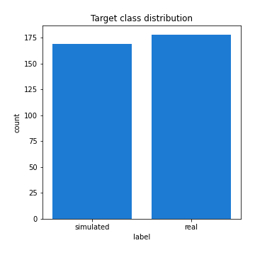
## Feature : mean1
- **Feature type** : continous
- **Missing** : 0.0%
- **Unique** : 347
- **Count** :347.0
- **Mean** :-0.2308522602011345
- **Std** :0.31833707978324066
- **Min** :-0.9361906844430047
- **25%th Percentile** : -0.540594665669472
- **50%th Percentile** : -0.10429740584906766
- **75%th Percentile** : 0.05640013279948231
- **Max** :0.37175100008111034

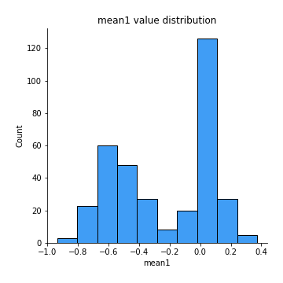
## Feature : mean2
- **Feature type** : continous
- **Missing** : 0.0%
- **Unique** : 347
- **Count** :347.0
- **Mean** :-0.251279551767115
- **Std** :0.3636840814979579
- **Min** :-1.2619098340195407
- **25%th Percentile** : -0.5803891245690425
- **50%th Percentile** : -0.09754389870392126
- **75%th Percentile** : 0.06602783808279786
- **Max** :0.5664886560614628

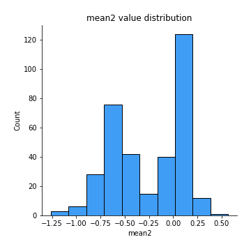
## Feature : sd1
- **Feature type** : continous
- **Missing** : 0.0%
- **Unique** : 347
- **Count** :347.0
- **Mean** :1.6296562606933225
- **Std** :0.8502213167870821
- **Min** :0.7470080772831957
- **25%th Percentile** : 1.2318310620780328
- **50%th Percentile** : 1.2872252002500348
- **75%th Percentile** : 1.7152907295492366
- **Max** :9.236766377527575

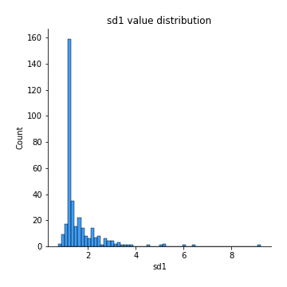
## Feature : sd2
- **Feature type** : continous
- **Missing** : 0.0%
- **Unique** : 347
- **Count** :347.0
- **Mean** :1.9211688680156442
- **Std** :0.696866231124116
- **Min** :0.8455946193085045
- **25%th Percentile** : 1.511089145233052
- **50%th Percentile** : 1.811221229295349
- **75%th Percentile** : 2.1063553476167085
- **Max** :5.872800253666788

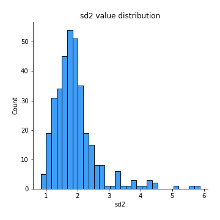
## Feature : skewness1
- **Feature type** : continous
- **Missing** : 0.0%
- **Unique** : 347
- **Count** :347.0
- **Mean** :-0.09841092686194736
- **Std** :0.6269251983476227
- **Min** :-3.530116233761814
- **25%th Percentile** : -0.18727668616991594
- **50%th Percentile** : -0.03749137048919273
- **75%th Percentile** : 0.07628345440490564
- **Max** :2.5845963767725557

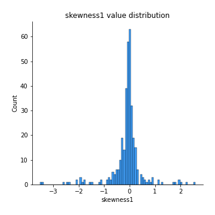
## Feature : skewness2
- **Feature type** : continous
- **Missing** : 0.0%
- **Unique** : 347
- **Count** :347.0
- **Mean** :-0.8774978958183189
- **Std** :0.9594787605792855
- **Min** :-5.778144124281153
- **25%th Percentile** : -1.6486860844462858
- **50%th Percentile** : -0.9928227498944008
- **75%th Percentile** : -0.1738197676768929
- **Max** :2.2606839051517187

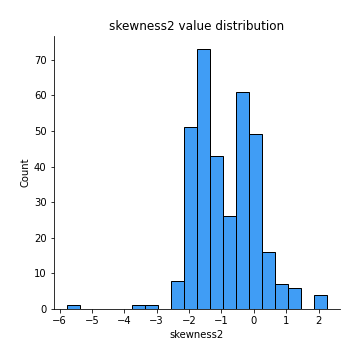
## Feature : kurtosis1
- **Feature type** : continous
- **Missing** : 0.0%
- **Unique** : 347
- **Count** :347.0
- **Mean** :3.2561087730908875
- **Std** :6.1546241978776735
- **Min** :-0.6176621889705372
- **25%th Percentile** : -0.01999449326072167
- **50%th Percentile** : 0.6819093157517129
- **75%th Percentile** : 3.8376122618365898
- **Max** :46.07507808162177

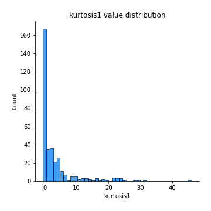
## Feature : kurtosis2
- **Feature type** : continous
- **Missing** : 0.0%
- **Unique** : 347
- **Count** :347.0
- **Mean** :5.27709280175542
- **Std** :6.534478860647557
- **Min** :0.32462059645996844
- **25%th Percentile** : 2.5150069321314756
- **50%th Percentile** : 3.761510516149595
- **75%th Percentile** : 5.089599491327819
- **Max** :71.39844769176813

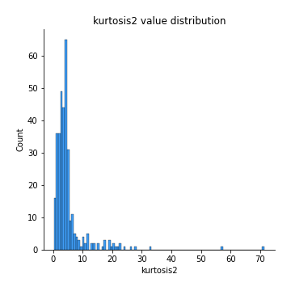
## Feature : return_autocorrelation_1_lag1
- **Feature type** : continous
- **Missing** : 0.0%
- **Unique** : 347
- **Count** :347.0
- **Mean** :0.01806966881169032
- **Std** :0.07225325393087946
- **Min** :-0.2135576224968752
- **25%th Percentile** : -0.0260245726536381
- **50%th Percentile** : 0.02299104735196405
- **75%th Percentile** : 0.07031275677916021
- **Max** :0.16351319519256252

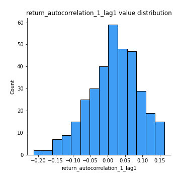
## Feature : return_autocorrelation_1_lag2
- **Feature type** : continous
- **Missing** : 0.0%
- **Unique** : 347
- **Count** :347.0
- **Mean** :0.0209636088809161
- **Std** :0.060580046578313326
- **Min** :-0.12172858720259
- **25%th Percentile** : -0.01678539779061093
- **50%th Percentile** : 0.020421195485099942
- **75%th Percentile** : 0.060628030534086455
- **Max** :0.19694768885125918

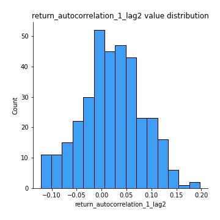
## Feature : return_autocorrelation_1_lag3
- **Feature type** : continous
- **Missing** : 0.0%
- **Unique** : 347
- **Count** :347.0
- **Mean** :0.0275661162423219
- **Std** :0.06331970107318266
- **Min** :-0.1940836867390813
- **25%th Percentile** : -0.011972907522060101
- **50%th Percentile** : 0.02915298038725312
- **75%th Percentile** : 0.07125830456117704
- **Max** :0.19929777193081233

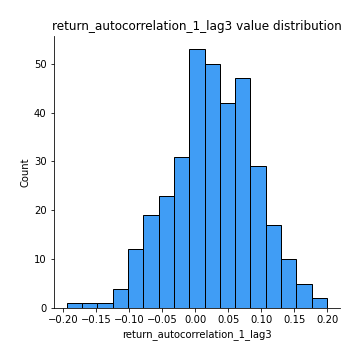
## Feature : return_autocorrelation_2_lag1
- **Feature type** : continous
- **Missing** : 0.0%
- **Unique** : 347
- **Count** :347.0
- **Mean** :0.29921222347663207
- **Std** :0.3461680214265905
- **Min** :-0.25075531010123286
- **25%th Percentile** : -0.022259025470626848
- **50%th Percentile** : 0.09323526263664529
- **75%th Percentile** : 0.6565632773400827
- **Max** :0.8903819919992129

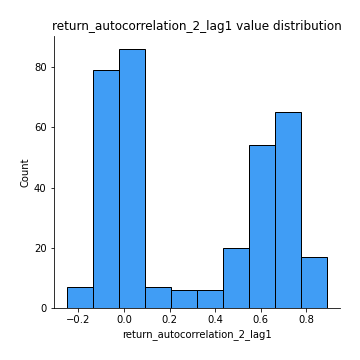
## Feature : return_autocorrelation_2_lag2
- **Feature type** : continous
- **Missing** : 0.0%
- **Unique** : 347
- **Count** :347.0
- **Mean** :0.3019971019178112
- **Std** :0.3373910103289078
- **Min** :-0.15323211089747296
- **25%th Percentile** : -0.014665583992610785
- **50%th Percentile** : 0.09340488510733228
- **75%th Percentile** : 0.6544020025388722
- **Max** :0.8927354454596891

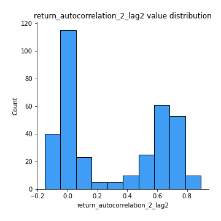
## Feature : return_autocorrelation_2_lag3
- **Feature type** : continous
- **Missing** : 0.0%
- **Unique** : 347
- **Count** :347.0
- **Mean** :0.30146137200177425
- **Std** :0.3334064845258259
- **Min** :-0.14200107169559698
- **25%th Percentile** : -0.00912306727506942
- **50%th Percentile** : 0.08020979478012402
- **75%th Percentile** : 0.6449052889479594
- **Max** :0.8896738797420799

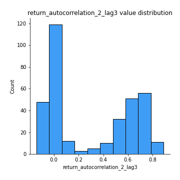
## Feature : return_correlation_ts1_lag_0
- **Feature type** : continous
- **Missing** : 0.0%
- **Unique** : 347
- **Count** :347.0
- **Mean** :0.31695520782082093
- **Std** :0.1108213197884249
- **Min** :-0.027089510445801036
- **25%th Percentile** : 0.2636428509901345
- **50%th Percentile** : 0.321151479233448
- **75%th Percentile** : 0.36634710644552737
- **Max** :0.7041861626832071

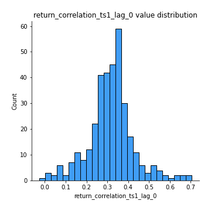
## Feature : return_correlation_ts1_lag_1
- **Feature type** : continous
- **Missing** : 0.0%
- **Unique** : 347
- **Count** :347.0
- **Mean** :0.065947328290349
- **Std** :0.10001677330316924
- **Min** :-0.16985510949917193
- **25%th Percentile** : -0.009260806631008683
- **50%th Percentile** : 0.056342251311684924
- **75%th Percentile** : 0.15650567639355828
- **Max** :0.27853185654230495

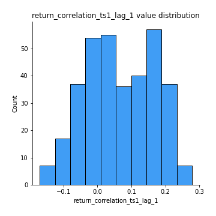
## Feature : return_correlation_ts1_lag_2
- **Feature type** : continous
- **Missing** : 0.0%
- **Unique** : 347
- **Count** :347.0
- **Mean** :0.06967576468335196
- **Std** :0.09567858066474491
- **Min** :-0.21653581047581763
- **25%th Percentile** : -0.01000736921294413
- **50%th Percentile** : 0.06337356427109792
- **75%th Percentile** : 0.15123245018561943
- **Max** :0.2829592282995214

## Feature : return_correlation_ts1_lag_3
- **Feature type** : continous
- **Missing** : 0.0%
- **Unique** : 347
- **Count** :347.0
- **Mean** :0.07059448855588163
- **Std** :0.09454797869149342
- **Min** :-0.14414257491689145
- **25%th Percentile** : -0.0077239202194875085
- **50%th Percentile** : 0.06852438818855595
- **75%th Percentile** : 0.15901737834763546
- **Max** :0.2621354278008399

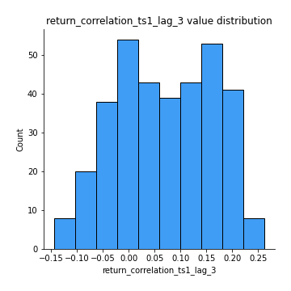
## Feature : return_correlation_ts2_lag_1
- **Feature type** : continous
- **Missing** : 0.0%
- **Unique** : 347
- **Count** :347.0
- **Mean** :0.06441157968134825
- **Std** :0.09782555135773878
- **Min** :-0.2081139431093261
- **25%th Percentile** : -0.013968313295694337
- **50%th Percentile** : 0.06175630807747253
- **75%th Percentile** : 0.14476376491293075
- **Max** :0.2812862100769917

## Feature : return_correlation_ts2_lag_2
- **Feature type** : continous
- **Missing** : 0.0%
- **Unique** : 347
- **Count** :347.0
- **Mean** :0.06654391701074565
- **Std** :0.0936921879996176
- **Min** :-0.23751835475804678
- **25%th Percentile** : -0.008968474904944401
- **50%th Percentile** : 0.06612908824758792
- **75%th Percentile** : 0.14340302352351827
- **Max** :0.2742201714304881

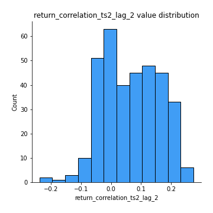
## Feature : return_correlation_ts2_lag_3
- **Feature type** : continous
- **Missing** : 0.0%
- **Unique** : 347
- **Count** :347.0
- **Mean** :0.06783140625109765
- **Std** :0.09398882017596603
- **Min** :-0.21913846319227168
- **25%th Percentile** : -0.005201560063413522
- **50%th Percentile** : 0.06371642806836526
- **75%th Percentile** : 0.14724694971696312
- **Max** :0.2649545604093148

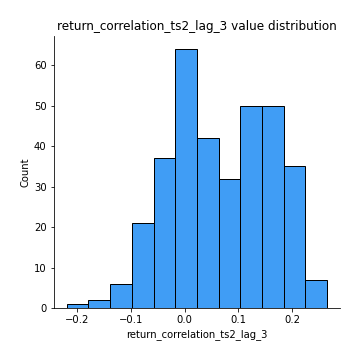
## Feature : sqreturn_autocorrelation_ts1_lag1
- **Feature type** : continous
- **Missing** : 0.0%
- **Unique** : 347
- **Count** :347.0
- **Mean** :0.05991919263919978
- **Std** :0.08646985898917992
- **Min** :-0.12088106789418065
- **25%th Percentile** : 0.003964995369272315
- **50%th Percentile** : 0.040425417795911134
- **75%th Percentile** : 0.08846190224604261
- **Max** :0.4399873614316609

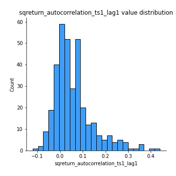
## Feature : sqreturn_autocorrelation_ts1_lag2
- **Feature type** : continous
- **Missing** : 0.0%
- **Unique** : 347
- **Count** :347.0
- **Mean** :0.05469604648849484
- **Std** :0.08174678767300735
- **Min** :-0.09432281151293165
- **25%th Percentile** : 0.0009284563236238747
- **50%th Percentile** : 0.03547877664811379
- **75%th Percentile** : 0.08723665837639759
- **Max** :0.42719220751700526

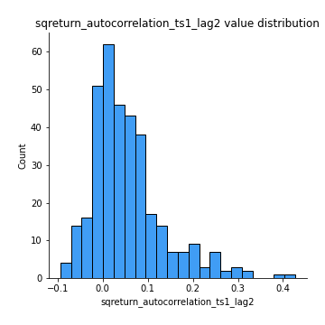
## Feature : sqreturn_autocorrelation_ts1_lag3
- **Feature type** : continous
- **Missing** : 0.0%
- **Unique** : 347
- **Count** :347.0
- **Mean** :0.04880922436689654
- **Std** :0.07633360993250159
- **Min** :-0.07053075447640093
- **25%th Percentile** : -0.002809489425125649
- **50%th Percentile** : 0.037697155353456926
- **75%th Percentile** : 0.08139927290017579
- **Max** :0.44755937369538146

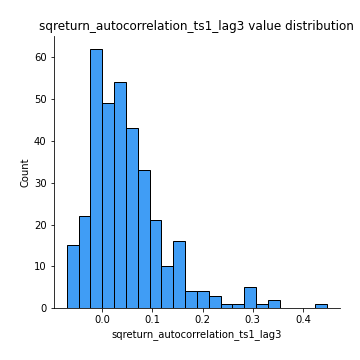
## Feature : sqreturn_autocorrelation_ts2_lag1
- **Feature type** : continous
- **Missing** : 0.0%
- **Unique** : 347
- **Count** :347.0
- **Mean** :0.4378023209036962
- **Std** :0.37399164536056156
- **Min** :-0.08520586663750691
- **25%th Percentile** : 0.06461068166092168
- **50%th Percentile** : 0.2842203437518423
- **75%th Percentile** : 0.836214229847771
- **Max** :0.9635273154681813

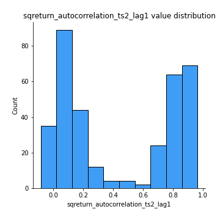
## Feature : sqreturn_autocorrelation_ts2_lag2
- **Feature type** : continous
- **Missing** : 0.0%
- **Unique** : 347
- **Count** :347.0
- **Mean** :0.42437374589571725
- **Std** :0.3825703774322267
- **Min** :-0.051523884196217395
- **25%th Percentile** : 0.03826370173867734
- **50%th Percentile** : 0.26444358377018157
- **75%th Percentile** : 0.8294548589485407
- **Max** :0.9725245407951464

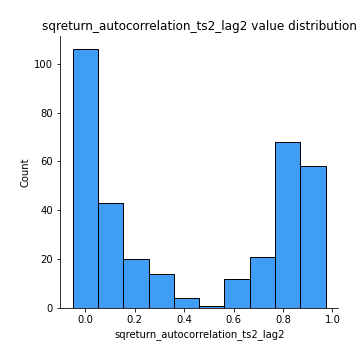
## Feature : sqreturn_autocorrelation_ts2_lag3
- **Feature type** : continous
- **Missing** : 0.0%
- **Unique** : 347
- **Count** :347.0
- **Mean** :0.4133150693514474
- **Std** :0.3886502969019672
- **Min** :-0.06082766359524085
- **25%th Percentile** : 0.030081329452346477
- **50%th Percentile** : 0.22591312271148054
- **75%th Percentile** : 0.8361552948768007
- **Max** :0.9617222243805843

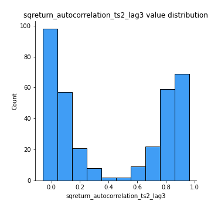
## Feature : sqreturn_correlation_ts1_lag_0
- **Feature type** : continous
- **Missing** : 0.0%
- **Unique** : 347
- **Count** :347.0
- **Mean** :0.31695520782082093
- **Std** :0.1108213197884249
- **Min** :-0.027089510445801036
- **25%th Percentile** : 0.2636428509901345
- **50%th Percentile** : 0.321151479233448
- **75%th Percentile** : 0.36634710644552737
- **Max** :0.7041861626832071

## Feature : sqreturn_correlation_ts1_lag_1
- **Feature type** : continous
- **Missing** : 0.0%
- **Unique** : 347
- **Count** :347.0
- **Mean** :0.065947328290349
- **Std** :0.10001677330316924
- **Min** :-0.16985510949917193
- **25%th Percentile** : -0.009260806631008683
- **50%th Percentile** : 0.056342251311684924
- **75%th Percentile** : 0.15650567639355828
- **Max** :0.27853185654230495

## Feature : sqreturn_correlation_ts1_lag_2
- **Feature type** : continous
- **Missing** : 0.0%
- **Unique** : 347
- **Count** :347.0
- **Mean** :0.06967576468335196
- **Std** :0.09567858066474491
- **Min** :-0.21653581047581763
- **25%th Percentile** : -0.01000736921294413
- **50%th Percentile** : 0.06337356427109792
- **75%th Percentile** : 0.15123245018561943
- **Max** :0.2829592282995214

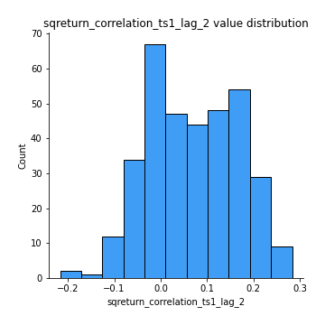
## Feature : sqreturn_correlation_ts1_lag_3
- **Feature type** : continous
- **Missing** : 0.0%
- **Unique** : 347
- **Count** :347.0
- **Mean** :0.07059448855588163
- **Std** :0.09454797869149342
- **Min** :-0.14414257491689145
- **25%th Percentile** : -0.0077239202194875085
- **50%th Percentile** : 0.06852438818855595
- **75%th Percentile** : 0.15901737834763546
- **Max** :0.2621354278008399

## Feature : sqreturn_correlation_ts2_lag_1
- **Feature type** : continous
- **Missing** : 0.0%
- **Unique** : 347
- **Count** :347.0
- **Mean** :0.06441157968134825
- **Std** :0.09782555135773878
- **Min** :-0.2081139431093261
- **25%th Percentile** : -0.013968313295694337
- **50%th Percentile** : 0.06175630807747253
- **75%th Percentile** : 0.14476376491293075
- **Max** :0.2812862100769917

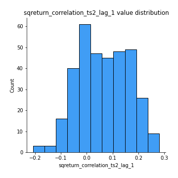
## Feature : sqreturn_correlation_ts2_lag_2
- **Feature type** : continous
- **Missing** : 0.0%
- **Unique** : 347
- **Count** :347.0
- **Mean** :0.06654391701074565
- **Std** :0.0936921879996176
- **Min** :-0.23751835475804678
- **25%th Percentile** : -0.008968474904944401
- **50%th Percentile** : 0.06612908824758792
- **75%th Percentile** : 0.14340302352351827
- **Max** :0.2742201714304881

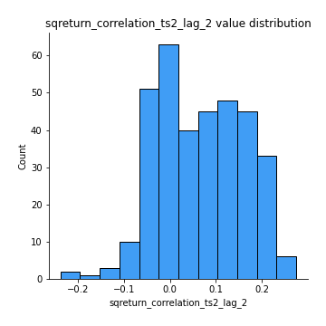
## Feature : sqreturn_correlation_ts2_lag_3
- **Feature type** : continous
- **Missing** : 0.0%
- **Unique** : 347
- **Count** :347.0
- **Mean** :0.06783140625109765
- **Std** :0.09398882017596603
- **Min** :-0.21913846319227168
- **25%th Percentile** : -0.005201560063413522
- **50%th Percentile** : 0.06371642806836526
- **75%th Percentile** : 0.14724694971696312
- **Max** :0.2649545604093148

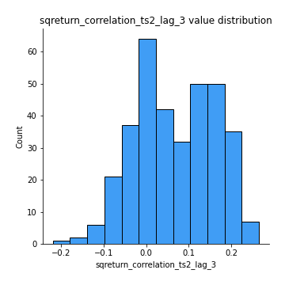
## Feature : price2_granger_cause_price1
- **Feature type** : continous
- **Missing** : 0.0%
- **Unique** : 347
- **Count** :347.0
- **Mean** :0.1886063121409069
- **Std** :0.27076571383431924
- **Min** :2.102994891258094e-37
- **25%th Percentile** : 3.555085443622345e-07
- **50%th Percentile** : 0.024039677302725777
- **75%th Percentile** : 0.3023609999165101
- **Max** :0.9885712803689185

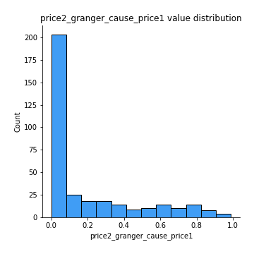
## Feature : price1_granger_cause_price2
- **Feature type** : continous
- **Missing** : 0.0%
- **Unique** : 347
- **Count** :347.0
- **Mean** :0.16536746929463134
- **Std** :0.2410334750208796
- **Min** :2.0511862543130165e-30
- **25%th Percentile** : 3.837073222157462e-06
- **50%th Percentile** : 0.025118127485026235
- **75%th Percentile** : 0.26348873564718966
- **Max** :0.9660122325264373

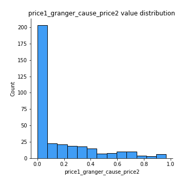

[<< Go back](../README.md)
