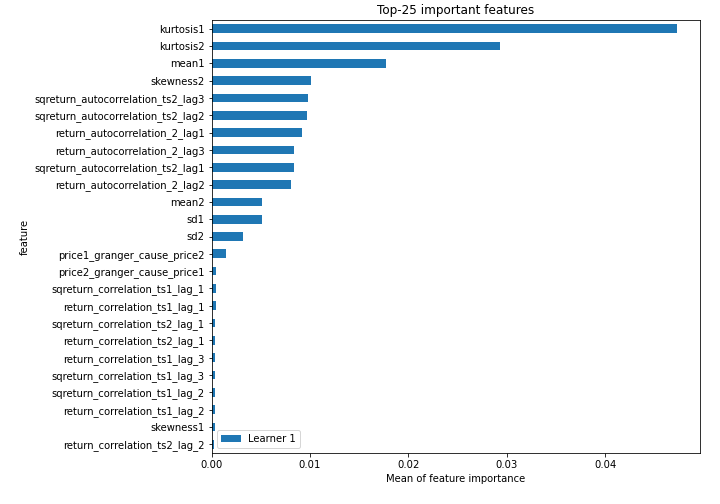
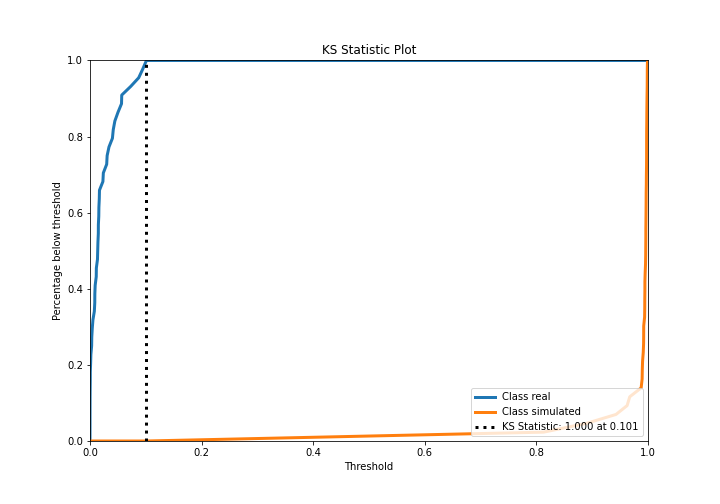
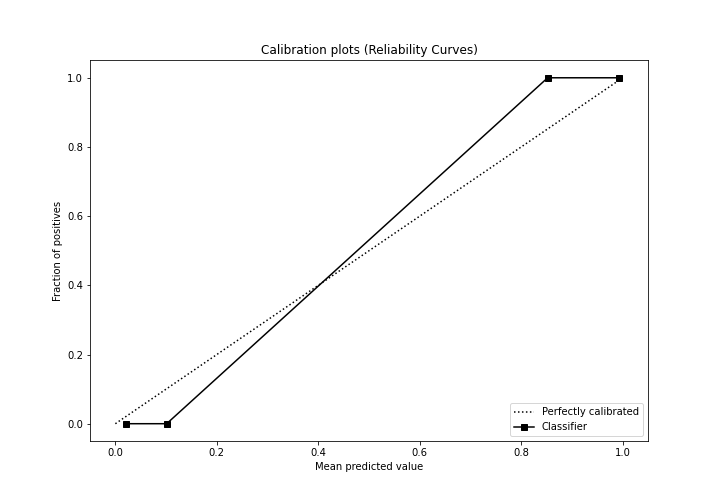
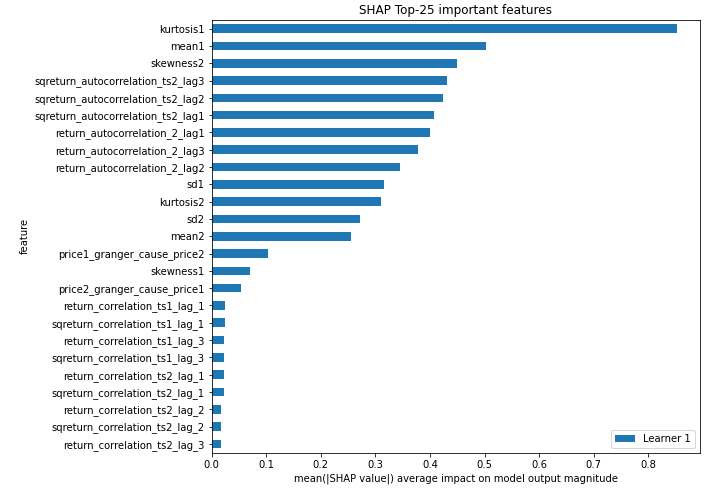
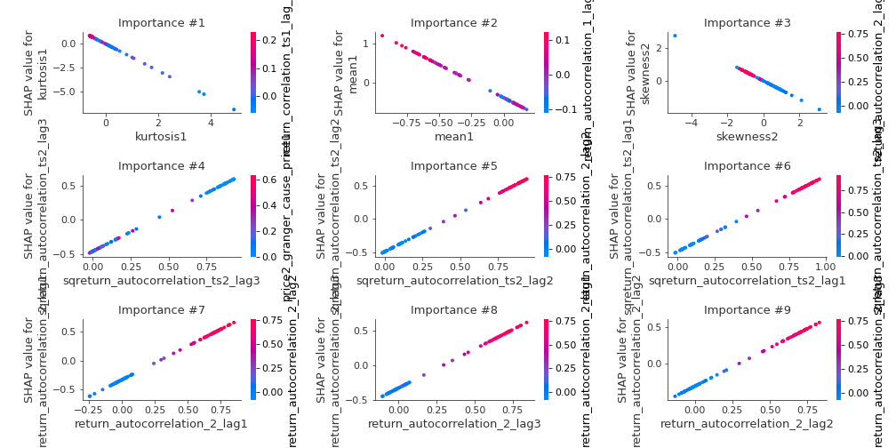
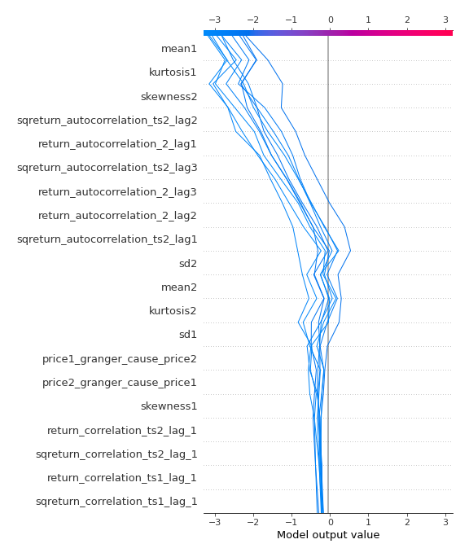
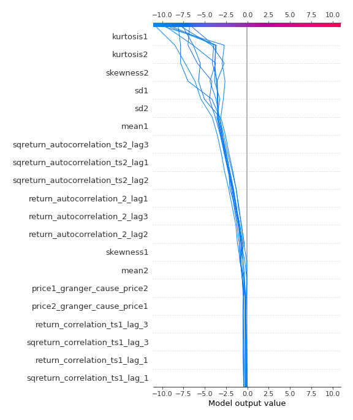
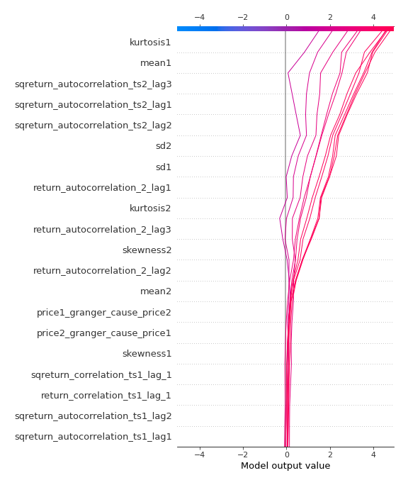
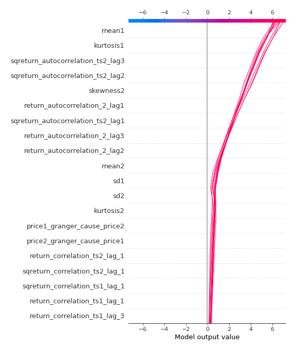

# Summary of 3_Linear

[<< Go back](../README.md)

## Logistic Regression (Linear)
- **n_jobs**: -1
- **explain_level**: 2

## Validation
 - **validation_type**: split
 - **train_ratio**: 0.75
 - **shuffle**: True
 - **stratify**: True

## Optimized metric
accuracy

## Training time

4.7 seconds

## Metric details
|           |     score |    threshold |
|:----------|----------:|-------------:|
| logloss   | 0.0190455 | nan          |
| auc       | 1         | nan          |
| f1        | 1         |   0.501717   |
| accuracy  | 1         |   0.501717   |
| precision | 1         |   0.501717   |
| recall    | 1         |   2.1501e-05 |
| mcc       | 1         |   0.501717   |

## Confusion matrix (at threshold=0.501717)
|                      |   Predicted as real |   Predicted as simulated |
|:---------------------|--------------------:|-------------------------:|
| Labeled as real      |                  44 |                        0 |
| Labeled as simulated |                   0 |                       43 |

## Learning curves

## Coefficients
| feature                           |   Learner_1 |
|:----------------------------------|------------:|
| return_autocorrelation_2_lag1     |   1.17162   |
| sqreturn_autocorrelation_ts2_lag2 |   1.1605    |
| sqreturn_autocorrelation_ts2_lag1 |   1.144     |
| sqreturn_autocorrelation_ts2_lag3 |   1.14216   |
| return_autocorrelation_2_lag3     |   1.13373   |
| return_autocorrelation_2_lag2     |   1.04314   |
| return_correlation_ts2_lag_1      |   0.302314  |
| sqreturn_correlation_ts2_lag_1    |   0.302314  |
| return_correlation_ts1_lag_3      |   0.292903  |
| sqreturn_correlation_ts1_lag_3    |   0.292903  |
| sqreturn_correlation_ts1_lag_1    |   0.283331  |
| return_correlation_ts1_lag_1      |   0.283331  |
| skewness1                         |   0.242169  |
| sqreturn_correlation_ts2_lag_3    |   0.238808  |
| return_correlation_ts2_lag_3      |   0.238808  |
| return_autocorrelation_1_lag3     |   0.226776  |
| return_correlation_ts2_lag_2      |   0.225371  |
| sqreturn_correlation_ts2_lag_2    |   0.225371  |
| return_autocorrelation_1_lag1     |   0.210569  |
| sqreturn_correlation_ts1_lag_2    |   0.205789  |
| return_correlation_ts1_lag_2      |   0.205789  |
| return_autocorrelation_1_lag2     |   0.188545  |
| return_correlation_ts1_lag_0      |  -0.0503707 |
| sqreturn_correlation_ts1_lag_0    |  -0.0503707 |
| sqreturn_autocorrelation_ts1_lag3 |  -0.180708  |
| sqreturn_autocorrelation_ts1_lag1 |  -0.181453  |
| sqreturn_autocorrelation_ts1_lag2 |  -0.21424   |
| price2_granger_cause_price1       |  -0.262091  |
| sd2                               |  -0.383204  |
| price1_granger_cause_price2       |  -0.459119  |
| sd1                               |  -0.523772  |
| skewness2                         |  -0.556448  |
| mean2                             |  -0.76422   |
| kurtosis2                         |  -0.819676  |
| kurtosis1                         |  -1.3972    |
| mean1                             |  -1.68205   |
| intercept                         |  -3.04334   |

## Permutation-based Importance

## Confusion Matrix

## Normalized Confusion Matrix

## ROC Curve

## Kolmogorov-Smirnov Statistic

## Precision-Recall Curve

## Calibration Curve

## Cumulative Gains Curve

## Lift Curve

## SHAP Importance

## SHAP Dependence plots

### Dependence (Fold 1)

## SHAP Decision plots

### Top-10 Worst decisions for class 0 (Fold 1)

### Top-10 Best decisions for class 0 (Fold 1)

### Top-10 Worst decisions for class 1 (Fold 1)

### Top-10 Best decisions for class 1 (Fold 1)

[<< Go back](../README.md)
