# Exploratory Data Analysis

[<< Go back](../README.md)
## Feature : target
- **Feature type** : categorical
- **Missing** : 0.0%
- **Unique** : 2
- **Count** :347
- **Unique** :2
- **Top** :real
- **Freq** :174

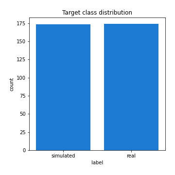
## Feature : mean1
- **Feature type** : continous
- **Missing** : 0.0%
- **Unique** : 347
- **Count** :347.0
- **Mean** :-0.23417703419757857
- **Std** :0.31639954812612014
- **Min** :-0.9417819071383892
- **25%th Percentile** : -0.5297681466966877
- **50%th Percentile** : -0.10429740584906766
- **75%th Percentile** : 0.05808847460973031
- **Max** :0.35951212719134734

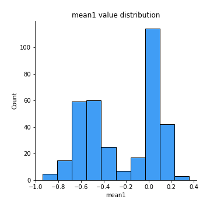
## Feature : mean2
- **Feature type** : continous
- **Missing** : 0.0%
- **Unique** : 347
- **Count** :347.0
- **Mean** :-0.25387567904003466
- **Std** :0.345231927785446
- **Min** :-1.0851670711704386
- **25%th Percentile** : -0.5819179367611862
- **50%th Percentile** : -0.20022088889057277
- **75%th Percentile** : 0.05940346199613544
- **Max** :0.5881967056758088

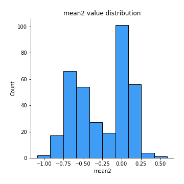
## Feature : sd1
- **Feature type** : continous
- **Missing** : 0.0%
- **Unique** : 347
- **Count** :347.0
- **Mean** :1.562790937319415
- **Std** :0.6437759617854786
- **Min** :0.7470080772831957
- **25%th Percentile** : 1.2295075709139536
- **50%th Percentile** : 1.2792066664009643
- **75%th Percentile** : 1.6902017658202082
- **Max** :6.495661311240861

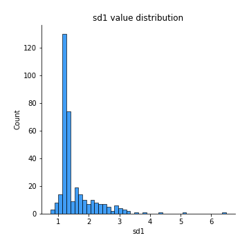
## Feature : sd2
- **Feature type** : continous
- **Missing** : 0.0%
- **Unique** : 347
- **Count** :347.0
- **Mean** :1.8935301680698942
- **Std** :0.7379917525069802
- **Min** :0.8455946193085045
- **25%th Percentile** : 1.4852964580353878
- **50%th Percentile** : 1.7923116848783351
- **75%th Percentile** : 2.0725005254905593
- **Max** :5.872800253666788

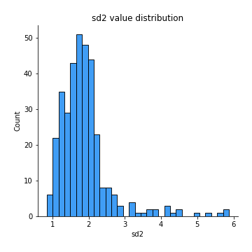
## Feature : skewness1
- **Feature type** : continous
- **Missing** : 0.0%
- **Unique** : 347
- **Count** :347.0
- **Mean** :-0.04988859363394602
- **Std** :0.523601022518879
- **Min** :-2.817259764925239
- **25%th Percentile** : -0.17049082671580118
- **50%th Percentile** : -0.024634963149047798
- **75%th Percentile** : 0.1000448006669588
- **Max** :2.5845963767725557

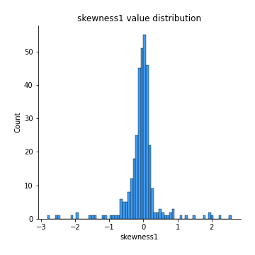
## Feature : skewness2
- **Feature type** : continous
- **Missing** : 0.0%
- **Unique** : 347
- **Count** :347.0
- **Mean** :-0.8879462449679936
- **Std** :1.0074347333280975
- **Min** :-8.801502855292393
- **25%th Percentile** : -1.6014708036002134
- **50%th Percentile** : -0.9658990502164109
- **75%th Percentile** : -0.22065337180543873
- **Max** :2.2606839051517187

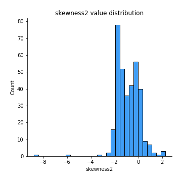
## Feature : kurtosis1
- **Feature type** : continous
- **Missing** : 0.0%
- **Unique** : 347
- **Count** :347.0
- **Mean** :2.7830012116962237
- **Std** :5.181969544868609
- **Min** :-0.4772391203273987
- **25%th Percentile** : -0.012529394185163412
- **50%th Percentile** : 0.4646314805253593
- **75%th Percentile** : 3.454449566137388
- **Max** :36.91113889081053

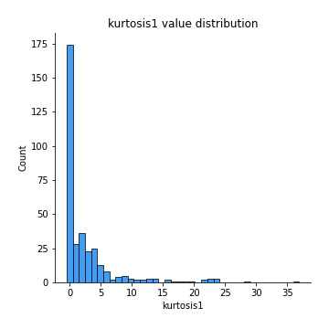
## Feature : kurtosis2
- **Feature type** : continous
- **Missing** : 0.0%
- **Unique** : 347
- **Count** :347.0
- **Mean** :5.171071922739452
- **Std** :9.457161938738482
- **Min** :0.048331584837276065
- **25%th Percentile** : 2.2981061041441926
- **50%th Percentile** : 3.6288596842385723
- **75%th Percentile** : 4.7165660909918286
- **Max** :143.10871011533666

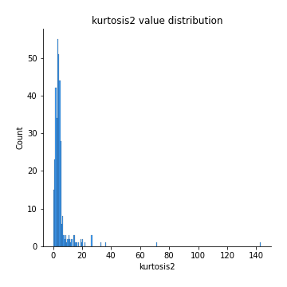
## Feature : return_autocorrelation_1_lag1
- **Feature type** : continous
- **Missing** : 0.0%
- **Unique** : 347
- **Count** :347.0
- **Mean** :0.016678344906919586
- **Std** :0.07203639535116144
- **Min** :-0.2135576224968752
- **25%th Percentile** : -0.025613199816471203
- **50%th Percentile** : 0.019868394199661476
- **75%th Percentile** : 0.06504331774296834
- **Max** :0.18074335210836098

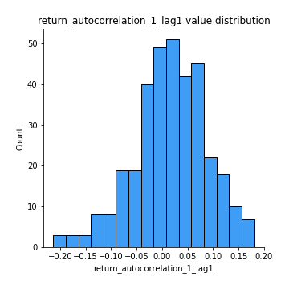
## Feature : return_autocorrelation_1_lag2
- **Feature type** : continous
- **Missing** : 0.0%
- **Unique** : 347
- **Count** :347.0
- **Mean** :0.02790651190652778
- **Std** :0.06284442710153929
- **Min** :-0.13309283796645122
- **25%th Percentile** : -0.013086711601328727
- **50%th Percentile** : 0.02663292649185981
- **75%th Percentile** : 0.07515733655715465
- **Max** :0.16626960839897081

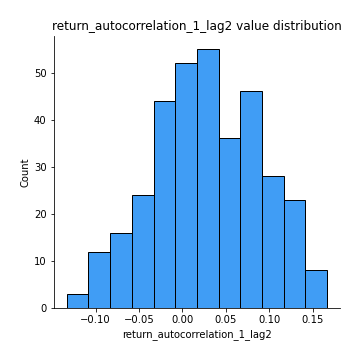
## Feature : return_autocorrelation_1_lag3
- **Feature type** : continous
- **Missing** : 0.0%
- **Unique** : 347
- **Count** :347.0
- **Mean** :0.0249096768298327
- **Std** :0.06518795236894179
- **Min** :-0.1940836867390813
- **25%th Percentile** : -0.020292678429703746
- **50%th Percentile** : 0.02627479107261208
- **75%th Percentile** : 0.07248133797801426
- **Max** :0.18341587540372206

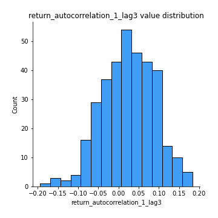
## Feature : return_autocorrelation_2_lag1
- **Feature type** : continous
- **Missing** : 0.0%
- **Unique** : 347
- **Count** :347.0
- **Mean** :0.30029691948498555
- **Std** :0.34209178795591555
- **Min** :-0.25075531010123286
- **25%th Percentile** : -0.025619852556291907
- **50%th Percentile** : 0.12235403572864123
- **75%th Percentile** : 0.6563086981276283
- **Max** :0.8492592422049214

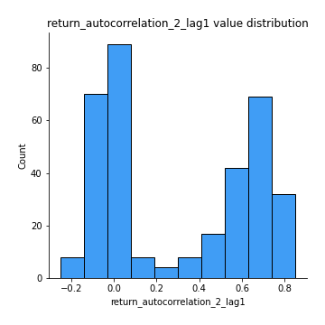
## Feature : return_autocorrelation_2_lag2
- **Feature type** : continous
- **Missing** : 0.0%
- **Unique** : 347
- **Count** :347.0
- **Mean** :0.30629402189378574
- **Std** :0.3315592939982414
- **Min** :-0.13300063901033632
- **25%th Percentile** : -0.011753787292693694
- **50%th Percentile** : 0.12867784384335576
- **75%th Percentile** : 0.6579980256835709
- **Max** :0.8315194624953982

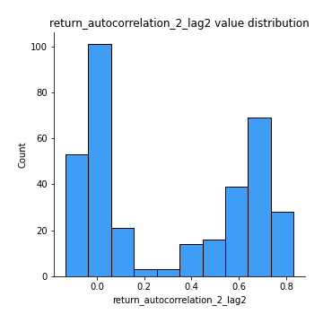
## Feature : return_autocorrelation_2_lag3
- **Feature type** : continous
- **Missing** : 0.0%
- **Unique** : 347
- **Count** :347.0
- **Mean** :0.3003873538196053
- **Std** :0.3307119177840732
- **Min** :-0.12708292641486704
- **25%th Percentile** : -0.01115042275628702
- **50%th Percentile** : 0.13480911807504564
- **75%th Percentile** : 0.644768163997929
- **Max** :0.8415775682940019

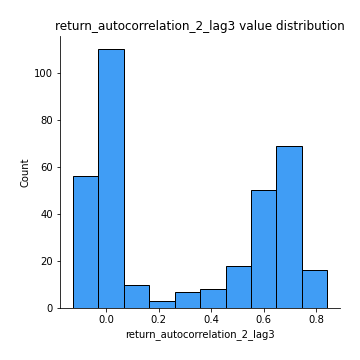
## Feature : return_correlation_ts1_lag_0
- **Feature type** : continous
- **Missing** : 0.0%
- **Unique** : 347
- **Count** :347.0
- **Mean** :0.32848099649181045
- **Std** :0.1084810353893875
- **Min** :-0.027089510445801036
- **25%th Percentile** : 0.272434739999344
- **50%th Percentile** : 0.33270643963669083
- **75%th Percentile** : 0.37070329775535604
- **Max** :0.6949986865664105

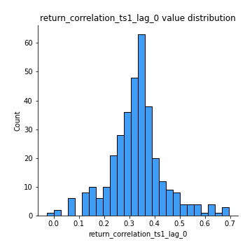
## Feature : return_correlation_ts1_lag_1
- **Feature type** : continous
- **Missing** : 0.0%
- **Unique** : 347
- **Count** :347.0
- **Mean** :0.06320164275203424
- **Std** :0.10241230548974599
- **Min** :-0.16985510949917193
- **25%th Percentile** : -0.018366446231520672
- **50%th Percentile** : 0.053189342520166306
- **75%th Percentile** : 0.14596128465030525
- **Max** :0.3039797685978651

## Feature : return_correlation_ts1_lag_2
- **Feature type** : continous
- **Missing** : 0.0%
- **Unique** : 347
- **Count** :347.0
- **Mean** :0.06972790686133208
- **Std** :0.09441520426639184
- **Min** :-0.21653581047581763
- **25%th Percentile** : -0.010135544459176239
- **50%th Percentile** : 0.07149314296483529
- **75%th Percentile** : 0.14635342155054087
- **Max** :0.26590024055661154

## Feature : return_correlation_ts1_lag_3
- **Feature type** : continous
- **Missing** : 0.0%
- **Unique** : 347
- **Count** :347.0
- **Mean** :0.06902770639871882
- **Std** :0.09545944153512388
- **Min** :-0.19622682206670172
- **25%th Percentile** : -0.0065454080287301805
- **50%th Percentile** : 0.06985687742334902
- **75%th Percentile** : 0.15203606739653802
- **Max** :0.262810724719715

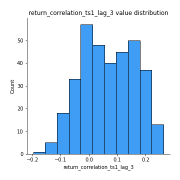
## Feature : return_correlation_ts2_lag_1
- **Feature type** : continous
- **Missing** : 0.0%
- **Unique** : 347
- **Count** :347.0
- **Mean** :0.06247177598082029
- **Std** :0.10015424016726485
- **Min** :-0.2081139431093261
- **25%th Percentile** : -0.014370207509359433
- **50%th Percentile** : 0.05768390915578954
- **75%th Percentile** : 0.14940256044859285
- **Max** :0.2819429261953421

## Feature : return_correlation_ts2_lag_2
- **Feature type** : continous
- **Missing** : 0.0%
- **Unique** : 347
- **Count** :347.0
- **Mean** :0.07199991911575264
- **Std** :0.0923560448854208
- **Min** :-0.11701735111763815
- **25%th Percentile** : -0.0035514025770324925
- **50%th Percentile** : 0.06712274122147373
- **75%th Percentile** : 0.15175598807135865
- **Max** :0.3004902485958775

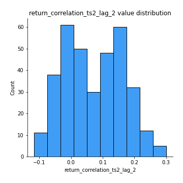
## Feature : return_correlation_ts2_lag_3
- **Feature type** : continous
- **Missing** : 0.0%
- **Unique** : 347
- **Count** :347.0
- **Mean** :0.06587838724131717
- **Std** :0.09388677465033686
- **Min** :-0.17564076057312866
- **25%th Percentile** : -0.004765391796437195
- **50%th Percentile** : 0.06167202009359097
- **75%th Percentile** : 0.14363039225684143
- **Max** :0.2630309171148807

## Feature : sqreturn_autocorrelation_ts1_lag1
- **Feature type** : continous
- **Missing** : 0.0%
- **Unique** : 347
- **Count** :347.0
- **Mean** :0.06618069849213948
- **Std** :0.08928302680246958
- **Min** :-0.09109556593648313
- **25%th Percentile** : 0.009404208617849227
- **50%th Percentile** : 0.04805959064645308
- **75%th Percentile** : 0.09920233807199783
- **Max** :0.49414293176447355

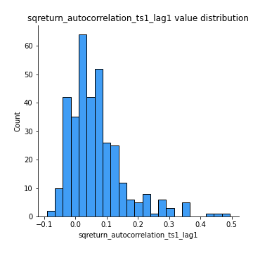
## Feature : sqreturn_autocorrelation_ts1_lag2
- **Feature type** : continous
- **Missing** : 0.0%
- **Unique** : 347
- **Count** :347.0
- **Mean** :0.055235642980769266
- **Std** :0.09116385820504914
- **Min** :-0.08635209361735705
- **25%th Percentile** : -0.003069217994450657
- **50%th Percentile** : 0.033783909283565304
- **75%th Percentile** : 0.08245589242000709
- **Max** :0.540735851444759

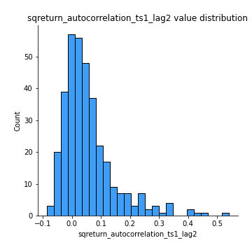
## Feature : sqreturn_autocorrelation_ts1_lag3
- **Feature type** : continous
- **Missing** : 0.0%
- **Unique** : 347
- **Count** :347.0
- **Mean** :0.050498295085788285
- **Std** :0.08218300937517878
- **Min** :-0.09267815063508573
- **25%th Percentile** : -0.0038059918209342337
- **50%th Percentile** : 0.03342148489937152
- **75%th Percentile** : 0.0797136526005435
- **Max** :0.44755937369538146

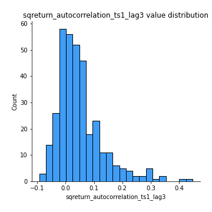
## Feature : sqreturn_autocorrelation_ts2_lag1
- **Feature type** : continous
- **Missing** : 0.0%
- **Unique** : 347
- **Count** :347.0
- **Mean** :0.4441231309425382
- **Std** :0.36768394162245127
- **Min** :-0.08520586663750691
- **25%th Percentile** : 0.07464678766495364
- **50%th Percentile** : 0.32722813449540955
- **75%th Percentile** : 0.8362968052119848
- **Max** :0.954522084278366

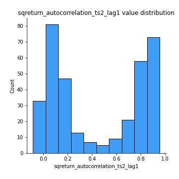
## Feature : sqreturn_autocorrelation_ts2_lag2
- **Feature type** : continous
- **Missing** : 0.0%
- **Unique** : 347
- **Count** :347.0
- **Mean** :0.4332725505960234
- **Std** :0.3761624368469819
- **Min** :-0.051523884196217395
- **25%th Percentile** : 0.0468905869039373
- **50%th Percentile** : 0.36643671865899713
- **75%th Percentile** : 0.8357714494692345
- **Max** :0.9581209020159439

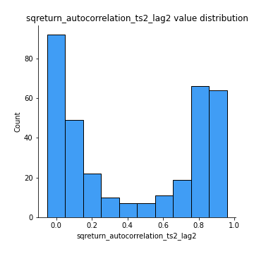
## Feature : sqreturn_autocorrelation_ts2_lag3
- **Feature type** : continous
- **Missing** : 0.0%
- **Unique** : 347
- **Count** :347.0
- **Mean** :0.421496847837029
- **Std** :0.3819137910879598
- **Min** :-0.06065894750062144
- **25%th Percentile** : 0.03661376878226935
- **50%th Percentile** : 0.264502622646872
- **75%th Percentile** : 0.8309858531990051
- **Max** :0.9620043445390418

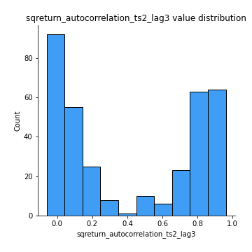
## Feature : sqreturn_correlation_ts1_lag_0
- **Feature type** : continous
- **Missing** : 0.0%
- **Unique** : 347
- **Count** :347.0
- **Mean** :0.32848099649181045
- **Std** :0.1084810353893875
- **Min** :-0.027089510445801036
- **25%th Percentile** : 0.272434739999344
- **50%th Percentile** : 0.33270643963669083
- **75%th Percentile** : 0.37070329775535604
- **Max** :0.6949986865664105

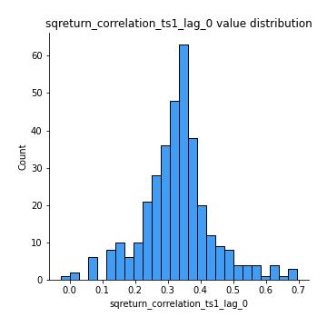
## Feature : sqreturn_correlation_ts1_lag_1
- **Feature type** : continous
- **Missing** : 0.0%
- **Unique** : 347
- **Count** :347.0
- **Mean** :0.06320164275203424
- **Std** :0.10241230548974599
- **Min** :-0.16985510949917193
- **25%th Percentile** : -0.018366446231520672
- **50%th Percentile** : 0.053189342520166306
- **75%th Percentile** : 0.14596128465030525
- **Max** :0.3039797685978651

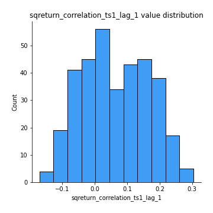
## Feature : sqreturn_correlation_ts1_lag_2
- **Feature type** : continous
- **Missing** : 0.0%
- **Unique** : 347
- **Count** :347.0
- **Mean** :0.06972790686133208
- **Std** :0.09441520426639184
- **Min** :-0.21653581047581763
- **25%th Percentile** : -0.010135544459176239
- **50%th Percentile** : 0.07149314296483529
- **75%th Percentile** : 0.14635342155054087
- **Max** :0.26590024055661154

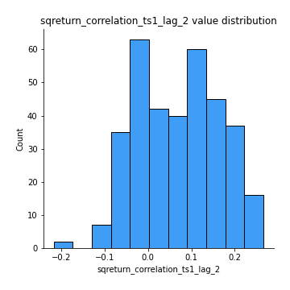
## Feature : sqreturn_correlation_ts1_lag_3
- **Feature type** : continous
- **Missing** : 0.0%
- **Unique** : 347
- **Count** :347.0
- **Mean** :0.06902770639871882
- **Std** :0.09545944153512388
- **Min** :-0.19622682206670172
- **25%th Percentile** : -0.0065454080287301805
- **50%th Percentile** : 0.06985687742334902
- **75%th Percentile** : 0.15203606739653802
- **Max** :0.262810724719715

## Feature : sqreturn_correlation_ts2_lag_1
- **Feature type** : continous
- **Missing** : 0.0%
- **Unique** : 347
- **Count** :347.0
- **Mean** :0.06247177598082029
- **Std** :0.10015424016726485
- **Min** :-0.2081139431093261
- **25%th Percentile** : -0.014370207509359433
- **50%th Percentile** : 0.05768390915578954
- **75%th Percentile** : 0.14940256044859285
- **Max** :0.2819429261953421

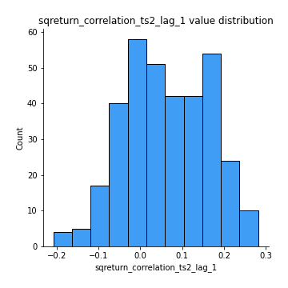
## Feature : sqreturn_correlation_ts2_lag_2
- **Feature type** : continous
- **Missing** : 0.0%
- **Unique** : 347
- **Count** :347.0
- **Mean** :0.07199991911575264
- **Std** :0.0923560448854208
- **Min** :-0.11701735111763815
- **25%th Percentile** : -0.0035514025770324925
- **50%th Percentile** : 0.06712274122147373
- **75%th Percentile** : 0.15175598807135865
- **Max** :0.3004902485958775

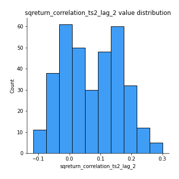
## Feature : sqreturn_correlation_ts2_lag_3
- **Feature type** : continous
- **Missing** : 0.0%
- **Unique** : 347
- **Count** :347.0
- **Mean** :0.06587838724131717
- **Std** :0.09388677465033686
- **Min** :-0.17564076057312866
- **25%th Percentile** : -0.004765391796437195
- **50%th Percentile** : 0.06167202009359097
- **75%th Percentile** : 0.14363039225684143
- **Max** :0.2630309171148807

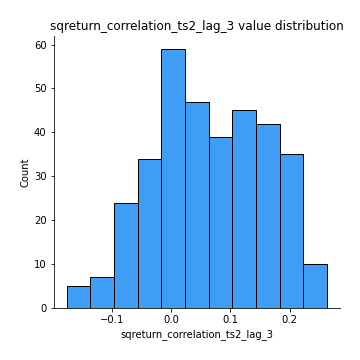
## Feature : price2_granger_cause_price1
- **Feature type** : continous
- **Missing** : 0.0%
- **Unique** : 347
- **Count** :347.0
- **Mean** :0.18322102713380634
- **Std** :0.26677684500930793
- **Min** :1.124714892203973e-27
- **25%th Percentile** : 9.053380067273485e-07
- **50%th Percentile** : 0.021889905087815405
- **75%th Percentile** : 0.2950340110940076
- **Max** :0.9885712803689185

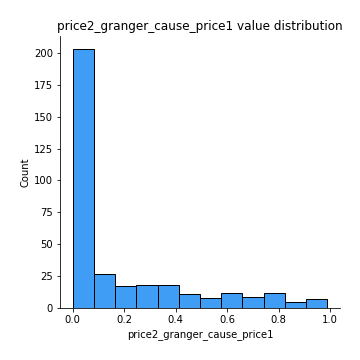
## Feature : price1_granger_cause_price2
- **Feature type** : continous
- **Missing** : 0.0%
- **Unique** : 347
- **Count** :347.0
- **Mean** :0.16949955680446807
- **Std** :0.25077827784526907
- **Min** :3.367109638356846e-30
- **25%th Percentile** : 7.644996930452107e-06
- **50%th Percentile** : 0.02096154046250328
- **75%th Percentile** : 0.27531973431939577
- **Max** :0.9522446940107451

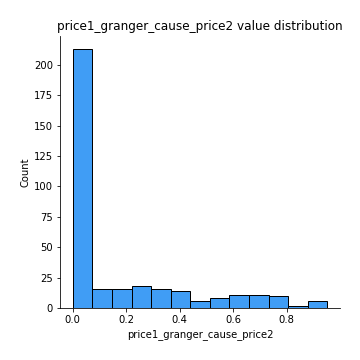

[<< Go back](../README.md)
