# Summary of 3_Linear

[<< Go back](../README.md)

## Logistic Regression (Linear)
- **n_jobs**: -1
- **explain_level**: 2

## Validation
 - **validation_type**: split
 - **train_ratio**: 0.75
 - **shuffle**: True
 - **stratify**: True

## Optimized metric
accuracy

## Training time

6.0 seconds

## Metric details
|           |     score |    threshold |
|:----------|----------:|-------------:|
| logloss   | 0.0354724 | nan          |
| auc       | 1         | nan          |
| f1        | 1         |   0.23098    |
| accuracy  | 1         |   0.23098    |
| precision | 1         |   0.23098    |
| recall    | 1         |   0.00016794 |
| mcc       | 1         |   0.23098    |

## Confusion matrix (at threshold=0.23098)
|                      |   Predicted as real |   Predicted as simulated |
|:---------------------|--------------------:|-------------------------:|
| Labeled as real      |                  44 |                        0 |
| Labeled as simulated |                   0 |                       43 |

## Learning curves

## Coefficients
| feature                           |   Learner_1 |
|:----------------------------------|------------:|
| sqreturn_autocorrelation_ts2_lag3 |  1.12591    |
| sqreturn_autocorrelation_ts2_lag2 |  1.03896    |
| return_autocorrelation_2_lag3     |  1.03784    |
| return_autocorrelation_2_lag1     |  1.02007    |
| sqreturn_autocorrelation_ts2_lag1 |  0.987198   |
| return_autocorrelation_2_lag2     |  0.952478   |
| return_correlation_ts1_lag_3      |  0.317447   |
| sqreturn_correlation_ts1_lag_3    |  0.317447   |
| sqreturn_correlation_ts1_lag_2    |  0.299758   |
| return_correlation_ts1_lag_2      |  0.299758   |
| return_correlation_ts2_lag_1      |  0.284359   |
| sqreturn_correlation_ts2_lag_1    |  0.284359   |
| return_correlation_ts2_lag_3      |  0.28178    |
| sqreturn_correlation_ts2_lag_3    |  0.28178    |
| return_correlation_ts1_lag_1      |  0.269342   |
| sqreturn_correlation_ts1_lag_1    |  0.269342   |
| sqreturn_correlation_ts2_lag_2    |  0.215821   |
| return_correlation_ts2_lag_2      |  0.215821   |
| return_autocorrelation_1_lag3     |  0.190489   |
| return_autocorrelation_1_lag2     |  0.157237   |
| skewness1                         |  0.138383   |
| return_autocorrelation_1_lag1     |  0.124731   |
| sqreturn_correlation_ts1_lag_0    |  0.00964511 |
| return_correlation_ts1_lag_0      |  0.00964511 |
| sqreturn_autocorrelation_ts1_lag3 | -0.121479   |
| sqreturn_autocorrelation_ts1_lag2 | -0.197168   |
| sqreturn_autocorrelation_ts1_lag1 | -0.206566   |
| sd2                               | -0.540759   |
| price2_granger_cause_price1       | -0.578811   |
| sd1                               | -0.609354   |
| price1_granger_cause_price2       | -0.713652   |
| skewness2                         | -0.758808   |
| kurtosis2                         | -0.931234   |
| mean2                             | -0.99892    |
| kurtosis1                         | -1.34107    |
| mean1                             | -1.56129    |
| intercept                         | -2.94541    |

## Permutation-based Importance
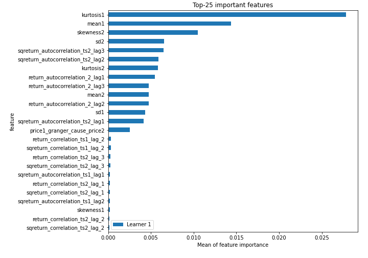
## Confusion Matrix

## Normalized Confusion Matrix

## ROC Curve

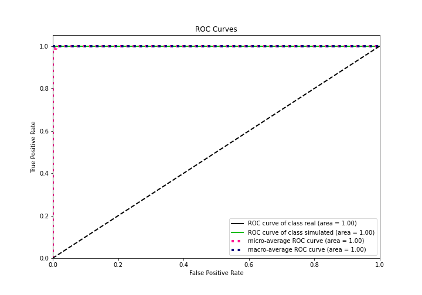

## Kolmogorov-Smirnov Statistic

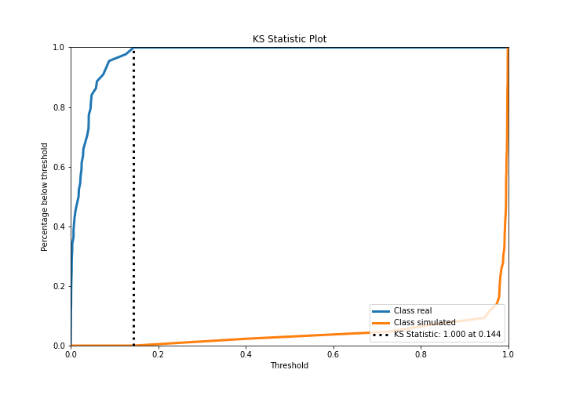

## Precision-Recall Curve

## Calibration Curve

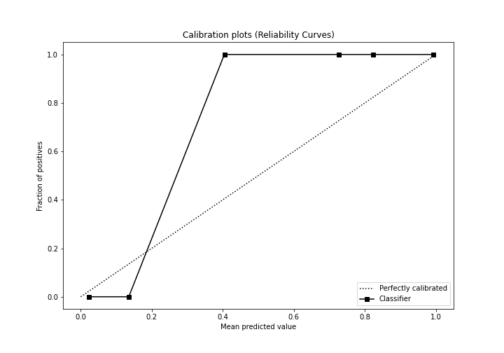

## Cumulative Gains Curve

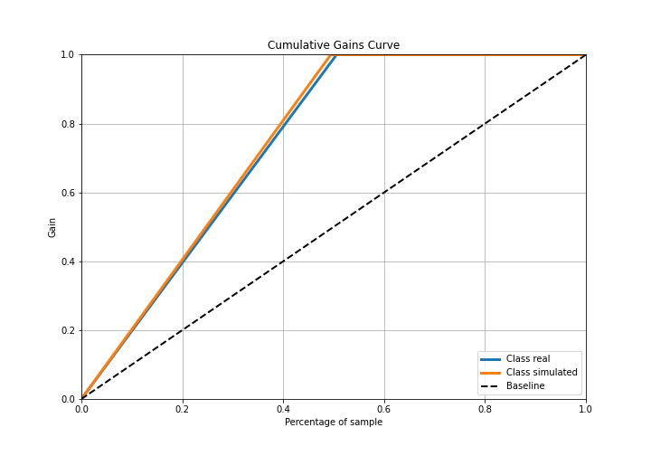

## Lift Curve

## SHAP Importance
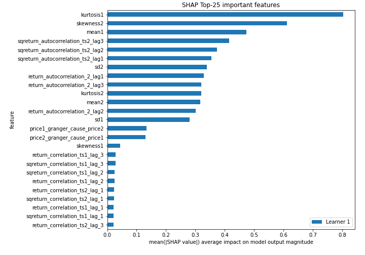

## SHAP Dependence plots

### Dependence (Fold 1)
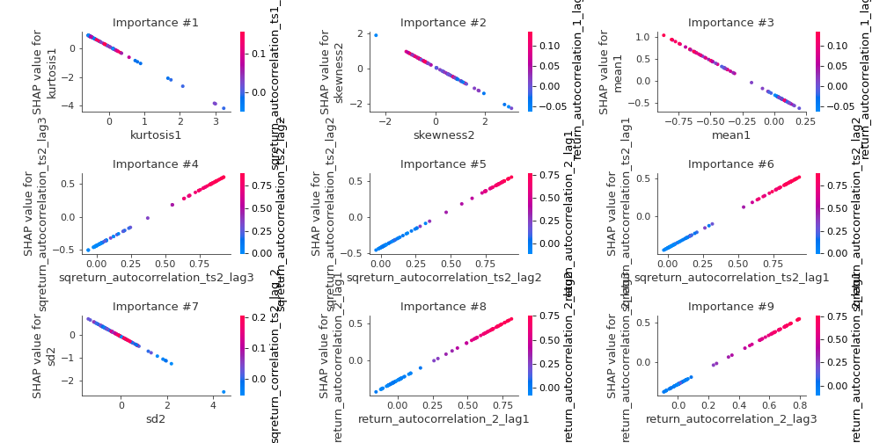

## SHAP Decision plots

### Top-10 Worst decisions for class 0 (Fold 1)
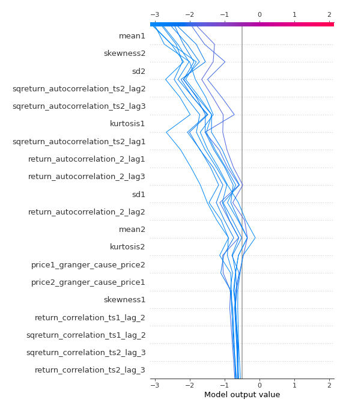
### Top-10 Best decisions for class 0 (Fold 1)
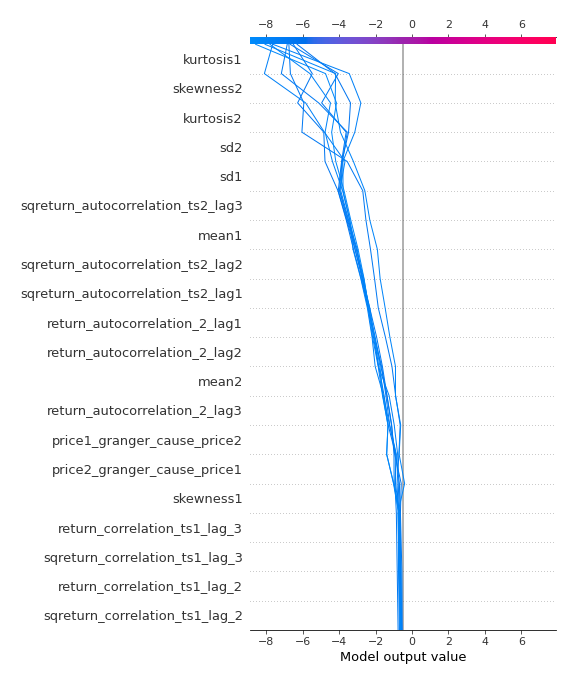
### Top-10 Worst decisions for class 1 (Fold 1)
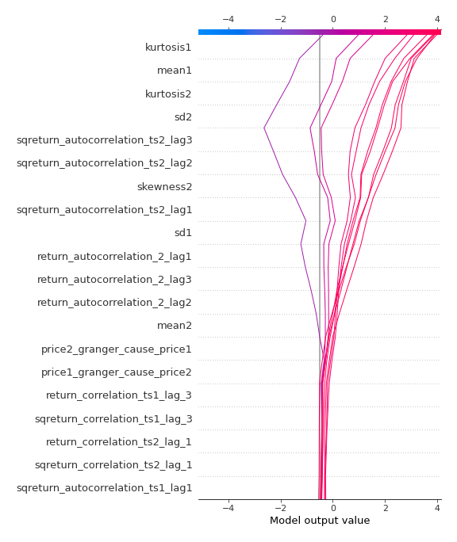
### Top-10 Best decisions for class 1 (Fold 1)
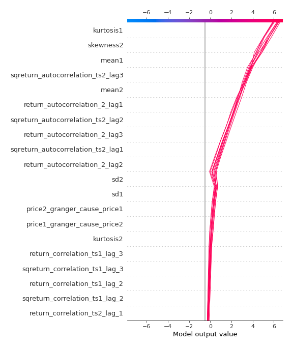

[<< Go back](../README.md)
