# Summary of 3_Linear

[<< Go back](../README.md)

## Logistic Regression (Linear)
- **n_jobs**: -1
- **explain_level**: 2

## Validation
 - **validation_type**: split
 - **train_ratio**: 0.75
 - **shuffle**: True
 - **stratify**: True

## Optimized metric
accuracy

## Training time

3.0 seconds

## Metric details
|           |     score |     threshold |
|:----------|----------:|--------------:|
| logloss   | 0.0164686 | nan           |
| auc       | 1         | nan           |
| f1        | 1         |   0.535075    |
| accuracy  | 1         |   0.535075    |
| precision | 1         |   0.535075    |
| recall    | 1         |   8.55926e-06 |
| mcc       | 1         |   0.535075    |

## Confusion matrix (at threshold=0.535075)
|                      |   Predicted as real |   Predicted as simulated |
|:---------------------|--------------------:|-------------------------:|
| Labeled as real      |                  43 |                        0 |
| Labeled as simulated |                   0 |                       44 |

## Learning curves
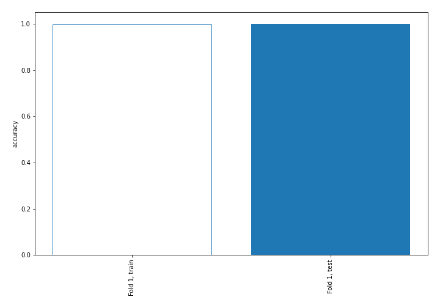

## Coefficients
| feature                           |   Learner_1 |
|:----------------------------------|------------:|
| return_autocorrelation_2_lag1     |   1.00122   |
| return_autocorrelation_2_lag3     |   0.981714  |
| sqreturn_autocorrelation_ts2_lag3 |   0.931612  |
| sqreturn_autocorrelation_ts2_lag2 |   0.928699  |
| return_autocorrelation_2_lag2     |   0.928555  |
| sqreturn_autocorrelation_ts2_lag1 |   0.909556  |
| return_correlation_ts2_lag_1      |   0.314962  |
| sqreturn_correlation_ts2_lag_1    |   0.314962  |
| sqreturn_correlation_ts1_lag_1    |   0.314595  |
| return_correlation_ts1_lag_1      |   0.314595  |
| sqreturn_correlation_ts1_lag_3    |   0.310879  |
| return_correlation_ts1_lag_3      |   0.310879  |
| skewness1                         |   0.283941  |
| sqreturn_correlation_ts1_lag_2    |   0.281041  |
| return_correlation_ts1_lag_2      |   0.281041  |
| return_correlation_ts2_lag_3      |   0.257935  |
| sqreturn_correlation_ts2_lag_3    |   0.257935  |
| return_correlation_ts2_lag_2      |   0.252696  |
| sqreturn_correlation_ts2_lag_2    |   0.252696  |
| return_autocorrelation_1_lag3     |   0.176518  |
| return_autocorrelation_1_lag1     |   0.13392   |
| return_autocorrelation_1_lag2     |   0.119759  |
| sqreturn_correlation_ts1_lag_0    |  -0.0392504 |
| return_correlation_ts1_lag_0      |  -0.0392504 |
| sqreturn_autocorrelation_ts1_lag3 |  -0.108999  |
| sqreturn_autocorrelation_ts1_lag2 |  -0.24393   |
| sqreturn_autocorrelation_ts1_lag1 |  -0.282095  |
| sd2                               |  -0.346386  |
| sd1                               |  -0.541529  |
| price2_granger_cause_price1       |  -0.717699  |
| price1_granger_cause_price2       |  -0.770394  |
| skewness2                         |  -0.807587  |
| kurtosis2                         |  -0.868323  |
| mean2                             |  -1.01011   |
| kurtosis1                         |  -1.40961   |
| mean1                             |  -1.5812    |
| intercept                         |  -2.60862   |

## Permutation-based Importance
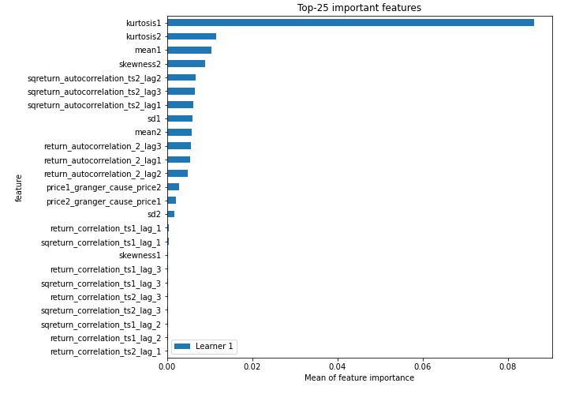
## Confusion Matrix

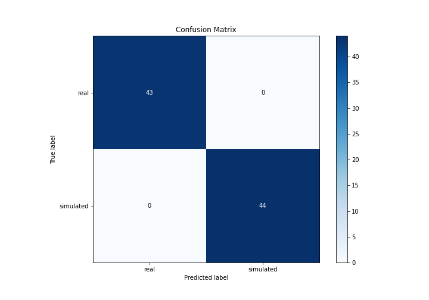

## Normalized Confusion Matrix

## ROC Curve

## Kolmogorov-Smirnov Statistic

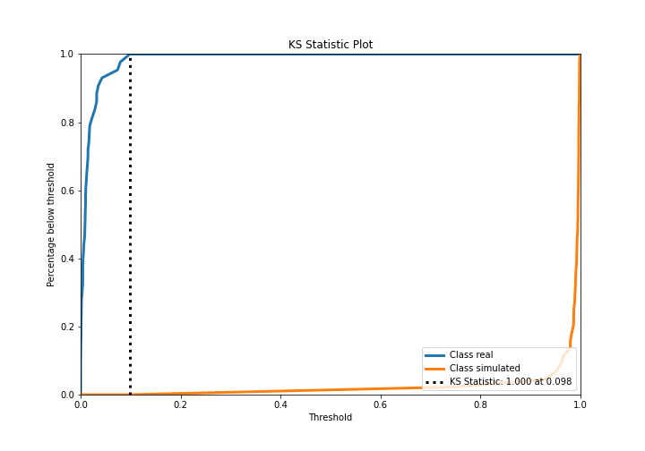

## Precision-Recall Curve

## Calibration Curve

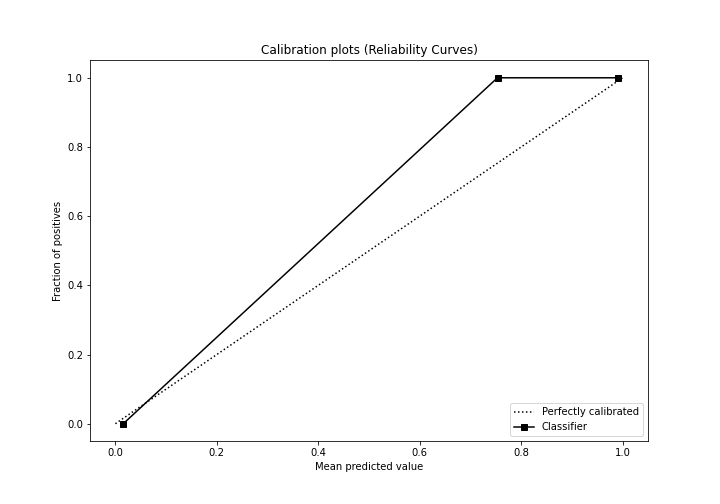

## Cumulative Gains Curve

## Lift Curve

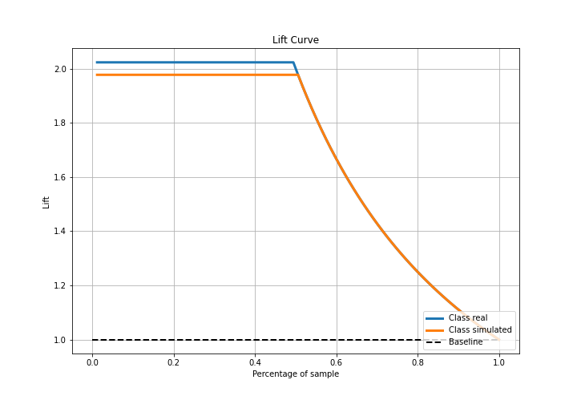

## SHAP Importance
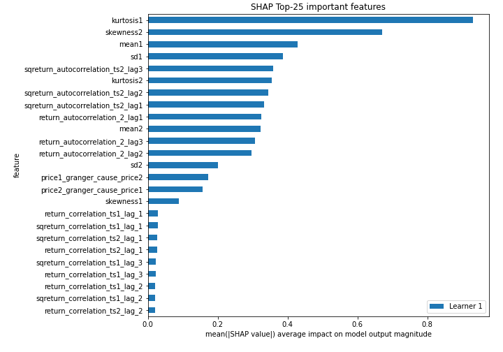

## SHAP Dependence plots

### Dependence (Fold 1)
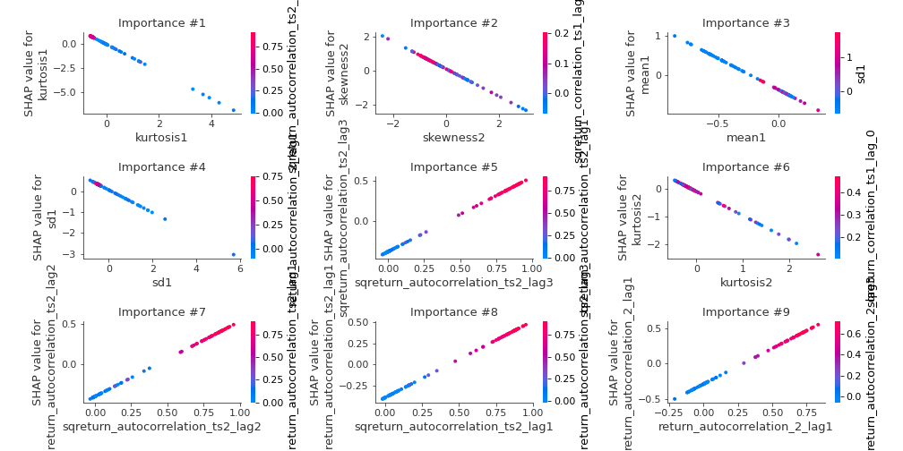

## SHAP Decision plots

### Top-10 Worst decisions for class 0 (Fold 1)
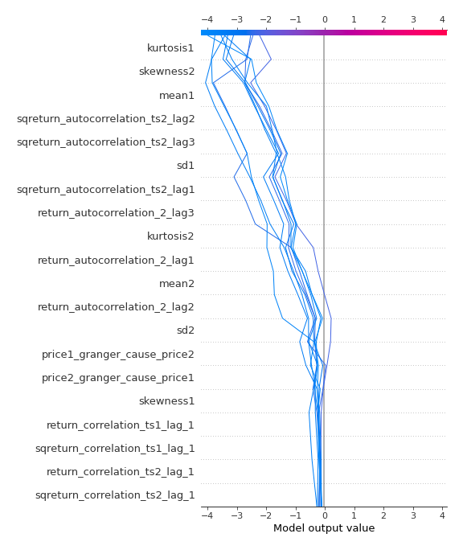
### Top-10 Best decisions for class 0 (Fold 1)
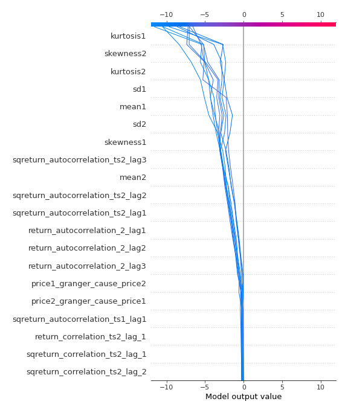
### Top-10 Worst decisions for class 1 (Fold 1)
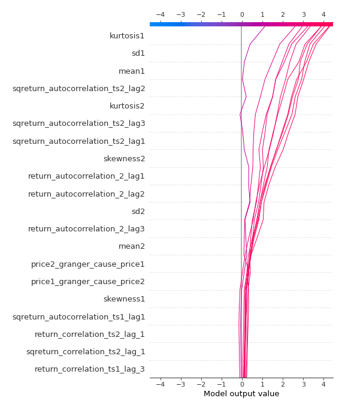
### Top-10 Best decisions for class 1 (Fold 1)
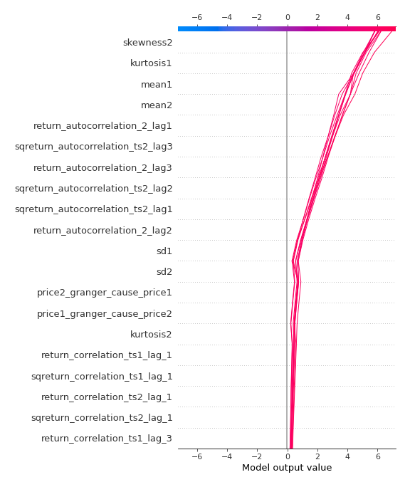

[<< Go back](../README.md)
