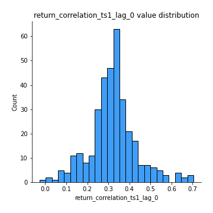
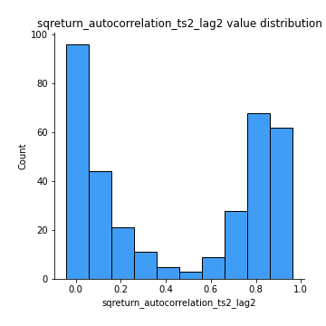

# Exploratory Data Analysis

[<< Go back](../README.md)
## Feature : target
- **Feature type** : categorical
- **Missing** : 0.0%
- **Unique** : 2
- **Count** :347
- **Unique** :2
- **Top** :simulated
- **Freq** :176

## Feature : mean1
- **Feature type** : continous
- **Missing** : 0.0%
- **Unique** : 347
- **Count** :347.0
- **Mean** :-0.23587463217682408
- **Std** :0.3107768683612697
- **Min** :-0.9669138314528976
- **25%th Percentile** : -0.5264925303481156
- **50%th Percentile** : -0.17548455228339357
- **75%th Percentile** : 0.051988692995305175
- **Max** :0.37175100008111034

## Feature : mean2
- **Feature type** : continous
- **Missing** : 0.0%
- **Unique** : 347
- **Count** :347.0
- **Mean** :-0.26924175096318126
- **Std** :0.34934529243458495
- **Min** :-1.275029035450387
- **25%th Percentile** : -0.5786948144771105
- **50%th Percentile** : -0.2114517707846986
- **75%th Percentile** : 0.05761700908004474
- **Max** :0.37616608147096464

## Feature : sd1
- **Feature type** : continous
- **Missing** : 0.0%
- **Unique** : 347
- **Count** :347.0
- **Mean** :1.6156766966699805
- **Std** :0.7614183016614897
- **Min** :0.7470080772831957
- **25%th Percentile** : 1.2350816276859065
- **50%th Percentile** : 1.2922874994005107
- **75%th Percentile** : 1.7352821479157923
- **Max** :6.495661311240861

## Feature : sd2
- **Feature type** : continous
- **Missing** : 0.0%
- **Unique** : 347
- **Count** :347.0
- **Mean** :1.929174299004327
- **Std** :0.7463831247248547
- **Min** :0.8455946193085045
- **25%th Percentile** : 1.4964687825233507
- **50%th Percentile** : 1.8110345132376273
- **75%th Percentile** : 2.092223002434208
- **Max** :6.737618636746393

## Feature : skewness1
- **Feature type** : continous
- **Missing** : 0.0%
- **Unique** : 347
- **Count** :347.0
- **Mean** :-0.08798360718602263
- **Std** :0.5191421280816761
- **Min** :-2.482614873291243
- **25%th Percentile** : -0.1662957259941482
- **50%th Percentile** : -0.034263453885687765
- **75%th Percentile** : 0.07516275534053837
- **Max** :2.5845963767725557

## Feature : skewness2
- **Feature type** : continous
- **Missing** : 0.0%
- **Unique** : 347
- **Count** :347.0
- **Mean** :-0.9302520712191081
- **Std** :1.0507058904972257
- **Min** :-8.801502855292393
- **25%th Percentile** : -1.6397292145037912
- **50%th Percentile** : -1.0622108520500213
- **75%th Percentile** : -0.22086467440811774
- **Max** :2.2606839051517187

## Feature : kurtosis1
- **Feature type** : continous
- **Missing** : 0.0%
- **Unique** : 347
- **Count** :347.0
- **Mean** :2.9504655089714795
- **Std** :5.376986018757656
- **Min** :-0.5466358773306643
- **25%th Percentile** : -0.055433519366514084
- **50%th Percentile** : 0.41253076302273106
- **75%th Percentile** : 3.691025264972352
- **Max** :35.56636016047202

## Feature : kurtosis2
- **Feature type** : continous
- **Missing** : 0.0%
- **Unique** : 347
- **Count** :347.0
- **Mean** :5.850078030120167
- **Std** :9.819793129669959
- **Min** :-0.16390481142055746
- **25%th Percentile** : 2.6012377042654737
- **50%th Percentile** : 3.781940335206525
- **75%th Percentile** : 5.266287923159067
- **Max** :143.10871011533666

## Feature : return_autocorrelation_1_lag1
- **Feature type** : continous
- **Missing** : 0.0%
- **Unique** : 347
- **Count** :347.0
- **Mean** :0.013739946241998244
- **Std** :0.07305800222281478
- **Min** :-0.2135576224968752
- **25%th Percentile** : -0.02798709989585133
- **50%th Percentile** : 0.02102275072110599
- **75%th Percentile** : 0.063535669223863
- **Max** :0.16070488276229453

## Feature : return_autocorrelation_1_lag2
- **Feature type** : continous
- **Missing** : 0.0%
- **Unique** : 347
- **Count** :347.0
- **Mean** :0.025835550572123906
- **Std** :0.0638637177115493
- **Min** :-0.13309283796645122
- **25%th Percentile** : -0.01815031745089707
- **50%th Percentile** : 0.02639225866408018
- **75%th Percentile** : 0.07409493398211495
- **Max** :0.19446869019537918

## Feature : return_autocorrelation_1_lag3
- **Feature type** : continous
- **Missing** : 0.0%
- **Unique** : 347
- **Count** :347.0
- **Mean** :0.028564143481254634
- **Std** :0.06119473114217637
- **Min** :-0.1940836867390813
- **25%th Percentile** : -0.010815231274016764
- **50%th Percentile** : 0.033603837883302824
- **75%th Percentile** : 0.07316834690151724
- **Max** :0.17805869530681923

## Feature : return_autocorrelation_2_lag1
- **Feature type** : continous
- **Missing** : 0.0%
- **Unique** : 347
- **Count** :347.0
- **Mean** :0.3055268302574459
- **Std** :0.34615518108314963
- **Min** :-0.25075531010123286
- **25%th Percentile** : -0.026072870527155734
- **50%th Percentile** : 0.22864650105930184
- **75%th Percentile** : 0.6534542404768564
- **Max** :0.8942528446664654

## Feature : return_autocorrelation_2_lag2
- **Feature type** : continous
- **Missing** : 0.0%
- **Unique** : 347
- **Count** :347.0
- **Mean** :0.31485008312174134
- **Std** :0.3332334103698846
- **Min** :-0.15323211089747296
- **25%th Percentile** : -0.009808090400774863
- **50%th Percentile** : 0.20974504043791217
- **75%th Percentile** : 0.6456757241076471
- **Max** :0.8809681359969813

## Feature : return_autocorrelation_2_lag3
- **Feature type** : continous
- **Missing** : 0.0%
- **Unique** : 347
- **Count** :347.0
- **Mean** :0.30950299702306416
- **Std** :0.3303343137079674
- **Min** :-0.12708292641486704
- **25%th Percentile** : -0.005731462337987332
- **50%th Percentile** : 0.16200279234509404
- **75%th Percentile** : 0.6449290344079639
- **Max** :0.883639231314448

## Feature : return_correlation_ts1_lag_0
- **Feature type** : continous
- **Missing** : 0.0%
- **Unique** : 347
- **Count** :347.0
- **Mean** :0.32107797342513544
- **Std** :0.11262307385466627
- **Min** :-0.027089510445801036
- **25%th Percentile** : 0.2657839288532611
- **50%th Percentile** : 0.32378723922312413
- **75%th Percentile** : 0.3721793857445415
- **Max** :0.7041861626832071

## Feature : return_correlation_ts1_lag_1
- **Feature type** : continous
- **Missing** : 0.0%
- **Unique** : 347
- **Count** :347.0
- **Mean** :0.062036858522751044
- **Std** :0.09789890490620508
- **Min** :-0.16985510949917193
- **25%th Percentile** : -0.012753271076439782
- **50%th Percentile** : 0.05826225071620892
- **75%th Percentile** : 0.14350459760810158
- **Max** :0.26781510050087515

## Feature : return_correlation_ts1_lag_2
- **Feature type** : continous
- **Missing** : 0.0%
- **Unique** : 347
- **Count** :347.0
- **Mean** :0.07077497570791318
- **Std** :0.09254707781662581
- **Min** :-0.21653581047581763
- **25%th Percentile** : -0.00714163301116976
- **50%th Percentile** : 0.07579177666496148
- **75%th Percentile** : 0.14806969138691656
- **Max** :0.2919828646056567

## Feature : return_correlation_ts1_lag_3
- **Feature type** : continous
- **Missing** : 0.0%
- **Unique** : 347
- **Count** :347.0
- **Mean** :0.07147232840294765
- **Std** :0.09205661205162585
- **Min** :-0.1270218498974763
- **25%th Percentile** : -0.001528840221660964
- **50%th Percentile** : 0.07626213523170719
- **75%th Percentile** : 0.14894557090488983
- **Max** :0.2806371740807201

## Feature : return_correlation_ts2_lag_1
- **Feature type** : continous
- **Missing** : 0.0%
- **Unique** : 347
- **Count** :347.0
- **Mean** :0.06416131718272079
- **Std** :0.09651448003400656
- **Min** :-0.2081139431093261
- **25%th Percentile** : -0.014370207509359433
- **50%th Percentile** : 0.0667121871520354
- **75%th Percentile** : 0.14721524416707865
- **Max** :0.28226348113280925

## Feature : return_correlation_ts2_lag_2
- **Feature type** : continous
- **Missing** : 0.0%
- **Unique** : 347
- **Count** :347.0
- **Mean** :0.0680647611540698
- **Std** :0.09079135347326729
- **Min** :-0.23751835475804678
- **25%th Percentile** : -0.005457198384978979
- **50%th Percentile** : 0.0729539871345187
- **75%th Percentile** : 0.14201018992066056
- **Max** :0.26384295141085234

## Feature : return_correlation_ts2_lag_3
- **Feature type** : continous
- **Missing** : 0.0%
- **Unique** : 347
- **Count** :347.0
- **Mean** :0.06751679338665585
- **Std** :0.08942812989374606
- **Min** :-0.17564076057312866
- **25%th Percentile** : -0.004692928924825786
- **50%th Percentile** : 0.06784144532716616
- **75%th Percentile** : 0.14193334723221296
- **Max** :0.28764177343136077

## Feature : sqreturn_autocorrelation_ts1_lag1
- **Feature type** : continous
- **Missing** : 0.0%
- **Unique** : 347
- **Count** :347.0
- **Mean** :0.06190068628471689
- **Std** :0.08660585230816556
- **Min** :-0.07460482545752219
- **25%th Percentile** : 0.009099031615744515
- **50%th Percentile** : 0.03987811688118776
- **75%th Percentile** : 0.08808965261429583
- **Max** :0.4439086285737898

## Feature : sqreturn_autocorrelation_ts1_lag2
- **Feature type** : continous
- **Missing** : 0.0%
- **Unique** : 347
- **Count** :347.0
- **Mean** :0.05043681644472207
- **Std** :0.08570246656653942
- **Min** :-0.10067773289406677
- **25%th Percentile** : -0.0037351752517079256
- **50%th Percentile** : 0.028961382759243082
- **75%th Percentile** : 0.08114719271580675
- **Max** :0.4522162366773919

## Feature : sqreturn_autocorrelation_ts1_lag3
- **Feature type** : continous
- **Missing** : 0.0%
- **Unique** : 347
- **Count** :347.0
- **Mean** :0.04689855938038445
- **Std** :0.07613264533722959
- **Min** :-0.09120466942817501
- **25%th Percentile** : -0.008964681542628361
- **50%th Percentile** : 0.03312451505892478
- **75%th Percentile** : 0.07738604951851391
- **Max** :0.41030914918857014

## Feature : sqreturn_autocorrelation_ts2_lag1
- **Feature type** : continous
- **Missing** : 0.0%
- **Unique** : 347
- **Count** :347.0
- **Mean** :0.4489836516694278
- **Std** :0.37145134353322873
- **Min** :-0.08520586663750691
- **25%th Percentile** : 0.07310845567424916
- **50%th Percentile** : 0.3503359607621391
- **75%th Percentile** : 0.8312520069147638
- **Max** :0.9614692533514541

## Feature : sqreturn_autocorrelation_ts2_lag2
- **Feature type** : continous
- **Missing** : 0.0%
- **Unique** : 347
- **Count** :347.0
- **Mean** :0.44193167038886494
- **Std** :0.37837460241818777
- **Min** :-0.04424883229120365
- **25%th Percentile** : 0.04513417267661814
- **50%th Percentile** : 0.38955150949317774
- **75%th Percentile** : 0.8350898186656365
- **Max** :0.9640406070024833

## Feature : sqreturn_autocorrelation_ts2_lag3
- **Feature type** : continous
- **Missing** : 0.0%
- **Unique** : 347
- **Count** :347.0
- **Mean** :0.42684166462698553
- **Std** :0.38524124096213463
- **Min** :-0.06082766359524085
- **25%th Percentile** : 0.035976608635472196
- **50%th Percentile** : 0.2878058608565052
- **75%th Percentile** : 0.8311061405273373
- **Max** :0.9574408411172256

## Feature : sqreturn_correlation_ts1_lag_0
- **Feature type** : continous
- **Missing** : 0.0%
- **Unique** : 347
- **Count** :347.0
- **Mean** :0.32107797342513544
- **Std** :0.11262307385466627
- **Min** :-0.027089510445801036
- **25%th Percentile** : 0.2657839288532611
- **50%th Percentile** : 0.32378723922312413
- **75%th Percentile** : 0.3721793857445415
- **Max** :0.7041861626832071

## Feature : sqreturn_correlation_ts1_lag_1
- **Feature type** : continous
- **Missing** : 0.0%
- **Unique** : 347
- **Count** :347.0
- **Mean** :0.062036858522751044
- **Std** :0.09789890490620508
- **Min** :-0.16985510949917193
- **25%th Percentile** : -0.012753271076439782
- **50%th Percentile** : 0.05826225071620892
- **75%th Percentile** : 0.14350459760810158
- **Max** :0.26781510050087515

## Feature : sqreturn_correlation_ts1_lag_2
- **Feature type** : continous
- **Missing** : 0.0%
- **Unique** : 347
- **Count** :347.0
- **Mean** :0.07077497570791318
- **Std** :0.09254707781662581
- **Min** :-0.21653581047581763
- **25%th Percentile** : -0.00714163301116976
- **50%th Percentile** : 0.07579177666496148
- **75%th Percentile** : 0.14806969138691656
- **Max** :0.2919828646056567

## Feature : sqreturn_correlation_ts1_lag_3
- **Feature type** : continous
- **Missing** : 0.0%
- **Unique** : 347
- **Count** :347.0
- **Mean** :0.07147232840294765
- **Std** :0.09205661205162585
- **Min** :-0.1270218498974763
- **25%th Percentile** : -0.001528840221660964
- **50%th Percentile** : 0.07626213523170719
- **75%th Percentile** : 0.14894557090488983
- **Max** :0.2806371740807201

## Feature : sqreturn_correlation_ts2_lag_1
- **Feature type** : continous
- **Missing** : 0.0%
- **Unique** : 347
- **Count** :347.0
- **Mean** :0.06416131718272079
- **Std** :0.09651448003400656
- **Min** :-0.2081139431093261
- **25%th Percentile** : -0.014370207509359433
- **50%th Percentile** : 0.0667121871520354
- **75%th Percentile** : 0.14721524416707865
- **Max** :0.28226348113280925

## Feature : sqreturn_correlation_ts2_lag_2
- **Feature type** : continous
- **Missing** : 0.0%
- **Unique** : 347
- **Count** :347.0
- **Mean** :0.0680647611540698
- **Std** :0.09079135347326729
- **Min** :-0.23751835475804678
- **25%th Percentile** : -0.005457198384978979
- **50%th Percentile** : 0.0729539871345187
- **75%th Percentile** : 0.14201018992066056
- **Max** :0.26384295141085234

## Feature : sqreturn_correlation_ts2_lag_3
- **Feature type** : continous
- **Missing** : 0.0%
- **Unique** : 347
- **Count** :347.0
- **Mean** :0.06751679338665585
- **Std** :0.08942812989374606
- **Min** :-0.17564076057312866
- **25%th Percentile** : -0.004692928924825786
- **50%th Percentile** : 0.06784144532716616
- **75%th Percentile** : 0.14193334723221296
- **Max** :0.28764177343136077

## Feature : price2_granger_cause_price1
- **Feature type** : continous
- **Missing** : 0.0%
- **Unique** : 347
- **Count** :347.0
- **Mean** :0.18439121906648961
- **Std** :0.26331331257676543
- **Min** :1.2012905036096657e-32
- **25%th Percentile** : 6.297796136951949e-07
- **50%th Percentile** : 0.021889905087815405
- **75%th Percentile** : 0.295204350631629
- **Max** :0.9853666024514321

## Feature : price1_granger_cause_price2
- **Feature type** : continous
- **Missing** : 0.0%
- **Unique** : 347
- **Count** :347.0
- **Mean** :0.16955119832291438
- **Std** :0.252016373869523
- **Min** :1.2256612636478175e-26
- **25%th Percentile** : 1.8225878529945175e-05
- **50%th Percentile** : 0.013633559932764822
- **75%th Percentile** : 0.268048599017
- **Max** :0.9951398266867577

[<< Go back](../README.md)
