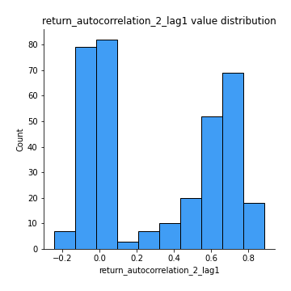

# Exploratory Data Analysis

[<< Go back](../README.md)
## Feature : target
- **Feature type** : categorical
- **Missing** : 0.0%
- **Unique** : 2
- **Count** :347
- **Unique** :2
- **Top** :simulated
- **Freq** :177

## Feature : mean1
- **Feature type** : continous
- **Missing** : 0.0%
- **Unique** : 347
- **Count** :347.0
- **Mean** :-0.2429629464992073
- **Std** :0.31714758276826793
- **Min** :-0.9381577624715209
- **25%th Percentile** : -0.5387710614129142
- **50%th Percentile** : -0.2516799947049939
- **75%th Percentile** : 0.05659694639843202
- **Max** :0.37175100008111034

## Feature : mean2
- **Feature type** : continous
- **Missing** : 0.0%
- **Unique** : 347
- **Count** :347.0
- **Mean** :-0.2662583188623163
- **Std** :0.348856798711338
- **Min** :-1.2681230949163782
- **25%th Percentile** : -0.5772944006845818
- **50%th Percentile** : -0.21243113216081735
- **75%th Percentile** : 0.05786652693553883
- **Max** :0.37616608147096464

## Feature : sd1
- **Feature type** : continous
- **Missing** : 0.0%
- **Unique** : 347
- **Count** :347.0
- **Mean** :1.5975151496214148
- **Std** :0.8227245797496385
- **Min** :0.7620831696941981
- **25%th Percentile** : 1.2353567115332007
- **50%th Percentile** : 1.2868166090094353
- **75%th Percentile** : 1.6533767460973428
- **Max** :9.236766377527575

## Feature : sd2
- **Feature type** : continous
- **Missing** : 0.0%
- **Unique** : 347
- **Count** :347.0
- **Mean** :1.881710964487307
- **Std** :0.7168348674687701
- **Min** :0.8967691504919791
- **25%th Percentile** : 1.4674139952537106
- **50%th Percentile** : 1.7735733876400106
- **75%th Percentile** : 2.0616175713144616
- **Max** :6.737618636746393

## Feature : skewness1
- **Feature type** : continous
- **Missing** : 0.0%
- **Unique** : 347
- **Count** :347.0
- **Mean** :-0.06697236544712976
- **Std** :0.5853154207324553
- **Min** :-3.530116233761814
- **25%th Percentile** : -0.1563270481608119
- **50%th Percentile** : -0.02822682337991468
- **75%th Percentile** : 0.10084413316605279
- **Max** :2.5845963767725557

## Feature : skewness2
- **Feature type** : continous
- **Missing** : 0.0%
- **Unique** : 347
- **Count** :347.0
- **Mean** :-0.9426304916433199
- **Std** :0.9516813820244656
- **Min** :-8.801502855292393
- **25%th Percentile** : -1.616628955129661
- **50%th Percentile** : -1.0584073524234094
- **75%th Percentile** : -0.25486328367368943
- **Max** :2.242019525651531

## Feature : kurtosis1
- **Feature type** : continous
- **Missing** : 0.0%
- **Unique** : 347
- **Count** :347.0
- **Mean** :3.1977200827297207
- **Std** :6.032609268735714
- **Min** :-0.45696837848952
- **25%th Percentile** : -0.03487482748759452
- **50%th Percentile** : 0.4285132601670729
- **75%th Percentile** : 3.601784904080982
- **Max** :36.91113889081053

## Feature : kurtosis2
- **Feature type** : continous
- **Missing** : 0.0%
- **Unique** : 347
- **Count** :347.0
- **Mean** :5.213236390695338
- **Std** :8.97434420484346
- **Min** :-0.08541755297837117
- **25%th Percentile** : 2.4307721805032427
- **50%th Percentile** : 3.6607267068103737
- **75%th Percentile** : 4.908889875355416
- **Max** :143.10871011533666

## Feature : return_autocorrelation_1_lag1
- **Feature type** : continous
- **Missing** : 0.0%
- **Unique** : 347
- **Count** :347.0
- **Mean** :0.019621794963275214
- **Std** :0.0726568863508775
- **Min** :-0.2135576224968752
- **25%th Percentile** : -0.027455074117402736
- **50%th Percentile** : 0.026361263443736495
- **75%th Percentile** : 0.07118585638080346
- **Max** :0.21456241065200501

## Feature : return_autocorrelation_1_lag2
- **Feature type** : continous
- **Missing** : 0.0%
- **Unique** : 347
- **Count** :347.0
- **Mean** :0.024433704310713983
- **Std** :0.0657840425720258
- **Min** :-0.13309283796645122
- **25%th Percentile** : -0.017993009030377302
- **50%th Percentile** : 0.01875432170987361
- **75%th Percentile** : 0.07165499081469356
- **Max** :0.2122861070908919

## Feature : return_autocorrelation_1_lag3
- **Feature type** : continous
- **Missing** : 0.0%
- **Unique** : 347
- **Count** :347.0
- **Mean** :0.03122980734663402
- **Std** :0.06312371488144611
- **Min** :-0.1940836867390813
- **25%th Percentile** : -0.010355691551312024
- **50%th Percentile** : 0.034062088088023856
- **75%th Percentile** : 0.07203066885262002
- **Max** :0.20098008836163495

## Feature : return_autocorrelation_2_lag1
- **Feature type** : continous
- **Missing** : 0.0%
- **Unique** : 347
- **Count** :347.0
- **Mean** :0.30987132884289187
- **Std** :0.34346501184436196
- **Min** :-0.24590087874039124
- **25%th Percentile** : -0.016768681115712527
- **50%th Percentile** : 0.25507934092325535
- **75%th Percentile** : 0.6601558429628565
- **Max** :0.8861628925017888

## Feature : return_autocorrelation_2_lag2
- **Feature type** : continous
- **Missing** : 0.0%
- **Unique** : 347
- **Count** :347.0
- **Mean** :0.3108618363033792
- **Std** :0.3356764861064898
- **Min** :-0.15323211089747296
- **25%th Percentile** : -0.017892866063311773
- **50%th Percentile** : 0.21866548499667107
- **75%th Percentile** : 0.6498919128407572
- **Max** :0.8802292115047444

## Feature : return_autocorrelation_2_lag3
- **Feature type** : continous
- **Missing** : 0.0%
- **Unique** : 347
- **Count** :347.0
- **Mean** :0.30981171649903677
- **Std** :0.33316353826311423
- **Min** :-0.12708292641486704
- **25%th Percentile** : -0.010595512251248784
- **50%th Percentile** : 0.2166514467409481
- **75%th Percentile** : 0.6462714630249412
- **Max** :0.8778424309872105

## Feature : return_correlation_ts1_lag_0
- **Feature type** : continous
- **Missing** : 0.0%
- **Unique** : 347
- **Count** :347.0
- **Mean** :0.3245060237416904
- **Std** :0.1125962786470353
- **Min** :-0.027089510445801036
- **25%th Percentile** : 0.26481534966668385
- **50%th Percentile** : 0.3327163044575831
- **75%th Percentile** : 0.37762316295317755
- **Max** :0.7028422087350163

## Feature : return_correlation_ts1_lag_1
- **Feature type** : continous
- **Missing** : 0.0%
- **Unique** : 347
- **Count** :347.0
- **Mean** :0.07245048439866207
- **Std** :0.10022791647127437
- **Min** :-0.16985510949917193
- **25%th Percentile** : -0.005682085636313252
- **50%th Percentile** : 0.07835552412264682
- **75%th Percentile** : 0.15957547977962516
- **Max** :0.282659873216528

## Feature : return_correlation_ts1_lag_2
- **Feature type** : continous
- **Missing** : 0.0%
- **Unique** : 347
- **Count** :347.0
- **Mean** :0.07520283541651977
- **Std** :0.09740823201931025
- **Min** :-0.21653581047581763
- **25%th Percentile** : -0.005822901377645122
- **50%th Percentile** : 0.07015009997949354
- **75%th Percentile** : 0.1556949841404972
- **Max** :0.33171996279639204

## Feature : return_correlation_ts1_lag_3
- **Feature type** : continous
- **Missing** : 0.0%
- **Unique** : 347
- **Count** :347.0
- **Mean** :0.07508740327296241
- **Std** :0.09678603240293931
- **Min** :-0.1270218498974763
- **25%th Percentile** : -0.005049621123639951
- **50%th Percentile** : 0.07548240183351919
- **75%th Percentile** : 0.160059603405106
- **Max** :0.2841932587241117

## Feature : return_correlation_ts2_lag_1
- **Feature type** : continous
- **Missing** : 0.0%
- **Unique** : 347
- **Count** :347.0
- **Mean** :0.0680184273466388
- **Std** :0.09698680159944571
- **Min** :-0.2081139431093261
- **25%th Percentile** : -0.011927655030407481
- **50%th Percentile** : 0.06428921283185247
- **75%th Percentile** : 0.15051196697925845
- **Max** :0.31070246027090254

## Feature : return_correlation_ts2_lag_2
- **Feature type** : continous
- **Missing** : 0.0%
- **Unique** : 347
- **Count** :347.0
- **Mean** :0.07051795089152305
- **Std** :0.0923788803164892
- **Min** :-0.23751835475804678
- **25%th Percentile** : -0.006746710374323692
- **50%th Percentile** : 0.06342163083760649
- **75%th Percentile** : 0.14415560855789866
- **Max** :0.3338355519566983

## Feature : return_correlation_ts2_lag_3
- **Feature type** : continous
- **Missing** : 0.0%
- **Unique** : 347
- **Count** :347.0
- **Mean** :0.07073423033947852
- **Std** :0.09578886414269791
- **Min** :-0.17564076057312866
- **25%th Percentile** : -0.007620675089094652
- **50%th Percentile** : 0.0692572850821736
- **75%th Percentile** : 0.14891222187798941
- **Max** :0.30440368024116654

## Feature : sqreturn_autocorrelation_ts1_lag1
- **Feature type** : continous
- **Missing** : 0.0%
- **Unique** : 347
- **Count** :347.0
- **Mean** :0.061064896447463664
- **Std** :0.09043749024974408
- **Min** :-0.09644356963812684
- **25%th Percentile** : 0.0032598668203475756
- **50%th Percentile** : 0.03601015756957659
- **75%th Percentile** : 0.09261741799418072
- **Max** :0.49414293176447355

## Feature : sqreturn_autocorrelation_ts1_lag2
- **Feature type** : continous
- **Missing** : 0.0%
- **Unique** : 347
- **Count** :347.0
- **Mean** :0.05169543026241687
- **Std** :0.0864196282344063
- **Min** :-0.11970104438027054
- **25%th Percentile** : -0.0030206406553473005
- **50%th Percentile** : 0.03438685400467464
- **75%th Percentile** : 0.07928716887409692
- **Max** :0.540735851444759

## Feature : sqreturn_autocorrelation_ts1_lag3
- **Feature type** : continous
- **Missing** : 0.0%
- **Unique** : 347
- **Count** :347.0
- **Mean** :0.04770082544461576
- **Std** :0.07954791913060925
- **Min** :-0.08449914168914088
- **25%th Percentile** : -0.006783774165261533
- **50%th Percentile** : 0.03272787541740248
- **75%th Percentile** : 0.08100090949242891
- **Max** :0.44755937369538146

## Feature : sqreturn_autocorrelation_ts2_lag1
- **Feature type** : continous
- **Missing** : 0.0%
- **Unique** : 347
- **Count** :347.0
- **Mean** :0.45298548076035045
- **Std** :0.3732380962041756
- **Min** :-0.08520586663750691
- **25%th Percentile** : 0.07391895622826458
- **50%th Percentile** : 0.35221785747778067
- **75%th Percentile** : 0.8398617514272693
- **Max** :0.9606621811709346

## Feature : sqreturn_autocorrelation_ts2_lag2
- **Feature type** : continous
- **Missing** : 0.0%
- **Unique** : 347
- **Count** :347.0
- **Mean** :0.4433224937381439
- **Std** :0.3795274355952124
- **Min** :-0.051523884196217395
- **25%th Percentile** : 0.042591276164763624
- **50%th Percentile** : 0.38955150949317774
- **75%th Percentile** : 0.8298636000249389
- **Max** :0.9570918973488743

## Feature : sqreturn_autocorrelation_ts2_lag3
- **Feature type** : continous
- **Missing** : 0.0%
- **Unique** : 347
- **Count** :347.0
- **Mean** :0.4276101060138088
- **Std** :0.3865584447806517
- **Min** :-0.06082766359524085
- **25%th Percentile** : 0.035976608635472196
- **50%th Percentile** : 0.31225727797735664
- **75%th Percentile** : 0.8347742294964753
- **Max** :0.9584727354814415

## Feature : sqreturn_correlation_ts1_lag_0
- **Feature type** : continous
- **Missing** : 0.0%
- **Unique** : 347
- **Count** :347.0
- **Mean** :0.3245060237416904
- **Std** :0.1125962786470353
- **Min** :-0.027089510445801036
- **25%th Percentile** : 0.26481534966668385
- **50%th Percentile** : 0.3327163044575831
- **75%th Percentile** : 0.37762316295317755
- **Max** :0.7028422087350163

## Feature : sqreturn_correlation_ts1_lag_1
- **Feature type** : continous
- **Missing** : 0.0%
- **Unique** : 347
- **Count** :347.0
- **Mean** :0.07245048439866207
- **Std** :0.10022791647127437
- **Min** :-0.16985510949917193
- **25%th Percentile** : -0.005682085636313252
- **50%th Percentile** : 0.07835552412264682
- **75%th Percentile** : 0.15957547977962516
- **Max** :0.282659873216528

## Feature : sqreturn_correlation_ts1_lag_2
- **Feature type** : continous
- **Missing** : 0.0%
- **Unique** : 347
- **Count** :347.0
- **Mean** :0.07520283541651977
- **Std** :0.09740823201931025
- **Min** :-0.21653581047581763
- **25%th Percentile** : -0.005822901377645122
- **50%th Percentile** : 0.07015009997949354
- **75%th Percentile** : 0.1556949841404972
- **Max** :0.33171996279639204

## Feature : sqreturn_correlation_ts1_lag_3
- **Feature type** : continous
- **Missing** : 0.0%
- **Unique** : 347
- **Count** :347.0
- **Mean** :0.07508740327296241
- **Std** :0.09678603240293931
- **Min** :-0.1270218498974763
- **25%th Percentile** : -0.005049621123639951
- **50%th Percentile** : 0.07548240183351919
- **75%th Percentile** : 0.160059603405106
- **Max** :0.2841932587241117

## Feature : sqreturn_correlation_ts2_lag_1
- **Feature type** : continous
- **Missing** : 0.0%
- **Unique** : 347
- **Count** :347.0
- **Mean** :0.0680184273466388
- **Std** :0.09698680159944571
- **Min** :-0.2081139431093261
- **25%th Percentile** : -0.011927655030407481
- **50%th Percentile** : 0.06428921283185247
- **75%th Percentile** : 0.15051196697925845
- **Max** :0.31070246027090254

## Feature : sqreturn_correlation_ts2_lag_2
- **Feature type** : continous
- **Missing** : 0.0%
- **Unique** : 347
- **Count** :347.0
- **Mean** :0.07051795089152305
- **Std** :0.0923788803164892
- **Min** :-0.23751835475804678
- **25%th Percentile** : -0.006746710374323692
- **50%th Percentile** : 0.06342163083760649
- **75%th Percentile** : 0.14415560855789866
- **Max** :0.3338355519566983

## Feature : sqreturn_correlation_ts2_lag_3
- **Feature type** : continous
- **Missing** : 0.0%
- **Unique** : 347
- **Count** :347.0
- **Mean** :0.07073423033947852
- **Std** :0.09578886414269791
- **Min** :-0.17564076057312866
- **25%th Percentile** : -0.007620675089094652
- **50%th Percentile** : 0.0692572850821736
- **75%th Percentile** : 0.14891222187798941
- **Max** :0.30440368024116654

## Feature : price2_granger_cause_price1
- **Feature type** : continous
- **Missing** : 0.0%
- **Unique** : 347
- **Count** :347.0
- **Mean** :0.1789721972277068
- **Std** :0.26596101644465886
- **Min** :5.09245139322211e-35
- **25%th Percentile** : 4.672659456312207e-07
- **50%th Percentile** : 0.01605306474112226
- **75%th Percentile** : 0.28444809995471093
- **Max** :0.9885712803689185

## Feature : price1_granger_cause_price2
- **Feature type** : continous
- **Missing** : 0.0%
- **Unique** : 347
- **Count** :347.0
- **Mean** :0.16935913075241407
- **Std** :0.25006086614849593
- **Min** :3.937807547030471e-24
- **25%th Percentile** : 8.161003544731427e-06
- **50%th Percentile** : 0.019520610775820776
- **75%th Percentile** : 0.2730347851335665
- **Max** :0.9660122325264373

[<< Go back](../README.md)
