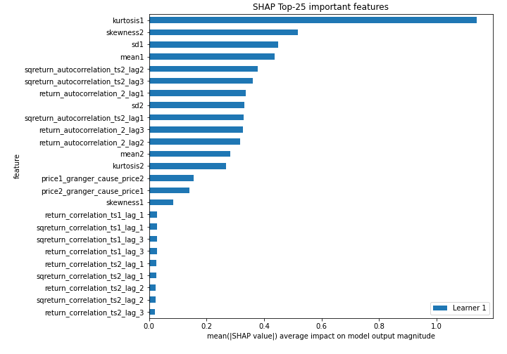
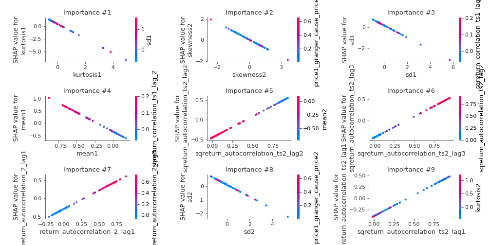

# Summary of 3_Linear

[<< Go back](../README.md)

## Logistic Regression (Linear)
- **n_jobs**: -1
- **explain_level**: 2

## Validation
 - **validation_type**: split
 - **train_ratio**: 0.75
 - **shuffle**: True
 - **stratify**: True

## Optimized metric
accuracy

## Training time

3.7 seconds

## Metric details
|           |     score |     threshold |
|:----------|----------:|--------------:|
| logloss   | 0.0407312 | nan           |
| auc       | 1         | nan           |
| f1        | 1         |   0.268149    |
| accuracy  | 1         |   0.268149    |
| precision | 1         |   0.508152    |
| recall    | 1         |   7.43787e-06 |
| mcc       | 1         |   0.268149    |

## Confusion matrix (at threshold=0.268149)
|                      |   Predicted as real |   Predicted as simulated |
|:---------------------|--------------------:|-------------------------:|
| Labeled as real      |                  43 |                        0 |
| Labeled as simulated |                   0 |                       44 |

## Learning curves

## Coefficients
| feature                           |   Learner_1 |
|:----------------------------------|------------:|
| sqreturn_autocorrelation_ts2_lag2 |  1.08226    |
| return_autocorrelation_2_lag3     |  1.05228    |
| return_autocorrelation_2_lag2     |  1.05011    |
| return_autocorrelation_2_lag1     |  1.01752    |
| sqreturn_autocorrelation_ts2_lag3 |  0.985848   |
| sqreturn_autocorrelation_ts2_lag1 |  0.922258   |
| sqreturn_correlation_ts1_lag_1    |  0.332773   |
| return_correlation_ts1_lag_1      |  0.332773   |
| sqreturn_correlation_ts1_lag_3    |  0.324856   |
| return_correlation_ts1_lag_3      |  0.324856   |
| sqreturn_correlation_ts2_lag_1    |  0.296189   |
| return_correlation_ts2_lag_1      |  0.296189   |
| return_correlation_ts2_lag_2      |  0.287229   |
| sqreturn_correlation_ts2_lag_2    |  0.287229   |
| return_correlation_ts2_lag_3      |  0.275376   |
| sqreturn_correlation_ts2_lag_3    |  0.275376   |
| sqreturn_correlation_ts1_lag_2    |  0.259586   |
| return_correlation_ts1_lag_2      |  0.259586   |
| return_autocorrelation_1_lag1     |  0.257452   |
| skewness1                         |  0.252807   |
| return_autocorrelation_1_lag3     |  0.191429   |
| return_autocorrelation_1_lag2     |  0.184781   |
| sqreturn_correlation_ts1_lag_0    | -0.00833363 |
| return_correlation_ts1_lag_0      | -0.00833363 |
| sqreturn_autocorrelation_ts1_lag3 | -0.12804    |
| sqreturn_autocorrelation_ts1_lag2 | -0.187539   |
| sqreturn_autocorrelation_ts1_lag1 | -0.289511   |
| sd2                               | -0.436124   |
| sd1                               | -0.586262   |
| price2_granger_cause_price1       | -0.593746   |
| price1_granger_cause_price2       | -0.763333   |
| skewness2                         | -0.8003     |
| kurtosis2                         | -0.862692   |
| mean2                             | -0.950114   |
| kurtosis1                         | -1.41445    |
| mean1                             | -1.55638    |
| intercept                         | -2.87507    |

## Permutation-based Importance

## Confusion Matrix

## Normalized Confusion Matrix

## ROC Curve

## Kolmogorov-Smirnov Statistic

## Precision-Recall Curve

## Calibration Curve

## Cumulative Gains Curve

## Lift Curve

## SHAP Importance

## SHAP Dependence plots

### Dependence (Fold 1)

## SHAP Decision plots

### Top-10 Worst decisions for class 0 (Fold 1)

### Top-10 Best decisions for class 0 (Fold 1)

### Top-10 Worst decisions for class 1 (Fold 1)

### Top-10 Best decisions for class 1 (Fold 1)

[<< Go back](../README.md)
