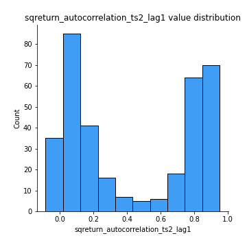

# Exploratory Data Analysis

[<< Go back](../README.md)
## Feature : target
- **Feature type** : categorical
- **Missing** : 0.0%
- **Unique** : 2
- **Count** :347
- **Unique** :2
- **Top** :simulated
- **Freq** :174

## Feature : mean1
- **Feature type** : continous
- **Missing** : 0.0%
- **Unique** : 347
- **Count** :347.0
- **Mean** :-0.23904311247480176
- **Std** :0.3105720339129925
- **Min** :-0.88727393615743
- **25%th Percentile** : -0.5289184292568447
- **50%th Percentile** : -0.17204249685483763
- **75%th Percentile** : 0.053080451029895254
- **Max** :0.37175100008111034

## Feature : mean2
- **Feature type** : continous
- **Missing** : 0.0%
- **Unique** : 347
- **Count** :347.0
- **Mean** :-0.2546628288860533
- **Std** :0.3402727765637103
- **Min** :-1.2634255074166127
- **25%th Percentile** : -0.5683718611383916
- **50%th Percentile** : -0.19314328651816623
- **75%th Percentile** : 0.05550804733911564
- **Max** :0.37616608147096464

## Feature : sd1
- **Feature type** : continous
- **Missing** : 0.0%
- **Unique** : 347
- **Count** :347.0
- **Mean** :1.611541315401274
- **Std** :0.8469970121281762
- **Min** :0.7470080772831957
- **25%th Percentile** : 1.2323396154949138
- **50%th Percentile** : 1.2875742693417258
- **75%th Percentile** : 1.6902017658202082
- **Max** :9.236766377527575

## Feature : sd2
- **Feature type** : continous
- **Missing** : 0.0%
- **Unique** : 347
- **Count** :347.0
- **Mean** :1.9058646213222492
- **Std** :0.7499250610192842
- **Min** :0.8455946193085045
- **25%th Percentile** : 1.4540122342069912
- **50%th Percentile** : 1.7814828335335218
- **75%th Percentile** : 2.0702605429936725
- **Max** :6.737618636746393

## Feature : skewness1
- **Feature type** : continous
- **Missing** : 0.0%
- **Unique** : 347
- **Count** :347.0
- **Mean** :-0.0853888960393807
- **Std** :0.5554138806734984
- **Min** :-3.530116233761814
- **25%th Percentile** : -0.18893026564736531
- **50%th Percentile** : -0.042001025257228874
- **75%th Percentile** : 0.05952520265859294
- **Max** :2.5845963767725557

## Feature : skewness2
- **Feature type** : continous
- **Missing** : 0.0%
- **Unique** : 347
- **Count** :347.0
- **Mean** :-0.9038308996499154
- **Std** :1.0117958662322681
- **Min** :-8.801502855292393
- **25%th Percentile** : -1.586271721356578
- **50%th Percentile** : -0.9832201572958815
- **75%th Percentile** : -0.23676984422478103
- **Max** :2.2606839051517187

## Feature : kurtosis1
- **Feature type** : continous
- **Missing** : 0.0%
- **Unique** : 347
- **Count** :347.0
- **Mean** :3.032530787243976
- **Std** :5.848269600916679
- **Min** :-0.49509587333399896
- **25%th Percentile** : -0.004177419059982812
- **50%th Percentile** : 0.5475802376953998
- **75%th Percentile** : 3.4878801809466733
- **Max** :36.91113889081053

## Feature : kurtosis2
- **Feature type** : continous
- **Missing** : 0.0%
- **Unique** : 347
- **Count** :347.0
- **Mean** :5.527019691003602
- **Std** :9.7311475839175
- **Min** :-0.30900298143453986
- **25%th Percentile** : 2.4023358784865128
- **50%th Percentile** : 3.665745567321958
- **75%th Percentile** : 4.959118914730564
- **Max** :143.10871011533666

## Feature : return_autocorrelation_1_lag1
- **Feature type** : continous
- **Missing** : 0.0%
- **Unique** : 347
- **Count** :347.0
- **Mean** :0.015284401918660132
- **Std** :0.07632074113755365
- **Min** :-0.19339575314049967
- **25%th Percentile** : -0.02917855358677514
- **50%th Percentile** : 0.020389366955023375
- **75%th Percentile** : 0.06835888467312203
- **Max** :0.23127225972050278

## Feature : return_autocorrelation_1_lag2
- **Feature type** : continous
- **Missing** : 0.0%
- **Unique** : 347
- **Count** :347.0
- **Mean** :0.021606437857822684
- **Std** :0.0601929970874169
- **Min** :-0.13309283796645122
- **25%th Percentile** : -0.01602784737308738
- **50%th Percentile** : 0.018025024544903574
- **75%th Percentile** : 0.05762133721984769
- **Max** :0.16806219430921773

## Feature : return_autocorrelation_1_lag3
- **Feature type** : continous
- **Missing** : 0.0%
- **Unique** : 347
- **Count** :347.0
- **Mean** :0.028966239112557777
- **Std** :0.06271894153810699
- **Min** :-0.1940836867390813
- **25%th Percentile** : -0.010761600965964287
- **50%th Percentile** : 0.02917060415850453
- **75%th Percentile** : 0.0736658346719774
- **Max** :0.2409453198982211

## Feature : return_autocorrelation_2_lag1
- **Feature type** : continous
- **Missing** : 0.0%
- **Unique** : 347
- **Count** :347.0
- **Mean** :0.2954978488119671
- **Std** :0.3378167959715681
- **Min** :-0.24590087874039124
- **25%th Percentile** : -0.025113874107817458
- **50%th Percentile** : 0.11353369288759363
- **75%th Percentile** : 0.6433897254583294
- **Max** :0.880711961761678

## Feature : return_autocorrelation_2_lag2
- **Feature type** : continous
- **Missing** : 0.0%
- **Unique** : 347
- **Count** :347.0
- **Mean** :0.3001684926549168
- **Std** :0.3278953371123873
- **Min** :-0.15323211089747296
- **25%th Percentile** : -0.009808090400774863
- **50%th Percentile** : 0.1447966288833156
- **75%th Percentile** : 0.6360013491266696
- **Max** :0.879551509601906

## Feature : return_autocorrelation_2_lag3
- **Feature type** : continous
- **Missing** : 0.0%
- **Unique** : 347
- **Count** :347.0
- **Mean** :0.29499662408659627
- **Std** :0.3286426279347745
- **Min** :-0.14200107169559698
- **25%th Percentile** : -0.016706050142869258
- **50%th Percentile** : 0.1419999376914021
- **75%th Percentile** : 0.6345430086832556
- **Max** :0.8819000098162231

## Feature : return_correlation_ts1_lag_0
- **Feature type** : continous
- **Missing** : 0.0%
- **Unique** : 347
- **Count** :347.0
- **Mean** :0.3285191433470832
- **Std** :0.1112036626120101
- **Min** :-0.027089510445801036
- **25%th Percentile** : 0.2665010931833617
- **50%th Percentile** : 0.3279158869848604
- **75%th Percentile** : 0.3813123856685121
- **Max** :0.7041861626832071

## Feature : return_correlation_ts1_lag_1
- **Feature type** : continous
- **Missing** : 0.0%
- **Unique** : 347
- **Count** :347.0
- **Mean** :0.06325194065398056
- **Std** :0.09934956497364766
- **Min** :-0.15776193292681923
- **25%th Percentile** : -0.0126038727916566
- **50%th Percentile** : 0.05502503121772045
- **75%th Percentile** : 0.14456353890929174
- **Max** :0.2883836535081696

## Feature : return_correlation_ts1_lag_2
- **Feature type** : continous
- **Missing** : 0.0%
- **Unique** : 347
- **Count** :347.0
- **Mean** :0.07029491017949266
- **Std** :0.09018099790367284
- **Min** :-0.11523251525020971
- **25%th Percentile** : -0.003963677865958395
- **50%th Percentile** : 0.06813506827032777
- **75%th Percentile** : 0.14202200222335187
- **Max** :0.2688397846534779

## Feature : return_correlation_ts1_lag_3
- **Feature type** : continous
- **Missing** : 0.0%
- **Unique** : 347
- **Count** :347.0
- **Mean** :0.07184393739121006
- **Std** :0.09432103702850363
- **Min** :-0.1270218498974763
- **25%th Percentile** : -0.007177145682166144
- **50%th Percentile** : 0.07574616918397643
- **75%th Percentile** : 0.14693946350538697
- **Max** :0.29551075386335207

## Feature : return_correlation_ts2_lag_1
- **Feature type** : continous
- **Missing** : 0.0%
- **Unique** : 347
- **Count** :347.0
- **Mean** :0.0641097399251197
- **Std** :0.09766752799276798
- **Min** :-0.2081139431093261
- **25%th Percentile** : -0.013968313295694337
- **50%th Percentile** : 0.05925550039287871
- **75%th Percentile** : 0.1453468495738165
- **Max** :0.27192253489605

## Feature : return_correlation_ts2_lag_2
- **Feature type** : continous
- **Missing** : 0.0%
- **Unique** : 347
- **Count** :347.0
- **Mean** :0.06561463989977422
- **Std** :0.0920065465267351
- **Min** :-0.23751835475804678
- **25%th Percentile** : -0.00651431480044268
- **50%th Percentile** : 0.05463502635736337
- **75%th Percentile** : 0.14079786037728476
- **Max** :0.279284074763679

## Feature : return_correlation_ts2_lag_3
- **Feature type** : continous
- **Missing** : 0.0%
- **Unique** : 347
- **Count** :347.0
- **Mean** :0.06612191977788393
- **Std** :0.09147942995890922
- **Min** :-0.17564076057312866
- **25%th Percentile** : -0.007620675089094652
- **50%th Percentile** : 0.06430097477708784
- **75%th Percentile** : 0.13946666145130698
- **Max** :0.33928104112907614

## Feature : sqreturn_autocorrelation_ts1_lag1
- **Feature type** : continous
- **Missing** : 0.0%
- **Unique** : 347
- **Count** :347.0
- **Mean** :0.06959763709135271
- **Std** :0.08974477437564686
- **Min** :-0.07494294416980121
- **25%th Percentile** : 0.010849313111326026
- **50%th Percentile** : 0.04797734163841104
- **75%th Percentile** : 0.10710391401551034
- **Max** :0.4439086285737898

## Feature : sqreturn_autocorrelation_ts1_lag2
- **Feature type** : continous
- **Missing** : 0.0%
- **Unique** : 347
- **Count** :347.0
- **Mean** :0.0585269377711755
- **Std** :0.08656474295605267
- **Min** :-0.12092268361475333
- **25%th Percentile** : 0.00716656580583494
- **50%th Percentile** : 0.03893553630769483
- **75%th Percentile** : 0.08541732926685142
- **Max** :0.540735851444759

## Feature : sqreturn_autocorrelation_ts1_lag3
- **Feature type** : continous
- **Missing** : 0.0%
- **Unique** : 347
- **Count** :347.0
- **Mean** :0.04961776858683411
- **Std** :0.07364775915717146
- **Min** :-0.09075996732229272
- **25%th Percentile** : -0.0001198417237293596
- **50%th Percentile** : 0.033676431104114016
- **75%th Percentile** : 0.08101940624114844
- **Max** :0.41030914918857014

## Feature : sqreturn_autocorrelation_ts2_lag1
- **Feature type** : continous
- **Missing** : 0.0%
- **Unique** : 347
- **Count** :347.0
- **Mean** :0.43781849270025613
- **Std** :0.36864051882502635
- **Min** :-0.08520586663750691
- **25%th Percentile** : 0.07317653774074089
- **50%th Percentile** : 0.2932867660283794
- **75%th Percentile** : 0.8265947186258966
- **Max** :0.9512883910721956

## Feature : sqreturn_autocorrelation_ts2_lag2
- **Feature type** : continous
- **Missing** : 0.0%
- **Unique** : 347
- **Count** :347.0
- **Mean** :0.4311261761975283
- **Std** :0.3723300493645446
- **Min** :-0.033377693228870714
- **25%th Percentile** : 0.04872415777708081
- **50%th Percentile** : 0.33888608917633906
- **75%th Percentile** : 0.8234434804586594
- **Max** :0.9557414531192631

## Feature : sqreturn_autocorrelation_ts2_lag3
- **Feature type** : continous
- **Missing** : 0.0%
- **Unique** : 347
- **Count** :347.0
- **Mean** :0.41468875289529317
- **Std** :0.37938514800139594
- **Min** :-0.06082766359524085
- **25%th Percentile** : 0.03711554950474376
- **50%th Percentile** : 0.2631994508239405
- **75%th Percentile** : 0.8233303067715645
- **Max** :0.9460031320365225

## Feature : sqreturn_correlation_ts1_lag_0
- **Feature type** : continous
- **Missing** : 0.0%
- **Unique** : 347
- **Count** :347.0
- **Mean** :0.3285191433470832
- **Std** :0.1112036626120101
- **Min** :-0.027089510445801036
- **25%th Percentile** : 0.2665010931833617
- **50%th Percentile** : 0.3279158869848604
- **75%th Percentile** : 0.3813123856685121
- **Max** :0.7041861626832071

## Feature : sqreturn_correlation_ts1_lag_1
- **Feature type** : continous
- **Missing** : 0.0%
- **Unique** : 347
- **Count** :347.0
- **Mean** :0.06325194065398056
- **Std** :0.09934956497364766
- **Min** :-0.15776193292681923
- **25%th Percentile** : -0.0126038727916566
- **50%th Percentile** : 0.05502503121772045
- **75%th Percentile** : 0.14456353890929174
- **Max** :0.2883836535081696

## Feature : sqreturn_correlation_ts1_lag_2
- **Feature type** : continous
- **Missing** : 0.0%
- **Unique** : 347
- **Count** :347.0
- **Mean** :0.07029491017949266
- **Std** :0.09018099790367284
- **Min** :-0.11523251525020971
- **25%th Percentile** : -0.003963677865958395
- **50%th Percentile** : 0.06813506827032777
- **75%th Percentile** : 0.14202200222335187
- **Max** :0.2688397846534779

## Feature : sqreturn_correlation_ts1_lag_3
- **Feature type** : continous
- **Missing** : 0.0%
- **Unique** : 347
- **Count** :347.0
- **Mean** :0.07184393739121006
- **Std** :0.09432103702850363
- **Min** :-0.1270218498974763
- **25%th Percentile** : -0.007177145682166144
- **50%th Percentile** : 0.07574616918397643
- **75%th Percentile** : 0.14693946350538697
- **Max** :0.29551075386335207

## Feature : sqreturn_correlation_ts2_lag_1
- **Feature type** : continous
- **Missing** : 0.0%
- **Unique** : 347
- **Count** :347.0
- **Mean** :0.0641097399251197
- **Std** :0.09766752799276798
- **Min** :-0.2081139431093261
- **25%th Percentile** : -0.013968313295694337
- **50%th Percentile** : 0.05925550039287871
- **75%th Percentile** : 0.1453468495738165
- **Max** :0.27192253489605

## Feature : sqreturn_correlation_ts2_lag_2
- **Feature type** : continous
- **Missing** : 0.0%
- **Unique** : 347
- **Count** :347.0
- **Mean** :0.06561463989977422
- **Std** :0.0920065465267351
- **Min** :-0.23751835475804678
- **25%th Percentile** : -0.00651431480044268
- **50%th Percentile** : 0.05463502635736337
- **75%th Percentile** : 0.14079786037728476
- **Max** :0.279284074763679

## Feature : sqreturn_correlation_ts2_lag_3
- **Feature type** : continous
- **Missing** : 0.0%
- **Unique** : 347
- **Count** :347.0
- **Mean** :0.06612191977788393
- **Std** :0.09147942995890922
- **Min** :-0.17564076057312866
- **25%th Percentile** : -0.007620675089094652
- **50%th Percentile** : 0.06430097477708784
- **75%th Percentile** : 0.13946666145130698
- **Max** :0.33928104112907614

## Feature : price2_granger_cause_price1
- **Feature type** : continous
- **Missing** : 0.0%
- **Unique** : 347
- **Count** :347.0
- **Mean** :0.1714826445913873
- **Std** :0.2610490933067349
- **Min** :6.676872573985236e-42
- **25%th Percentile** : 9.433225331408522e-07
- **50%th Percentile** : 0.014027886700369693
- **75%th Percentile** : 0.2733881676332255
- **Max** :0.9885712803689185

## Feature : price1_granger_cause_price2
- **Feature type** : continous
- **Missing** : 0.0%
- **Unique** : 347
- **Count** :347.0
- **Mean** :0.17140867580515687
- **Std** :0.25269591167266764
- **Min** :1.399845311159024e-27
- **25%th Percentile** : 4.868669194135286e-05
- **50%th Percentile** : 0.020902102830077374
- **75%th Percentile** : 0.2700955377893237
- **Max** :0.9951398266867577

[<< Go back](../README.md)
