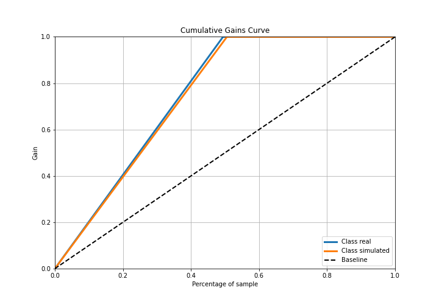

# Summary of Ensemble

[<< Go back](../README.md)

## Ensemble structure
| Model                   |   Weight |
|:------------------------|---------:|
| 5_Default_NeuralNetwork |        1 |

## Metric details
|           |   score |     threshold |
|:----------|--------:|--------------:|
| logloss   | 0.10517 | nan           |
| auc       | 1       | nan           |
| f1        | 1       |   0.508739    |
| accuracy  | 1       |   0.508739    |
| precision | 1       |   0.508739    |
| recall    | 1       |   0.000184918 |
| mcc       | 1       |   0.508739    |

## Confusion matrix (at threshold=0.508739)
|                      |   Predicted as real |   Predicted as simulated |
|:---------------------|--------------------:|-------------------------:|
| Labeled as real      |                  43 |                        0 |
| Labeled as simulated |                   0 |                       44 |

## Learning curves

## Confusion Matrix

## Normalized Confusion Matrix

## ROC Curve

## Kolmogorov-Smirnov Statistic

## Precision-Recall Curve

## Calibration Curve

## Cumulative Gains Curve

## Lift Curve

[<< Go back](../README.md)
