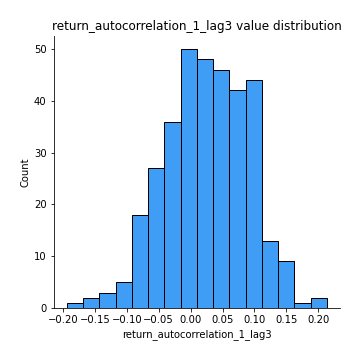

# Exploratory Data Analysis

[<< Go back](../README.md)
## Feature : target
- **Feature type** : categorical
- **Missing** : 0.0%
- **Unique** : 2
- **Count** :347
- **Unique** :2
- **Top** :real
- **Freq** :176

## Feature : mean1
- **Feature type** : continous
- **Missing** : 0.0%
- **Unique** : 347
- **Count** :347.0
- **Mean** :-0.23420401927303935
- **Std** :0.3145173860229809
- **Min** :-0.9420182494033131
- **25%th Percentile** : -0.5404116475758924
- **50%th Percentile** : -0.12531756434611951
- **75%th Percentile** : 0.05787590372950853
- **Max** :0.3612366374600757

## Feature : mean2
- **Feature type** : continous
- **Missing** : 0.0%
- **Unique** : 347
- **Count** :347.0
- **Mean** :-0.2506765751060661
- **Std** :0.3501308485392615
- **Min** :-1.2253476415726916
- **25%th Percentile** : -0.5706754572400701
- **50%th Percentile** : -0.17229417140111347
- **75%th Percentile** : 0.06373534574062097
- **Max** :0.5837242077536182

## Feature : sd1
- **Feature type** : continous
- **Missing** : 0.0%
- **Unique** : 347
- **Count** :347.0
- **Mean** :1.623398546527067
- **Std** :0.825011364314486
- **Min** :0.7620831696941981
- **25%th Percentile** : 1.245556657258436
- **50%th Percentile** : 1.2903344816696334
- **75%th Percentile** : 1.7609450471781232
- **Max** :9.236766377527575

## Feature : sd2
- **Feature type** : continous
- **Missing** : 0.0%
- **Unique** : 347
- **Count** :347.0
- **Mean** :1.8756798952050922
- **Std** :0.715446257202844
- **Min** :0.8455946193085045
- **25%th Percentile** : 1.459066946087755
- **50%th Percentile** : 1.761070784314347
- **75%th Percentile** : 2.05291892308239
- **Max** :5.872800253666788

## Feature : skewness1
- **Feature type** : continous
- **Missing** : 0.0%
- **Unique** : 347
- **Count** :347.0
- **Mean** :-0.11669038951298656
- **Std** :0.5985398244472988
- **Min** :-3.530116233761814
- **25%th Percentile** : -0.19887740323679115
- **50%th Percentile** : -0.020229667469930098
- **75%th Percentile** : 0.09522161973853352
- **Max** :2.224942816365292

## Feature : skewness2
- **Feature type** : continous
- **Missing** : 0.0%
- **Unique** : 347
- **Count** :347.0
- **Mean** :-0.8368647115391212
- **Std** :0.9007283410870406
- **Min** :-3.436088288137694
- **25%th Percentile** : -1.5768381267005291
- **50%th Percentile** : -0.9465948992620881
- **75%th Percentile** : -0.1738197676768929
- **Max** :2.2606839051517187

## Feature : kurtosis1
- **Feature type** : continous
- **Missing** : 0.0%
- **Unique** : 347
- **Count** :347.0
- **Mean** :3.184833449369263
- **Std** :5.828396061994273
- **Min** :-0.5254252426300781
- **25%th Percentile** : -0.04023513409006174
- **50%th Percentile** : 0.6819093157517129
- **75%th Percentile** : 3.6512465710229476
- **Max** :36.91113889081053

## Feature : kurtosis2
- **Feature type** : continous
- **Missing** : 0.0%
- **Unique** : 347
- **Count** :347.0
- **Mean** :5.003783490285826
- **Std** :5.166328942913779
- **Min** :-0.1700123037590351
- **25%th Percentile** : 2.523257000503594
- **50%th Percentile** : 3.7767067651392536
- **75%th Percentile** : 4.924599989387505
- **Max** :36.023880269969645

## Feature : return_autocorrelation_1_lag1
- **Feature type** : continous
- **Missing** : 0.0%
- **Unique** : 347
- **Count** :347.0
- **Mean** :0.016554960435497087
- **Std** :0.0729522486119458
- **Min** :-0.2135576224968752
- **25%th Percentile** : -0.02700806355610754
- **50%th Percentile** : 0.020722666802017533
- **75%th Percentile** : 0.06913709954140185
- **Max** :0.19830600834772275

## Feature : return_autocorrelation_1_lag2
- **Feature type** : continous
- **Missing** : 0.0%
- **Unique** : 347
- **Count** :347.0
- **Mean** :0.023561060242799754
- **Std** :0.06390194556580474
- **Min** :-0.13309283796645122
- **25%th Percentile** : -0.017677673078791454
- **50%th Percentile** : 0.02512430726692688
- **75%th Percentile** : 0.0642517864378974
- **Max** :0.2372315904056621

## Feature : return_autocorrelation_1_lag3
- **Feature type** : continous
- **Missing** : 0.0%
- **Unique** : 347
- **Count** :347.0
- **Mean** :0.02568713299276861
- **Std** :0.06590427573715586
- **Min** :-0.1940836867390813
- **25%th Percentile** : -0.018253751983680386
- **50%th Percentile** : 0.02915298038725312
- **75%th Percentile** : 0.07639490174654229
- **Max** :0.21370306737603945

## Feature : return_autocorrelation_2_lag1
- **Feature type** : continous
- **Missing** : 0.0%
- **Unique** : 347
- **Count** :347.0
- **Mean** :0.2953146644556161
- **Std** :0.34247433419808815
- **Min** :-0.25075531010123286
- **25%th Percentile** : -0.02370892168786351
- **50%th Percentile** : 0.08044155988383898
- **75%th Percentile** : 0.6418380152996959
- **Max** :0.8869713260737518

## Feature : return_autocorrelation_2_lag2
- **Feature type** : continous
- **Missing** : 0.0%
- **Unique** : 347
- **Count** :347.0
- **Mean** :0.29972276426745814
- **Std** :0.33315914764076837
- **Min** :-0.15323211089747296
- **25%th Percentile** : -0.014665583992610785
- **50%th Percentile** : 0.12368622463880061
- **75%th Percentile** : 0.6443256559367025
- **Max** :0.8902000298054313

## Feature : return_autocorrelation_2_lag3
- **Feature type** : continous
- **Missing** : 0.0%
- **Unique** : 347
- **Count** :347.0
- **Mean** :0.296201698981618
- **Std** :0.33018260359015245
- **Min** :-0.14200107169559698
- **25%th Percentile** : -0.011615099469782945
- **50%th Percentile** : 0.09916361039684134
- **75%th Percentile** : 0.6308774801950807
- **Max** :0.8761678926115709

## Feature : return_correlation_ts1_lag_0
- **Feature type** : continous
- **Missing** : 0.0%
- **Unique** : 347
- **Count** :347.0
- **Mean** :0.32461629399535064
- **Std** :0.10985131927372042
- **Min** :-0.027089510445801036
- **25%th Percentile** : 0.266247248665264
- **50%th Percentile** : 0.33029931140255087
- **75%th Percentile** : 0.37252330924940424
- **Max** :0.7028422087350163

## Feature : return_correlation_ts1_lag_1
- **Feature type** : continous
- **Missing** : 0.0%
- **Unique** : 347
- **Count** :347.0
- **Mean** :0.06707837679945641
- **Std** :0.09989679825392886
- **Min** :-0.16985510949917193
- **25%th Percentile** : -0.010384847100349329
- **50%th Percentile** : 0.06222318531147905
- **75%th Percentile** : 0.154361224611406
- **Max** :0.2929615832192002

## Feature : return_correlation_ts1_lag_2
- **Feature type** : continous
- **Missing** : 0.0%
- **Unique** : 347
- **Count** :347.0
- **Mean** :0.07449648819589945
- **Std** :0.09417989066689418
- **Min** :-0.21653581047581763
- **25%th Percentile** : -0.006248732813947334
- **50%th Percentile** : 0.0719228931002147
- **75%th Percentile** : 0.14950516051696963
- **Max** :0.356850828849012

## Feature : return_correlation_ts1_lag_3
- **Feature type** : continous
- **Missing** : 0.0%
- **Unique** : 347
- **Count** :347.0
- **Mean** :0.06997502931292351
- **Std** :0.09562529635306495
- **Min** :-0.12988624386328868
- **25%th Percentile** : -0.009079238869067911
- **50%th Percentile** : 0.0767837809969462
- **75%th Percentile** : 0.15002713962074826
- **Max** :0.29889635774392026

## Feature : return_correlation_ts2_lag_1
- **Feature type** : continous
- **Missing** : 0.0%
- **Unique** : 347
- **Count** :347.0
- **Mean** :0.06449698322033318
- **Std** :0.09882862670919643
- **Min** :-0.2081139431093261
- **25%th Percentile** : -0.013968313295694337
- **50%th Percentile** : 0.06676380846422836
- **75%th Percentile** : 0.14256393882305796
- **Max** :0.323487769089628

## Feature : return_correlation_ts2_lag_2
- **Feature type** : continous
- **Missing** : 0.0%
- **Unique** : 347
- **Count** :347.0
- **Mean** :0.06843430205996243
- **Std** :0.09605443535838752
- **Min** :-0.23751835475804678
- **25%th Percentile** : -0.01119730994723887
- **50%th Percentile** : 0.06205840622702334
- **75%th Percentile** : 0.1463684171263895
- **Max** :0.3550310233203607

## Feature : return_correlation_ts2_lag_3
- **Feature type** : continous
- **Missing** : 0.0%
- **Unique** : 347
- **Count** :347.0
- **Mean** :0.06610067490746825
- **Std** :0.09743974411678277
- **Min** :-0.17564076057312866
- **25%th Percentile** : -0.010525574528243667
- **50%th Percentile** : 0.06236511763813519
- **75%th Percentile** : 0.14486190179975672
- **Max** :0.331292538687261

## Feature : sqreturn_autocorrelation_ts1_lag1
- **Feature type** : continous
- **Missing** : 0.0%
- **Unique** : 347
- **Count** :347.0
- **Mean** :0.06292893875395732
- **Std** :0.09366116811412842
- **Min** :-0.10553911596017293
- **25%th Percentile** : 0.0026987969893480755
- **50%th Percentile** : 0.038996046072880645
- **75%th Percentile** : 0.09968558566239803
- **Max** :0.49414293176447355

## Feature : sqreturn_autocorrelation_ts1_lag2
- **Feature type** : continous
- **Missing** : 0.0%
- **Unique** : 347
- **Count** :347.0
- **Mean** :0.056373573468534964
- **Std** :0.09361104596037817
- **Min** :-0.08836320488394267
- **25%th Percentile** : -0.0007903418202192213
- **50%th Percentile** : 0.02919611630800611
- **75%th Percentile** : 0.08277085802236217
- **Max** :0.540735851444759

## Feature : sqreturn_autocorrelation_ts1_lag3
- **Feature type** : continous
- **Missing** : 0.0%
- **Unique** : 347
- **Count** :347.0
- **Mean** :0.05542249545260813
- **Std** :0.08237513137049762
- **Min** :-0.06486026764840777
- **25%th Percentile** : -0.0018991647772915077
- **50%th Percentile** : 0.03675877355154456
- **75%th Percentile** : 0.0840886943383106
- **Max** :0.44755937369538146

## Feature : sqreturn_autocorrelation_ts2_lag1
- **Feature type** : continous
- **Missing** : 0.0%
- **Unique** : 347
- **Count** :347.0
- **Mean** :0.4409724110773352
- **Std** :0.36998651517580516
- **Min** :-0.08520586663750691
- **25%th Percentile** : 0.07416764381043656
- **50%th Percentile** : 0.2932867660283794
- **75%th Percentile** : 0.8426534096782168
- **Max** :0.9732406045891419

## Feature : sqreturn_autocorrelation_ts2_lag2
- **Feature type** : continous
- **Missing** : 0.0%
- **Unique** : 347
- **Count** :347.0
- **Mean** :0.4292628598065836
- **Std** :0.37884727113656363
- **Min** :-0.033516679666994106
- **25%th Percentile** : 0.04165744341647652
- **50%th Percentile** : 0.3380799547374326
- **75%th Percentile** : 0.8320736578728672
- **Max** :0.9728632096177031

## Feature : sqreturn_autocorrelation_ts2_lag3
- **Feature type** : continous
- **Missing** : 0.0%
- **Unique** : 347
- **Count** :347.0
- **Mean** :0.41510398122413905
- **Std** :0.385595465373096
- **Min** :-0.06082766359524085
- **25%th Percentile** : 0.03285592317681589
- **50%th Percentile** : 0.23154281434581947
- **75%th Percentile** : 0.8244309181252021
- **Max** :0.9654861385897496

## Feature : sqreturn_correlation_ts1_lag_0
- **Feature type** : continous
- **Missing** : 0.0%
- **Unique** : 347
- **Count** :347.0
- **Mean** :0.32461629399535064
- **Std** :0.10985131927372042
- **Min** :-0.027089510445801036
- **25%th Percentile** : 0.266247248665264
- **50%th Percentile** : 0.33029931140255087
- **75%th Percentile** : 0.37252330924940424
- **Max** :0.7028422087350163

## Feature : sqreturn_correlation_ts1_lag_1
- **Feature type** : continous
- **Missing** : 0.0%
- **Unique** : 347
- **Count** :347.0
- **Mean** :0.06707837679945641
- **Std** :0.09989679825392886
- **Min** :-0.16985510949917193
- **25%th Percentile** : -0.010384847100349329
- **50%th Percentile** : 0.06222318531147905
- **75%th Percentile** : 0.154361224611406
- **Max** :0.2929615832192002

## Feature : sqreturn_correlation_ts1_lag_2
- **Feature type** : continous
- **Missing** : 0.0%
- **Unique** : 347
- **Count** :347.0
- **Mean** :0.07449648819589945
- **Std** :0.09417989066689418
- **Min** :-0.21653581047581763
- **25%th Percentile** : -0.006248732813947334
- **50%th Percentile** : 0.0719228931002147
- **75%th Percentile** : 0.14950516051696963
- **Max** :0.356850828849012

## Feature : sqreturn_correlation_ts1_lag_3
- **Feature type** : continous
- **Missing** : 0.0%
- **Unique** : 347
- **Count** :347.0
- **Mean** :0.06997502931292351
- **Std** :0.09562529635306495
- **Min** :-0.12988624386328868
- **25%th Percentile** : -0.009079238869067911
- **50%th Percentile** : 0.0767837809969462
- **75%th Percentile** : 0.15002713962074826
- **Max** :0.29889635774392026

## Feature : sqreturn_correlation_ts2_lag_1
- **Feature type** : continous
- **Missing** : 0.0%
- **Unique** : 347
- **Count** :347.0
- **Mean** :0.06449698322033318
- **Std** :0.09882862670919643
- **Min** :-0.2081139431093261
- **25%th Percentile** : -0.013968313295694337
- **50%th Percentile** : 0.06676380846422836
- **75%th Percentile** : 0.14256393882305796
- **Max** :0.323487769089628

## Feature : sqreturn_correlation_ts2_lag_2
- **Feature type** : continous
- **Missing** : 0.0%
- **Unique** : 347
- **Count** :347.0
- **Mean** :0.06843430205996243
- **Std** :0.09605443535838752
- **Min** :-0.23751835475804678
- **25%th Percentile** : -0.01119730994723887
- **50%th Percentile** : 0.06205840622702334
- **75%th Percentile** : 0.1463684171263895
- **Max** :0.3550310233203607

## Feature : sqreturn_correlation_ts2_lag_3
- **Feature type** : continous
- **Missing** : 0.0%
- **Unique** : 347
- **Count** :347.0
- **Mean** :0.06610067490746825
- **Std** :0.09743974411678277
- **Min** :-0.17564076057312866
- **25%th Percentile** : -0.010525574528243667
- **50%th Percentile** : 0.06236511763813519
- **75%th Percentile** : 0.14486190179975672
- **Max** :0.331292538687261

## Feature : price2_granger_cause_price1
- **Feature type** : continous
- **Missing** : 0.0%
- **Unique** : 347
- **Count** :347.0
- **Mean** :0.1923328891751762
- **Std** :0.2746031817574099
- **Min** :7.752377784601189e-28
- **25%th Percentile** : 3.0110193844910926e-07
- **50%th Percentile** : 0.01605306474112226
- **75%th Percentile** : 0.33863831870937655
- **Max** :0.9885712803689185

## Feature : price1_granger_cause_price2
- **Feature type** : continous
- **Missing** : 0.0%
- **Unique** : 347
- **Count** :347.0
- **Mean** :0.16090967412572885
- **Std** :0.24381568616179608
- **Min** :7.173951246646617e-36
- **25%th Percentile** : 4.95307621212705e-06
- **50%th Percentile** : 0.016398268511350407
- **75%th Percentile** : 0.2543344000945917
- **Max** :0.9951398266867577

[<< Go back](../README.md)
