# Exploratory Data Analysis

[<< Go back](../README.md)
## Feature : target
- **Feature type** : categorical
- **Missing** : 0.0%
- **Unique** : 2
- **Count** :347
- **Unique** :2
- **Top** :real
- **Freq** :176

## Feature : mean1
- **Feature type** : continous
- **Missing** : 0.0%
- **Unique** : 347
- **Count** :347.0
- **Mean** :-0.2255961975550087
- **Std** :0.31116188322023236
- **Min** :-0.9187153717062725
- **25%th Percentile** : -0.5248049294317818
- **50%th Percentile** : -0.10429740584906766
- **75%th Percentile** : 0.05800209500123443
- **Max** :0.37175100008111034

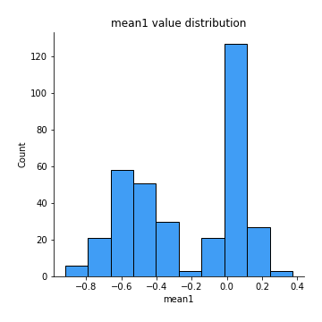
## Feature : mean2
- **Feature type** : continous
- **Missing** : 0.0%
- **Unique** : 347
- **Count** :347.0
- **Mean** :-0.2503962904444967
- **Std** :0.3462946980042399
- **Min** :-1.2245635143655074
- **25%th Percentile** : -0.5704304352185985
- **50%th Percentile** : -0.16677645431873298
- **75%th Percentile** : 0.060068701411380813
- **Max** :0.5742454711703513

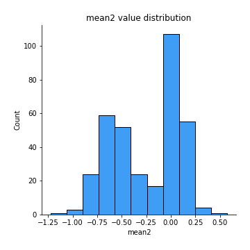
## Feature : sd1
- **Feature type** : continous
- **Missing** : 0.0%
- **Unique** : 347
- **Count** :347.0
- **Mean** :1.5824482972390916
- **Std** :0.7897903899205366
- **Min** :0.8382061051466024
- **25%th Percentile** : 1.2317204734472007
- **50%th Percentile** : 1.2951271706105614
- **75%th Percentile** : 1.6457364156622571
- **Max** :9.236766377527575

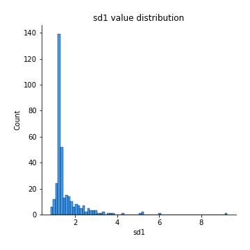
## Feature : sd2
- **Feature type** : continous
- **Missing** : 0.0%
- **Unique** : 347
- **Count** :347.0
- **Mean** :1.9060954715410574
- **Std** :0.7194876685628733
- **Min** :0.8592887433004143
- **25%th Percentile** : 1.4876999373314832
- **50%th Percentile** : 1.7978447903421555
- **75%th Percentile** : 2.1086967774533916
- **Max** :6.737618636746393

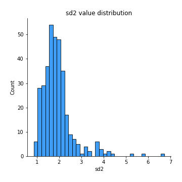
## Feature : skewness1
- **Feature type** : continous
- **Missing** : 0.0%
- **Unique** : 347
- **Count** :347.0
- **Mean** :-0.127276922871957
- **Std** :0.5382629083641427
- **Min** :-3.453087436558107
- **25%th Percentile** : -0.22589266855466336
- **50%th Percentile** : -0.055056681289373466
- **75%th Percentile** : 0.08135784345992533
- **Max** :1.9242627504543173

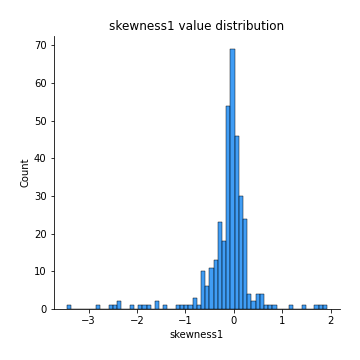
## Feature : skewness2
- **Feature type** : continous
- **Missing** : 0.0%
- **Unique** : 347
- **Count** :347.0
- **Mean** :-0.864808632120593
- **Std** :1.0240095899507058
- **Min** :-8.801502855292393
- **25%th Percentile** : -1.601789503830998
- **50%th Percentile** : -0.9162021773202599
- **75%th Percentile** : -0.16308734252797663
- **Max** :2.2606839051517187

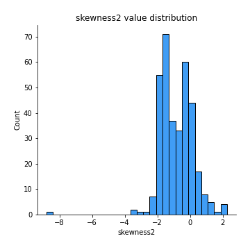
## Feature : kurtosis1
- **Feature type** : continous
- **Missing** : 0.0%
- **Unique** : 347
- **Count** :347.0
- **Mean** :3.1269379603161447
- **Std** :6.229028612042002
- **Min** :-0.5687124709287485
- **25%th Percentile** : -0.0629106163427442
- **50%th Percentile** : 0.6669059404074686
- **75%th Percentile** : 3.528701256114429
- **Max** :46.07507808162177

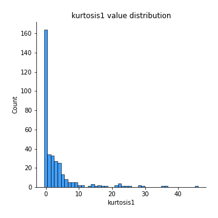
## Feature : kurtosis2
- **Feature type** : continous
- **Missing** : 0.0%
- **Unique** : 347
- **Count** :347.0
- **Mean** :5.576426019619709
- **Std** :9.592475756269456
- **Min** :0.18363702764971368
- **25%th Percentile** : 2.3976628605294152
- **50%th Percentile** : 3.6567651916125503
- **75%th Percentile** : 4.988072472328428
- **Max** :143.10871011533666

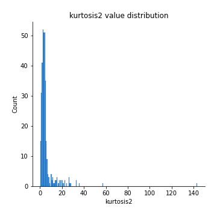
## Feature : return_autocorrelation_1_lag1
- **Feature type** : continous
- **Missing** : 0.0%
- **Unique** : 347
- **Count** :347.0
- **Mean** :0.017725294257702886
- **Std** :0.07285352487408438
- **Min** :-0.20673896439036124
- **25%th Percentile** : -0.02590876877587545
- **50%th Percentile** : 0.021781347054944843
- **75%th Percentile** : 0.06544478258016229
- **Max** :0.2424688919528973

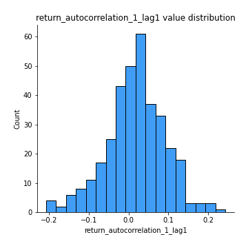
## Feature : return_autocorrelation_1_lag2
- **Feature type** : continous
- **Missing** : 0.0%
- **Unique** : 347
- **Count** :347.0
- **Mean** :0.025989801272521165
- **Std** :0.06604356449365627
- **Min** :-0.12172858720259
- **25%th Percentile** : -0.01983331041539886
- **50%th Percentile** : 0.026317725959215235
- **75%th Percentile** : 0.07457692506057546
- **Max** :0.19882345612248206

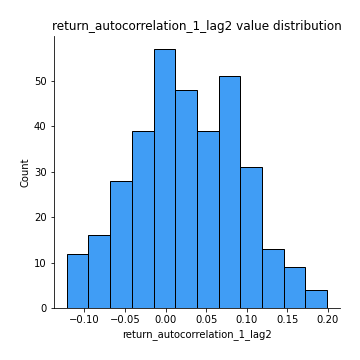
## Feature : return_autocorrelation_1_lag3
- **Feature type** : continous
- **Missing** : 0.0%
- **Unique** : 347
- **Count** :347.0
- **Mean** :0.02651672630284985
- **Std** :0.06225949247054778
- **Min** :-0.15806635192103805
- **25%th Percentile** : -0.013079098626781116
- **50%th Percentile** : 0.02687056478036418
- **75%th Percentile** : 0.06952366501452904
- **Max** :0.18916747461608877

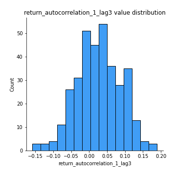
## Feature : return_autocorrelation_2_lag1
- **Feature type** : continous
- **Missing** : 0.0%
- **Unique** : 347
- **Count** :347.0
- **Mean** :0.29595565609652114
- **Std** :0.34465794437520875
- **Min** :-0.25075531010123286
- **25%th Percentile** : -0.025113874107817458
- **50%th Percentile** : 0.09159461545593775
- **75%th Percentile** : 0.6495437109974989
- **Max** :0.892471926944034

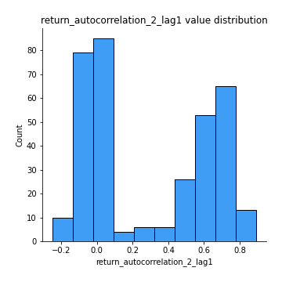
## Feature : return_autocorrelation_2_lag2
- **Feature type** : continous
- **Missing** : 0.0%
- **Unique** : 347
- **Count** :347.0
- **Mean** :0.3023071444487446
- **Std** :0.33388901800835424
- **Min** :-0.15323211089747296
- **25%th Percentile** : -0.010252625061983479
- **50%th Percentile** : 0.12198508403198742
- **75%th Percentile** : 0.6540475070223857
- **Max** :0.8667429023431216

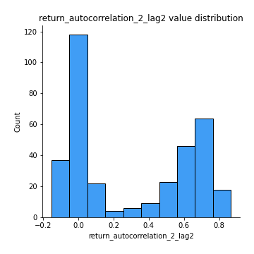
## Feature : return_autocorrelation_2_lag3
- **Feature type** : continous
- **Missing** : 0.0%
- **Unique** : 347
- **Count** :347.0
- **Mean** :0.29965810268736065
- **Std** :0.33055681449339613
- **Min** :-0.14200107169559698
- **25%th Percentile** : -0.006713959910819891
- **50%th Percentile** : 0.09916361039684134
- **75%th Percentile** : 0.6463015201316993
- **Max** :0.87398893753991

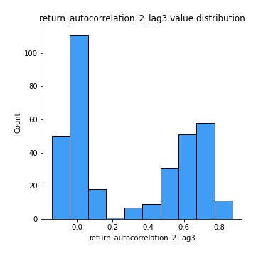
## Feature : return_correlation_ts1_lag_0
- **Feature type** : continous
- **Missing** : 0.0%
- **Unique** : 347
- **Count** :347.0
- **Mean** :0.3189479779060952
- **Std** :0.11198135441918192
- **Min** :-0.027089510445801036
- **25%th Percentile** : 0.25530488425182474
- **50%th Percentile** : 0.32544837639440893
- **75%th Percentile** : 0.37044539902339246
- **Max** :0.7041861626832071

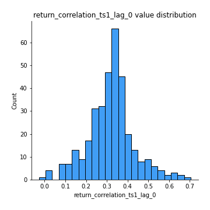
## Feature : return_correlation_ts1_lag_1
- **Feature type** : continous
- **Missing** : 0.0%
- **Unique** : 347
- **Count** :347.0
- **Mean** :0.06648028359356241
- **Std** :0.09936524725266253
- **Min** :-0.1549695474991776
- **25%th Percentile** : -0.007797594680113104
- **50%th Percentile** : 0.05463979882240766
- **75%th Percentile** : 0.14774787996598454
- **Max** :0.2863977072748895

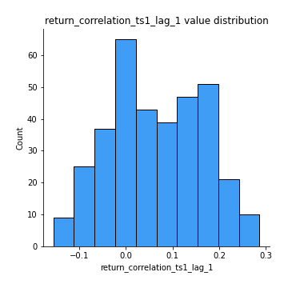
## Feature : return_correlation_ts1_lag_2
- **Feature type** : continous
- **Missing** : 0.0%
- **Unique** : 347
- **Count** :347.0
- **Mean** :0.06766222951123538
- **Std** :0.09377871250303775
- **Min** :-0.15709423128198627
- **25%th Percentile** : -0.011443398052860272
- **50%th Percentile** : 0.06570234233179655
- **75%th Percentile** : 0.14829933288546132
- **Max** :0.27973569476883325

## Feature : return_correlation_ts1_lag_3
- **Feature type** : continous
- **Missing** : 0.0%
- **Unique** : 347
- **Count** :347.0
- **Mean** :0.07348700091176522
- **Std** :0.09476603340334216
- **Min** :-0.1270218498974763
- **25%th Percentile** : -0.0057162652632773096
- **50%th Percentile** : 0.07557449752939877
- **75%th Percentile** : 0.1510651320825393
- **Max** :0.27695222708017775

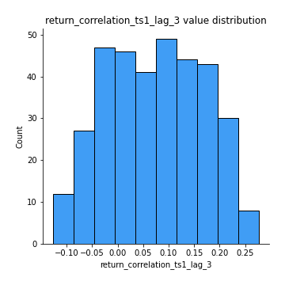
## Feature : return_correlation_ts2_lag_1
- **Feature type** : continous
- **Missing** : 0.0%
- **Unique** : 347
- **Count** :347.0
- **Mean** :0.06482153734672222
- **Std** :0.09791793099266746
- **Min** :-0.2081139431093261
- **25%th Percentile** : -0.013842383496452528
- **50%th Percentile** : 0.06693516586194924
- **75%th Percentile** : 0.14629979202071103
- **Max** :0.2726671361782271

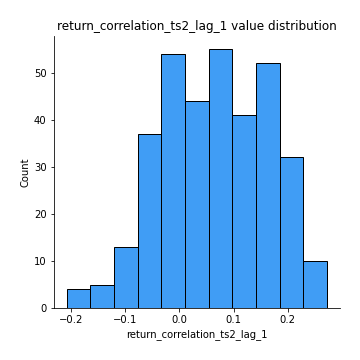
## Feature : return_correlation_ts2_lag_2
- **Feature type** : continous
- **Missing** : 0.0%
- **Unique** : 347
- **Count** :347.0
- **Mean** :0.06871047498812094
- **Std** :0.09347734567901132
- **Min** :-0.23751835475804678
- **25%th Percentile** : -0.006746710374323692
- **50%th Percentile** : 0.06370129029451205
- **75%th Percentile** : 0.14764548548715217
- **Max** :0.2555994172168445

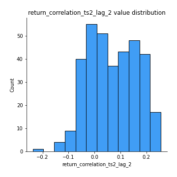
## Feature : return_correlation_ts2_lag_3
- **Feature type** : continous
- **Missing** : 0.0%
- **Unique** : 347
- **Count** :347.0
- **Mean** :0.06756517043160185
- **Std** :0.09421779097394355
- **Min** :-0.17564076057312866
- **25%th Percentile** : -0.005883491278442322
- **50%th Percentile** : 0.06602452200822663
- **75%th Percentile** : 0.14966585008010116
- **Max** :0.28315077690428814

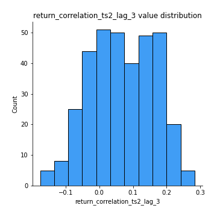
## Feature : sqreturn_autocorrelation_ts1_lag1
- **Feature type** : continous
- **Missing** : 0.0%
- **Unique** : 347
- **Count** :347.0
- **Mean** :0.06334064832693166
- **Std** :0.08397674579280633
- **Min** :-0.11242545344405531
- **25%th Percentile** : 0.009521188643249297
- **50%th Percentile** : 0.04545636811220671
- **75%th Percentile** : 0.09696863387785119
- **Max** :0.4439086285737898

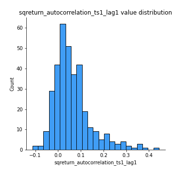
## Feature : sqreturn_autocorrelation_ts1_lag2
- **Feature type** : continous
- **Missing** : 0.0%
- **Unique** : 347
- **Count** :347.0
- **Mean** :0.05622172760000019
- **Std** :0.08577062299956781
- **Min** :-0.13080739187301288
- **25%th Percentile** : 0.0019329421666963195
- **50%th Percentile** : 0.037044034566187066
- **75%th Percentile** : 0.08834144029621104
- **Max** :0.4522162366773919

## Feature : sqreturn_autocorrelation_ts1_lag3
- **Feature type** : continous
- **Missing** : 0.0%
- **Unique** : 347
- **Count** :347.0
- **Mean** :0.044156482648569716
- **Std** :0.07825317225039503
- **Min** :-0.09684308166963063
- **25%th Percentile** : -0.009404832162719767
- **50%th Percentile** : 0.02327660184282146
- **75%th Percentile** : 0.08040904824695325
- **Max** :0.41030914918857014

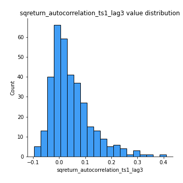
## Feature : sqreturn_autocorrelation_ts2_lag1
- **Feature type** : continous
- **Missing** : 0.0%
- **Unique** : 347
- **Count** :347.0
- **Mean** :0.4385478286852583
- **Std** :0.37232311077129315
- **Min** :-0.04997282481431907
- **25%th Percentile** : 0.06461068166092168
- **50%th Percentile** : 0.2942563895640028
- **75%th Percentile** : 0.8318780134385967
- **Max** :0.9665646917445206

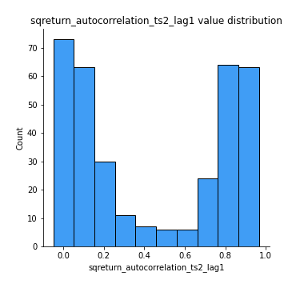
## Feature : sqreturn_autocorrelation_ts2_lag2
- **Feature type** : continous
- **Missing** : 0.0%
- **Unique** : 347
- **Count** :347.0
- **Mean** :0.4268466344534476
- **Std** :0.3786871318550331
- **Min** :-0.04424883229120365
- **25%th Percentile** : 0.040147287179445615
- **50%th Percentile** : 0.3380799547374326
- **75%th Percentile** : 0.8407108575843198
- **Max** :0.9730220972268459

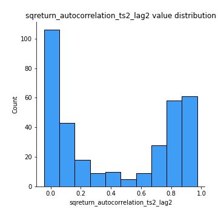
## Feature : sqreturn_autocorrelation_ts2_lag3
- **Feature type** : continous
- **Missing** : 0.0%
- **Unique** : 347
- **Count** :347.0
- **Mean** :0.41463781356434704
- **Std** :0.38256412144002244
- **Min** :-0.06082766359524085
- **25%th Percentile** : 0.033365556447826294
- **50%th Percentile** : 0.25602360891048725
- **75%th Percentile** : 0.8258079242202425
- **Max** :0.9552312259505621

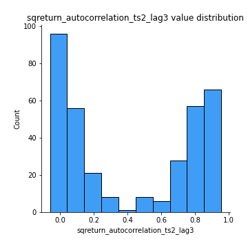
## Feature : sqreturn_correlation_ts1_lag_0
- **Feature type** : continous
- **Missing** : 0.0%
- **Unique** : 347
- **Count** :347.0
- **Mean** :0.3189479779060952
- **Std** :0.11198135441918192
- **Min** :-0.027089510445801036
- **25%th Percentile** : 0.25530488425182474
- **50%th Percentile** : 0.32544837639440893
- **75%th Percentile** : 0.37044539902339246
- **Max** :0.7041861626832071

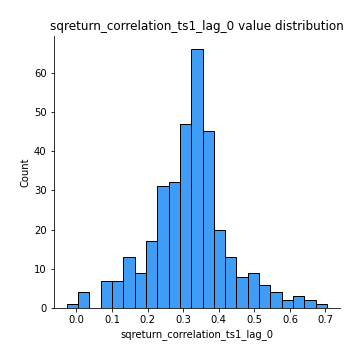
## Feature : sqreturn_correlation_ts1_lag_1
- **Feature type** : continous
- **Missing** : 0.0%
- **Unique** : 347
- **Count** :347.0
- **Mean** :0.06648028359356241
- **Std** :0.09936524725266253
- **Min** :-0.1549695474991776
- **25%th Percentile** : -0.007797594680113104
- **50%th Percentile** : 0.05463979882240766
- **75%th Percentile** : 0.14774787996598454
- **Max** :0.2863977072748895

## Feature : sqreturn_correlation_ts1_lag_2
- **Feature type** : continous
- **Missing** : 0.0%
- **Unique** : 347
- **Count** :347.0
- **Mean** :0.06766222951123538
- **Std** :0.09377871250303775
- **Min** :-0.15709423128198627
- **25%th Percentile** : -0.011443398052860272
- **50%th Percentile** : 0.06570234233179655
- **75%th Percentile** : 0.14829933288546132
- **Max** :0.27973569476883325

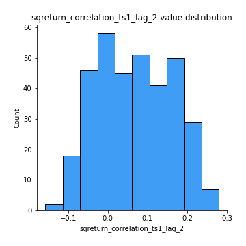
## Feature : sqreturn_correlation_ts1_lag_3
- **Feature type** : continous
- **Missing** : 0.0%
- **Unique** : 347
- **Count** :347.0
- **Mean** :0.07348700091176522
- **Std** :0.09476603340334216
- **Min** :-0.1270218498974763
- **25%th Percentile** : -0.0057162652632773096
- **50%th Percentile** : 0.07557449752939877
- **75%th Percentile** : 0.1510651320825393
- **Max** :0.27695222708017775

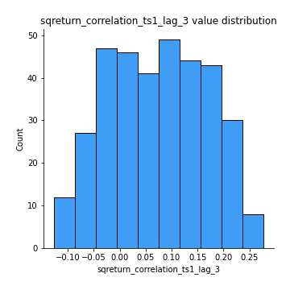
## Feature : sqreturn_correlation_ts2_lag_1
- **Feature type** : continous
- **Missing** : 0.0%
- **Unique** : 347
- **Count** :347.0
- **Mean** :0.06482153734672222
- **Std** :0.09791793099266746
- **Min** :-0.2081139431093261
- **25%th Percentile** : -0.013842383496452528
- **50%th Percentile** : 0.06693516586194924
- **75%th Percentile** : 0.14629979202071103
- **Max** :0.2726671361782271

## Feature : sqreturn_correlation_ts2_lag_2
- **Feature type** : continous
- **Missing** : 0.0%
- **Unique** : 347
- **Count** :347.0
- **Mean** :0.06871047498812094
- **Std** :0.09347734567901132
- **Min** :-0.23751835475804678
- **25%th Percentile** : -0.006746710374323692
- **50%th Percentile** : 0.06370129029451205
- **75%th Percentile** : 0.14764548548715217
- **Max** :0.2555994172168445

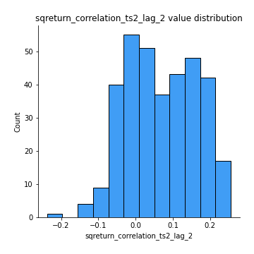
## Feature : sqreturn_correlation_ts2_lag_3
- **Feature type** : continous
- **Missing** : 0.0%
- **Unique** : 347
- **Count** :347.0
- **Mean** :0.06756517043160185
- **Std** :0.09421779097394355
- **Min** :-0.17564076057312866
- **25%th Percentile** : -0.005883491278442322
- **50%th Percentile** : 0.06602452200822663
- **75%th Percentile** : 0.14966585008010116
- **Max** :0.28315077690428814

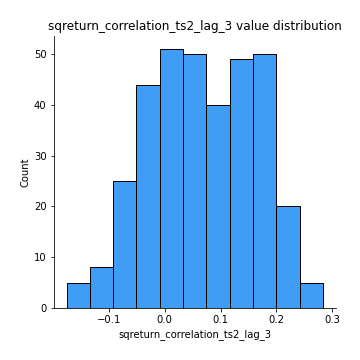
## Feature : price2_granger_cause_price1
- **Feature type** : continous
- **Missing** : 0.0%
- **Unique** : 347
- **Count** :347.0
- **Mean** :0.1941101404607789
- **Std** :0.27397771366471435
- **Min** :7.11121622338157e-31
- **25%th Percentile** : 5.498986932657111e-07
- **50%th Percentile** : 0.02608207962141842
- **75%th Percentile** : 0.3406616605290365
- **Max** :0.9853666024514321

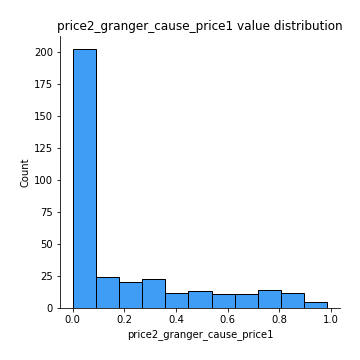
## Feature : price1_granger_cause_price2
- **Feature type** : continous
- **Missing** : 0.0%
- **Unique** : 347
- **Count** :347.0
- **Mean** :0.17289308943729076
- **Std** :0.25918713175643654
- **Min** :1.1255942662267176e-34
- **25%th Percentile** : 5.572442897133848e-06
- **50%th Percentile** : 0.017407807620560087
- **75%th Percentile** : 0.273986579458791
- **Max** :0.9951398266867577

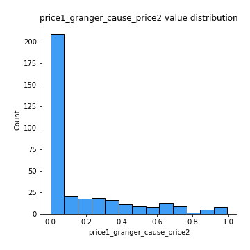

[<< Go back](../README.md)
