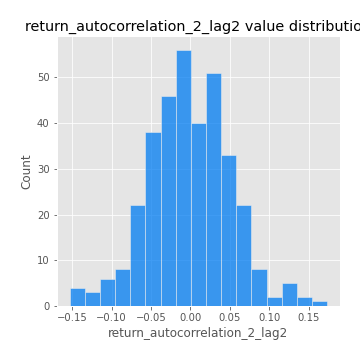

# Exploratory Data Analysis

[<< Go back](../README.md)
## Feature : target
- **Feature type** : categorical
- **Missing** : 0.0%
- **Unique** : 2
- **Count** :347
- **Unique** :2
- **Top** :simulated
- **Freq** :181

## Feature : mean1
- **Feature type** : continous
- **Missing** : 0.0%
- **Unique** : 347
- **Count** :347.0
- **Mean** :0.04799074453860024
- **Std** :0.08237790843843029
- **Min** :-0.22632637961920957
- **25%th Percentile** : -0.0018951063736248489
- **50%th Percentile** : 0.050268535712626634
- **75%th Percentile** : 0.09504000636940252
- **Max** :0.37175100008111034

## Feature : mean2
- **Feature type** : continous
- **Missing** : 0.0%
- **Unique** : 347
- **Count** :347.0
- **Mean** :0.07731565867978017
- **Std** :0.0894377798451775
- **Min** :-0.24205418062825398
- **25%th Percentile** : 0.029002408342760168
- **50%th Percentile** : 0.07480522387664061
- **75%th Percentile** : 0.12707583087977958
- **Max** :0.37616608147096464

## Feature : sd1
- **Feature type** : continous
- **Missing** : 0.0%
- **Unique** : 347
- **Count** :347.0
- **Mean** :1.9005505246458927
- **Std** :0.7580126501589034
- **Min** :0.7470080772831957
- **25%th Percentile** : 1.7008062349475301
- **50%th Percentile** : 1.8088057628090488
- **75%th Percentile** : 1.894338505537998
- **Max** :9.236766377527575

## Feature : sd2
- **Feature type** : continous
- **Missing** : 0.0%
- **Unique** : 347
- **Count** :347.0
- **Mean** :1.814114810136003
- **Std** :0.7290573418333495
- **Min** :0.8455946193085045
- **25%th Percentile** : 1.5729755119759599
- **50%th Percentile** : 1.6494520520668587
- **75%th Percentile** : 1.7332501366073998
- **Max** :6.737618636746393

## Feature : skewness1
- **Feature type** : continous
- **Missing** : 0.0%
- **Unique** : 347
- **Count** :347.0
- **Mean** :-0.08536199018212465
- **Std** :0.6101763837153897
- **Min** :-3.453087436558107
- **25%th Percentile** : -0.1813901220084848
- **50%th Percentile** : -0.011347400673344882
- **75%th Percentile** : 0.10556763358954613
- **Max** :2.5845963767725557

## Feature : skewness2
- **Feature type** : continous
- **Missing** : 0.0%
- **Unique** : 347
- **Count** :347.0
- **Mean** :-0.13620899676268117
- **Std** :0.5789881450304929
- **Min** :-3.4392142944489743
- **25%th Percentile** : -0.22619501368185102
- **50%th Percentile** : -0.04251439815302558
- **75%th Percentile** : 0.08614159552616252
- **Max** :2.2606839051517187

## Feature : kurtosis1
- **Feature type** : continous
- **Missing** : 0.0%
- **Unique** : 347
- **Count** :347.0
- **Mean** :3.052248700095277
- **Std** :6.058673212011318
- **Min** :-0.48065182086400426
- **25%th Percentile** : -0.019353498272600245
- **50%th Percentile** : 0.4079024458168976
- **75%th Percentile** : 3.601784904080982
- **Max** :46.07507808162177

## Feature : kurtosis2
- **Feature type** : continous
- **Missing** : 0.0%
- **Unique** : 347
- **Count** :347.0
- **Mean** :3.2567508789925097
- **Std** :6.32029675642418
- **Min** :-0.49734969645211136
- **25%th Percentile** : -0.007407543731116517
- **50%th Percentile** : 0.42425077522257437
- **75%th Percentile** : 4.063516554723738
- **Max** :57.31293005729889

## Feature : return_autocorrelation_1_lag1
- **Feature type** : continous
- **Missing** : 0.0%
- **Unique** : 347
- **Count** :347.0
- **Mean** :-0.008884198731821969
- **Std** :0.06122888751870485
- **Min** :-0.2135576224968752
- **25%th Percentile** : -0.04175269412105591
- **50%th Percentile** : -0.0038203955790839317
- **75%th Percentile** : 0.03279823657761035
- **Max** :0.13647076610055076

## Feature : return_autocorrelation_1_lag2
- **Feature type** : continous
- **Missing** : 0.0%
- **Unique** : 347
- **Count** :347.0
- **Mean** :-0.008147511830907648
- **Std** :0.04766553285148919
- **Min** :-0.13309283796645122
- **25%th Percentile** : -0.037718350505397465
- **50%th Percentile** : -0.004613866201947514
- **75%th Percentile** : 0.022758485433178113
- **Max** :0.1561488228015672

## Feature : return_autocorrelation_1_lag3
- **Feature type** : continous
- **Missing** : 0.0%
- **Unique** : 347
- **Count** :347.0
- **Mean** :-0.001941607549237791
- **Std** :0.052536364993324064
- **Min** :-0.1940836867390813
- **25%th Percentile** : -0.0345086717297767
- **50%th Percentile** : -6.243631726255285e-05
- **75%th Percentile** : 0.035226630640114304
- **Max** :0.17805869530681923

## Feature : return_autocorrelation_2_lag1
- **Feature type** : continous
- **Missing** : 0.0%
- **Unique** : 347
- **Count** :347.0
- **Mean** :-0.009550638221530036
- **Std** :0.05735044523581402
- **Min** :-0.24590087874039124
- **25%th Percentile** : -0.03856473523769437
- **50%th Percentile** : -0.00486143391838778
- **75%th Percentile** : 0.026225020244944205
- **Max** :0.16349871797309318

## Feature : return_autocorrelation_2_lag2
- **Feature type** : continous
- **Missing** : 0.0%
- **Unique** : 347
- **Count** :347.0
- **Mean** :-0.0009605094978616896
- **Std** :0.05206080237356655
- **Min** :-0.15317886244993945
- **25%th Percentile** : -0.03521733852746289
- **50%th Percentile** : -0.0019786601520114383
- **75%th Percentile** : 0.03325495917098058
- **Max** :0.1735398560230086

## Feature : return_autocorrelation_2_lag3
- **Feature type** : continous
- **Missing** : 0.0%
- **Unique** : 347
- **Count** :347.0
- **Mean** :-0.00025786828751555245
- **Std** :0.0497363267943279
- **Min** :-0.14200107169559698
- **25%th Percentile** : -0.028377589355907538
- **50%th Percentile** : 0.0007884741750277437
- **75%th Percentile** : 0.02950776235042116
- **Max** :0.14796334700737984

## Feature : return_correlation_ts1_lag_0
- **Feature type** : continous
- **Missing** : 0.0%
- **Unique** : 347
- **Count** :347.0
- **Mean** :0.3174990150441422
- **Std** :0.10871635735940206
- **Min** :-0.027089510445801036
- **25%th Percentile** : 0.26481534966668385
- **50%th Percentile** : 0.3161235243418448
- **75%th Percentile** : 0.3595243902147236
- **Max** :0.6949986865664105

## Feature : return_correlation_ts1_lag_1
- **Feature type** : continous
- **Missing** : 0.0%
- **Unique** : 347
- **Count** :347.0
- **Mean** :-0.008629068514952513
- **Std** :0.052912814223018564
- **Min** :-0.16985510949917193
- **25%th Percentile** : -0.039419365168919765
- **50%th Percentile** : -0.004431822956967763
- **75%th Percentile** : 0.028976365627854418
- **Max** :0.15499424718508623

## Feature : return_correlation_ts1_lag_2
- **Feature type** : continous
- **Missing** : 0.0%
- **Unique** : 347
- **Count** :347.0
- **Mean** :-0.0030647719294004737
- **Std** :0.048062245251031144
- **Min** :-0.21653581047581763
- **25%th Percentile** : -0.033282012248603506
- **50%th Percentile** : -0.0037460202566904216
- **75%th Percentile** : 0.02882601855443861
- **Max** :0.11795720103977958

## Feature : return_correlation_ts1_lag_3
- **Feature type** : continous
- **Missing** : 0.0%
- **Unique** : 347
- **Count** :347.0
- **Mean** :0.00332335778689924
- **Std** :0.04998621374881311
- **Min** :-0.1270218498974763
- **25%th Percentile** : -0.031620886139549206
- **50%th Percentile** : 0.0029775147029687888
- **75%th Percentile** : 0.03872412583205084
- **Max** :0.1422809271770942

## Feature : return_correlation_ts2_lag_1
- **Feature type** : continous
- **Missing** : 0.0%
- **Unique** : 347
- **Count** :347.0
- **Mean** :-0.0046059340787931785
- **Std** :0.05277686895435796
- **Min** :-0.19671969155495325
- **25%th Percentile** : -0.038758213398769045
- **50%th Percentile** : -0.0052232063728208
- **75%th Percentile** : 0.03238653233384067
- **Max** :0.17208763791364762

## Feature : return_correlation_ts2_lag_2
- **Feature type** : continous
- **Missing** : 0.0%
- **Unique** : 347
- **Count** :347.0
- **Mean** :-0.0012233126609834178
- **Std** :0.05040364958360376
- **Min** :-0.23751835475804678
- **25%th Percentile** : -0.03499759952014374
- **50%th Percentile** : -0.0027358749519114604
- **75%th Percentile** : 0.028926093934968564
- **Max** :0.20772887392904255

## Feature : return_correlation_ts2_lag_3
- **Feature type** : continous
- **Missing** : 0.0%
- **Unique** : 347
- **Count** :347.0
- **Mean** :0.00028905579695893047
- **Std** :0.05278521239064849
- **Min** :-0.17564076057312866
- **25%th Percentile** : -0.030698968802299935
- **50%th Percentile** : -0.0011263914179240767
- **75%th Percentile** : 0.038270726951294715
- **Max** :0.13750823587850444

## Feature : sqreturn_autocorrelation_ts1_lag1
- **Feature type** : continous
- **Missing** : 0.0%
- **Unique** : 347
- **Count** :347.0
- **Mean** :0.047141575788076574
- **Std** :0.09359550455331339
- **Min** :-0.10756447820791597
- **25%th Percentile** : -0.014967697728396751
- **50%th Percentile** : 0.028104305206070105
- **75%th Percentile** : 0.08275441791374133
- **Max** :0.49414293176447355

## Feature : sqreturn_autocorrelation_ts1_lag2
- **Feature type** : continous
- **Missing** : 0.0%
- **Unique** : 347
- **Count** :347.0
- **Mean** :0.03760160536648167
- **Std** :0.09111116723916374
- **Min** :-0.08265150903215626
- **25%th Percentile** : -0.017199938864975978
- **50%th Percentile** : 0.013346386700580654
- **75%th Percentile** : 0.061866199490056784
- **Max** :0.540735851444759

## Feature : sqreturn_autocorrelation_ts1_lag3
- **Feature type** : continous
- **Missing** : 0.0%
- **Unique** : 347
- **Count** :347.0
- **Mean** :0.030679287258677985
- **Std** :0.07755822938068727
- **Min** :-0.10923786943971574
- **25%th Percentile** : -0.0167408561985
- **50%th Percentile** : 0.01468022778193809
- **75%th Percentile** : 0.0637088702069741
- **Max** :0.41030914918857014

## Feature : sqreturn_autocorrelation_ts2_lag1
- **Feature type** : continous
- **Missing** : 0.0%
- **Unique** : 347
- **Count** :347.0
- **Mean** :0.04262942919891351
- **Std** :0.0885814152058126
- **Min** :-0.09873727981861054
- **25%th Percentile** : -0.0132109038042853
- **50%th Percentile** : 0.023584307419180682
- **75%th Percentile** : 0.07310845567424916
- **Max** :0.510085647437958

## Feature : sqreturn_autocorrelation_ts2_lag2
- **Feature type** : continous
- **Missing** : 0.0%
- **Unique** : 347
- **Count** :347.0
- **Mean** :0.03586856481199617
- **Std** :0.08814158342198333
- **Min** :-0.12834082834239396
- **25%th Percentile** : -0.01551189716085845
- **50%th Percentile** : 0.016967489953971904
- **75%th Percentile** : 0.05534597657651877
- **Max** :0.45676817892778204

## Feature : sqreturn_autocorrelation_ts2_lag3
- **Feature type** : continous
- **Missing** : 0.0%
- **Unique** : 347
- **Count** :347.0
- **Mean** :0.027792452129895798
- **Std** :0.06979472123052455
- **Min** :-0.09588546833356475
- **25%th Percentile** : -0.013418470619336504
- **50%th Percentile** : 0.01099820015147977
- **75%th Percentile** : 0.05438758723878348
- **Max** :0.31225727797735664

## Feature : sqreturn_correlation_ts1_lag_0
- **Feature type** : continous
- **Missing** : 0.0%
- **Unique** : 347
- **Count** :347.0
- **Mean** :0.3174990150441422
- **Std** :0.10871635735940206
- **Min** :-0.027089510445801036
- **25%th Percentile** : 0.26481534966668385
- **50%th Percentile** : 0.3161235243418448
- **75%th Percentile** : 0.3595243902147236
- **Max** :0.6949986865664105

## Feature : sqreturn_correlation_ts1_lag_1
- **Feature type** : continous
- **Missing** : 0.0%
- **Unique** : 347
- **Count** :347.0
- **Mean** :-0.008629068514952513
- **Std** :0.052912814223018564
- **Min** :-0.16985510949917193
- **25%th Percentile** : -0.039419365168919765
- **50%th Percentile** : -0.004431822956967763
- **75%th Percentile** : 0.028976365627854418
- **Max** :0.15499424718508623

## Feature : sqreturn_correlation_ts1_lag_2
- **Feature type** : continous
- **Missing** : 0.0%
- **Unique** : 347
- **Count** :347.0
- **Mean** :-0.0030647719294004737
- **Std** :0.048062245251031144
- **Min** :-0.21653581047581763
- **25%th Percentile** : -0.033282012248603506
- **50%th Percentile** : -0.0037460202566904216
- **75%th Percentile** : 0.02882601855443861
- **Max** :0.11795720103977958

## Feature : sqreturn_correlation_ts1_lag_3
- **Feature type** : continous
- **Missing** : 0.0%
- **Unique** : 347
- **Count** :347.0
- **Mean** :0.00332335778689924
- **Std** :0.04998621374881311
- **Min** :-0.1270218498974763
- **25%th Percentile** : -0.031620886139549206
- **50%th Percentile** : 0.0029775147029687888
- **75%th Percentile** : 0.03872412583205084
- **Max** :0.1422809271770942

## Feature : sqreturn_correlation_ts2_lag_1
- **Feature type** : continous
- **Missing** : 0.0%
- **Unique** : 347
- **Count** :347.0
- **Mean** :-0.0046059340787931785
- **Std** :0.05277686895435796
- **Min** :-0.19671969155495325
- **25%th Percentile** : -0.038758213398769045
- **50%th Percentile** : -0.0052232063728208
- **75%th Percentile** : 0.03238653233384067
- **Max** :0.17208763791364762

## Feature : sqreturn_correlation_ts2_lag_2
- **Feature type** : continous
- **Missing** : 0.0%
- **Unique** : 347
- **Count** :347.0
- **Mean** :-0.0012233126609834178
- **Std** :0.05040364958360376
- **Min** :-0.23751835475804678
- **25%th Percentile** : -0.03499759952014374
- **50%th Percentile** : -0.0027358749519114604
- **75%th Percentile** : 0.028926093934968564
- **Max** :0.20772887392904255

## Feature : sqreturn_correlation_ts2_lag_3
- **Feature type** : continous
- **Missing** : 0.0%
- **Unique** : 347
- **Count** :347.0
- **Mean** :0.00028905579695893047
- **Std** :0.05278521239064849
- **Min** :-0.17564076057312866
- **25%th Percentile** : -0.030698968802299935
- **50%th Percentile** : -0.0011263914179240767
- **75%th Percentile** : 0.038270726951294715
- **Max** :0.13750823587850444

## Feature : price2_granger_cause_price1
- **Feature type** : continous
- **Missing** : 0.0%
- **Unique** : 347
- **Count** :347.0
- **Mean** :0.2788970964442662
- **Std** :0.2895155246012289
- **Min** :2.257781621953871e-08
- **25%th Percentile** : 0.0254553349404561
- **50%th Percentile** : 0.15906885886789413
- **75%th Percentile** : 0.46907939957033357
- **Max** :0.9990520822377589

## Feature : price1_granger_cause_price2
- **Feature type** : continous
- **Missing** : 0.0%
- **Unique** : 347
- **Count** :347.0
- **Mean** :0.304100145663801
- **Std** :0.2908281249657599
- **Min** :8.505293267719275e-06
- **25%th Percentile** : 0.043993762231640414
- **50%th Percentile** : 0.23037613057020018
- **75%th Percentile** : 0.5119350429100158
- **Max** :0.9951398266867577

[<< Go back](../README.md)
