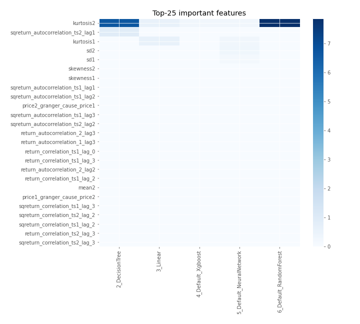

# AutoML Leaderboard

| Best model   | name                                                         | model_type     | metric_type   |   metric_value |   train_time |
|:-------------|:-------------------------------------------------------------|:---------------|:--------------|---------------:|-------------:|
|              | [1_Baseline](1_Baseline/README.md)                           | Baseline       | accuracy      |       0.517241 |         7.8  |
|              | [2_DecisionTree](2_DecisionTree/README.md)                   | Decision Tree  | accuracy      |       0.942529 |        15.46 |
|              | [3_Linear](3_Linear/README.md)                               | Linear         | accuracy      |       0.965517 |        10.88 |
|              | [4_Default_Xgboost](4_Default_Xgboost/README.md)             | Xgboost        | accuracy      |       0.977011 |        11.27 |
|              | [5_Default_NeuralNetwork](5_Default_NeuralNetwork/README.md) | Neural Network | accuracy      |       0.988506 |        10.14 |
|              | [6_Default_RandomForest](6_Default_RandomForest/README.md)   | Random Forest  | accuracy      |       0.965517 |        16.65 |
| **the best** | [Ensemble](Ensemble/README.md)                               | Ensemble       | accuracy      |       1        |         0.47 |

### AutoML Performance

### AutoML Performance Boxplot

### Features Importance

### Spearman Correlation of Models

