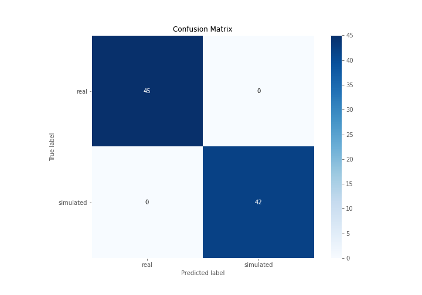

# Summary of 3_Linear

[<< Go back](../README.md)

## Logistic Regression (Linear)
- **n_jobs**: -1
- **explain_level**: 2

## Validation
 - **validation_type**: split
 - **train_ratio**: 0.75
 - **shuffle**: True
 - **stratify**: True

## Optimized metric
accuracy

## Training time

12.2 seconds

## Metric details
|           |    score |     threshold |
|:----------|---------:|--------------:|
| logloss   | 0.110834 | nan           |
| auc       | 1        | nan           |
| f1        | 1        |   0.721204    |
| accuracy  | 1        |   0.721204    |
| precision | 1        |   0.889737    |
| recall    | 1        |   8.58236e-35 |
| mcc       | 1        |   0.721204    |

## Confusion matrix (at threshold=0.721204)
|                      |   Predicted as real |   Predicted as simulated |
|:---------------------|--------------------:|-------------------------:|
| Labeled as real      |                  45 |                        0 |
| Labeled as simulated |                   0 |                       42 |

## Learning curves

## Coefficients
| feature                           |   Learner_1 |
|:----------------------------------|------------:|
| sd1                               |   0.539327  |
| skewness2                         |   0.499511  |
| return_correlation_ts2_lag_1      |   0.458013  |
| sqreturn_correlation_ts2_lag_1    |   0.458013  |
| return_autocorrelation_1_lag3     |   0.436854  |
| return_autocorrelation_2_lag1     |   0.34169   |
| return_autocorrelation_2_lag2     |   0.329625  |
| return_autocorrelation_2_lag3     |   0.283291  |
| return_autocorrelation_1_lag1     |   0.273519  |
| return_correlation_ts2_lag_3      |   0.258538  |
| sqreturn_correlation_ts2_lag_3    |   0.258538  |
| sqreturn_correlation_ts1_lag_3    |   0.225273  |
| return_correlation_ts1_lag_3      |   0.225273  |
| sqreturn_correlation_ts1_lag_1    |   0.210611  |
| return_correlation_ts1_lag_1      |   0.210611  |
| return_autocorrelation_1_lag2     |   0.202432  |
| return_correlation_ts1_lag_2      |   0.183626  |
| sqreturn_correlation_ts1_lag_2    |   0.183626  |
| skewness1                         |   0.13422   |
| sqreturn_correlation_ts2_lag_2    |   0.0840965 |
| return_correlation_ts2_lag_2      |   0.0840965 |
| mean2                             |   0.0812025 |
| mean1                             |  -0.0876486 |
| price1_granger_cause_price2       |  -0.197987  |
| sqreturn_correlation_ts1_lag_0    |  -0.223295  |
| return_correlation_ts1_lag_0      |  -0.223295  |
| sd2                               |  -0.349656  |
| price2_granger_cause_price1       |  -0.412365  |
| sqreturn_autocorrelation_ts2_lag3 |  -0.616545  |
| sqreturn_autocorrelation_ts1_lag3 |  -0.871813  |
| sqreturn_autocorrelation_ts1_lag2 |  -0.997292  |
| sqreturn_autocorrelation_ts2_lag2 |  -1.01945   |
| sqreturn_autocorrelation_ts1_lag1 |  -1.09662   |
| sqreturn_autocorrelation_ts2_lag1 |  -1.13552   |
| intercept                         |  -1.60988   |
| kurtosis2                         |  -3.9052    |
| kurtosis1                         |  -3.98028   |

## Permutation-based Importance

## Confusion Matrix

## Normalized Confusion Matrix

## ROC Curve

## Kolmogorov-Smirnov Statistic

## Precision-Recall Curve

## Calibration Curve

## Cumulative Gains Curve

## Lift Curve

## SHAP Importance

## SHAP Dependence plots

### Dependence (Fold 1)

## SHAP Decision plots

### Top-10 Worst decisions for class 0 (Fold 1)

### Top-10 Best decisions for class 0 (Fold 1)

### Top-10 Worst decisions for class 1 (Fold 1)

### Top-10 Best decisions for class 1 (Fold 1)

[<< Go back](../README.md)
