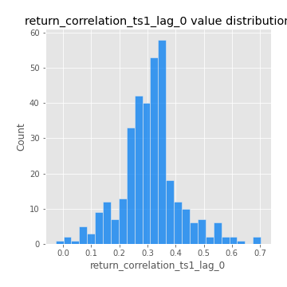
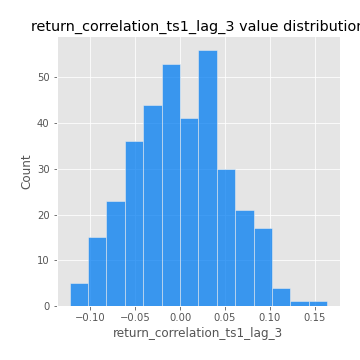
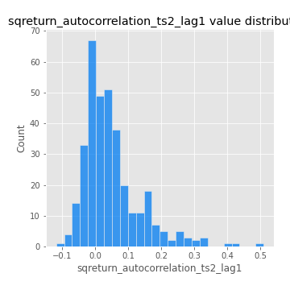

# Exploratory Data Analysis

[<< Go back](../README.md)
## Feature : target
- **Feature type** : categorical
- **Missing** : 0.0%
- **Unique** : 2
- **Count** :347
- **Unique** :2
- **Top** :real
- **Freq** :178

## Feature : mean1
- **Feature type** : continous
- **Missing** : 0.0%
- **Unique** : 347
- **Count** :347.0
- **Mean** :0.047254024352216824
- **Std** :0.08060574035696076
- **Min** :-0.22632637961920957
- **25%th Percentile** : -0.002723645207138727
- **50%th Percentile** : 0.050268535712626634
- **75%th Percentile** : 0.09209248995775368
- **Max** :0.37175100008111034

## Feature : mean2
- **Feature type** : continous
- **Missing** : 0.0%
- **Unique** : 347
- **Count** :347.0
- **Mean** :0.0730745966927518
- **Std** :0.09168993800636593
- **Min** :-0.21818165578778434
- **25%th Percentile** : 0.025962281563914613
- **50%th Percentile** : 0.07184066115911249
- **75%th Percentile** : 0.12819965491617416
- **Max** :0.37768414644446496

## Feature : sd1
- **Feature type** : continous
- **Missing** : 0.0%
- **Unique** : 347
- **Count** :347.0
- **Mean** :1.868653771739253
- **Std** :0.754387709597033
- **Min** :0.7620831696941981
- **25%th Percentile** : 1.580409353601877
- **50%th Percentile** : 1.8122381359686341
- **75%th Percentile** : 1.8923223987796105
- **Max** :9.236766377527575

## Feature : sd2
- **Feature type** : continous
- **Missing** : 0.0%
- **Unique** : 347
- **Count** :347.0
- **Mean** :1.777649364788364
- **Std** :0.6201782683931321
- **Min** :0.8455946193085045
- **25%th Percentile** : 1.56936789048951
- **50%th Percentile** : 1.650257481945809
- **75%th Percentile** : 1.725720061479794
- **Max** :5.642692356880054

## Feature : skewness1
- **Feature type** : continous
- **Missing** : 0.0%
- **Unique** : 347
- **Count** :347.0
- **Mean** :-0.10046556990883046
- **Std** :0.5893389100571177
- **Min** :-3.453087436558107
- **25%th Percentile** : -0.18252482766143813
- **50%th Percentile** : -0.025037750819104948
- **75%th Percentile** : 0.10481875927184484
- **Max** :2.5845963767725557

## Feature : skewness2
- **Feature type** : continous
- **Missing** : 0.0%
- **Unique** : 347
- **Count** :347.0
- **Mean** :-0.1887542210618732
- **Std** :0.8471353763102754
- **Min** :-8.801502855292393
- **25%th Percentile** : -0.2510112935931934
- **50%th Percentile** : -0.04980766708864933
- **75%th Percentile** : 0.07814714604006573
- **Max** :2.242019525651531

## Feature : kurtosis1
- **Feature type** : continous
- **Missing** : 0.0%
- **Unique** : 347
- **Count** :347.0
- **Mean** :3.2652206962899557
- **Std** :6.031389010783329
- **Min** :-0.48217397114689087
- **25%th Percentile** : 0.019629581588794798
- **50%th Percentile** : 0.6544505205572988
- **75%th Percentile** : 3.749242555655367
- **Max** :46.07507808162177

## Feature : kurtosis2
- **Feature type** : continous
- **Missing** : 0.0%
- **Unique** : 347
- **Count** :347.0
- **Mean** :4.1835184331461495
- **Std** :10.637465284885002
- **Min** :-0.4664855600333766
- **25%th Percentile** : -0.03292253506313325
- **50%th Percentile** : 0.6208695975279284
- **75%th Percentile** : 4.393039424201936
- **Max** :143.10871011533666

## Feature : return_autocorrelation_1_lag1
- **Feature type** : continous
- **Missing** : 0.0%
- **Unique** : 347
- **Count** :347.0
- **Mean** :-0.011879132805176561
- **Std** :0.05792042339081954
- **Min** :-0.2135576224968752
- **25%th Percentile** : -0.038315319892300706
- **50%th Percentile** : -0.004456277573547255
- **75%th Percentile** : 0.024252677597115087
- **Max** :0.12810656890648087

## Feature : return_autocorrelation_1_lag2
- **Feature type** : continous
- **Missing** : 0.0%
- **Unique** : 347
- **Count** :347.0
- **Mean** :-0.002606922742079317
- **Std** :0.050537870541945876
- **Min** :-0.12172858720259
- **25%th Percentile** : -0.03594447092887003
- **50%th Percentile** : -0.00436190027701974
- **75%th Percentile** : 0.03065119067539228
- **Max** :0.13553587149024285

## Feature : return_autocorrelation_1_lag3
- **Feature type** : continous
- **Missing** : 0.0%
- **Unique** : 347
- **Count** :347.0
- **Mean** :0.00056621549640081
- **Std** :0.052206226127756654
- **Min** :-0.1940836867390813
- **25%th Percentile** : -0.03596756027279088
- **50%th Percentile** : 0.0021881323837949574
- **75%th Percentile** : 0.03646988838242175
- **Max** :0.12334187606487615

## Feature : return_autocorrelation_2_lag1
- **Feature type** : continous
- **Missing** : 0.0%
- **Unique** : 347
- **Count** :347.0
- **Mean** :-0.009131318140082622
- **Std** :0.05959694064419116
- **Min** :-0.24265814531706406
- **25%th Percentile** : -0.04066229056488703
- **50%th Percentile** : -0.00680453193028564
- **75%th Percentile** : 0.027347984205531865
- **Max** :0.31863413537898483

## Feature : return_autocorrelation_2_lag2
- **Feature type** : continous
- **Missing** : 0.0%
- **Unique** : 347
- **Count** :347.0
- **Mean** :-0.000984204403145852
- **Std** :0.05019624755652472
- **Min** :-0.15323211089747296
- **25%th Percentile** : -0.0346839635537817
- **50%th Percentile** : -0.0004465644365372019
- **75%th Percentile** : 0.028546752445210377
- **Max** :0.20974504043791217

## Feature : return_autocorrelation_2_lag3
- **Feature type** : continous
- **Missing** : 0.0%
- **Unique** : 347
- **Count** :347.0
- **Mean** :-0.0015929469001623288
- **Std** :0.04718472373299529
- **Min** :-0.14200107169559698
- **25%th Percentile** : -0.032991779309318056
- **50%th Percentile** : -0.00034851136339246924
- **75%th Percentile** : 0.027459226313756965
- **Max** :0.1419999376914021

## Feature : return_correlation_ts1_lag_0
- **Feature type** : continous
- **Missing** : 0.0%
- **Unique** : 347
- **Count** :347.0
- **Mean** :0.3093987243804885
- **Std** :0.10489396386834247
- **Min** :-0.027089510445801036
- **25%th Percentile** : 0.2544356983672946
- **50%th Percentile** : 0.31104452096628216
- **75%th Percentile** : 0.3544769937627109
- **Max** :0.7028422087350163

## Feature : return_correlation_ts1_lag_1
- **Feature type** : continous
- **Missing** : 0.0%
- **Unique** : 347
- **Count** :347.0
- **Mean** :-0.007377313322359609
- **Std** :0.05106454534902193
- **Min** :-0.16985510949917193
- **25%th Percentile** : -0.03697800198678519
- **50%th Percentile** : -0.0016345203453836802
- **75%th Percentile** : 0.02642143541429718
- **Max** :0.15499424718508623

## Feature : return_correlation_ts1_lag_2
- **Feature type** : continous
- **Missing** : 0.0%
- **Unique** : 347
- **Count** :347.0
- **Mean** :0.0030946491336839264
- **Std** :0.04861162680496037
- **Min** :-0.21653581047581763
- **25%th Percentile** : -0.02977422160229267
- **50%th Percentile** : 0.0009685707217309875
- **75%th Percentile** : 0.03702609254053675
- **Max** :0.14135551944965188

## Feature : return_correlation_ts1_lag_3
- **Feature type** : continous
- **Missing** : 0.0%
- **Unique** : 347
- **Count** :347.0
- **Mean** :0.0004411478233601374
- **Std** :0.05146479259761053
- **Min** :-0.12306593817498207
- **25%th Percentile** : -0.037936450142419684
- **50%th Percentile** : -0.0014573215147489639
- **75%th Percentile** : 0.03446691389889874
- **Max** :0.1636773216468148

## Feature : return_correlation_ts2_lag_1
- **Feature type** : continous
- **Missing** : 0.0%
- **Unique** : 347
- **Count** :347.0
- **Mean** :-0.003363485823015396
- **Std** :0.05556518473838014
- **Min** :-0.2081139431093261
- **25%th Percentile** : -0.03868255914944284
- **50%th Percentile** : -0.000861019449117563
- **75%th Percentile** : 0.034904752884661404
- **Max** :0.17208763791364762

## Feature : return_correlation_ts2_lag_2
- **Feature type** : continous
- **Missing** : 0.0%
- **Unique** : 347
- **Count** :347.0
- **Mean** :0.002953020719128153
- **Std** :0.04842128859870907
- **Min** :-0.23751835475804678
- **25%th Percentile** : -0.02612121169992871
- **50%th Percentile** : 0.0022770941881023487
- **75%th Percentile** : 0.03187008284181108
- **Max** :0.15388933426238696

## Feature : return_correlation_ts2_lag_3
- **Feature type** : continous
- **Missing** : 0.0%
- **Unique** : 347
- **Count** :347.0
- **Mean** :0.0031093419898688525
- **Std** :0.049991768270270916
- **Min** :-0.1603001201932561
- **25%th Percentile** : -0.025687424367520202
- **50%th Percentile** : 0.001868518494874899
- **75%th Percentile** : 0.036606426533325645
- **Max** :0.14380424190419494

## Feature : sqreturn_autocorrelation_ts1_lag1
- **Feature type** : continous
- **Missing** : 0.0%
- **Unique** : 347
- **Count** :347.0
- **Mean** :0.049606160991661444
- **Std** :0.08732254654033739
- **Min** :-0.10173131541754121
- **25%th Percentile** : -0.00943701464075207
- **50%th Percentile** : 0.02525933072624431
- **75%th Percentile** : 0.08656006621399676
- **Max** :0.49414293176447355

## Feature : sqreturn_autocorrelation_ts1_lag2
- **Feature type** : continous
- **Missing** : 0.0%
- **Unique** : 347
- **Count** :347.0
- **Mean** :0.03973251813299715
- **Std** :0.08610890999162735
- **Min** :-0.09965248717110449
- **25%th Percentile** : -0.01184266968448525
- **50%th Percentile** : 0.01742381197615294
- **75%th Percentile** : 0.06263700833140265
- **Max** :0.42719220751700526

## Feature : sqreturn_autocorrelation_ts1_lag3
- **Feature type** : continous
- **Missing** : 0.0%
- **Unique** : 347
- **Count** :347.0
- **Mean** :0.03138861848329925
- **Std** :0.07546888865035623
- **Min** :-0.10756376598897843
- **25%th Percentile** : -0.014376026803781942
- **50%th Percentile** : 0.014668102076932076
- **75%th Percentile** : 0.05753113125799761
- **Max** :0.44755937369538146

## Feature : sqreturn_autocorrelation_ts2_lag1
- **Feature type** : continous
- **Missing** : 0.0%
- **Unique** : 347
- **Count** :347.0
- **Mean** :0.0487399074000043
- **Std** :0.08758048227991766
- **Min** :-0.11907181567364436
- **25%th Percentile** : -0.008550073091574115
- **50%th Percentile** : 0.027622004845876697
- **75%th Percentile** : 0.07686579336127711
- **Max** :0.510085647437958

## Feature : sqreturn_autocorrelation_ts2_lag2
- **Feature type** : continous
- **Missing** : 0.0%
- **Unique** : 347
- **Count** :347.0
- **Mean** :0.03213479729350861
- **Std** :0.08597237419052978
- **Min** :-0.1026311427251545
- **25%th Percentile** : -0.021684504073453605
- **50%th Percentile** : 0.012375866706371325
- **75%th Percentile** : 0.055566491858685535
- **Max** :0.5373432415582473

## Feature : sqreturn_autocorrelation_ts2_lag3
- **Feature type** : continous
- **Missing** : 0.0%
- **Unique** : 347
- **Count** :347.0
- **Mean** :0.02737644237452607
- **Std** :0.06880022830712525
- **Min** :-0.13201772324241626
- **25%th Percentile** : -0.010835294105481908
- **50%th Percentile** : 0.013916116258140881
- **75%th Percentile** : 0.051546686265329995
- **Max** :0.30256115637327263

## Feature : sqreturn_correlation_ts1_lag_0
- **Feature type** : continous
- **Missing** : 0.0%
- **Unique** : 347
- **Count** :347.0
- **Mean** :0.3093987243804885
- **Std** :0.10489396386834247
- **Min** :-0.027089510445801036
- **25%th Percentile** : 0.2544356983672946
- **50%th Percentile** : 0.31104452096628216
- **75%th Percentile** : 0.3544769937627109
- **Max** :0.7028422087350163

## Feature : sqreturn_correlation_ts1_lag_1
- **Feature type** : continous
- **Missing** : 0.0%
- **Unique** : 347
- **Count** :347.0
- **Mean** :-0.007377313322359609
- **Std** :0.05106454534902193
- **Min** :-0.16985510949917193
- **25%th Percentile** : -0.03697800198678519
- **50%th Percentile** : -0.0016345203453836802
- **75%th Percentile** : 0.02642143541429718
- **Max** :0.15499424718508623

## Feature : sqreturn_correlation_ts1_lag_2
- **Feature type** : continous
- **Missing** : 0.0%
- **Unique** : 347
- **Count** :347.0
- **Mean** :0.0030946491336839264
- **Std** :0.04861162680496037
- **Min** :-0.21653581047581763
- **25%th Percentile** : -0.02977422160229267
- **50%th Percentile** : 0.0009685707217309875
- **75%th Percentile** : 0.03702609254053675
- **Max** :0.14135551944965188

## Feature : sqreturn_correlation_ts1_lag_3
- **Feature type** : continous
- **Missing** : 0.0%
- **Unique** : 347
- **Count** :347.0
- **Mean** :0.0004411478233601374
- **Std** :0.05146479259761053
- **Min** :-0.12306593817498207
- **25%th Percentile** : -0.037936450142419684
- **50%th Percentile** : -0.0014573215147489639
- **75%th Percentile** : 0.03446691389889874
- **Max** :0.1636773216468148

## Feature : sqreturn_correlation_ts2_lag_1
- **Feature type** : continous
- **Missing** : 0.0%
- **Unique** : 347
- **Count** :347.0
- **Mean** :-0.003363485823015396
- **Std** :0.05556518473838014
- **Min** :-0.2081139431093261
- **25%th Percentile** : -0.03868255914944284
- **50%th Percentile** : -0.000861019449117563
- **75%th Percentile** : 0.034904752884661404
- **Max** :0.17208763791364762

## Feature : sqreturn_correlation_ts2_lag_2
- **Feature type** : continous
- **Missing** : 0.0%
- **Unique** : 347
- **Count** :347.0
- **Mean** :0.002953020719128153
- **Std** :0.04842128859870907
- **Min** :-0.23751835475804678
- **25%th Percentile** : -0.02612121169992871
- **50%th Percentile** : 0.0022770941881023487
- **75%th Percentile** : 0.03187008284181108
- **Max** :0.15388933426238696

## Feature : sqreturn_correlation_ts2_lag_3
- **Feature type** : continous
- **Missing** : 0.0%
- **Unique** : 347
- **Count** :347.0
- **Mean** :0.0031093419898688525
- **Std** :0.049991768270270916
- **Min** :-0.1603001201932561
- **25%th Percentile** : -0.025687424367520202
- **50%th Percentile** : 0.001868518494874899
- **75%th Percentile** : 0.036606426533325645
- **Max** :0.14380424190419494

## Feature : price2_granger_cause_price1
- **Feature type** : continous
- **Missing** : 0.0%
- **Unique** : 347
- **Count** :347.0
- **Mean** :0.2743340984707035
- **Std** :0.2912578638571628
- **Min** :4.528697386356913e-06
- **25%th Percentile** : 0.018806769135384496
- **50%th Percentile** : 0.1684272790688646
- **75%th Percentile** : 0.47651280493748777
- **Max** :0.9869379139864054

## Feature : price1_granger_cause_price2
- **Feature type** : continous
- **Missing** : 0.0%
- **Unique** : 347
- **Count** :347.0
- **Mean** :0.29077228327071797
- **Std** :0.287293545346884
- **Min** :5.98023366852603e-06
- **25%th Percentile** : 0.03840743220938598
- **50%th Percentile** : 0.20005594800180956
- **75%th Percentile** : 0.47226502093502987
- **Max** :0.9951398266867577

[<< Go back](../README.md)
