# Summary of 3_Linear

[<< Go back](../README.md)

## Logistic Regression (Linear)
- **n_jobs**: -1
- **explain_level**: 2

## Validation
 - **validation_type**: split
 - **train_ratio**: 0.75
 - **shuffle**: True
 - **stratify**: True

## Optimized metric
accuracy

## Training time

14.5 seconds

## Metric details
|           |    score |     threshold |
|:----------|---------:|--------------:|
| logloss   | 0.147792 | nan           |
| auc       | 1        | nan           |
| f1        | 1        |   0.759363    |
| accuracy  | 1        |   0.759363    |
| precision | 1        |   0.86712     |
| recall    | 1        |   8.89686e-11 |
| mcc       | 1        |   0.759363    |

## Confusion matrix (at threshold=0.759363)
|                      |   Predicted as real |   Predicted as simulated |
|:---------------------|--------------------:|-------------------------:|
| Labeled as real      |                  45 |                        0 |
| Labeled as simulated |                   0 |                       42 |

## Learning curves

## Coefficients
| feature                           |   Learner_1 |
|:----------------------------------|------------:|
| skewness2                         |   0.620405  |
| sd1                               |   0.564527  |
| return_autocorrelation_2_lag3     |   0.40603   |
| return_correlation_ts1_lag_1      |   0.368104  |
| sqreturn_correlation_ts1_lag_1    |   0.368104  |
| return_autocorrelation_2_lag2     |   0.351726  |
| sqreturn_correlation_ts2_lag_3    |   0.327854  |
| return_correlation_ts2_lag_3      |   0.327854  |
| return_autocorrelation_1_lag2     |   0.315042  |
| return_autocorrelation_2_lag1     |   0.267778  |
| return_autocorrelation_1_lag3     |   0.251119  |
| return_correlation_ts1_lag_3      |   0.204538  |
| sqreturn_correlation_ts1_lag_3    |   0.204538  |
| mean2                             |   0.189871  |
| sqreturn_correlation_ts1_lag_2    |   0.181716  |
| return_correlation_ts1_lag_2      |   0.181716  |
| price1_granger_cause_price2       |   0.166236  |
| return_autocorrelation_1_lag1     |   0.129971  |
| return_correlation_ts2_lag_1      |   0.12653   |
| sqreturn_correlation_ts2_lag_1    |   0.12653   |
| return_correlation_ts2_lag_2      |   0.113998  |
| sqreturn_correlation_ts2_lag_2    |   0.113998  |
| mean1                             |   0.0337896 |
| skewness1                         |  -0.0658963 |
| return_correlation_ts1_lag_0      |  -0.216492  |
| sqreturn_correlation_ts1_lag_0    |  -0.216492  |
| price2_granger_cause_price1       |  -0.380461  |
| sd2                               |  -0.626322  |
| sqreturn_autocorrelation_ts2_lag3 |  -0.71649   |
| sqreturn_autocorrelation_ts1_lag3 |  -0.965876  |
| sqreturn_autocorrelation_ts2_lag2 |  -1.10028   |
| sqreturn_autocorrelation_ts1_lag2 |  -1.15844   |
| sqreturn_autocorrelation_ts1_lag1 |  -1.2985    |
| sqreturn_autocorrelation_ts2_lag1 |  -1.30449   |
| intercept                         |  -1.45103   |
| kurtosis2                         |  -3.02399   |
| kurtosis1                         |  -4.57462   |

## Permutation-based Importance
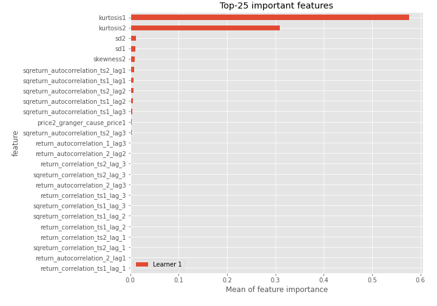
## Confusion Matrix

## Normalized Confusion Matrix

## ROC Curve

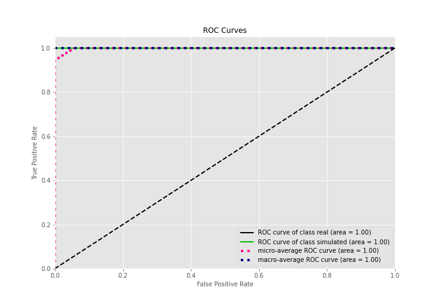

## Kolmogorov-Smirnov Statistic

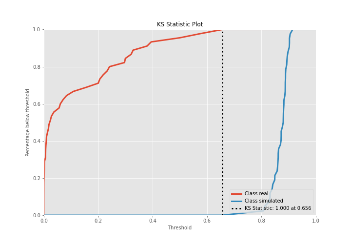

## Precision-Recall Curve

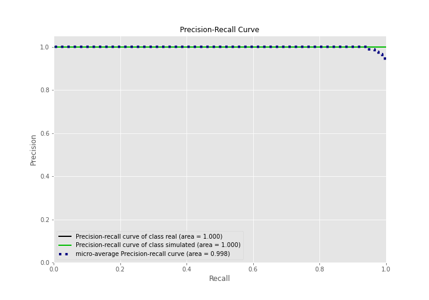

## Calibration Curve

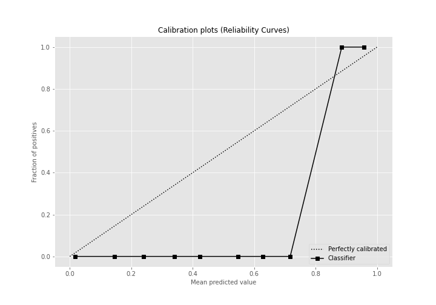

## Cumulative Gains Curve

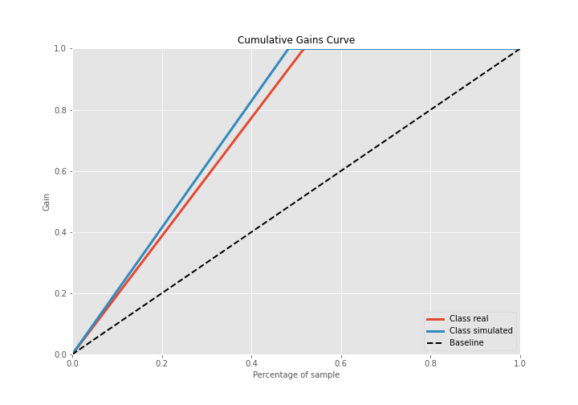

## Lift Curve

## SHAP Importance
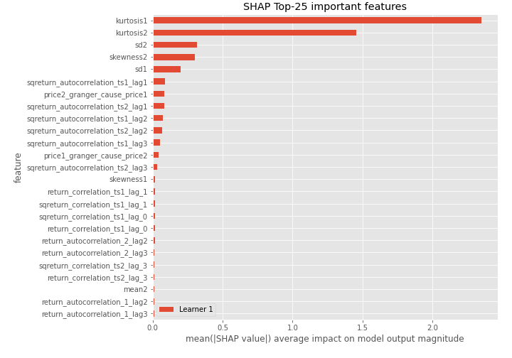

## SHAP Dependence plots

### Dependence (Fold 1)
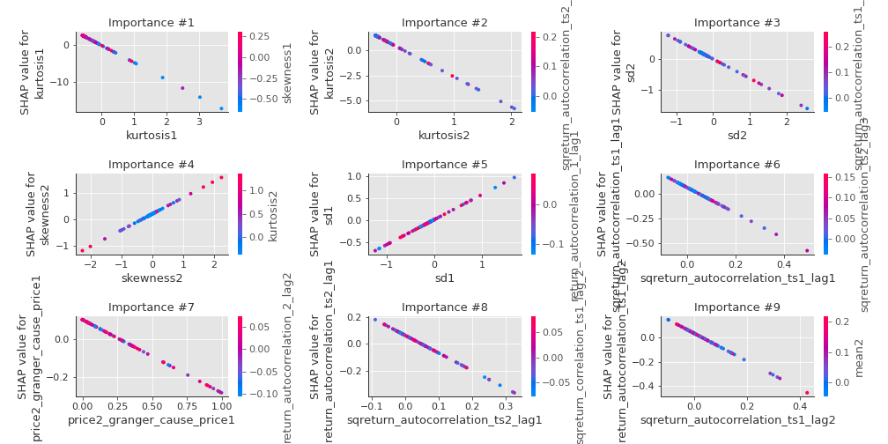

## SHAP Decision plots

### Top-10 Worst decisions for class 0 (Fold 1)
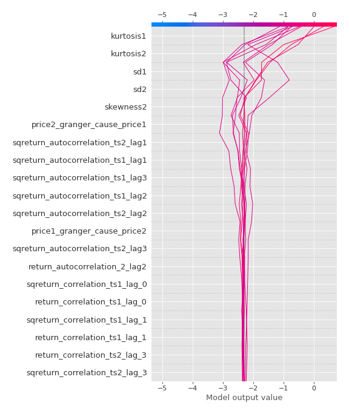
### Top-10 Best decisions for class 0 (Fold 1)
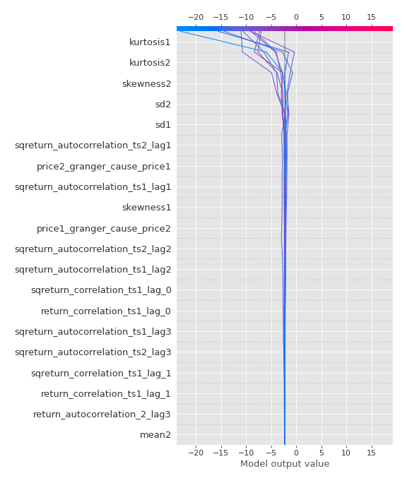
### Top-10 Worst decisions for class 1 (Fold 1)
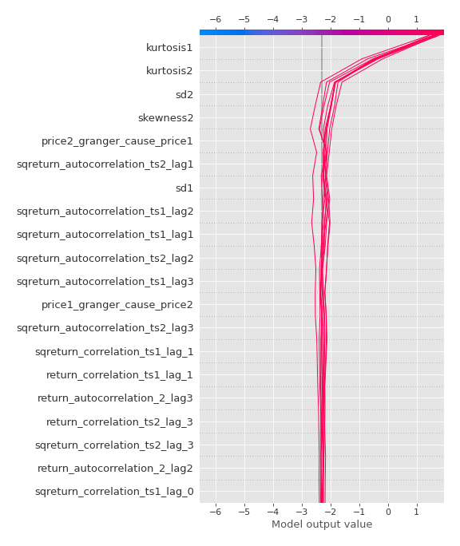
### Top-10 Best decisions for class 1 (Fold 1)
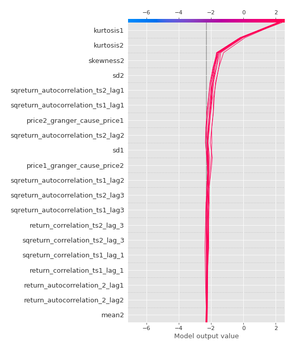

[<< Go back](../README.md)
