# Exploratory Data Analysis

[<< Go back](../README.md)
## Feature : target
- **Feature type** : categorical
- **Missing** : 0.0%
- **Unique** : 2
- **Count** :347
- **Unique** :2
- **Top** :real
- **Freq** :178

## Feature : mean1
- **Feature type** : continous
- **Missing** : 0.0%
- **Unique** : 347
- **Count** :347.0
- **Mean** :0.054392022294285906
- **Std** :0.0788522912250274
- **Min** :-0.22632637961920957
- **25%th Percentile** : 0.005828267936316784
- **50%th Percentile** : 0.05491880521864917
- **75%th Percentile** : 0.09822214204715649
- **Max** :0.3612366374600757

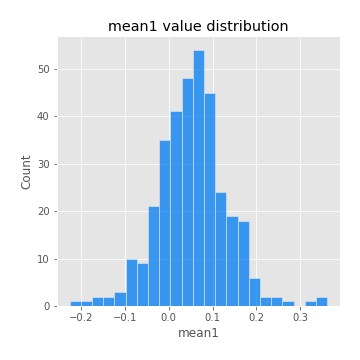
## Feature : mean2
- **Feature type** : continous
- **Missing** : 0.0%
- **Unique** : 347
- **Count** :347.0
- **Mean** :0.07642880620647689
- **Std** :0.0928285428524543
- **Min** :-0.24205418062825398
- **25%th Percentile** : 0.026660696334102098
- **50%th Percentile** : 0.07947485849676338
- **75%th Percentile** : 0.13126989092448035
- **Max** :0.37616608147096464

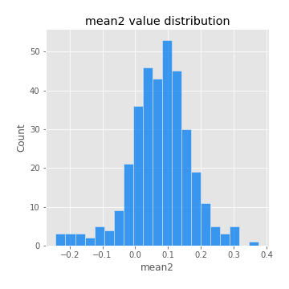
## Feature : sd1
- **Feature type** : continous
- **Missing** : 0.0%
- **Unique** : 347
- **Count** :347.0
- **Mean** :1.8798227012161435
- **Std** :0.7298313307346479
- **Min** :0.7470080772831957
- **25%th Percentile** : 1.6755231874636776
- **50%th Percentile** : 1.8135565321536848
- **75%th Percentile** : 1.8826793436499552
- **Max** :9.236766377527575

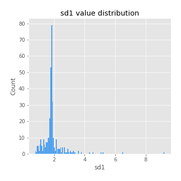
## Feature : sd2
- **Feature type** : continous
- **Missing** : 0.0%
- **Unique** : 347
- **Count** :347.0
- **Mean** :1.825112133035259
- **Std** :0.7211815106003034
- **Min** :0.8592887433004143
- **25%th Percentile** : 1.5751550853553407
- **50%th Percentile** : 1.6443894739947758
- **75%th Percentile** : 1.740356414388628
- **Max** :6.737618636746393

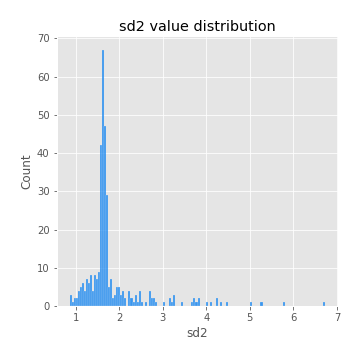
## Feature : skewness1
- **Feature type** : continous
- **Missing** : 0.0%
- **Unique** : 347
- **Count** :347.0
- **Mean** :-0.08682765749492755
- **Std** :0.5490869204862133
- **Min** :-2.817259764925239
- **25%th Percentile** : -0.1960071262728266
- **50%th Percentile** : -0.014600850465898792
- **75%th Percentile** : 0.08007787947224301
- **Max** :2.5845963767725557

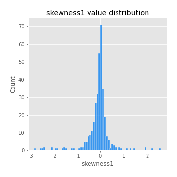
## Feature : skewness2
- **Feature type** : continous
- **Missing** : 0.0%
- **Unique** : 347
- **Count** :347.0
- **Mean** :-0.1488457831913382
- **Std** :0.7925307996961457
- **Min** :-8.801502855292393
- **25%th Percentile** : -0.21210390541398477
- **50%th Percentile** : -0.04733901255918336
- **75%th Percentile** : 0.06854313558837125
- **Max** :2.2606839051517187

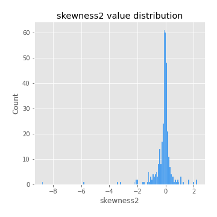
## Feature : kurtosis1
- **Feature type** : continous
- **Missing** : 0.0%
- **Unique** : 347
- **Count** :347.0
- **Mean** :3.0414710341052977
- **Std** :5.675147720804814
- **Min** :-0.3832866340333245
- **25%th Percentile** : -0.006533701191103969
- **50%th Percentile** : 0.7343851244767841
- **75%th Percentile** : 3.583058820532593
- **Max** :36.91113889081053

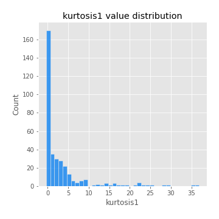
## Feature : kurtosis2
- **Feature type** : continous
- **Missing** : 0.0%
- **Unique** : 347
- **Count** :347.0
- **Mean** :3.7723033254276137
- **Std** :10.218957282885729
- **Min** :-0.4066303226986596
- **25%th Percentile** : -0.03245032807772352
- **50%th Percentile** : 0.6208695975279284
- **75%th Percentile** : 4.042224598652708
- **Max** :143.10871011533666

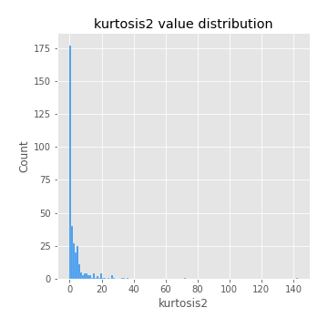
## Feature : return_autocorrelation_1_lag1
- **Feature type** : continous
- **Missing** : 0.0%
- **Unique** : 347
- **Count** :347.0
- **Mean** :-0.011636552426205326
- **Std** :0.05891363361852638
- **Min** :-0.2135576224968752
- **25%th Percentile** : -0.042574885126546516
- **50%th Percentile** : -0.008220567852800401
- **75%th Percentile** : 0.02684179426352298
- **Max** :0.14250651824059582

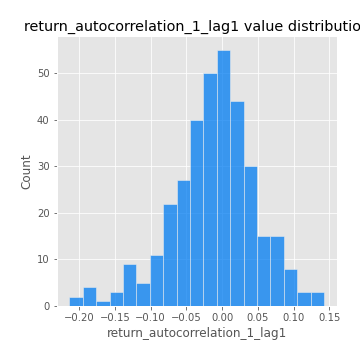
## Feature : return_autocorrelation_1_lag2
- **Feature type** : continous
- **Missing** : 0.0%
- **Unique** : 347
- **Count** :347.0
- **Mean** :-0.0023402482023294293
- **Std** :0.05034687765732753
- **Min** :-0.13309283796645122
- **25%th Percentile** : -0.033749337708157426
- **50%th Percentile** : -0.0009648527721287034
- **75%th Percentile** : 0.0323786069544299
- **Max** :0.1561488228015672

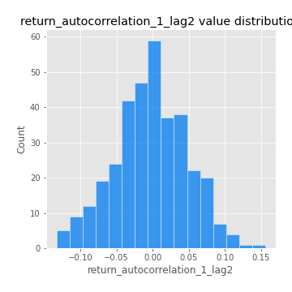
## Feature : return_autocorrelation_1_lag3
- **Feature type** : continous
- **Missing** : 0.0%
- **Unique** : 347
- **Count** :347.0
- **Mean** :-0.004721666429608142
- **Std** :0.05328194600881812
- **Min** :-0.1940836867390813
- **25%th Percentile** : -0.04017130169787666
- **50%th Percentile** : -0.004937140362520783
- **75%th Percentile** : 0.032643043786051276
- **Max** :0.17805869530681923

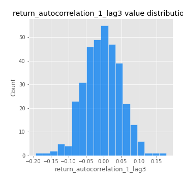
## Feature : return_autocorrelation_2_lag1
- **Feature type** : continous
- **Missing** : 0.0%
- **Unique** : 347
- **Count** :347.0
- **Mean** :-0.011355536795589656
- **Std** :0.0596261066108082
- **Min** :-0.24590087874039124
- **25%th Percentile** : -0.04358136056422812
- **50%th Percentile** : -0.009656956891914245
- **75%th Percentile** : 0.02716127526653517
- **Max** :0.31863413537898483

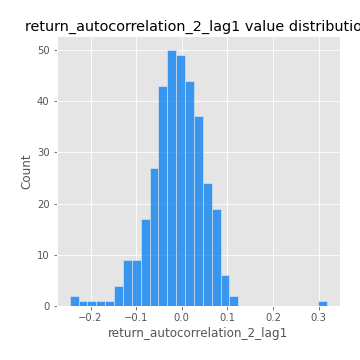
## Feature : return_autocorrelation_2_lag2
- **Feature type** : continous
- **Missing** : 0.0%
- **Unique** : 347
- **Count** :347.0
- **Mean** :0.0002747444828543892
- **Std** :0.052762645435558246
- **Min** :-0.15323211089747296
- **25%th Percentile** : -0.03473485300481585
- **50%th Percentile** : -0.0019786601520114383
- **75%th Percentile** : 0.035025060669090516
- **Max** :0.20974504043791217

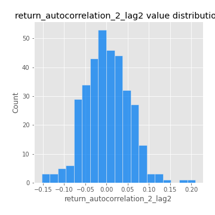
## Feature : return_autocorrelation_2_lag3
- **Feature type** : continous
- **Missing** : 0.0%
- **Unique** : 347
- **Count** :347.0
- **Mean** :-0.0023992519794324425
- **Std** :0.048126116453554434
- **Min** :-0.14200107169559698
- **25%th Percentile** : -0.032859621079509786
- **50%th Percentile** : -0.0021444689493975524
- **75%th Percentile** : 0.030033148741204198
- **Max** :0.12255842921411049

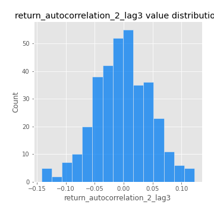
## Feature : return_correlation_ts1_lag_0
- **Feature type** : continous
- **Missing** : 0.0%
- **Unique** : 347
- **Count** :347.0
- **Mean** :0.32016995882886196
- **Std** :0.11026505039204866
- **Min** :-0.027089510445801036
- **25%th Percentile** : 0.2601904008502897
- **50%th Percentile** : 0.3110105551215919
- **75%th Percentile** : 0.3588119268971321
- **Max** :0.7028422087350163

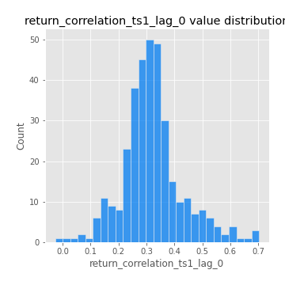
## Feature : return_correlation_ts1_lag_1
- **Feature type** : continous
- **Missing** : 0.0%
- **Unique** : 347
- **Count** :347.0
- **Mean** :-0.006460550094572338
- **Std** :0.05382398036977191
- **Min** :-0.16985510949917193
- **25%th Percentile** : -0.04143379780609019
- **50%th Percentile** : -0.0033191428202869475
- **75%th Percentile** : 0.028387265045054823
- **Max** :0.15499424718508623

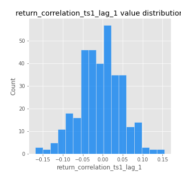
## Feature : return_correlation_ts1_lag_2
- **Feature type** : continous
- **Missing** : 0.0%
- **Unique** : 347
- **Count** :347.0
- **Mean** :0.00012252802112335697
- **Std** :0.04871394219245105
- **Min** :-0.21653581047581763
- **25%th Percentile** : -0.03175523893056423
- **50%th Percentile** : 0.0003007063469878718
- **75%th Percentile** : 0.03029951750362926
- **Max** :0.14012968171034126

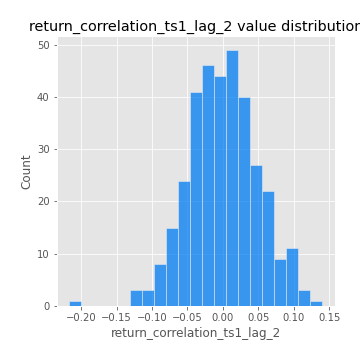
## Feature : return_correlation_ts1_lag_3
- **Feature type** : continous
- **Missing** : 0.0%
- **Unique** : 347
- **Count** :347.0
- **Mean** :-0.0019191722285919685
- **Std** :0.05225288621677059
- **Min** :-0.1270218498974763
- **25%th Percentile** : -0.03767817401802391
- **50%th Percentile** : -0.00484984241282189
- **75%th Percentile** : 0.030330854735873596
- **Max** :0.16622187286860926

## Feature : return_correlation_ts2_lag_1
- **Feature type** : continous
- **Missing** : 0.0%
- **Unique** : 347
- **Count** :347.0
- **Mean** :-0.007527449858076252
- **Std** :0.0534218038549529
- **Min** :-0.2081139431093261
- **25%th Percentile** : -0.03789041570365976
- **50%th Percentile** : -0.008563581774338
- **75%th Percentile** : 0.02823515541658064
- **Max** :0.1347960469889199

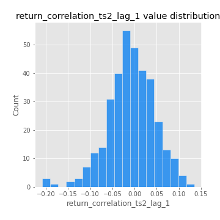
## Feature : return_correlation_ts2_lag_2
- **Feature type** : continous
- **Missing** : 0.0%
- **Unique** : 347
- **Count** :347.0
- **Mean** :0.00024006653125365239
- **Std** :0.0494914142831802
- **Min** :-0.23751835475804678
- **25%th Percentile** : -0.031207810417336355
- **50%th Percentile** : -0.0013414459010779038
- **75%th Percentile** : 0.02945608941784461
- **Max** :0.20772887392904255

## Feature : return_correlation_ts2_lag_3
- **Feature type** : continous
- **Missing** : 0.0%
- **Unique** : 347
- **Count** :347.0
- **Mean** :0.000505121135100681
- **Std** :0.05395948648055844
- **Min** :-0.17564076057312866
- **25%th Percentile** : -0.030698968802299935
- **50%th Percentile** : -0.0014930972633726716
- **75%th Percentile** : 0.03947016863597723
- **Max** :0.14732050641409805

## Feature : sqreturn_autocorrelation_ts1_lag1
- **Feature type** : continous
- **Missing** : 0.0%
- **Unique** : 347
- **Count** :347.0
- **Mean** :0.05512692501009283
- **Std** :0.09587205170622494
- **Min** :-0.10205385816007782
- **25%th Percentile** : -0.012842919553920416
- **50%th Percentile** : 0.031476128277277214
- **75%th Percentile** : 0.09424257268214548
- **Max** :0.49414293176447355

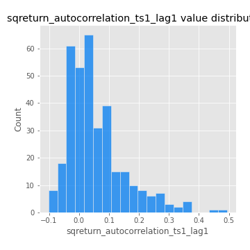
## Feature : sqreturn_autocorrelation_ts1_lag2
- **Feature type** : continous
- **Missing** : 0.0%
- **Unique** : 347
- **Count** :347.0
- **Mean** :0.048685611304547655
- **Std** :0.09708395726260216
- **Min** :-0.10093735712752024
- **25%th Percentile** : -0.008988480293677648
- **50%th Percentile** : 0.021573539466871187
- **75%th Percentile** : 0.07462054318273581
- **Max** :0.540735851444759

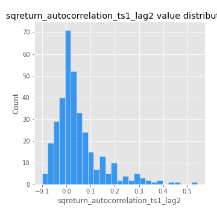
## Feature : sqreturn_autocorrelation_ts1_lag3
- **Feature type** : continous
- **Missing** : 0.0%
- **Unique** : 347
- **Count** :347.0
- **Mean** :0.035649503785942574
- **Std** :0.079500109116647
- **Min** :-0.11500048864780966
- **25%th Percentile** : -0.01742552968247609
- **50%th Percentile** : 0.016434947715406642
- **75%th Percentile** : 0.06269104546144452
- **Max** :0.41030914918857014

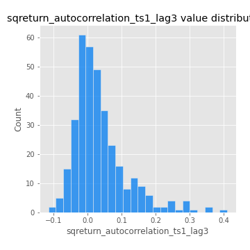
## Feature : sqreturn_autocorrelation_ts2_lag1
- **Feature type** : continous
- **Missing** : 0.0%
- **Unique** : 347
- **Count** :347.0
- **Mean** :0.049600352867956825
- **Std** :0.09134094298963463
- **Min** :-0.09191011966402982
- **25%th Percentile** : -0.009534228327307392
- **50%th Percentile** : 0.025614474627317103
- **75%th Percentile** : 0.08731796840775374
- **Max** :0.510085647437958

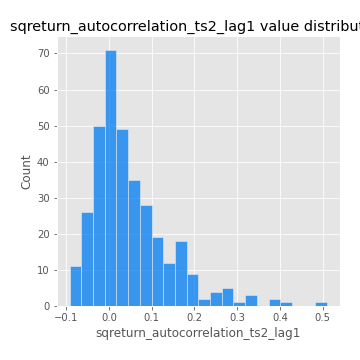
## Feature : sqreturn_autocorrelation_ts2_lag2
- **Feature type** : continous
- **Missing** : 0.0%
- **Unique** : 347
- **Count** :347.0
- **Mean** :0.04227882821482507
- **Std** :0.09445416197683525
- **Min** :-0.09550246183771795
- **25%th Percentile** : -0.013617644102388492
- **50%th Percentile** : 0.01510460734674649
- **75%th Percentile** : 0.06462919606584791
- **Max** :0.5373432415582473

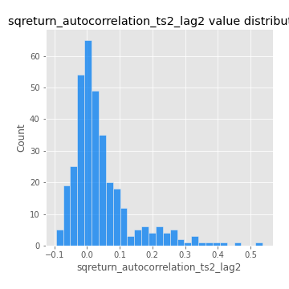
## Feature : sqreturn_autocorrelation_ts2_lag3
- **Feature type** : continous
- **Missing** : 0.0%
- **Unique** : 347
- **Count** :347.0
- **Mean** :0.032979434691567444
- **Std** :0.07173966778030545
- **Min** :-0.12374869966349043
- **25%th Percentile** : -0.011943491040310353
- **50%th Percentile** : 0.016564738094468713
- **75%th Percentile** : 0.060631877210146776
- **Max** :0.31225727797735664

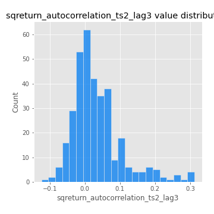
## Feature : sqreturn_correlation_ts1_lag_0
- **Feature type** : continous
- **Missing** : 0.0%
- **Unique** : 347
- **Count** :347.0
- **Mean** :0.32016995882886196
- **Std** :0.11026505039204866
- **Min** :-0.027089510445801036
- **25%th Percentile** : 0.2601904008502897
- **50%th Percentile** : 0.3110105551215919
- **75%th Percentile** : 0.3588119268971321
- **Max** :0.7028422087350163

## Feature : sqreturn_correlation_ts1_lag_1
- **Feature type** : continous
- **Missing** : 0.0%
- **Unique** : 347
- **Count** :347.0
- **Mean** :-0.006460550094572338
- **Std** :0.05382398036977191
- **Min** :-0.16985510949917193
- **25%th Percentile** : -0.04143379780609019
- **50%th Percentile** : -0.0033191428202869475
- **75%th Percentile** : 0.028387265045054823
- **Max** :0.15499424718508623

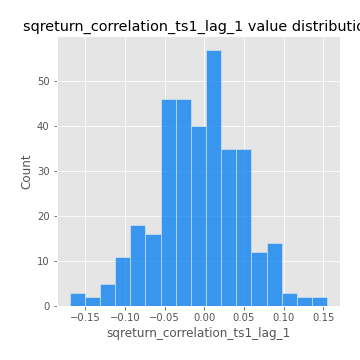
## Feature : sqreturn_correlation_ts1_lag_2
- **Feature type** : continous
- **Missing** : 0.0%
- **Unique** : 347
- **Count** :347.0
- **Mean** :0.00012252802112335697
- **Std** :0.04871394219245105
- **Min** :-0.21653581047581763
- **25%th Percentile** : -0.03175523893056423
- **50%th Percentile** : 0.0003007063469878718
- **75%th Percentile** : 0.03029951750362926
- **Max** :0.14012968171034126

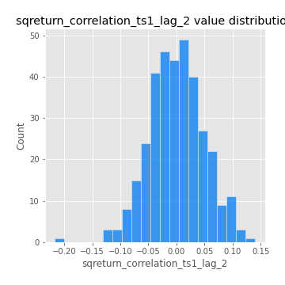
## Feature : sqreturn_correlation_ts1_lag_3
- **Feature type** : continous
- **Missing** : 0.0%
- **Unique** : 347
- **Count** :347.0
- **Mean** :-0.0019191722285919685
- **Std** :0.05225288621677059
- **Min** :-0.1270218498974763
- **25%th Percentile** : -0.03767817401802391
- **50%th Percentile** : -0.00484984241282189
- **75%th Percentile** : 0.030330854735873596
- **Max** :0.16622187286860926

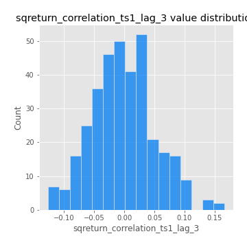
## Feature : sqreturn_correlation_ts2_lag_1
- **Feature type** : continous
- **Missing** : 0.0%
- **Unique** : 347
- **Count** :347.0
- **Mean** :-0.007527449858076252
- **Std** :0.0534218038549529
- **Min** :-0.2081139431093261
- **25%th Percentile** : -0.03789041570365976
- **50%th Percentile** : -0.008563581774338
- **75%th Percentile** : 0.02823515541658064
- **Max** :0.1347960469889199

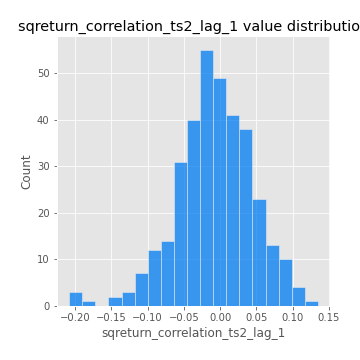
## Feature : sqreturn_correlation_ts2_lag_2
- **Feature type** : continous
- **Missing** : 0.0%
- **Unique** : 347
- **Count** :347.0
- **Mean** :0.00024006653125365239
- **Std** :0.0494914142831802
- **Min** :-0.23751835475804678
- **25%th Percentile** : -0.031207810417336355
- **50%th Percentile** : -0.0013414459010779038
- **75%th Percentile** : 0.02945608941784461
- **Max** :0.20772887392904255

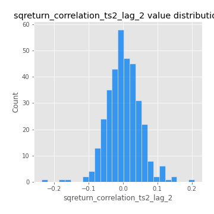
## Feature : sqreturn_correlation_ts2_lag_3
- **Feature type** : continous
- **Missing** : 0.0%
- **Unique** : 347
- **Count** :347.0
- **Mean** :0.000505121135100681
- **Std** :0.05395948648055844
- **Min** :-0.17564076057312866
- **25%th Percentile** : -0.030698968802299935
- **50%th Percentile** : -0.0014930972633726716
- **75%th Percentile** : 0.03947016863597723
- **Max** :0.14732050641409805

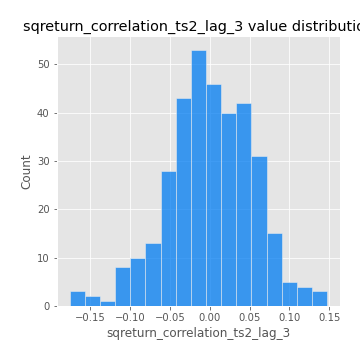
## Feature : price2_granger_cause_price1
- **Feature type** : continous
- **Missing** : 0.0%
- **Unique** : 347
- **Count** :347.0
- **Mean** :0.29408059511322987
- **Std** :0.2893051504467904
- **Min** :1.9998548511982058e-07
- **25%th Percentile** : 0.03364001708670193
- **50%th Percentile** : 0.20368417081248466
- **75%th Percentile** : 0.48029970396826005
- **Max** :0.9990984994861883

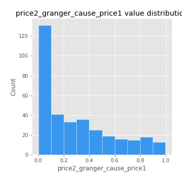
## Feature : price1_granger_cause_price2
- **Feature type** : continous
- **Missing** : 0.0%
- **Unique** : 347
- **Count** :347.0
- **Mean** :0.3109189800762648
- **Std** :0.2907665959223519
- **Min** :4.658461431608093e-06
- **25%th Percentile** : 0.04396828418310028
- **50%th Percentile** : 0.24290493411384015
- **75%th Percentile** : 0.5255994994787089
- **Max** :0.9951398266867577

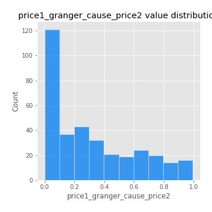

[<< Go back](../README.md)
