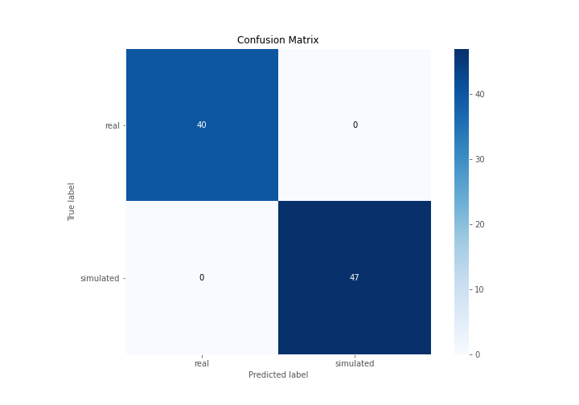
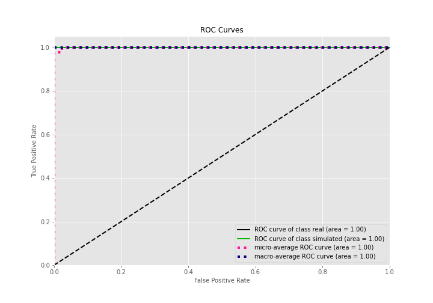
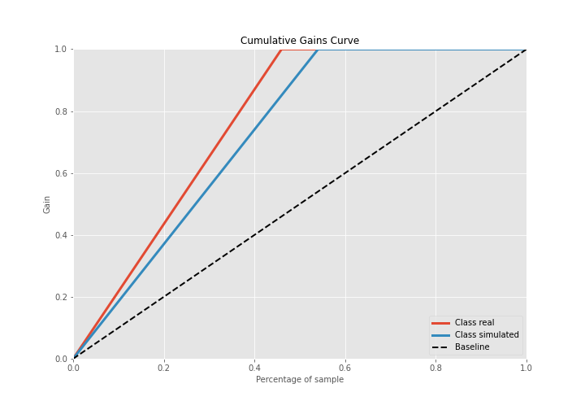

# Summary of 3_Linear

[<< Go back](../README.md)

## Logistic Regression (Linear)
- **n_jobs**: -1
- **explain_level**: 2

## Validation
 - **validation_type**: split
 - **train_ratio**: 0.75
 - **shuffle**: True
 - **stratify**: True

## Optimized metric
accuracy

## Training time

13.7 seconds

## Metric details
|           |    score |     threshold |
|:----------|---------:|--------------:|
| logloss   | 0.102114 | nan           |
| auc       | 1        | nan           |
| f1        | 1        |   0.669994    |
| accuracy  | 1        |   0.669994    |
| precision | 1        |   0.669994    |
| recall    | 1        |   2.74756e-46 |
| mcc       | 1        |   0.669994    |

## Confusion matrix (at threshold=0.669994)
|                      |   Predicted as real |   Predicted as simulated |
|:---------------------|--------------------:|-------------------------:|
| Labeled as real      |                  40 |                        0 |
| Labeled as simulated |                   0 |                       47 |

## Learning curves

## Coefficients
| feature                           |   Learner_1 |
|:----------------------------------|------------:|
| skewness2                         |   0.501245  |
| return_correlation_ts1_lag_1      |   0.384621  |
| sqreturn_correlation_ts1_lag_1    |   0.384621  |
| return_autocorrelation_2_lag1     |   0.364826  |
| return_autocorrelation_1_lag2     |   0.36113   |
| sd1                               |   0.329011  |
| skewness1                         |   0.270518  |
| sqreturn_correlation_ts2_lag_1    |   0.214802  |
| return_correlation_ts2_lag_1      |   0.214802  |
| return_correlation_ts2_lag_3      |   0.211406  |
| sqreturn_correlation_ts2_lag_3    |   0.211406  |
| return_autocorrelation_2_lag2     |   0.199486  |
| sqreturn_correlation_ts1_lag_2    |   0.188762  |
| return_correlation_ts1_lag_2      |   0.188762  |
| return_autocorrelation_2_lag3     |   0.17876   |
| sqreturn_correlation_ts1_lag_0    |   0.171408  |
| return_correlation_ts1_lag_0      |   0.171408  |
| mean2                             |   0.159371  |
| return_autocorrelation_1_lag3     |   0.106057  |
| return_correlation_ts2_lag_2      |   0.0894513 |
| sqreturn_correlation_ts2_lag_2    |   0.0894513 |
| return_autocorrelation_1_lag1     |   0.0795499 |
| sqreturn_correlation_ts1_lag_3    |   0.0696738 |
| return_correlation_ts1_lag_3      |   0.0696738 |
| mean1                             |   0.012785  |
| sd2                               |  -0.476452  |
| sqreturn_autocorrelation_ts2_lag3 |  -0.488791  |
| sqreturn_autocorrelation_ts1_lag3 |  -0.617913  |
| price2_granger_cause_price1       |  -0.619924  |
| price1_granger_cause_price2       |  -0.761917  |
| sqreturn_autocorrelation_ts1_lag1 |  -0.804038  |
| sqreturn_autocorrelation_ts1_lag2 |  -0.85848   |
| sqreturn_autocorrelation_ts2_lag2 |  -0.867366  |
| sqreturn_autocorrelation_ts2_lag1 |  -0.952897  |
| intercept                         |  -1.49137   |
| kurtosis1                         |  -3.82939   |
| kurtosis2                         |  -3.99858   |

## Permutation-based Importance

## Confusion Matrix

## Normalized Confusion Matrix

## ROC Curve

## Kolmogorov-Smirnov Statistic

## Precision-Recall Curve

## Calibration Curve

## Cumulative Gains Curve

## Lift Curve

## SHAP Importance

## SHAP Dependence plots

### Dependence (Fold 1)

## SHAP Decision plots

### Top-10 Worst decisions for class 0 (Fold 1)

### Top-10 Best decisions for class 0 (Fold 1)

### Top-10 Worst decisions for class 1 (Fold 1)

### Top-10 Best decisions for class 1 (Fold 1)

[<< Go back](../README.md)
