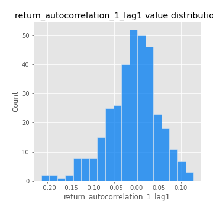
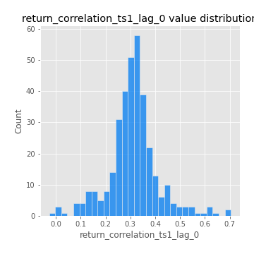

# Exploratory Data Analysis

[<< Go back](../README.md)
## Feature : target
- **Feature type** : categorical
- **Missing** : 0.0%
- **Unique** : 2
- **Count** :347
- **Unique** :2
- **Top** :simulated
- **Freq** :186

## Feature : mean1
- **Feature type** : continous
- **Missing** : 0.0%
- **Unique** : 347
- **Count** :347.0
- **Mean** :0.06175422098533317
- **Std** :0.0805152692550151
- **Min** :-0.17686457077756634
- **25%th Percentile** : 0.007878207199341479
- **50%th Percentile** : 0.06425392461301993
- **75%th Percentile** : 0.10378244602061501
- **Max** :0.37175100008111034

## Feature : mean2
- **Feature type** : continous
- **Missing** : 0.0%
- **Unique** : 347
- **Count** :347.0
- **Mean** :0.0739709449029603
- **Std** :0.0844000329812501
- **Min** :-0.24205418062825398
- **25%th Percentile** : 0.028059313624026493
- **50%th Percentile** : 0.07066448650672756
- **75%th Percentile** : 0.12482606548279604
- **Max** :0.32831323141564495

## Feature : sd1
- **Feature type** : continous
- **Missing** : 0.0%
- **Unique** : 347
- **Count** :347.0
- **Mean** :1.859722857988795
- **Std** :0.5965199214746005
- **Min** :0.7470080772831957
- **25%th Percentile** : 1.7126760564504857
- **50%th Percentile** : 1.8080123259930823
- **75%th Percentile** : 1.890825127187918
- **Max** :6.495661311240861

## Feature : sd2
- **Feature type** : continous
- **Missing** : 0.0%
- **Unique** : 347
- **Count** :347.0
- **Mean** :1.7533871214631402
- **Std** :0.622163177256842
- **Min** :0.8592887433004143
- **25%th Percentile** : 1.5627751911403154
- **50%th Percentile** : 1.6429632658313307
- **75%th Percentile** : 1.7212921949068956
- **Max** :5.762808157208253

## Feature : skewness1
- **Feature type** : continous
- **Missing** : 0.0%
- **Unique** : 347
- **Count** :347.0
- **Mean** :-0.06614337710395511
- **Std** :0.5758360567736186
- **Min** :-2.817259764925239
- **25%th Percentile** : -0.1563270481608119
- **50%th Percentile** : -0.0043356538842644786
- **75%th Percentile** : 0.10571032926724397
- **Max** :2.5845963767725557

## Feature : skewness2
- **Feature type** : continous
- **Missing** : 0.0%
- **Unique** : 347
- **Count** :347.0
- **Mean** :-0.15282557466796634
- **Std** :0.7543333179245499
- **Min** :-8.801502855292393
- **25%th Percentile** : -0.20610691210183038
- **50%th Percentile** : -0.036190499749165175
- **75%th Percentile** : 0.09533811587196347
- **Max** :2.123597625075353

## Feature : kurtosis1
- **Feature type** : continous
- **Missing** : 0.0%
- **Unique** : 347
- **Count** :347.0
- **Mean** :2.9518020196334724
- **Std** :5.774366998849862
- **Min** :-0.4840602627605284
- **25%th Percentile** : -0.036222530358915206
- **50%th Percentile** : 0.3181304622979271
- **75%th Percentile** : 3.435368886158079
- **Max** :36.91113889081053

## Feature : kurtosis2
- **Feature type** : continous
- **Missing** : 0.0%
- **Unique** : 347
- **Count** :347.0
- **Mean** :3.4826989293852053
- **Std** :9.522536117324654
- **Min** :-0.5265168840384078
- **25%th Percentile** : -0.03319128606077126
- **50%th Percentile** : 0.36692191874369273
- **75%th Percentile** : 3.6906339757515925
- **Max** :143.10871011533666

## Feature : return_autocorrelation_1_lag1
- **Feature type** : continous
- **Missing** : 0.0%
- **Unique** : 347
- **Count** :347.0
- **Mean** :-0.008711916471890787
- **Std** :0.05762322332899299
- **Min** :-0.2135576224968752
- **25%th Percentile** : -0.03760515107727347
- **50%th Percentile** : -0.004279287151001426
- **75%th Percentile** : 0.026632840942696592
- **Max** :0.12810656890648087

## Feature : return_autocorrelation_1_lag2
- **Feature type** : continous
- **Missing** : 0.0%
- **Unique** : 347
- **Count** :347.0
- **Mean** :-0.0028909941848900503
- **Std** :0.04915431224859346
- **Min** :-0.13309283796645122
- **25%th Percentile** : -0.0332105475224755
- **50%th Percentile** : 0.0001036910999988657
- **75%th Percentile** : 0.02866427961942703
- **Max** :0.1561488228015672

## Feature : return_autocorrelation_1_lag3
- **Feature type** : continous
- **Missing** : 0.0%
- **Unique** : 347
- **Count** :347.0
- **Mean** :-0.0006218758656362991
- **Std** :0.05028365588073053
- **Min** :-0.1940836867390813
- **25%th Percentile** : -0.030670203338933583
- **50%th Percentile** : -0.00017942748212601523
- **75%th Percentile** : 0.03377427246448357
- **Max** :0.17805869530681923

## Feature : return_autocorrelation_2_lag1
- **Feature type** : continous
- **Missing** : 0.0%
- **Unique** : 347
- **Count** :347.0
- **Mean** :-0.008562548283149363
- **Std** :0.059364438043430404
- **Min** :-0.25075531010123286
- **25%th Percentile** : -0.04040811589286729
- **50%th Percentile** : -0.0035317037627011433
- **75%th Percentile** : 0.02938560442145268
- **Max** :0.16349871797309318

## Feature : return_autocorrelation_2_lag2
- **Feature type** : continous
- **Missing** : 0.0%
- **Unique** : 347
- **Count** :347.0
- **Mean** :-0.0005526830283625202
- **Std** :0.04779433613823649
- **Min** :-0.15323211089747296
- **25%th Percentile** : -0.03257653772461328
- **50%th Percentile** : -8.180695967968901e-05
- **75%th Percentile** : 0.03216661440434587
- **Max** :0.1735398560230086

## Feature : return_autocorrelation_2_lag3
- **Feature type** : continous
- **Missing** : 0.0%
- **Unique** : 347
- **Count** :347.0
- **Mean** :-0.0022267159835856576
- **Std** :0.05148825487237153
- **Min** :-0.14200107169559698
- **25%th Percentile** : -0.03651452580596068
- **50%th Percentile** : -0.0017702289124079946
- **75%th Percentile** : 0.030586345472519063
- **Max** :0.14479076777823136

## Feature : return_correlation_ts1_lag_0
- **Feature type** : continous
- **Missing** : 0.0%
- **Unique** : 347
- **Count** :347.0
- **Mean** :0.31084961610616685
- **Std** :0.10168827923549702
- **Min** :-0.027089510445801036
- **25%th Percentile** : 0.2653208283146114
- **50%th Percentile** : 0.31243499085096216
- **75%th Percentile** : 0.35229746695896724
- **Max** :0.7041861626832071

## Feature : return_correlation_ts1_lag_1
- **Feature type** : continous
- **Missing** : 0.0%
- **Unique** : 347
- **Count** :347.0
- **Mean** :-0.0032605074770327546
- **Std** :0.0505630165529387
- **Min** :-0.16985510949917193
- **25%th Percentile** : -0.03752822531210838
- **50%th Percentile** : 0.0013958571343517011
- **75%th Percentile** : 0.03077566189589955
- **Max** :0.14792107218708686

## Feature : return_correlation_ts1_lag_2
- **Feature type** : continous
- **Missing** : 0.0%
- **Unique** : 347
- **Count** :347.0
- **Mean** :0.0008710981873340538
- **Std** :0.047196032918871166
- **Min** :-0.21653581047581763
- **25%th Percentile** : -0.028664688311828442
- **50%th Percentile** : 0.000558098410495882
- **75%th Percentile** : 0.032372331977865626
- **Max** :0.12436169089358766

## Feature : return_correlation_ts1_lag_3
- **Feature type** : continous
- **Missing** : 0.0%
- **Unique** : 347
- **Count** :347.0
- **Mean** :-0.0023961551016256255
- **Std** :0.05059682886210734
- **Min** :-0.1270218498974763
- **25%th Percentile** : -0.03730162328257794
- **50%th Percentile** : -0.00468077505976925
- **75%th Percentile** : 0.02975821140909156
- **Max** :0.1636773216468148

## Feature : return_correlation_ts2_lag_1
- **Feature type** : continous
- **Missing** : 0.0%
- **Unique** : 347
- **Count** :347.0
- **Mean** :-0.0037287210336260563
- **Std** :0.053818702345339996
- **Min** :-0.20093919236581337
- **25%th Percentile** : -0.036024303597617255
- **50%th Percentile** : -0.004748320710641742
- **75%th Percentile** : 0.03128007785830407
- **Max** :0.17208763791364762

## Feature : return_correlation_ts2_lag_2
- **Feature type** : continous
- **Missing** : 0.0%
- **Unique** : 347
- **Count** :347.0
- **Mean** :0.002145607831177107
- **Std** :0.04815287263269901
- **Min** :-0.11701735111763815
- **25%th Percentile** : -0.03244145428042608
- **50%th Percentile** : 0.0018346610747801257
- **75%th Percentile** : 0.03209325107337121
- **Max** :0.20772887392904255

## Feature : return_correlation_ts2_lag_3
- **Feature type** : continous
- **Missing** : 0.0%
- **Unique** : 347
- **Count** :347.0
- **Mean** :0.00023070310799591214
- **Std** :0.05017125218822332
- **Min** :-0.17564076057312866
- **25%th Percentile** : -0.02708196756723281
- **50%th Percentile** : 0.0017062306092014044
- **75%th Percentile** : 0.03465139898743087
- **Max** :0.12578577770423086

## Feature : sqreturn_autocorrelation_ts1_lag1
- **Feature type** : continous
- **Missing** : 0.0%
- **Unique** : 347
- **Count** :347.0
- **Mean** :0.046817202044407424
- **Std** :0.09439314497343065
- **Min** :-0.09022242190002061
- **25%th Percentile** : -0.012801860764335902
- **50%th Percentile** : 0.02102336635625544
- **75%th Percentile** : 0.0812339197509683
- **Max** :0.49414293176447355

## Feature : sqreturn_autocorrelation_ts1_lag2
- **Feature type** : continous
- **Missing** : 0.0%
- **Unique** : 347
- **Count** :347.0
- **Mean** :0.039032408307159074
- **Std** :0.08828790470409685
- **Min** :-0.09981731920861996
- **25%th Percentile** : -0.01404409554659444
- **50%th Percentile** : 0.017770783974223305
- **75%th Percentile** : 0.061413674762686506
- **Max** :0.4522162366773919

## Feature : sqreturn_autocorrelation_ts1_lag3
- **Feature type** : continous
- **Missing** : 0.0%
- **Unique** : 347
- **Count** :347.0
- **Mean** :0.03302064537629228
- **Std** :0.08027744732289276
- **Min** :-0.11616598057542388
- **25%th Percentile** : -0.017712721633715317
- **50%th Percentile** : 0.012593715022244586
- **75%th Percentile** : 0.06281678153515256
- **Max** :0.41030914918857014

## Feature : sqreturn_autocorrelation_ts2_lag1
- **Feature type** : continous
- **Missing** : 0.0%
- **Unique** : 347
- **Count** :347.0
- **Mean** :0.04620074981204978
- **Std** :0.08777711176753257
- **Min** :-0.10522259094462877
- **25%th Percentile** : -0.012295432183749925
- **50%th Percentile** : 0.025695549370206412
- **75%th Percentile** : 0.08384687394187884
- **Max** :0.510085647437958

## Feature : sqreturn_autocorrelation_ts2_lag2
- **Feature type** : continous
- **Missing** : 0.0%
- **Unique** : 347
- **Count** :347.0
- **Mean** :0.03232196636976549
- **Std** :0.08552573747629538
- **Min** :-0.10827809168570436
- **25%th Percentile** : -0.013822549302815616
- **50%th Percentile** : 0.012367098888812732
- **75%th Percentile** : 0.049362359878011214
- **Max** :0.45676817892778204

## Feature : sqreturn_autocorrelation_ts2_lag3
- **Feature type** : continous
- **Missing** : 0.0%
- **Unique** : 347
- **Count** :347.0
- **Mean** :0.027649253521675445
- **Std** :0.06716969866815514
- **Min** :-0.10750563163331933
- **25%th Percentile** : -0.011890836828934676
- **50%th Percentile** : 0.016612205993699145
- **75%th Percentile** : 0.05411492121489697
- **Max** :0.31225727797735664

## Feature : sqreturn_correlation_ts1_lag_0
- **Feature type** : continous
- **Missing** : 0.0%
- **Unique** : 347
- **Count** :347.0
- **Mean** :0.31084961610616685
- **Std** :0.10168827923549702
- **Min** :-0.027089510445801036
- **25%th Percentile** : 0.2653208283146114
- **50%th Percentile** : 0.31243499085096216
- **75%th Percentile** : 0.35229746695896724
- **Max** :0.7041861626832071

## Feature : sqreturn_correlation_ts1_lag_1
- **Feature type** : continous
- **Missing** : 0.0%
- **Unique** : 347
- **Count** :347.0
- **Mean** :-0.0032605074770327546
- **Std** :0.0505630165529387
- **Min** :-0.16985510949917193
- **25%th Percentile** : -0.03752822531210838
- **50%th Percentile** : 0.0013958571343517011
- **75%th Percentile** : 0.03077566189589955
- **Max** :0.14792107218708686

## Feature : sqreturn_correlation_ts1_lag_2
- **Feature type** : continous
- **Missing** : 0.0%
- **Unique** : 347
- **Count** :347.0
- **Mean** :0.0008710981873340538
- **Std** :0.047196032918871166
- **Min** :-0.21653581047581763
- **25%th Percentile** : -0.028664688311828442
- **50%th Percentile** : 0.000558098410495882
- **75%th Percentile** : 0.032372331977865626
- **Max** :0.12436169089358766

## Feature : sqreturn_correlation_ts1_lag_3
- **Feature type** : continous
- **Missing** : 0.0%
- **Unique** : 347
- **Count** :347.0
- **Mean** :-0.0023961551016256255
- **Std** :0.05059682886210734
- **Min** :-0.1270218498974763
- **25%th Percentile** : -0.03730162328257794
- **50%th Percentile** : -0.00468077505976925
- **75%th Percentile** : 0.02975821140909156
- **Max** :0.1636773216468148

## Feature : sqreturn_correlation_ts2_lag_1
- **Feature type** : continous
- **Missing** : 0.0%
- **Unique** : 347
- **Count** :347.0
- **Mean** :-0.0037287210336260563
- **Std** :0.053818702345339996
- **Min** :-0.20093919236581337
- **25%th Percentile** : -0.036024303597617255
- **50%th Percentile** : -0.004748320710641742
- **75%th Percentile** : 0.03128007785830407
- **Max** :0.17208763791364762

## Feature : sqreturn_correlation_ts2_lag_2
- **Feature type** : continous
- **Missing** : 0.0%
- **Unique** : 347
- **Count** :347.0
- **Mean** :0.002145607831177107
- **Std** :0.04815287263269901
- **Min** :-0.11701735111763815
- **25%th Percentile** : -0.03244145428042608
- **50%th Percentile** : 0.0018346610747801257
- **75%th Percentile** : 0.03209325107337121
- **Max** :0.20772887392904255

## Feature : sqreturn_correlation_ts2_lag_3
- **Feature type** : continous
- **Missing** : 0.0%
- **Unique** : 347
- **Count** :347.0
- **Mean** :0.00023070310799591214
- **Std** :0.05017125218822332
- **Min** :-0.17564076057312866
- **25%th Percentile** : -0.02708196756723281
- **50%th Percentile** : 0.0017062306092014044
- **75%th Percentile** : 0.03465139898743087
- **Max** :0.12578577770423086

## Feature : price2_granger_cause_price1
- **Feature type** : continous
- **Missing** : 0.0%
- **Unique** : 347
- **Count** :347.0
- **Mean** :0.29385982234306124
- **Std** :0.29991677404502415
- **Min** :4.6594146002569614e-08
- **25%th Percentile** : 0.02585485071578837
- **50%th Percentile** : 0.17743565343192882
- **75%th Percentile** : 0.49288916197351035
- **Max** :0.9981362666401428

## Feature : price1_granger_cause_price2
- **Feature type** : continous
- **Missing** : 0.0%
- **Unique** : 347
- **Count** :347.0
- **Mean** :0.2659041897119993
- **Std** :0.27374444189463476
- **Min** :4.8662776497322015e-09
- **25%th Percentile** : 0.02691634394263277
- **50%th Percentile** : 0.15737929693347602
- **75%th Percentile** : 0.457972803781858
- **Max** :0.9889085534452092

[<< Go back](../README.md)
