# Summary of 3_Linear

[<< Go back](../README.md)

## Logistic Regression (Linear)
- **n_jobs**: -1
- **explain_level**: 2

## Validation
 - **validation_type**: split
 - **train_ratio**: 0.75
 - **shuffle**: True
 - **stratify**: True

## Optimized metric
accuracy

## Training time

3.1 seconds

## Metric details
|           |   score |     threshold |
|:----------|--------:|--------------:|
| logloss   | 0.11283 | nan           |
| auc       | 1       | nan           |
| f1        | 1       |   0.662639    |
| accuracy  | 1       |   0.662639    |
| precision | 1       |   0.877818    |
| recall    | 1       |   1.43175e-37 |
| mcc       | 1       |   0.662639    |

## Confusion matrix (at threshold=0.662639)
|                      |   Predicted as real |   Predicted as simulated |
|:---------------------|--------------------:|-------------------------:|
| Labeled as real      |                  43 |                        0 |
| Labeled as simulated |                   0 |                       44 |

## Learning curves
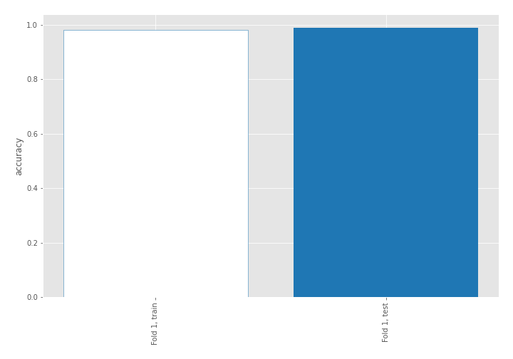

## Coefficients
| feature                           |   Learner_1 |
|:----------------------------------|------------:|
| return_skew2                      |   0.705843  |
| return_correlation_ts2_lag_3      |   0.316238  |
| sqreturn_correlation_ts2_lag_3    |   0.316238  |
| return_autocorrelation_2_lag1     |   0.315055  |
| return_sd1                        |   0.311444  |
| return_skew1                      |   0.297111  |
| return_correlation_ts2_lag_1      |   0.286673  |
| sqreturn_correlation_ts2_lag_1    |   0.286673  |
| sqreturn_correlation_ts1_lag_2    |   0.258083  |
| return_correlation_ts1_lag_2      |   0.258083  |
| sqreturn_correlation_ts1_lag_1    |   0.248165  |
| return_correlation_ts1_lag_1      |   0.248165  |
| return_autocorrelation_1_lag2     |   0.233142  |
| return_autocorrelation_2_lag3     |   0.207404  |
| return_autocorrelation_1_lag3     |   0.182783  |
| return_mean2                      |   0.174433  |
| sqreturn_correlation_ts1_lag_3    |   0.129692  |
| return_correlation_ts1_lag_3      |   0.129692  |
| return_autocorrelation_2_lag2     |   0.102607  |
| return_autocorrelation_1_lag1     |   0.0493655 |
| sqreturn_correlation_ts2_lag_2    |   0.035389  |
| return_correlation_ts2_lag_2      |   0.035389  |
| return_mean1                      |  -0.107348  |
| price1_granger_cause_price2       |  -0.145032  |
| sqreturn_correlation_ts1_lag_0    |  -0.202508  |
| return_correlation_ts1_lag_0      |  -0.202508  |
| return_sd2                        |  -0.414849  |
| sqreturn_autocorrelation_ts2_lag3 |  -0.702168  |
| sqreturn_autocorrelation_ts1_lag3 |  -0.781862  |
| sqreturn_autocorrelation_ts2_lag2 |  -0.817185  |
| sqreturn_autocorrelation_ts1_lag2 |  -0.833824  |
| price2_granger_cause_price1       |  -0.911397  |
| sqreturn_autocorrelation_ts1_lag1 |  -0.975375  |
| sqreturn_autocorrelation_ts2_lag1 |  -1.13261   |
| intercept                         |  -1.47879   |
| return_kurtosis2                  |  -3.81732   |
| return_kurtosis1                  |  -3.9506    |

## Permutation-based Importance
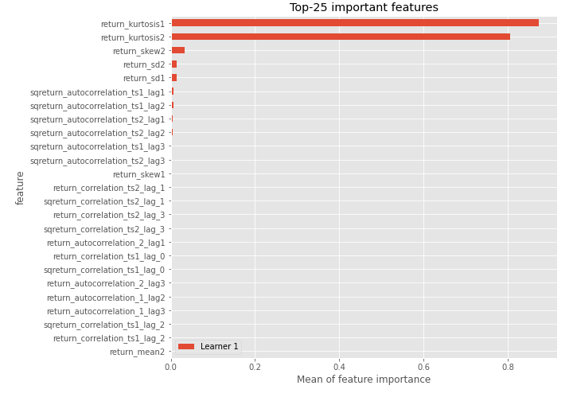
## Confusion Matrix

## Normalized Confusion Matrix

## ROC Curve

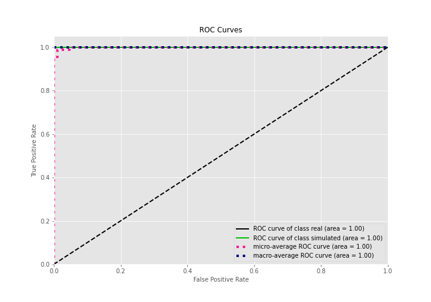

## Kolmogorov-Smirnov Statistic

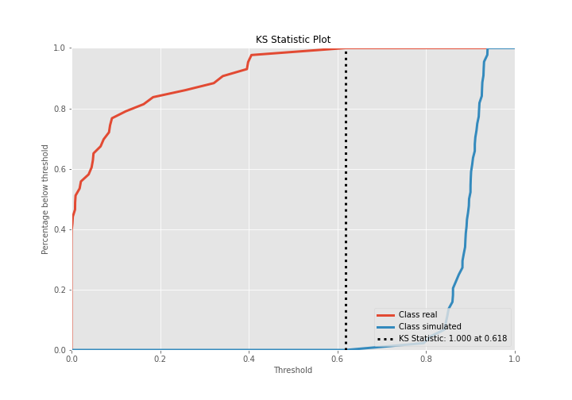

## Precision-Recall Curve

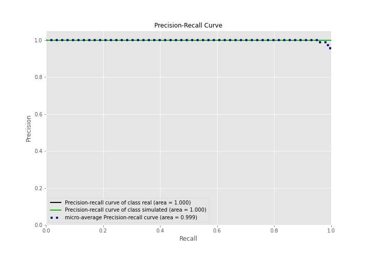

## Calibration Curve

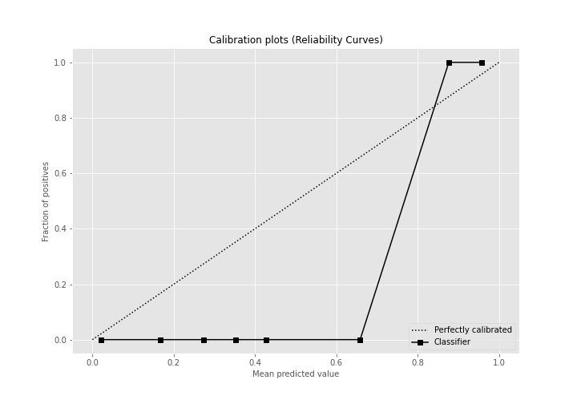

## Cumulative Gains Curve

## Lift Curve

## SHAP Importance
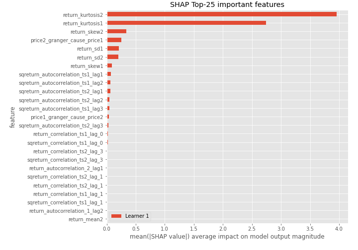

## SHAP Dependence plots

### Dependence (Fold 1)
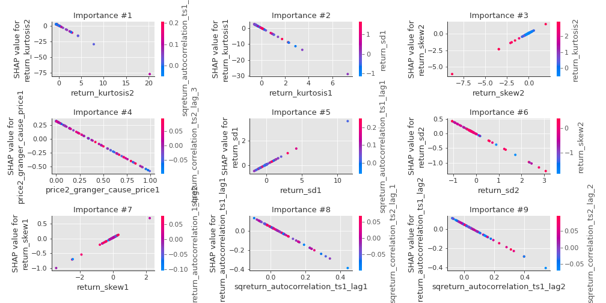

## SHAP Decision plots

### Top-10 Worst decisions for class 0 (Fold 1)
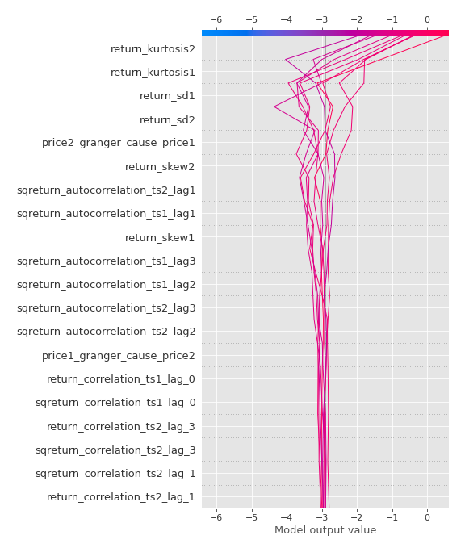
### Top-10 Best decisions for class 0 (Fold 1)
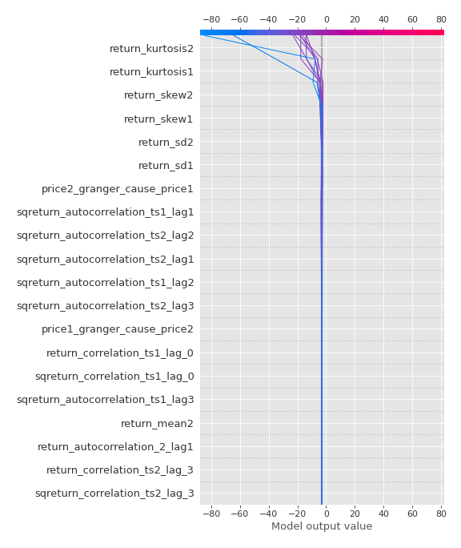
### Top-10 Worst decisions for class 1 (Fold 1)
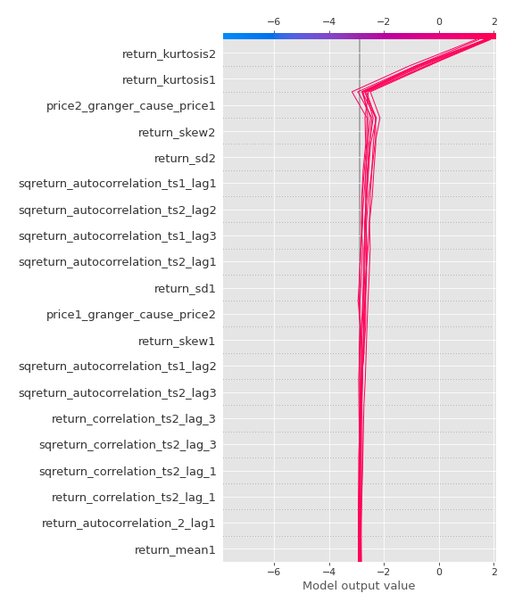
### Top-10 Best decisions for class 1 (Fold 1)
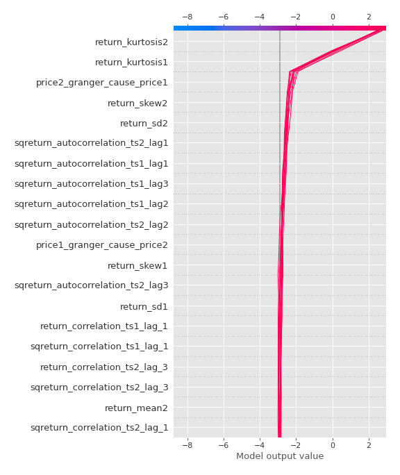

[<< Go back](../README.md)
