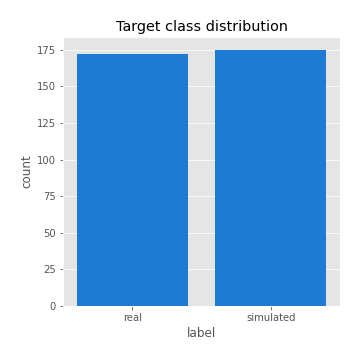
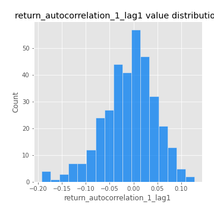

# Exploratory Data Analysis

[<< Go back](../README.md)
## Feature : target
- **Feature type** : categorical
- **Missing** : 0.0%
- **Unique** : 2
- **Count** :347
- **Unique** :2
- **Top** :simulated
- **Freq** :175

## Feature : return_mean1
- **Feature type** : continous
- **Missing** : 0.0%
- **Unique** : 347
- **Count** :347.0
- **Mean** :0.05407557697994529
- **Std** :0.07852033718761017
- **Min** :-0.22632637961920957
- **25%th Percentile** : 0.002578255640284766
- **50%th Percentile** : 0.05312186492204548
- **75%th Percentile** : 0.0984349407080207
- **Max** :0.37175100008111034

## Feature : return_mean2
- **Feature type** : continous
- **Missing** : 0.0%
- **Unique** : 347
- **Count** :347.0
- **Mean** :0.07459197582068598
- **Std** :0.08198471661603512
- **Min** :-0.24205418062825398
- **25%th Percentile** : 0.03327593704790542
- **50%th Percentile** : 0.0744293668100789
- **75%th Percentile** : 0.1223436827597178
- **Max** :0.37616608147096464

## Feature : return_sd1
- **Feature type** : continous
- **Missing** : 0.0%
- **Unique** : 347
- **Count** :347.0
- **Mean** :1.8698152607765115
- **Std** :0.7443879252553551
- **Min** :0.7470080772831957
- **25%th Percentile** : 1.6533767460973428
- **50%th Percentile** : 1.8113713433033225
- **75%th Percentile** : 1.8858964241038336
- **Max** :9.236766377527575

## Feature : return_sd2
- **Feature type** : continous
- **Missing** : 0.0%
- **Unique** : 347
- **Count** :347.0
- **Mean** :1.8096553877186627
- **Std** :0.7567211772692453
- **Min** :0.8455946193085045
- **25%th Percentile** : 1.575991972796938
- **50%th Percentile** : 1.647373609856018
- **75%th Percentile** : 1.7339188262103014
- **Max** :6.737618636746393

## Feature : return_skew1
- **Feature type** : continous
- **Missing** : 0.0%
- **Unique** : 347
- **Count** :347.0
- **Mean** :-0.0813510294065519
- **Std** :0.6173517556463329
- **Min** :-3.530116233761814
- **25%th Percentile** : -0.18283449600095644
- **50%th Percentile** : -0.0030503369151098658
- **75%th Percentile** : 0.10977229297875932
- **Max** :2.5845963767725557

## Feature : return_skew2
- **Feature type** : continous
- **Missing** : 0.0%
- **Unique** : 347
- **Count** :347.0
- **Mean** :-0.17320372130044662
- **Std** :0.833691263809564
- **Min** :-8.801502855292393
- **25%th Percentile** : -0.22764781393197045
- **50%th Percentile** : -0.03969881738036278
- **75%th Percentile** : 0.083289002266598
- **Max** :2.242019525651531

## Feature : return_kurtosis1
- **Feature type** : continous
- **Missing** : 0.0%
- **Unique** : 347
- **Count** :347.0
- **Mean** :3.177289321960012
- **Std** :6.11819829458156
- **Min** :-0.5432961315900116
- **25%th Percentile** : -0.02699548276627528
- **50%th Percentile** : 0.5387186195450089
- **75%th Percentile** : 3.5326987255989466
- **Max** :46.07507808162177

## Feature : return_kurtosis2
- **Feature type** : continous
- **Missing** : 0.0%
- **Unique** : 347
- **Count** :347.0
- **Mean** :4.102874348930733
- **Std** :10.623938129229519
- **Min** :-0.42319023464764616
- **25%th Percentile** : -0.009466413257253281
- **50%th Percentile** : 0.5557465400052362
- **75%th Percentile** : 4.335825686593465
- **Max** :143.10871011533666

## Feature : return_autocorrelation_1_lag1
- **Feature type** : continous
- **Missing** : 0.0%
- **Unique** : 347
- **Count** :347.0
- **Mean** :-0.009079342146186737
- **Std** :0.055498199046383694
- **Min** :-0.19339575314049967
- **25%th Percentile** : -0.040312387531632285
- **50%th Percentile** : -0.0036038998825459814
- **75%th Percentile** : 0.026937348658454534
- **Max** :0.12810656890648087

## Feature : return_autocorrelation_1_lag2
- **Feature type** : continous
- **Missing** : 0.0%
- **Unique** : 347
- **Count** :347.0
- **Mean** :-0.007073087255805022
- **Std** :0.04766469228581152
- **Min** :-0.13309283796645122
- **25%th Percentile** : -0.03594255869639325
- **50%th Percentile** : -0.008227582329404515
- **75%th Percentile** : 0.022225790210120527
- **Max** :0.1806051227782619

## Feature : return_autocorrelation_1_lag3
- **Feature type** : continous
- **Missing** : 0.0%
- **Unique** : 347
- **Count** :347.0
- **Mean** :0.00016220702141900444
- **Std** :0.052326375935427966
- **Min** :-0.1940836867390813
- **25%th Percentile** : -0.028683007881267604
- **50%th Percentile** : 0.0006925224194404295
- **75%th Percentile** : 0.032643043786051276
- **Max** :0.17805869530681923

## Feature : return_autocorrelation_2_lag1
- **Feature type** : continous
- **Missing** : 0.0%
- **Unique** : 347
- **Count** :347.0
- **Mean** :-0.009520991307605933
- **Std** :0.05897165704488978
- **Min** :-0.25075531010123286
- **25%th Percentile** : -0.04069401276918458
- **50%th Percentile** : -0.007793058865094259
- **75%th Percentile** : 0.025205565741594434
- **Max** :0.31863413537898483

## Feature : return_autocorrelation_2_lag2
- **Feature type** : continous
- **Missing** : 0.0%
- **Unique** : 347
- **Count** :347.0
- **Mean** :-0.005170648075516849
- **Std** :0.05183374107231288
- **Min** :-0.15323211089747296
- **25%th Percentile** : -0.036069593551598916
- **50%th Percentile** : -0.007521628340500333
- **75%th Percentile** : 0.028283105039993976
- **Max** :0.20974504043791217

## Feature : return_autocorrelation_2_lag3
- **Feature type** : continous
- **Missing** : 0.0%
- **Unique** : 347
- **Count** :347.0
- **Mean** :-0.002161356162798399
- **Std** :0.04788472128134114
- **Min** :-0.14200107169559698
- **25%th Percentile** : -0.032715665456844525
- **50%th Percentile** : -0.0033165962748403057
- **75%th Percentile** : 0.034970362318500266
- **Max** :0.1419999376914021

## Feature : return_correlation_ts1_lag_0
- **Feature type** : continous
- **Missing** : 0.0%
- **Unique** : 347
- **Count** :347.0
- **Mean** :0.3142987283478269
- **Std** :0.11041324384986316
- **Min** :-0.027089510445801036
- **25%th Percentile** : 0.264647049017696
- **50%th Percentile** : 0.31108983723275846
- **75%th Percentile** : 0.3568440413204602
- **Max** :0.7041861626832071

## Feature : return_correlation_ts1_lag_1
- **Feature type** : continous
- **Missing** : 0.0%
- **Unique** : 347
- **Count** :347.0
- **Mean** :-0.00257055607298225
- **Std** :0.0512846716706815
- **Min** :-0.15776193292681923
- **25%th Percentile** : -0.0347586006224333
- **50%th Percentile** : 0.000803810238242537
- **75%th Percentile** : 0.03740278400072177
- **Max** :0.15499424718508623

## Feature : return_correlation_ts1_lag_2
- **Feature type** : continous
- **Missing** : 0.0%
- **Unique** : 347
- **Count** :347.0
- **Mean** :-0.0005854154070570795
- **Std** :0.04742967950460174
- **Min** :-0.12864410180561703
- **25%th Percentile** : -0.032909623630992695
- **50%th Percentile** : -0.0007521274175957864
- **75%th Percentile** : 0.036122380772645235
- **Max** :0.10995023355729286

## Feature : return_correlation_ts1_lag_3
- **Feature type** : continous
- **Missing** : 0.0%
- **Unique** : 347
- **Count** :347.0
- **Mean** :0.0029464615154421695
- **Std** :0.05047234303991695
- **Min** :-0.1270218498974763
- **25%th Percentile** : -0.03336703103627614
- **50%th Percentile** : 0.005148581441872404
- **75%th Percentile** : 0.034721961987363464
- **Max** :0.1636773216468148

## Feature : return_correlation_ts2_lag_1
- **Feature type** : continous
- **Missing** : 0.0%
- **Unique** : 347
- **Count** :347.0
- **Mean** :-0.004690953768039579
- **Std** :0.05194781518681267
- **Min** :-0.20093919236581337
- **25%th Percentile** : -0.03585596546558539
- **50%th Percentile** : -0.004748320710641742
- **75%th Percentile** : 0.027248068597664397
- **Max** :0.17208763791364762

## Feature : return_correlation_ts2_lag_2
- **Feature type** : continous
- **Missing** : 0.0%
- **Unique** : 347
- **Count** :347.0
- **Mean** :0.00029944795694529015
- **Std** :0.050508305686113336
- **Min** :-0.23751835475804678
- **25%th Percentile** : -0.033711766821150145
- **50%th Percentile** : -0.003186316216567342
- **75%th Percentile** : 0.029678906861114865
- **Max** :0.20772887392904255

## Feature : return_correlation_ts2_lag_3
- **Feature type** : continous
- **Missing** : 0.0%
- **Unique** : 347
- **Count** :347.0
- **Mean** :0.0006529971848707627
- **Std** :0.052908967263210545
- **Min** :-0.17564076057312866
- **25%th Percentile** : -0.02951252664353618
- **50%th Percentile** : 0.00025314814303647456
- **75%th Percentile** : 0.033886305581179534
- **Max** :0.1368801674116406

## Feature : sqreturn_autocorrelation_ts1_lag1
- **Feature type** : continous
- **Missing** : 0.0%
- **Unique** : 347
- **Count** :347.0
- **Mean** :0.04707878639480157
- **Std** :0.09385850962670962
- **Min** :-0.09389334372318785
- **25%th Percentile** : -0.011500337142327535
- **50%th Percentile** : 0.02125223407787622
- **75%th Percentile** : 0.0806604382292497
- **Max** :0.49414293176447355

## Feature : sqreturn_autocorrelation_ts1_lag2
- **Feature type** : continous
- **Missing** : 0.0%
- **Unique** : 347
- **Count** :347.0
- **Mean** :0.042089579546933334
- **Std** :0.08968020654337376
- **Min** :-0.10343409241813156
- **25%th Percentile** : -0.010368785664763805
- **50%th Percentile** : 0.017708291982320722
- **75%th Percentile** : 0.0661901525911979
- **Max** :0.540735851444759

## Feature : sqreturn_autocorrelation_ts1_lag3
- **Feature type** : continous
- **Missing** : 0.0%
- **Unique** : 347
- **Count** :347.0
- **Mean** :0.035504303524970034
- **Std** :0.07616746390411022
- **Min** :-0.11369545530610456
- **25%th Percentile** : -0.013401358493631275
- **50%th Percentile** : 0.017412275669772066
- **75%th Percentile** : 0.06269104546144452
- **Max** :0.41030914918857014

## Feature : sqreturn_autocorrelation_ts2_lag1
- **Feature type** : continous
- **Missing** : 0.0%
- **Unique** : 347
- **Count** :347.0
- **Mean** :0.04462085379558795
- **Std** :0.08989271361562566
- **Min** :-0.11196657652027388
- **25%th Percentile** : -0.00898219578924642
- **50%th Percentile** : 0.024001793134355548
- **75%th Percentile** : 0.08336425571324294
- **Max** :0.510085647437958

## Feature : sqreturn_autocorrelation_ts2_lag2
- **Feature type** : continous
- **Missing** : 0.0%
- **Unique** : 347
- **Count** :347.0
- **Mean** :0.03820355238665579
- **Std** :0.08424721878824608
- **Min** :-0.0827971296610135
- **25%th Percentile** : -0.010391842576047508
- **50%th Percentile** : 0.015009649875009542
- **75%th Percentile** : 0.05886147087967282
- **Max** :0.45676817892778204

## Feature : sqreturn_autocorrelation_ts2_lag3
- **Feature type** : continous
- **Missing** : 0.0%
- **Unique** : 347
- **Count** :347.0
- **Mean** :0.02819251730902694
- **Std** :0.06797629167208447
- **Min** :-0.12466421152091087
- **25%th Percentile** : -0.013554495884681913
- **50%th Percentile** : 0.012784161301929102
- **75%th Percentile** : 0.05636833840181621
- **Max** :0.31225727797735664

## Feature : sqreturn_correlation_ts1_lag_0
- **Feature type** : continous
- **Missing** : 0.0%
- **Unique** : 347
- **Count** :347.0
- **Mean** :0.3142987283478269
- **Std** :0.11041324384986316
- **Min** :-0.027089510445801036
- **25%th Percentile** : 0.264647049017696
- **50%th Percentile** : 0.31108983723275846
- **75%th Percentile** : 0.3568440413204602
- **Max** :0.7041861626832071

## Feature : sqreturn_correlation_ts1_lag_1
- **Feature type** : continous
- **Missing** : 0.0%
- **Unique** : 347
- **Count** :347.0
- **Mean** :-0.00257055607298225
- **Std** :0.0512846716706815
- **Min** :-0.15776193292681923
- **25%th Percentile** : -0.0347586006224333
- **50%th Percentile** : 0.000803810238242537
- **75%th Percentile** : 0.03740278400072177
- **Max** :0.15499424718508623

## Feature : sqreturn_correlation_ts1_lag_2
- **Feature type** : continous
- **Missing** : 0.0%
- **Unique** : 347
- **Count** :347.0
- **Mean** :-0.0005854154070570795
- **Std** :0.04742967950460174
- **Min** :-0.12864410180561703
- **25%th Percentile** : -0.032909623630992695
- **50%th Percentile** : -0.0007521274175957864
- **75%th Percentile** : 0.036122380772645235
- **Max** :0.10995023355729286

## Feature : sqreturn_correlation_ts1_lag_3
- **Feature type** : continous
- **Missing** : 0.0%
- **Unique** : 347
- **Count** :347.0
- **Mean** :0.0029464615154421695
- **Std** :0.05047234303991695
- **Min** :-0.1270218498974763
- **25%th Percentile** : -0.03336703103627614
- **50%th Percentile** : 0.005148581441872404
- **75%th Percentile** : 0.034721961987363464
- **Max** :0.1636773216468148

## Feature : sqreturn_correlation_ts2_lag_1
- **Feature type** : continous
- **Missing** : 0.0%
- **Unique** : 347
- **Count** :347.0
- **Mean** :-0.004690953768039579
- **Std** :0.05194781518681267
- **Min** :-0.20093919236581337
- **25%th Percentile** : -0.03585596546558539
- **50%th Percentile** : -0.004748320710641742
- **75%th Percentile** : 0.027248068597664397
- **Max** :0.17208763791364762

## Feature : sqreturn_correlation_ts2_lag_2
- **Feature type** : continous
- **Missing** : 0.0%
- **Unique** : 347
- **Count** :347.0
- **Mean** :0.00029944795694529015
- **Std** :0.050508305686113336
- **Min** :-0.23751835475804678
- **25%th Percentile** : -0.033711766821150145
- **50%th Percentile** : -0.003186316216567342
- **75%th Percentile** : 0.029678906861114865
- **Max** :0.20772887392904255

## Feature : sqreturn_correlation_ts2_lag_3
- **Feature type** : continous
- **Missing** : 0.0%
- **Unique** : 347
- **Count** :347.0
- **Mean** :0.0006529971848707627
- **Std** :0.052908967263210545
- **Min** :-0.17564076057312866
- **25%th Percentile** : -0.02951252664353618
- **50%th Percentile** : 0.00025314814303647456
- **75%th Percentile** : 0.033886305581179534
- **Max** :0.1368801674116406

## Feature : price2_granger_cause_price1
- **Feature type** : continous
- **Missing** : 0.0%
- **Unique** : 347
- **Count** :347.0
- **Mean** :0.30522476376175744
- **Std** :0.2963305683273618
- **Min** :1.0557714008471032e-06
- **25%th Percentile** : 0.04988730458612746
- **50%th Percentile** : 0.21304524344450712
- **75%th Percentile** : 0.5336397694428395
- **Max** :0.9927112287563817

## Feature : price1_granger_cause_price2
- **Feature type** : continous
- **Missing** : 0.0%
- **Unique** : 347
- **Count** :347.0
- **Mean** :0.29580831025368287
- **Std** :0.2833613741321767
- **Min** :5.308182792292091e-07
- **25%th Percentile** : 0.05009064169624242
- **50%th Percentile** : 0.21573654946768422
- **75%th Percentile** : 0.4811758999712707
- **Max** :0.9951398266867577

[<< Go back](../README.md)
