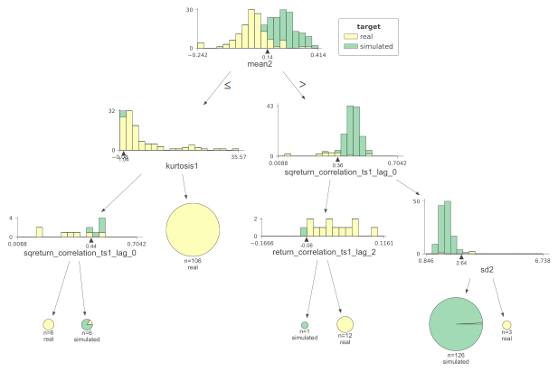
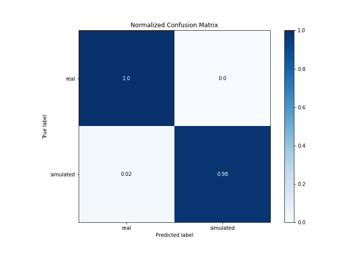
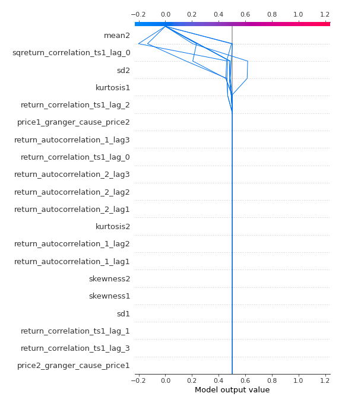

# Summary of 2_DecisionTree

[<< Go back](../README.md)

## Decision Tree
- **n_jobs**: -1
- **criterion**: gini
- **max_depth**: 3
- **explain_level**: 2

## Validation
 - **validation_type**: split
 - **train_ratio**: 0.75
 - **shuffle**: True
 - **stratify**: True

## Optimized metric
accuracy

## Training time

9.3 seconds

## Metric details
|           |    score |   threshold |
|:----------|---------:|------------:|
| logloss   | 0.164742 |  nan        |
| auc       | 0.988636 |  nan        |
| f1        | 0.988506 |    0        |
| accuracy  | 0.988506 |    0        |
| precision | 1        |    0        |
| recall    | 0.977273 |    0        |
| mcc       | 0.977273 |    0.496032 |

## Confusion matrix (at threshold=0.0)
|                      |   Predicted as real |   Predicted as simulated |
|:---------------------|--------------------:|-------------------------:|
| Labeled as real      |                  43 |                        0 |
| Labeled as simulated |                   1 |                       43 |

## Learning curves

## Decision Tree 

### Tree #1

### Rules

if (mean2 > 0.138) and (sqreturn_correlation_ts1_lag_0 > 0.356) and (sd2 <= 2.636) then class: simulated (proba: 99.21%) | based on 126 samples

if (mean2 <= 0.138) and (kurtosis1 > 1.037) then class: real (proba: 100.0%) | based on 106 samples

if (mean2 > 0.138) and (sqreturn_correlation_ts1_lag_0 <= 0.356) and (return_correlation_ts1_lag_2 > -0.064) then class: real (proba: 100.0%) | based on 12 samples

if (mean2 <= 0.138) and (kurtosis1 <= 1.037) and (sqreturn_correlation_ts1_lag_0 > 0.439) then class: simulated (proba: 83.33%) | based on 6 samples

if (mean2 <= 0.138) and (kurtosis1 <= 1.037) and (sqreturn_correlation_ts1_lag_0 <= 0.439) then class: real (proba: 100.0%) | based on 6 samples

if (mean2 > 0.138) and (sqreturn_correlation_ts1_lag_0 > 0.356) and (sd2 > 2.636) then class: real (proba: 100.0%) | based on 3 samples

if (mean2 > 0.138) and (sqreturn_correlation_ts1_lag_0 <= 0.356) and (return_correlation_ts1_lag_2 <= -0.064) then class: simulated (proba: 100.0%) | based on 1 samples

## Permutation-based Importance

## Confusion Matrix

## Normalized Confusion Matrix

## ROC Curve

## Kolmogorov-Smirnov Statistic

## Precision-Recall Curve

## Calibration Curve

## Cumulative Gains Curve

## Lift Curve

## SHAP Importance

## SHAP Dependence plots

### Dependence (Fold 1)

## SHAP Decision plots

### Top-10 Worst decisions for class 0 (Fold 1)

### Top-10 Best decisions for class 0 (Fold 1)

### Top-10 Worst decisions for class 1 (Fold 1)

### Top-10 Best decisions for class 1 (Fold 1)

[<< Go back](../README.md)
