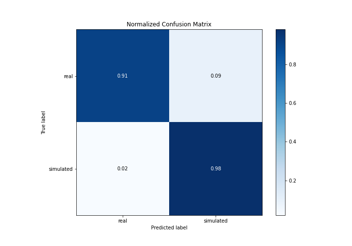

# Summary of 3_Linear

[<< Go back](../README.md)

## Logistic Regression (Linear)
- **n_jobs**: -1
- **explain_level**: 2

## Validation
 - **validation_type**: split
 - **train_ratio**: 0.75
 - **shuffle**: True
 - **stratify**: True

## Optimized metric
accuracy

## Training time

3.3 seconds

## Metric details
|           |    score |     threshold |
|:----------|---------:|--------------:|
| logloss   | 0.223479 | nan           |
| auc       | 0.989429 | nan           |
| f1        | 0.945055 |   0.582501    |
| accuracy  | 0.942529 |   0.582501    |
| precision | 1        |   0.827627    |
| recall    | 1        |   1.80512e-35 |
| mcc       | 0.887067 |   0.582501    |

## Confusion matrix (at threshold=0.582501)
|                      |   Predicted as real |   Predicted as simulated |
|:---------------------|--------------------:|-------------------------:|
| Labeled as real      |                  39 |                        4 |
| Labeled as simulated |                   1 |                       43 |

## Learning curves

## Coefficients
| feature                           |   Learner_1 |
|:----------------------------------|------------:|
| mean2                             |   3.1517    |
| return_correlation_ts1_lag_0      |   1.1733    |
| sqreturn_correlation_ts1_lag_0    |   1.1733    |
| sqreturn_autocorrelation_ts2_lag3 |   0.67938   |
| sqreturn_autocorrelation_ts1_lag3 |   0.674191  |
| sqreturn_correlation_ts2_lag_1    |   0.501986  |
| return_correlation_ts2_lag_1      |   0.501986  |
| return_autocorrelation_2_lag1     |   0.495362  |
| sqreturn_autocorrelation_ts1_lag1 |   0.453796  |
| sqreturn_correlation_ts2_lag_3    |   0.413766  |
| return_correlation_ts2_lag_3      |   0.413766  |
| sqreturn_correlation_ts1_lag_1    |   0.407751  |
| return_correlation_ts1_lag_1      |   0.407751  |
| sqreturn_autocorrelation_ts2_lag2 |   0.380142  |
| sqreturn_autocorrelation_ts1_lag2 |   0.368966  |
| mean1                             |   0.257048  |
| return_autocorrelation_1_lag1     |   0.248742  |
| return_autocorrelation_2_lag3     |   0.23121   |
| return_autocorrelation_1_lag2     |   0.197587  |
| return_autocorrelation_1_lag3     |   0.184219  |
| price1_granger_cause_price2       |   0.184042  |
| sqreturn_autocorrelation_ts2_lag1 |   0.166808  |
| sqreturn_correlation_ts1_lag_3    |   0.155588  |
| return_correlation_ts1_lag_3      |   0.155588  |
| return_correlation_ts1_lag_2      |   0.0697943 |
| sqreturn_correlation_ts1_lag_2    |   0.0697943 |
| skewness2                         |   0.0557664 |
| sd1                               |   0.0370325 |
| return_autocorrelation_2_lag2     |  -0.0357572 |
| return_correlation_ts2_lag_2      |  -0.161253  |
| sqreturn_correlation_ts2_lag_2    |  -0.161253  |
| sd2                               |  -0.19575   |
| skewness1                         |  -0.267751  |
| price2_granger_cause_price1       |  -1.01024   |
| kurtosis1                         |  -2.81752   |
| intercept                         |  -3.18172   |
| kurtosis2                         |  -3.7074    |

## Permutation-based Importance

## Confusion Matrix

## Normalized Confusion Matrix

## ROC Curve

## Kolmogorov-Smirnov Statistic

## Precision-Recall Curve

## Calibration Curve

## Cumulative Gains Curve

## Lift Curve

## SHAP Importance

## SHAP Dependence plots

### Dependence (Fold 1)

## SHAP Decision plots

### Top-10 Worst decisions for class 0 (Fold 1)

### Top-10 Best decisions for class 0 (Fold 1)

### Top-10 Worst decisions for class 1 (Fold 1)

### Top-10 Best decisions for class 1 (Fold 1)

[<< Go back](../README.md)
