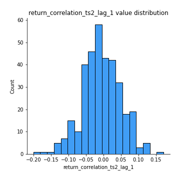
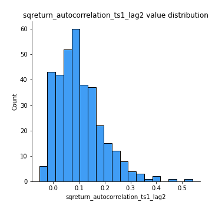

# Exploratory Data Analysis

[<< Go back](../README.md)
## Feature : target
- **Feature type** : categorical
- **Missing** : 0.0%
- **Unique** : 2
- **Count** :347
- **Unique** :2
- **Top** :simulated
- **Freq** :175

## Feature : mean1
- **Feature type** : continous
- **Missing** : 0.0%
- **Unique** : 347
- **Count** :347.0
- **Mean** :0.056350046133385345
- **Std** :0.07360740376940926
- **Min** :-0.22632637961920957
- **25%th Percentile** : 0.008624893050842011
- **50%th Percentile** : 0.055382501050406145
- **75%th Percentile** : 0.09409841746565403
- **Max** :0.37175100008111034

## Feature : mean2
- **Feature type** : continous
- **Missing** : 0.0%
- **Unique** : 347
- **Count** :347.0
- **Mean** :0.14745403995553494
- **Std** :0.11974205470067004
- **Min** :-0.24205418062825398
- **25%th Percentile** : 0.06118066932002115
- **50%th Percentile** : 0.15587926816292139
- **75%th Percentile** : 0.23872028424504937
- **Max** :0.4139741336271557

## Feature : sd1
- **Feature type** : continous
- **Missing** : 0.0%
- **Unique** : 347
- **Count** :347.0
- **Mean** :1.8946982015591547
- **Std** :0.7766811549885749
- **Min** :0.7470080772831957
- **25%th Percentile** : 1.4916525673268506
- **50%th Percentile** : 1.787600992219761
- **75%th Percentile** : 2.1425938407679013
- **Max** :9.236766377527575

## Feature : sd2
- **Feature type** : continous
- **Missing** : 0.0%
- **Unique** : 347
- **Count** :347.0
- **Mean** :1.9065959243896602
- **Std** :0.7642046059958008
- **Min** :0.8455946193085045
- **25%th Percentile** : 1.509604119247173
- **50%th Percentile** : 1.767787434568263
- **75%th Percentile** : 2.0521340237560795
- **Max** :6.737618636746393

## Feature : skewness1
- **Feature type** : continous
- **Missing** : 0.0%
- **Unique** : 347
- **Count** :347.0
- **Mean** :-0.1406259346726292
- **Std** :0.6193413373495458
- **Min** :-3.530116233761814
- **25%th Percentile** : -0.29227046962749953
- **50%th Percentile** : -0.11798818034258074
- **75%th Percentile** : 0.05948810452941538
- **Max** :2.5845963767725557

## Feature : skewness2
- **Feature type** : continous
- **Missing** : 0.0%
- **Unique** : 347
- **Count** :347.0
- **Mean** :-0.21880088517069735
- **Std** :0.830801736485204
- **Min** :-8.801502855292393
- **25%th Percentile** : -0.3063774121692413
- **50%th Percentile** : -0.1348284785097175
- **75%th Percentile** : 0.054923107245176975
- **Max** :2.242019525651531

## Feature : kurtosis1
- **Feature type** : continous
- **Missing** : 0.0%
- **Unique** : 347
- **Count** :347.0
- **Mean** :3.7694759025664912
- **Std** :5.852839484713385
- **Min** :-0.0809258683938534
- **25%th Percentile** : 0.9729286573070743
- **50%th Percentile** : 1.6662235762615283
- **75%th Percentile** : 3.583058820532593
- **Max** :46.07507808162177

## Feature : kurtosis2
- **Feature type** : continous
- **Missing** : 0.0%
- **Unique** : 347
- **Count** :347.0
- **Mean** :4.5893705431469005
- **Std** :10.449518112926558
- **Min** :0.06775447580064942
- **25%th Percentile** : 0.8406145945364194
- **50%th Percentile** : 1.5237575071696488
- **75%th Percentile** : 4.335825686593465
- **Max** :143.10871011533666

## Feature : return_autocorrelation_1_lag1
- **Feature type** : continous
- **Missing** : 0.0%
- **Unique** : 347
- **Count** :347.0
- **Mean** :-0.0075822921101260515
- **Std** :0.06145769674860274
- **Min** :-0.19339575314049967
- **25%th Percentile** : -0.043659617895889
- **50%th Percentile** : -0.0003986500096667489
- **75%th Percentile** : 0.03501327396844418
- **Max** :0.159190825716867

## Feature : return_autocorrelation_1_lag2
- **Feature type** : continous
- **Missing** : 0.0%
- **Unique** : 347
- **Count** :347.0
- **Mean** :-0.006298999522799742
- **Std** :0.05385583610152243
- **Min** :-0.15664373358660733
- **25%th Percentile** : -0.03758480969436911
- **50%th Percentile** : -0.006619091921571229
- **75%th Percentile** : 0.028324738073919317
- **Max** :0.1561488228015672

## Feature : return_autocorrelation_1_lag3
- **Feature type** : continous
- **Missing** : 0.0%
- **Unique** : 347
- **Count** :347.0
- **Mean** :-0.004653286366100004
- **Std** :0.05262204940725512
- **Min** :-0.1940836867390813
- **25%th Percentile** : -0.04095307216633879
- **50%th Percentile** : -0.0037834462111670545
- **75%th Percentile** : 0.030165885536898418
- **Max** :0.17805869530681923

## Feature : return_autocorrelation_2_lag1
- **Feature type** : continous
- **Missing** : 0.0%
- **Unique** : 347
- **Count** :347.0
- **Mean** :-0.013882457788105727
- **Std** :0.060634257456634075
- **Min** :-0.25075531010123286
- **25%th Percentile** : -0.050941881845549805
- **50%th Percentile** : -0.01140731730854918
- **75%th Percentile** : 0.024572293304104598
- **Max** :0.31863413537898483

## Feature : return_autocorrelation_2_lag2
- **Feature type** : continous
- **Missing** : 0.0%
- **Unique** : 347
- **Count** :347.0
- **Mean** :-0.008379257690759532
- **Std** :0.054894101811600156
- **Min** :-0.15323211089747296
- **25%th Percentile** : -0.04356463837730113
- **50%th Percentile** : -0.012387126304682748
- **75%th Percentile** : 0.027304912759534075
- **Max** :0.20974504043791217

## Feature : return_autocorrelation_2_lag3
- **Feature type** : continous
- **Missing** : 0.0%
- **Unique** : 347
- **Count** :347.0
- **Mean** :-0.00878040210446973
- **Std** :0.051398034753385
- **Min** :-0.14893378858267048
- **25%th Percentile** : -0.04188434108371333
- **50%th Percentile** : -0.008684760770370175
- **75%th Percentile** : 0.02384994044863739
- **Max** :0.1419999376914021

## Feature : return_correlation_ts1_lag_0
- **Feature type** : continous
- **Missing** : 0.0%
- **Unique** : 347
- **Count** :347.0
- **Mean** :0.38154882104607163
- **Std** :0.12831736438459845
- **Min** :-0.027089510445801036
- **25%th Percentile** : 0.3061327584824916
- **50%th Percentile** : 0.4226264218220513
- **75%th Percentile** : 0.4634838027806568
- **Max** :0.7041861626832071

## Feature : return_correlation_ts1_lag_1
- **Feature type** : continous
- **Missing** : 0.0%
- **Unique** : 347
- **Count** :347.0
- **Mean** :-0.004560904302754255
- **Std** :0.055276059289283
- **Min** :-0.15776193292681923
- **25%th Percentile** : -0.04037489451646563
- **50%th Percentile** : -0.004354939351143206
- **75%th Percentile** : 0.031979377526826704
- **Max** :0.15499424718508623

## Feature : return_correlation_ts1_lag_2
- **Feature type** : continous
- **Missing** : 0.0%
- **Unique** : 347
- **Count** :347.0
- **Mean** :-0.002401213882269445
- **Std** :0.0507902790997434
- **Min** :-0.16663957333635804
- **25%th Percentile** : -0.04004643763927927
- **50%th Percentile** : -0.0014534736287393124
- **75%th Percentile** : 0.033048933851586984
- **Max** :0.11606454035323184

## Feature : return_correlation_ts1_lag_3
- **Feature type** : continous
- **Missing** : 0.0%
- **Unique** : 347
- **Count** :347.0
- **Mean** :-0.0025675448795546576
- **Std** :0.05277906778182905
- **Min** :-0.14567484542134987
- **25%th Percentile** : -0.037824524953153915
- **50%th Percentile** : -0.003775022021749299
- **75%th Percentile** : 0.03177594577971367
- **Max** :0.1636773216468148

## Feature : return_correlation_ts2_lag_1
- **Feature type** : continous
- **Missing** : 0.0%
- **Unique** : 347
- **Count** :347.0
- **Mean** :-0.005701489904798485
- **Std** :0.05506144129556893
- **Min** :-0.20093919236581337
- **25%th Percentile** : -0.04069787703593718
- **50%th Percentile** : -0.007029328054122237
- **75%th Percentile** : 0.03062946002490455
- **Max** :0.17208763791364762

## Feature : return_correlation_ts2_lag_2
- **Feature type** : continous
- **Missing** : 0.0%
- **Unique** : 347
- **Count** :347.0
- **Mean** :-0.00440226008110952
- **Std** :0.05392673130169493
- **Min** :-0.23751835475804678
- **25%th Percentile** : -0.04211556966530586
- **50%th Percentile** : -0.006220758873367837
- **75%th Percentile** : 0.028288335009897254
- **Max** :0.20772887392904255

## Feature : return_correlation_ts2_lag_3
- **Feature type** : continous
- **Missing** : 0.0%
- **Unique** : 347
- **Count** :347.0
- **Mean** :-0.0047101282389571
- **Std** :0.05548625714495958
- **Min** :-0.17564076057312866
- **25%th Percentile** : -0.039080234198592315
- **50%th Percentile** : -0.004750981486485089
- **75%th Percentile** : 0.03393817548390328
- **Max** :0.15465520999667556

## Feature : sqreturn_autocorrelation_ts1_lag1
- **Feature type** : continous
- **Missing** : 0.0%
- **Unique** : 347
- **Count** :347.0
- **Mean** :0.11040254761017695
- **Std** :0.08760639052809728
- **Min** :-0.052978649713557625
- **25%th Percentile** : 0.04638698827239381
- **50%th Percentile** : 0.09636842956753039
- **75%th Percentile** : 0.1572778433858437
- **Max** :0.49414293176447355

## Feature : sqreturn_autocorrelation_ts1_lag2
- **Feature type** : continous
- **Missing** : 0.0%
- **Unique** : 347
- **Count** :347.0
- **Mean** :0.10247835877283833
- **Std** :0.08951297952956011
- **Min** :-0.05419304650062953
- **25%th Percentile** : 0.037700776692598276
- **50%th Percentile** : 0.09062670440662428
- **75%th Percentile** : 0.14894996880935527
- **Max** :0.540735851444759

## Feature : sqreturn_autocorrelation_ts1_lag3
- **Feature type** : continous
- **Missing** : 0.0%
- **Unique** : 347
- **Count** :347.0
- **Mean** :0.09643807855808223
- **Std** :0.08294862872915047
- **Min** :-0.06636365461566658
- **25%th Percentile** : 0.0328817767127218
- **50%th Percentile** : 0.08848593397496383
- **75%th Percentile** : 0.14844351727496619
- **Max** :0.4276426462717915

## Feature : sqreturn_autocorrelation_ts2_lag1
- **Feature type** : continous
- **Missing** : 0.0%
- **Unique** : 347
- **Count** :347.0
- **Mean** :0.10328204767927542
- **Std** :0.08096395288731682
- **Min** :-0.08520586663750691
- **25%th Percentile** : 0.04428802425119917
- **50%th Percentile** : 0.09133155357504552
- **75%th Percentile** : 0.15191247494147603
- **Max** :0.510085647437958

## Feature : sqreturn_autocorrelation_ts2_lag2
- **Feature type** : continous
- **Missing** : 0.0%
- **Unique** : 347
- **Count** :347.0
- **Mean** :0.09456415965369988
- **Std** :0.08350757109876868
- **Min** :-0.051523884196217395
- **25%th Percentile** : 0.032278353154825606
- **50%th Percentile** : 0.08265184039569824
- **75%th Percentile** : 0.13783869515271513
- **Max** :0.45676817892778204

## Feature : sqreturn_autocorrelation_ts2_lag3
- **Feature type** : continous
- **Missing** : 0.0%
- **Unique** : 347
- **Count** :347.0
- **Mean** :0.08094400221151056
- **Std** :0.07254657081560247
- **Min** :-0.06082766359524085
- **25%th Percentile** : 0.023179428758324138
- **50%th Percentile** : 0.07499659497512734
- **75%th Percentile** : 0.12236427878399651
- **Max** :0.31225727797735664

## Feature : sqreturn_correlation_ts1_lag_0
- **Feature type** : continous
- **Missing** : 0.0%
- **Unique** : 347
- **Count** :347.0
- **Mean** :0.38154882104607163
- **Std** :0.12831736438459845
- **Min** :-0.027089510445801036
- **25%th Percentile** : 0.3061327584824916
- **50%th Percentile** : 0.4226264218220513
- **75%th Percentile** : 0.4634838027806568
- **Max** :0.7041861626832071

## Feature : sqreturn_correlation_ts1_lag_1
- **Feature type** : continous
- **Missing** : 0.0%
- **Unique** : 347
- **Count** :347.0
- **Mean** :-0.004560904302754255
- **Std** :0.055276059289283
- **Min** :-0.15776193292681923
- **25%th Percentile** : -0.04037489451646563
- **50%th Percentile** : -0.004354939351143206
- **75%th Percentile** : 0.031979377526826704
- **Max** :0.15499424718508623

## Feature : sqreturn_correlation_ts1_lag_2
- **Feature type** : continous
- **Missing** : 0.0%
- **Unique** : 347
- **Count** :347.0
- **Mean** :-0.002401213882269445
- **Std** :0.0507902790997434
- **Min** :-0.16663957333635804
- **25%th Percentile** : -0.04004643763927927
- **50%th Percentile** : -0.0014534736287393124
- **75%th Percentile** : 0.033048933851586984
- **Max** :0.11606454035323184

## Feature : sqreturn_correlation_ts1_lag_3
- **Feature type** : continous
- **Missing** : 0.0%
- **Unique** : 347
- **Count** :347.0
- **Mean** :-0.0025675448795546576
- **Std** :0.05277906778182905
- **Min** :-0.14567484542134987
- **25%th Percentile** : -0.037824524953153915
- **50%th Percentile** : -0.003775022021749299
- **75%th Percentile** : 0.03177594577971367
- **Max** :0.1636773216468148

## Feature : sqreturn_correlation_ts2_lag_1
- **Feature type** : continous
- **Missing** : 0.0%
- **Unique** : 347
- **Count** :347.0
- **Mean** :-0.005701489904798485
- **Std** :0.05506144129556893
- **Min** :-0.20093919236581337
- **25%th Percentile** : -0.04069787703593718
- **50%th Percentile** : -0.007029328054122237
- **75%th Percentile** : 0.03062946002490455
- **Max** :0.17208763791364762

## Feature : sqreturn_correlation_ts2_lag_2
- **Feature type** : continous
- **Missing** : 0.0%
- **Unique** : 347
- **Count** :347.0
- **Mean** :-0.00440226008110952
- **Std** :0.05392673130169493
- **Min** :-0.23751835475804678
- **25%th Percentile** : -0.04211556966530586
- **50%th Percentile** : -0.006220758873367837
- **75%th Percentile** : 0.028288335009897254
- **Max** :0.20772887392904255

## Feature : sqreturn_correlation_ts2_lag_3
- **Feature type** : continous
- **Missing** : 0.0%
- **Unique** : 347
- **Count** :347.0
- **Mean** :-0.0047101282389571
- **Std** :0.05548625714495958
- **Min** :-0.17564076057312866
- **25%th Percentile** : -0.039080234198592315
- **50%th Percentile** : -0.004750981486485089
- **75%th Percentile** : 0.03393817548390328
- **Max** :0.15465520999667556

## Feature : price2_granger_cause_price1
- **Feature type** : continous
- **Missing** : 0.0%
- **Unique** : 347
- **Count** :347.0
- **Mean** :0.3075314290111103
- **Std** :0.3045208961038584
- **Min** :4.928159234442167e-08
- **25%th Percentile** : 0.027011165207181255
- **50%th Percentile** : 0.21304524344450712
- **75%th Percentile** : 0.5290127152001143
- **Max** :0.9960199694844057

## Feature : price1_granger_cause_price2
- **Feature type** : continous
- **Missing** : 0.0%
- **Unique** : 347
- **Count** :347.0
- **Mean** :0.3159768010729507
- **Std** :0.28121029810941744
- **Min** :2.4478941778665617e-08
- **25%th Percentile** : 0.05754005093239317
- **50%th Percentile** : 0.25865993604004966
- **75%th Percentile** : 0.5360665571356467
- **Max** :0.9951398266867577

[<< Go back](../README.md)
