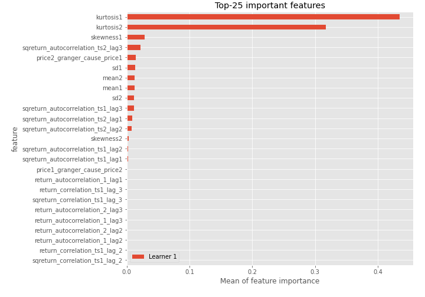
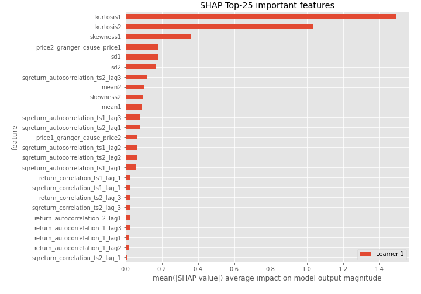

# Summary of 3_Linear

[<< Go back](../README.md)

## Logistic Regression (Linear)
- **n_jobs**: -1
- **explain_level**: 2

## Validation
 - **validation_type**: split
 - **train_ratio**: 0.75
 - **shuffle**: True
 - **stratify**: True

## Optimized metric
accuracy

## Training time

7.0 seconds

## Metric details
|           |    score |     threshold |
|:----------|---------:|--------------:|
| logloss   | 0.256561 | nan           |
| auc       | 0.985714 | nan           |
| f1        | 0.967742 |   0.503429    |
| accuracy  | 0.965517 |   0.503429    |
| precision | 1        |   0.796855    |
| recall    | 1        |   9.55939e-07 |
| mcc       | 0.933025 |   0.503429    |

## Confusion matrix (at threshold=0.503429)
|                      |   Predicted as real |   Predicted as simulated |
|:---------------------|--------------------:|-------------------------:|
| Labeled as real      |                  39 |                        3 |
| Labeled as simulated |                   0 |                       45 |

## Learning curves

## Coefficients
| feature                           |   Learner_1 |
|:----------------------------------|------------:|
| mean2                             |   1.72218   |
| mean1                             |   1.6209    |
| sqreturn_autocorrelation_ts2_lag3 |   1.5992    |
| sqreturn_autocorrelation_ts1_lag3 |   1.15642   |
| sqreturn_autocorrelation_ts2_lag1 |   1.09729   |
| sqreturn_autocorrelation_ts2_lag2 |   0.913717  |
| sqreturn_autocorrelation_ts1_lag2 |   0.850005  |
| sqreturn_autocorrelation_ts1_lag1 |   0.767159  |
| sqreturn_correlation_ts1_lag_1    |   0.699444  |
| return_correlation_ts1_lag_1      |   0.699444  |
| sqreturn_correlation_ts2_lag_3    |   0.665364  |
| return_correlation_ts2_lag_3      |   0.665364  |
| return_autocorrelation_1_lag3     |   0.571284  |
| return_autocorrelation_2_lag1     |   0.570421  |
| return_autocorrelation_1_lag2     |   0.42221   |
| return_autocorrelation_1_lag1     |   0.327913  |
| return_autocorrelation_2_lag2     |   0.296832  |
| sqreturn_correlation_ts2_lag_1    |   0.258554  |
| return_correlation_ts2_lag_1      |   0.258554  |
| sd1                               |   0.232668  |
| return_correlation_ts1_lag_3      |   0.197243  |
| sqreturn_correlation_ts1_lag_3    |   0.197243  |
| return_autocorrelation_2_lag3     |   0.130074  |
| return_correlation_ts1_lag_2      |   0.0965154 |
| sqreturn_correlation_ts1_lag_2    |   0.0965154 |
| return_correlation_ts2_lag_2      |   0.0610164 |
| sqreturn_correlation_ts2_lag_2    |   0.0610164 |
| sqreturn_correlation_ts1_lag_0    |  -0.106547  |
| return_correlation_ts1_lag_0      |  -0.106547  |
| sd2                               |  -0.211265  |
| price1_granger_cause_price2       |  -0.302415  |
| skewness2                         |  -0.314649  |
| price2_granger_cause_price1       |  -0.737542  |
| skewness1                         |  -0.968348  |
| intercept                         |  -1.78653   |
| kurtosis2                         |  -2.20112   |
| kurtosis1                         |  -2.91974   |

## Permutation-based Importance

## Confusion Matrix

## Normalized Confusion Matrix

## ROC Curve

## Kolmogorov-Smirnov Statistic

## Precision-Recall Curve

## Calibration Curve

## Cumulative Gains Curve

## Lift Curve

## SHAP Importance

## SHAP Dependence plots

### Dependence (Fold 1)

## SHAP Decision plots

### Top-10 Worst decisions for class 0 (Fold 1)

### Top-10 Best decisions for class 0 (Fold 1)

### Top-10 Worst decisions for class 1 (Fold 1)

### Top-10 Best decisions for class 1 (Fold 1)

[<< Go back](../README.md)
