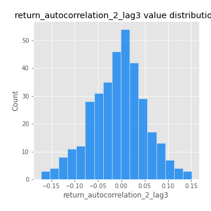

# Exploratory Data Analysis

[<< Go back](../README.md)
## Feature : target
- **Feature type** : categorical
- **Missing** : 0.0%
- **Unique** : 2
- **Count** :347
- **Unique** :2
- **Top** :simulated
- **Freq** :181

## Feature : mean1
- **Feature type** : continous
- **Missing** : 0.0%
- **Unique** : 347
- **Count** :347.0
- **Mean** :0.07724646861025466
- **Std** :0.07984534806139272
- **Min** :-0.22632637961920957
- **25%th Percentile** : 0.034358372071285365
- **50%th Percentile** : 0.06985648739966095
- **75%th Percentile** : 0.1171945365878463
- **Max** :0.37175100008111034

## Feature : mean2
- **Feature type** : continous
- **Missing** : 0.0%
- **Unique** : 347
- **Count** :347.0
- **Mean** :0.0896477499335229
- **Std** :0.08660170140516193
- **Min** :-0.24205418062825398
- **25%th Percentile** : 0.0413398866526699
- **50%th Percentile** : 0.08621113735322024
- **75%th Percentile** : 0.14635973221193752
- **Max** :0.37616608147096464

## Feature : sd1
- **Feature type** : continous
- **Missing** : 0.0%
- **Unique** : 347
- **Count** :347.0
- **Mean** :2.0572017035310046
- **Std** :0.8344532817050485
- **Min** :0.7470080772831957
- **25%th Percentile** : 1.5623018404609963
- **50%th Percentile** : 1.9550389200549305
- **75%th Percentile** : 2.368740932418717
- **Max** :9.236766377527575

## Feature : sd2
- **Feature type** : continous
- **Missing** : 0.0%
- **Unique** : 347
- **Count** :347.0
- **Mean** :1.9674403842897756
- **Std** :0.7794676782855102
- **Min** :0.8455946193085045
- **25%th Percentile** : 1.455895167513083
- **50%th Percentile** : 1.821900838629216
- **75%th Percentile** : 2.254859160270104
- **Max** :6.737618636746393

## Feature : skewness1
- **Feature type** : continous
- **Missing** : 0.0%
- **Unique** : 347
- **Count** :347.0
- **Mean** :-0.16693157519747706
- **Std** :0.6137529660243066
- **Min** :-3.453087436558107
- **25%th Percentile** : -0.3208588781909392
- **50%th Percentile** : -0.1331586134048802
- **75%th Percentile** : 0.0348215551290137
- **Max** :2.5845963767725557

## Feature : skewness2
- **Feature type** : continous
- **Missing** : 0.0%
- **Unique** : 347
- **Count** :347.0
- **Mean** :-0.21705350334428697
- **Std** :0.582637468856557
- **Min** :-3.4392142944489743
- **25%th Percentile** : -0.3781603335155558
- **50%th Percentile** : -0.17708290752120492
- **75%th Percentile** : 0.02389093285345505
- **Max** :2.2606839051517187

## Feature : kurtosis1
- **Feature type** : continous
- **Missing** : 0.0%
- **Unique** : 347
- **Count** :347.0
- **Mean** :3.8777720898287154
- **Std** :5.721249238135321
- **Min** :0.03477879299249054
- **25%th Percentile** : 1.1895303925703935
- **50%th Percentile** : 1.9799269187070894
- **75%th Percentile** : 3.9672030656784054
- **Max** :46.07507808162177

## Feature : kurtosis2
- **Feature type** : continous
- **Missing** : 0.0%
- **Unique** : 347
- **Count** :347.0
- **Mean** :4.177788886729251
- **Std** :5.94169764409789
- **Min** :0.017569371958026547
- **25%th Percentile** : 1.2488496618532658
- **50%th Percentile** : 2.118885999480431
- **75%th Percentile** : 4.291456358055212
- **Max** :57.31293005729889

## Feature : return_autocorrelation_1_lag1
- **Feature type** : continous
- **Missing** : 0.0%
- **Unique** : 347
- **Count** :347.0
- **Mean** :-0.013838716749189373
- **Std** :0.06471342271427732
- **Min** :-0.2135576224968752
- **25%th Percentile** : -0.05589785765179719
- **50%th Percentile** : -0.010914393888152778
- **75%th Percentile** : 0.027781319499203285
- **Max** :0.16345790879962047

## Feature : return_autocorrelation_1_lag2
- **Feature type** : continous
- **Missing** : 0.0%
- **Unique** : 347
- **Count** :347.0
- **Mean** :-0.010118423738060184
- **Std** :0.05134337280760339
- **Min** :-0.1341603697186257
- **25%th Percentile** : -0.046939949541861245
- **50%th Percentile** : -0.00838129967950691
- **75%th Percentile** : 0.023008161091937793
- **Max** :0.1561488228015672

## Feature : return_autocorrelation_1_lag3
- **Feature type** : continous
- **Missing** : 0.0%
- **Unique** : 347
- **Count** :347.0
- **Mean** :-0.005508614161164995
- **Std** :0.05594199660983749
- **Min** :-0.1940836867390813
- **25%th Percentile** : -0.04011008735158919
- **50%th Percentile** : -0.005187774305168985
- **75%th Percentile** : 0.027073800618907316
- **Max** :0.17805869530681923

## Feature : return_autocorrelation_2_lag1
- **Feature type** : continous
- **Missing** : 0.0%
- **Unique** : 347
- **Count** :347.0
- **Mean** :-0.019015829498469975
- **Std** :0.062340285059729855
- **Min** :-0.24590087874039124
- **25%th Percentile** : -0.05879018562892961
- **50%th Percentile** : -0.01975857822388491
- **75%th Percentile** : 0.02092405978987978
- **Max** :0.16349871797309318

## Feature : return_autocorrelation_2_lag2
- **Feature type** : continous
- **Missing** : 0.0%
- **Unique** : 347
- **Count** :347.0
- **Mean** :-0.008003053637707102
- **Std** :0.0550711914588795
- **Min** :-0.1495113937562178
- **25%th Percentile** : -0.043116862919251556
- **50%th Percentile** : -0.013183113640094817
- **75%th Percentile** : 0.027937942911073127
- **Max** :0.1735398560230086

## Feature : return_autocorrelation_2_lag3
- **Feature type** : continous
- **Missing** : 0.0%
- **Unique** : 347
- **Count** :347.0
- **Mean** :-0.007386952469230135
- **Std** :0.05784831696858854
- **Min** :-0.17247363878866592
- **25%th Percentile** : -0.043483792318176805
- **50%th Percentile** : -0.0025865203129047626
- **75%th Percentile** : 0.026942509090315134
- **Max** :0.1509857030544509

## Feature : return_correlation_ts1_lag_0
- **Feature type** : continous
- **Missing** : 0.0%
- **Unique** : 347
- **Count** :347.0
- **Mean** :0.33621991640376586
- **Std** :0.11148736835171033
- **Min** :-0.027089510445801036
- **25%th Percentile** : 0.2733570194745196
- **50%th Percentile** : 0.3390072433825586
- **75%th Percentile** : 0.39372443527468476
- **Max** :0.6949986865664105

## Feature : return_correlation_ts1_lag_1
- **Feature type** : continous
- **Missing** : 0.0%
- **Unique** : 347
- **Count** :347.0
- **Mean** :-0.013241378599307015
- **Std** :0.05784600954203852
- **Min** :-0.1762028334206227
- **25%th Percentile** : -0.04588326670306189
- **50%th Percentile** : -0.006700590876969218
- **75%th Percentile** : 0.025706736375609565
- **Max** :0.15499424718508623

## Feature : return_correlation_ts1_lag_2
- **Feature type** : continous
- **Missing** : 0.0%
- **Unique** : 347
- **Count** :347.0
- **Mean** :-0.0060187867366016095
- **Std** :0.05302252481136882
- **Min** :-0.21653581047581763
- **25%th Percentile** : -0.041618443363033955
- **50%th Percentile** : -0.00691159229106382
- **75%th Percentile** : 0.02926867306660355
- **Max** :0.15603176006277336

## Feature : return_correlation_ts1_lag_3
- **Feature type** : continous
- **Missing** : 0.0%
- **Unique** : 347
- **Count** :347.0
- **Mean** :-0.0018483033552434036
- **Std** :0.054169204892446705
- **Min** :-0.15330682854224642
- **25%th Percentile** : -0.03921607810312494
- **50%th Percentile** : -0.004151873133904713
- **75%th Percentile** : 0.033949878353899635
- **Max** :0.1422809271770942

## Feature : return_correlation_ts2_lag_1
- **Feature type** : continous
- **Missing** : 0.0%
- **Unique** : 347
- **Count** :347.0
- **Mean** :-0.01309280770029111
- **Std** :0.05651261487360826
- **Min** :-0.19671969155495325
- **25%th Percentile** : -0.04931423233778426
- **50%th Percentile** : -0.012673332414578733
- **75%th Percentile** : 0.025817132188490258
- **Max** :0.17803548304363348

## Feature : return_correlation_ts2_lag_2
- **Feature type** : continous
- **Missing** : 0.0%
- **Unique** : 347
- **Count** :347.0
- **Mean** :-0.0038459491280028275
- **Std** :0.05791826386963893
- **Min** :-0.23751835475804678
- **25%th Percentile** : -0.04146468328781018
- **50%th Percentile** : -0.006807870727517523
- **75%th Percentile** : 0.027957594828435257
- **Max** :0.20772887392904255

## Feature : return_correlation_ts2_lag_3
- **Feature type** : continous
- **Missing** : 0.0%
- **Unique** : 347
- **Count** :347.0
- **Mean** :-0.0017411490379783874
- **Std** :0.05671466168907772
- **Min** :-0.17564076057312866
- **25%th Percentile** : -0.040577848804378626
- **50%th Percentile** : -0.001744564302787636
- **75%th Percentile** : 0.04098854868794266
- **Max** :0.13250699943049235

## Feature : sqreturn_autocorrelation_ts1_lag1
- **Feature type** : continous
- **Missing** : 0.0%
- **Unique** : 347
- **Count** :347.0
- **Mean** :0.12276792572723617
- **Std** :0.09149039736567346
- **Min** :-0.06790610152640679
- **25%th Percentile** : 0.0614838624230596
- **50%th Percentile** : 0.10535606063098572
- **75%th Percentile** : 0.17726513620470308
- **Max** :0.49414293176447355

## Feature : sqreturn_autocorrelation_ts1_lag2
- **Feature type** : continous
- **Missing** : 0.0%
- **Unique** : 347
- **Count** :347.0
- **Mean** :0.11218600826206146
- **Std** :0.09484966366095827
- **Min** :-0.05165593255897504
- **25%th Percentile** : 0.037589279176572926
- **50%th Percentile** : 0.09705571080156164
- **75%th Percentile** : 0.17580380110569355
- **Max** :0.540735851444759

## Feature : sqreturn_autocorrelation_ts1_lag3
- **Feature type** : continous
- **Missing** : 0.0%
- **Unique** : 347
- **Count** :347.0
- **Mean** :0.10484125029992328
- **Std** :0.08652777306849281
- **Min** :-0.05313973583773816
- **25%th Percentile** : 0.03733253699563924
- **50%th Percentile** : 0.10187101211794718
- **75%th Percentile** : 0.1530184616169128
- **Max** :0.41030914918857014

## Feature : sqreturn_autocorrelation_ts2_lag1
- **Feature type** : continous
- **Missing** : 0.0%
- **Unique** : 347
- **Count** :347.0
- **Mean** :0.12410280713569773
- **Std** :0.08912874076456528
- **Min** :-0.08520586663750691
- **25%th Percentile** : 0.05627580954602765
- **50%th Percentile** : 0.11302292654885325
- **75%th Percentile** : 0.17479907668659242
- **Max** :0.510085647437958

## Feature : sqreturn_autocorrelation_ts2_lag2
- **Feature type** : continous
- **Missing** : 0.0%
- **Unique** : 347
- **Count** :347.0
- **Mean** :0.11360066243061176
- **Std** :0.09260081476875592
- **Min** :-0.051523884196217395
- **25%th Percentile** : 0.040678910724182796
- **50%th Percentile** : 0.10578658286916477
- **75%th Percentile** : 0.16386442528114586
- **Max** :0.45676817892778204

## Feature : sqreturn_autocorrelation_ts2_lag3
- **Feature type** : continous
- **Missing** : 0.0%
- **Unique** : 347
- **Count** :347.0
- **Mean** :0.10324106765169826
- **Std** :0.08700168984681533
- **Min** :-0.06082766359524085
- **25%th Percentile** : 0.02814680460107262
- **50%th Percentile** : 0.1001758655422479
- **75%th Percentile** : 0.16152347081751733
- **Max** :0.3779880766629193

## Feature : sqreturn_correlation_ts1_lag_0
- **Feature type** : continous
- **Missing** : 0.0%
- **Unique** : 347
- **Count** :347.0
- **Mean** :0.33621991640376586
- **Std** :0.11148736835171033
- **Min** :-0.027089510445801036
- **25%th Percentile** : 0.2733570194745196
- **50%th Percentile** : 0.3390072433825586
- **75%th Percentile** : 0.39372443527468476
- **Max** :0.6949986865664105

## Feature : sqreturn_correlation_ts1_lag_1
- **Feature type** : continous
- **Missing** : 0.0%
- **Unique** : 347
- **Count** :347.0
- **Mean** :-0.013241378599307015
- **Std** :0.05784600954203852
- **Min** :-0.1762028334206227
- **25%th Percentile** : -0.04588326670306189
- **50%th Percentile** : -0.006700590876969218
- **75%th Percentile** : 0.025706736375609565
- **Max** :0.15499424718508623

## Feature : sqreturn_correlation_ts1_lag_2
- **Feature type** : continous
- **Missing** : 0.0%
- **Unique** : 347
- **Count** :347.0
- **Mean** :-0.0060187867366016095
- **Std** :0.05302252481136882
- **Min** :-0.21653581047581763
- **25%th Percentile** : -0.041618443363033955
- **50%th Percentile** : -0.00691159229106382
- **75%th Percentile** : 0.02926867306660355
- **Max** :0.15603176006277336

## Feature : sqreturn_correlation_ts1_lag_3
- **Feature type** : continous
- **Missing** : 0.0%
- **Unique** : 347
- **Count** :347.0
- **Mean** :-0.0018483033552434036
- **Std** :0.054169204892446705
- **Min** :-0.15330682854224642
- **25%th Percentile** : -0.03921607810312494
- **50%th Percentile** : -0.004151873133904713
- **75%th Percentile** : 0.033949878353899635
- **Max** :0.1422809271770942

## Feature : sqreturn_correlation_ts2_lag_1
- **Feature type** : continous
- **Missing** : 0.0%
- **Unique** : 347
- **Count** :347.0
- **Mean** :-0.01309280770029111
- **Std** :0.05651261487360826
- **Min** :-0.19671969155495325
- **25%th Percentile** : -0.04931423233778426
- **50%th Percentile** : -0.012673332414578733
- **75%th Percentile** : 0.025817132188490258
- **Max** :0.17803548304363348

## Feature : sqreturn_correlation_ts2_lag_2
- **Feature type** : continous
- **Missing** : 0.0%
- **Unique** : 347
- **Count** :347.0
- **Mean** :-0.0038459491280028275
- **Std** :0.05791826386963893
- **Min** :-0.23751835475804678
- **25%th Percentile** : -0.04146468328781018
- **50%th Percentile** : -0.006807870727517523
- **75%th Percentile** : 0.027957594828435257
- **Max** :0.20772887392904255

## Feature : sqreturn_correlation_ts2_lag_3
- **Feature type** : continous
- **Missing** : 0.0%
- **Unique** : 347
- **Count** :347.0
- **Mean** :-0.0017411490379783874
- **Std** :0.05671466168907772
- **Min** :-0.17564076057312866
- **25%th Percentile** : -0.040577848804378626
- **50%th Percentile** : -0.001744564302787636
- **75%th Percentile** : 0.04098854868794266
- **Max** :0.13250699943049235

## Feature : price2_granger_cause_price1
- **Feature type** : continous
- **Missing** : 0.0%
- **Unique** : 347
- **Count** :347.0
- **Mean** :0.2901188810660457
- **Std** :0.2882950869417383
- **Min** :1.17053588002412e-07
- **25%th Percentile** : 0.03391740715942373
- **50%th Percentile** : 0.19899598869636254
- **75%th Percentile** : 0.48809558966018957
- **Max** :0.9853666024514321

## Feature : price1_granger_cause_price2
- **Feature type** : continous
- **Missing** : 0.0%
- **Unique** : 347
- **Count** :347.0
- **Mean** :0.28935960725145476
- **Std** :0.2806994724955298
- **Min** :2.1419215307592467e-09
- **25%th Percentile** : 0.03995067732286746
- **50%th Percentile** : 0.21544702794312137
- **75%th Percentile** : 0.46298366101026983
- **Max** :0.9999066387365626

[<< Go back](../README.md)
