# Summary of 2_DecisionTree

[<< Go back](../README.md)

## Decision Tree
- **n_jobs**: -1
- **criterion**: gini
- **max_depth**: 3
- **explain_level**: 2

## Validation
 - **validation_type**: split
 - **train_ratio**: 0.75
 - **shuffle**: True
 - **stratify**: True

## Optimized metric
accuracy

## Training time

9.7 seconds

## Metric details
|           |    score |   threshold |
|:----------|---------:|------------:|
| logloss   | 0.614822 |  nan        |
| auc       | 0.840212 |  nan        |
| f1        | 0.853933 |    0.690476 |
| accuracy  | 0.850575 |    0.690476 |
| precision | 0.815789 |    0.799766 |
| recall    | 1        |    0        |
| mcc       | 0.706634 |    0.690476 |

## Confusion matrix (at threshold=0.690476)
|                      |   Predicted as real |   Predicted as simulated |
|:---------------------|--------------------:|-------------------------:|
| Labeled as real      |                  36 |                        9 |
| Labeled as simulated |                   4 |                       38 |

## Learning curves
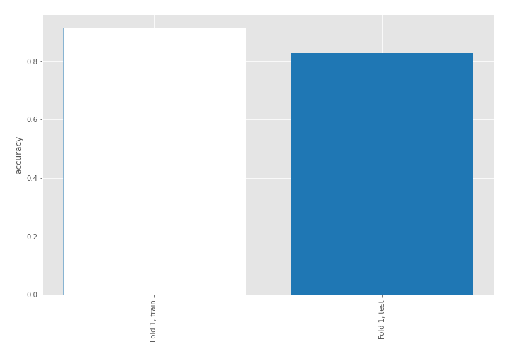

## Decision Tree 

### Tree #1

### Rules

if (kurtosis1 <= 2.794) and (sqreturn_autocorrelation_ts2_lag2 > 0.052) and (sd1 > 1.178) then class: simulated (proba: 88.52%) | based on 122 samples

if (kurtosis1 > 2.794) and (price2_granger_cause_price1 > 0.001) and (price1_granger_cause_price2 > 0.001) then class: real (proba: 97.65%) | based on 85 samples

if (kurtosis1 <= 2.794) and (sqreturn_autocorrelation_ts2_lag2 <= 0.052) and (kurtosis2 > 1.619) then class: real (proba: 96.3%) | based on 27 samples

if (kurtosis1 <= 2.794) and (sqreturn_autocorrelation_ts2_lag2 <= 0.052) and (kurtosis2 <= 1.619) then class: simulated (proba: 71.43%) | based on 14 samples

if (kurtosis1 > 2.794) and (price2_granger_cause_price1 <= 0.001) and (sqreturn_correlation_ts2_lag_2 <= 0.022) then class: simulated (proba: 100.0%) | based on 4 samples

if (kurtosis1 <= 2.794) and (sqreturn_autocorrelation_ts2_lag2 > 0.052) and (sd1 <= 1.178) then class: real (proba: 100.0%) | based on 4 samples

if (kurtosis1 > 2.794) and (price2_granger_cause_price1 > 0.001) and (price1_granger_cause_price2 <= 0.001) then class: simulated (proba: 66.67%) | based on 3 samples

if (kurtosis1 > 2.794) and (price2_granger_cause_price1 <= 0.001) and (sqreturn_correlation_ts2_lag_2 > 0.022) then class: real (proba: 100.0%) | based on 1 samples

## Permutation-based Importance
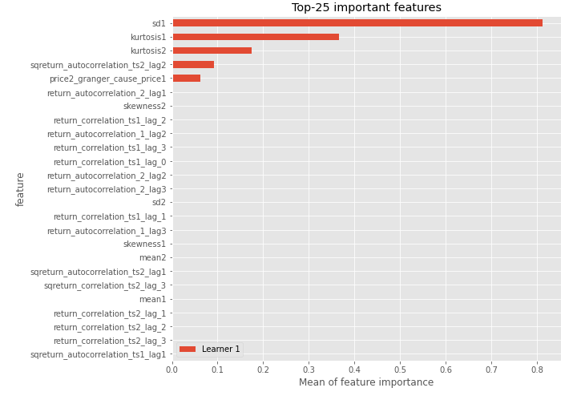
## Confusion Matrix

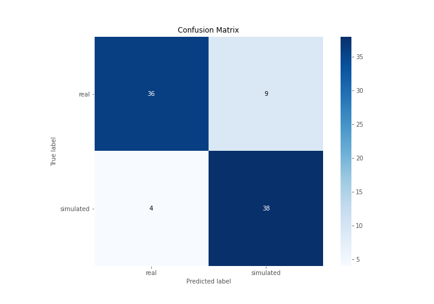

## Normalized Confusion Matrix

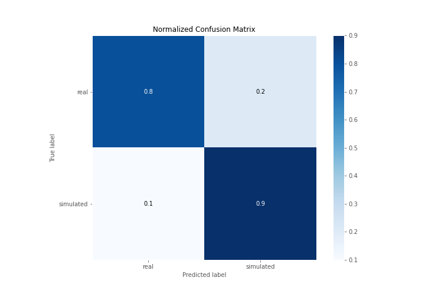

## ROC Curve

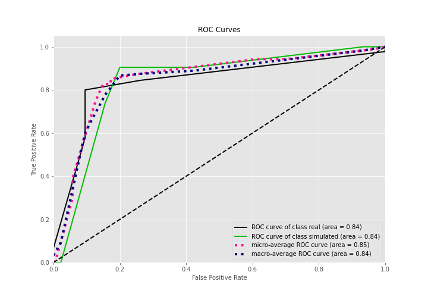

## Kolmogorov-Smirnov Statistic

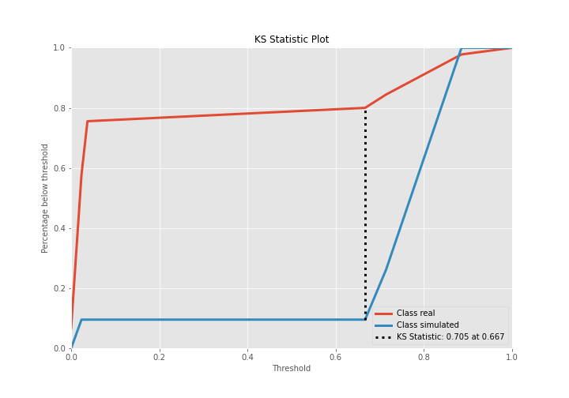

## Precision-Recall Curve

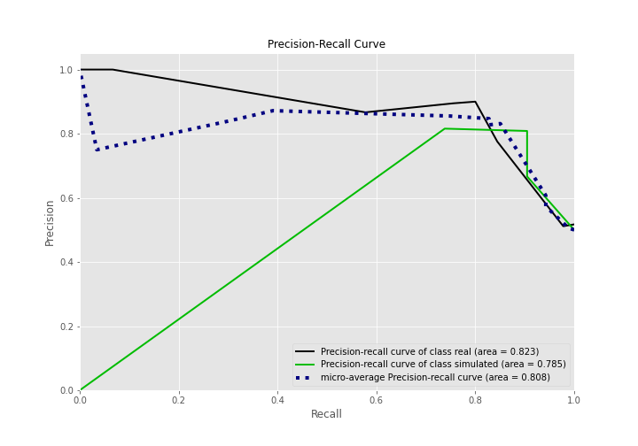

## Calibration Curve

## Cumulative Gains Curve

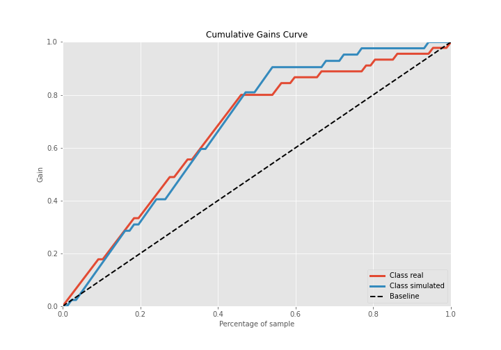

## Lift Curve

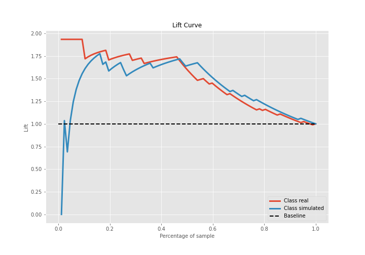

## SHAP Importance
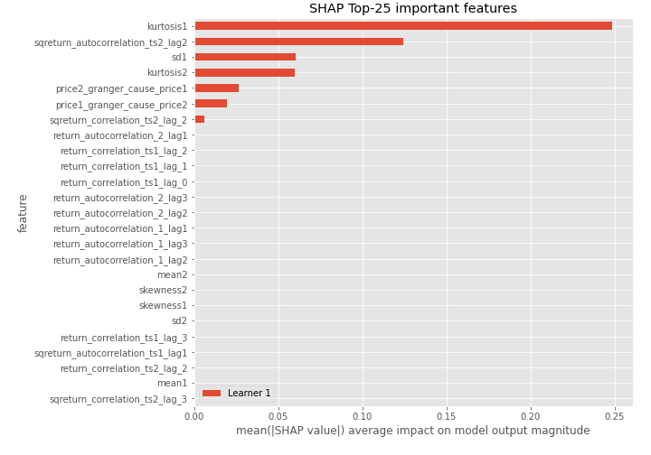

## SHAP Dependence plots

### Dependence (Fold 1)
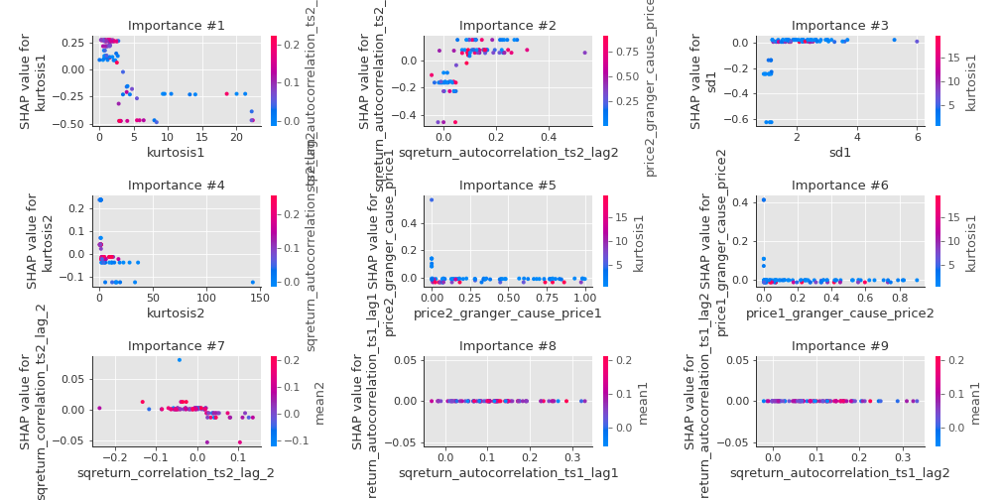

## SHAP Decision plots

### Top-10 Worst decisions for class 0 (Fold 1)
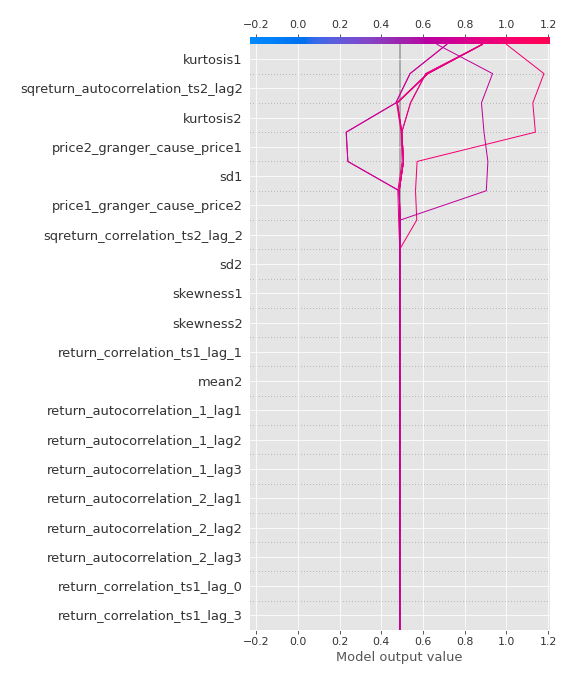
### Top-10 Best decisions for class 0 (Fold 1)

### Top-10 Worst decisions for class 1 (Fold 1)
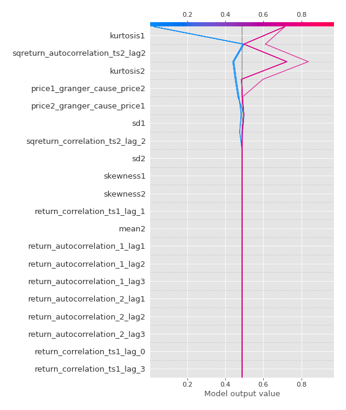
### Top-10 Best decisions for class 1 (Fold 1)

[<< Go back](../README.md)
