# Summary of 3_Linear

[<< Go back](../README.md)

## Logistic Regression (Linear)
- **n_jobs**: -1
- **explain_level**: 2

## Validation
 - **validation_type**: split
 - **train_ratio**: 0.75
 - **shuffle**: True
 - **stratify**: True

## Optimized metric
accuracy

## Training time

8.5 seconds

## Metric details
|           |    score |     threshold |
|:----------|---------:|--------------:|
| logloss   | 0.300462 | nan           |
| auc       | 0.934392 | nan           |
| f1        | 0.898876 |   0.550053    |
| accuracy  | 0.896552 |   0.550053    |
| precision | 1        |   0.896       |
| recall    | 1        |   1.71359e-21 |
| mcc       | 0.798942 |   0.550053    |

## Confusion matrix (at threshold=0.550053)
|                      |   Predicted as real |   Predicted as simulated |
|:---------------------|--------------------:|-------------------------:|
| Labeled as real      |                  38 |                        7 |
| Labeled as simulated |                   2 |                       40 |

## Learning curves
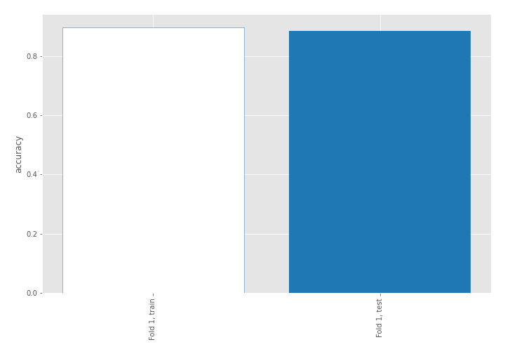

## Coefficients
| feature                           |   Learner_1 |
|:----------------------------------|------------:|
| sqreturn_autocorrelation_ts2_lag3 |   1.9465    |
| mean2                             |   1.57248   |
| sqreturn_autocorrelation_ts1_lag3 |   1.54069   |
| mean1                             |   1.33712   |
| sqreturn_autocorrelation_ts2_lag2 |   1.27814   |
| sqreturn_autocorrelation_ts2_lag1 |   1.04857   |
| sqreturn_autocorrelation_ts1_lag2 |   0.857662  |
| sqreturn_autocorrelation_ts1_lag1 |   0.82003   |
| sd1                               |   0.645103  |
| return_autocorrelation_2_lag1     |   0.620607  |
| return_autocorrelation_1_lag1     |   0.485057  |
| sqreturn_correlation_ts1_lag_1    |   0.475167  |
| return_correlation_ts1_lag_1      |   0.475167  |
| return_correlation_ts2_lag_1      |   0.461426  |
| sqreturn_correlation_ts2_lag_1    |   0.461426  |
| return_autocorrelation_1_lag3     |   0.386032  |
| return_autocorrelation_2_lag3     |   0.29112   |
| return_autocorrelation_2_lag2     |   0.241974  |
| return_correlation_ts2_lag_3      |   0.211775  |
| sqreturn_correlation_ts2_lag_3    |   0.211775  |
| sqreturn_correlation_ts1_lag_3    |   0.176307  |
| return_correlation_ts1_lag_3      |   0.176307  |
| price1_granger_cause_price2       |  -0.0568879 |
| return_autocorrelation_1_lag2     |  -0.107509  |
| return_correlation_ts1_lag_2      |  -0.125741  |
| sqreturn_correlation_ts1_lag_2    |  -0.125741  |
| sd2                               |  -0.210534  |
| price2_granger_cause_price1       |  -0.432025  |
| return_correlation_ts2_lag_2      |  -0.433485  |
| sqreturn_correlation_ts2_lag_2    |  -0.433485  |
| return_correlation_ts1_lag_0      |  -0.46042   |
| sqreturn_correlation_ts1_lag_0    |  -0.46042   |
| skewness2                         |  -0.624984  |
| skewness1                         |  -0.884177  |
| intercept                         |  -1.89148   |
| kurtosis1                         |  -2.47823   |
| kurtosis2                         |  -2.67114   |

## Permutation-based Importance
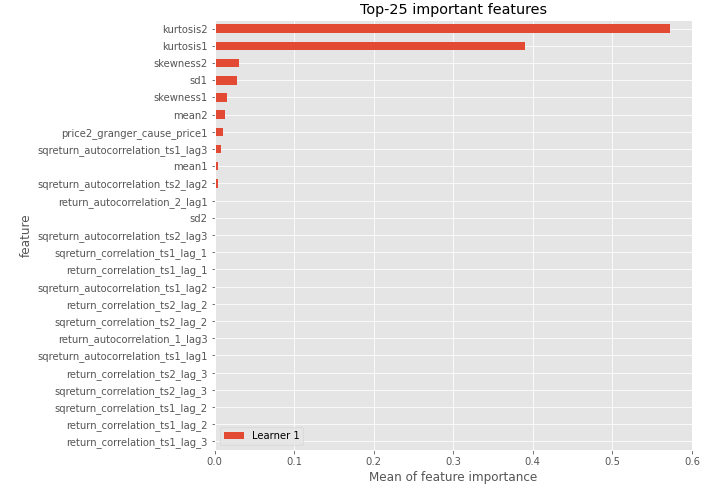
## Confusion Matrix

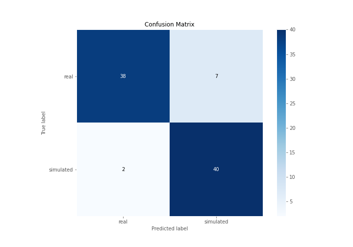

## Normalized Confusion Matrix

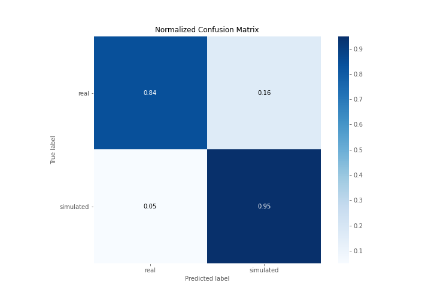

## ROC Curve

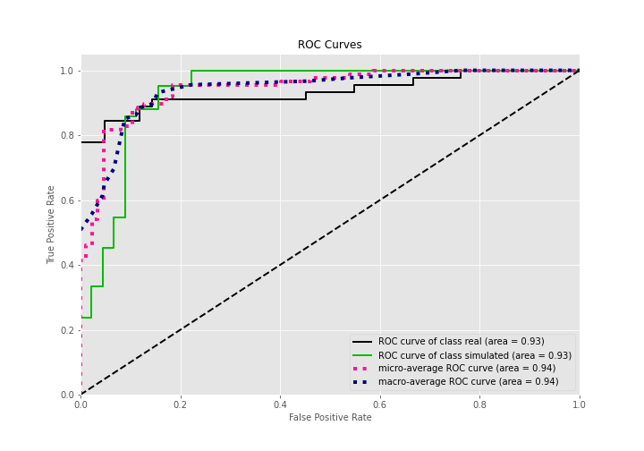

## Kolmogorov-Smirnov Statistic

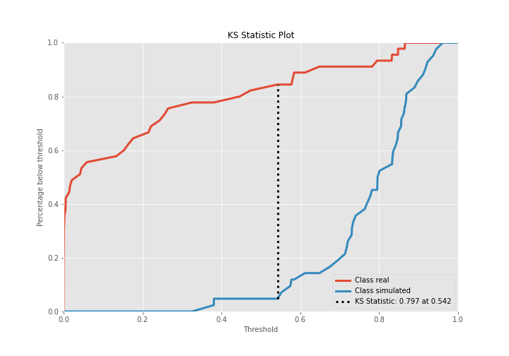

## Precision-Recall Curve

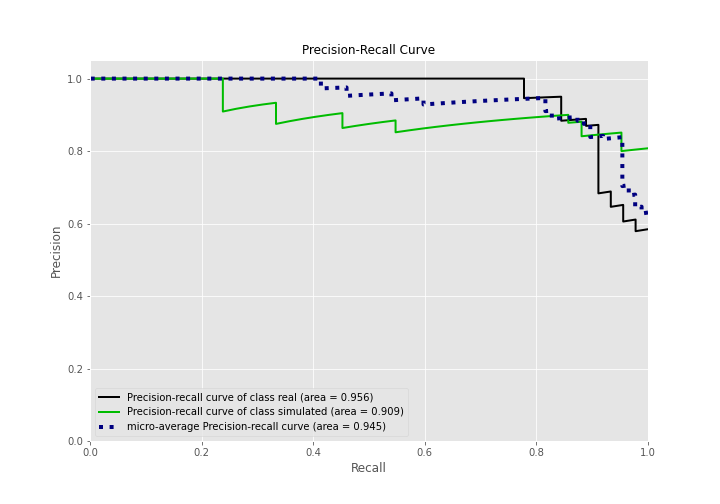

## Calibration Curve

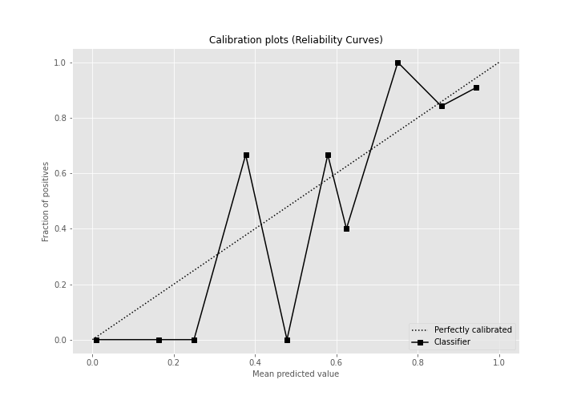

## Cumulative Gains Curve

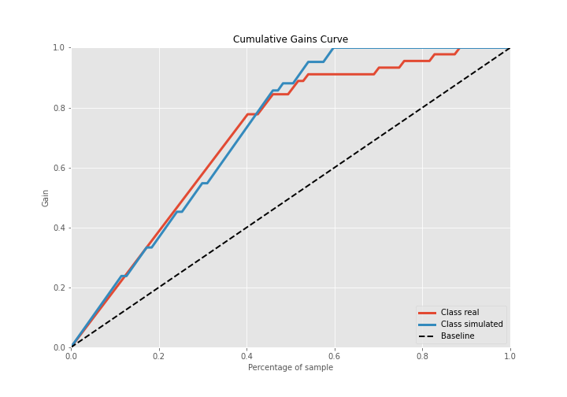

## Lift Curve

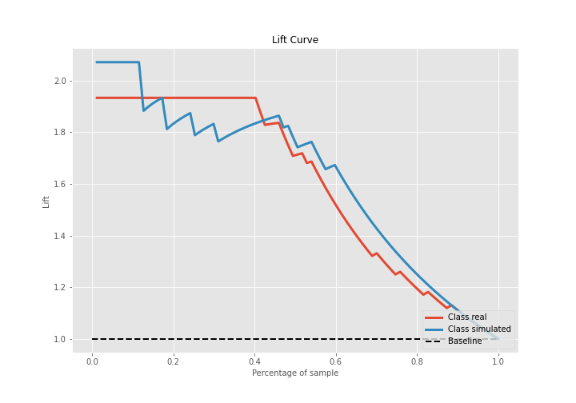

## SHAP Importance
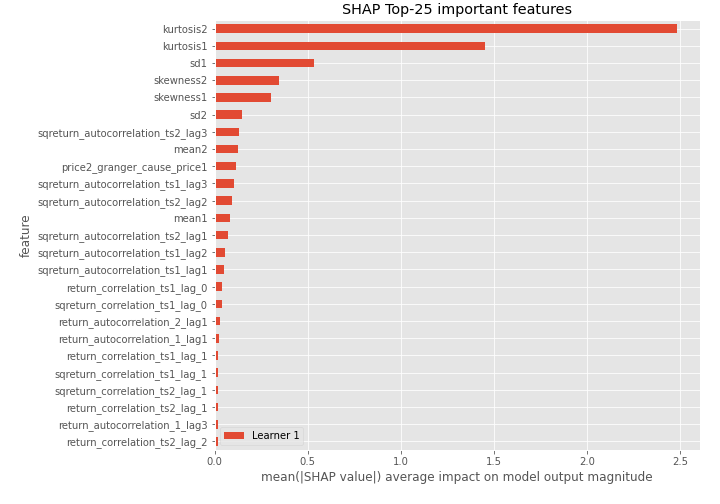

## SHAP Dependence plots

### Dependence (Fold 1)
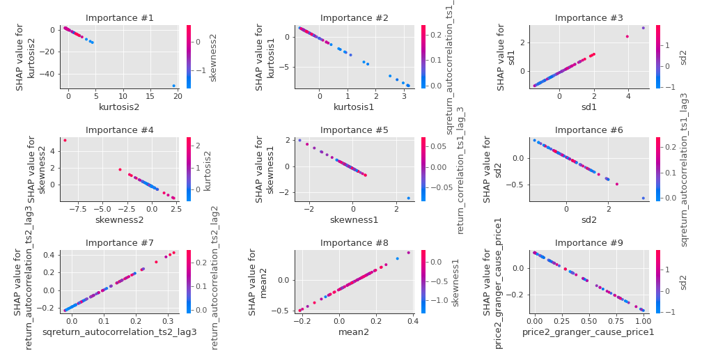

## SHAP Decision plots

### Top-10 Worst decisions for class 0 (Fold 1)
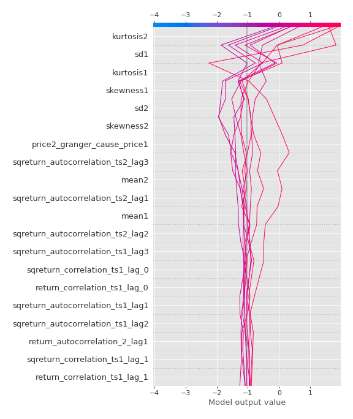
### Top-10 Best decisions for class 0 (Fold 1)
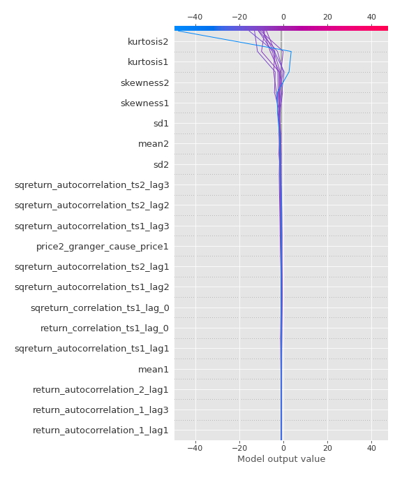
### Top-10 Worst decisions for class 1 (Fold 1)
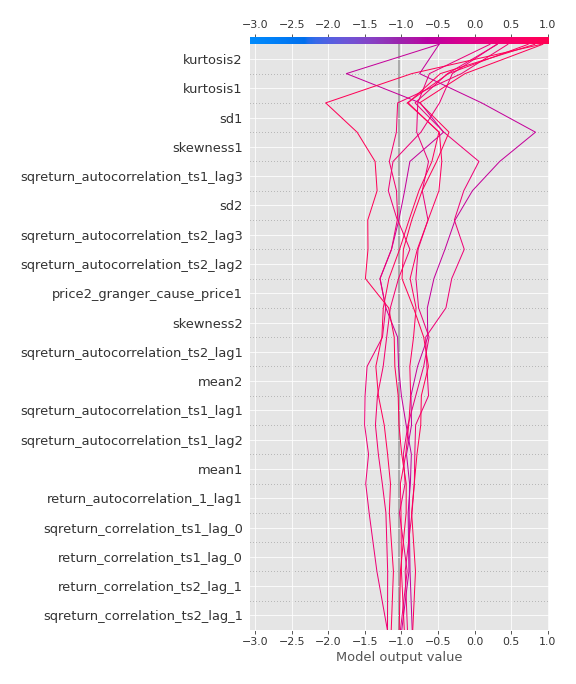
### Top-10 Best decisions for class 1 (Fold 1)
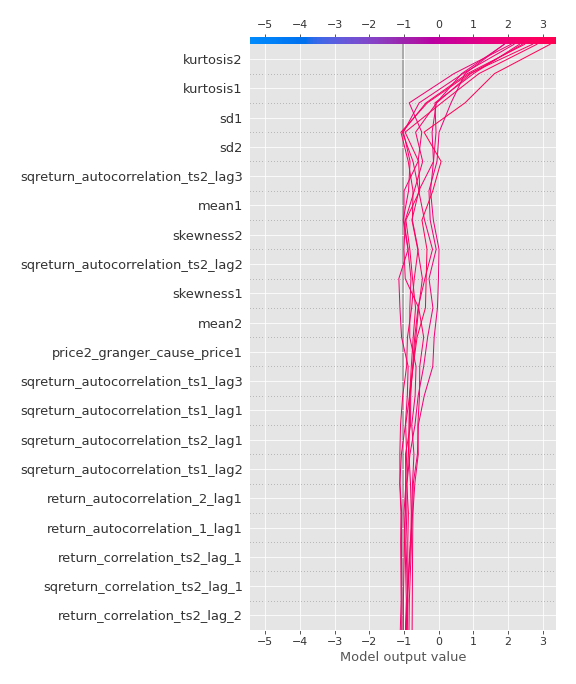

[<< Go back](../README.md)
