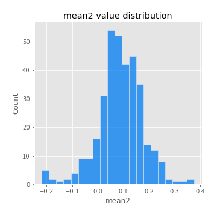
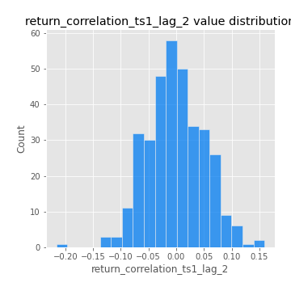

# Exploratory Data Analysis

[<< Go back](../README.md)
## Feature : target
- **Feature type** : categorical
- **Missing** : 0.0%
- **Unique** : 2
- **Count** :347
- **Unique** :2
- **Top** :real
- **Freq** :178

## Feature : mean1
- **Feature type** : continous
- **Missing** : 0.0%
- **Unique** : 347
- **Count** :347.0
- **Mean** :0.0721104644279961
- **Std** :0.08166061923928478
- **Min** :-0.22632637961920957
- **25%th Percentile** : 0.021631866921469636
- **50%th Percentile** : 0.07187812998793731
- **75%th Percentile** : 0.11837143631658609
- **Max** :0.37175100008111034

## Feature : mean2
- **Feature type** : continous
- **Missing** : 0.0%
- **Unique** : 347
- **Count** :347.0
- **Mean** :0.08644635763586159
- **Std** :0.0893380202065692
- **Min** :-0.21818165578778434
- **25%th Percentile** : 0.04165816710797847
- **50%th Percentile** : 0.0859932364683619
- **75%th Percentile** : 0.1422905468420886
- **Max** :0.37616608147096464

## Feature : sd1
- **Feature type** : continous
- **Missing** : 0.0%
- **Unique** : 347
- **Count** :347.0
- **Mean** :2.0412958108733705
- **Std** :0.8306951043073394
- **Min** :0.7620831696941981
- **25%th Percentile** : 1.524468969621088
- **50%th Percentile** : 1.9824977685749046
- **75%th Percentile** : 2.375644626165147
- **Max** :9.236766377527575

## Feature : sd2
- **Feature type** : continous
- **Missing** : 0.0%
- **Unique** : 347
- **Count** :347.0
- **Mean** :1.9203667412840293
- **Std** :0.6788480299330031
- **Min** :0.8455946193085045
- **25%th Percentile** : 1.4606835823592568
- **50%th Percentile** : 1.8156097016986061
- **75%th Percentile** : 2.196036890273683
- **Max** :5.642692356880054

## Feature : skewness1
- **Feature type** : continous
- **Missing** : 0.0%
- **Unique** : 347
- **Count** :347.0
- **Mean** :-0.1740315772829095
- **Std** :0.5917878743579776
- **Min** :-3.453087436558107
- **25%th Percentile** : -0.31724367218303173
- **50%th Percentile** : -0.12667373120517889
- **75%th Percentile** : 0.027048596203001773
- **Max** :2.5845963767725557

## Feature : skewness2
- **Feature type** : continous
- **Missing** : 0.0%
- **Unique** : 347
- **Count** :347.0
- **Mean** :-0.26760129931307586
- **Std** :0.8430204798029058
- **Min** :-8.801502855292393
- **25%th Percentile** : -0.4002449954820499
- **50%th Percentile** : -0.1814215767647316
- **75%th Percentile** : 0.016501568436496014
- **Max** :2.242019525651531

## Feature : kurtosis1
- **Feature type** : continous
- **Missing** : 0.0%
- **Unique** : 347
- **Count** :347.0
- **Mean** :4.024189866018486
- **Std** :5.709839287245299
- **Min** :0.03477879299249054
- **25%th Percentile** : 1.1561592850964089
- **50%th Percentile** : 1.9621195410040753
- **75%th Percentile** : 4.005476609832319
- **Max** :46.07507808162177

## Feature : kurtosis2
- **Feature type** : continous
- **Missing** : 0.0%
- **Unique** : 347
- **Count** :347.0
- **Mean** :5.021779797310278
- **Std** :10.362174534180893
- **Min** :0.1266422363739892
- **25%th Percentile** : 1.232404939519017
- **50%th Percentile** : 2.2065886908617256
- **75%th Percentile** : 4.624994353288867
- **Max** :143.10871011533666

## Feature : return_autocorrelation_1_lag1
- **Feature type** : continous
- **Missing** : 0.0%
- **Unique** : 347
- **Count** :347.0
- **Mean** :-0.019908526917322186
- **Std** :0.060928756714638946
- **Min** :-0.2135576224968752
- **25%th Percentile** : -0.05772742784558612
- **50%th Percentile** : -0.012958181168433036
- **75%th Percentile** : 0.021335712176649417
- **Max** :0.13987869181475385

## Feature : return_autocorrelation_1_lag2
- **Feature type** : continous
- **Missing** : 0.0%
- **Unique** : 347
- **Count** :347.0
- **Mean** :-0.005572667886274414
- **Std** :0.05482380919424571
- **Min** :-0.15764615507368998
- **25%th Percentile** : -0.04376795143935695
- **50%th Percentile** : -0.005991756692773178
- **75%th Percentile** : 0.028324738073919317
- **Max** :0.1431209137402344

## Feature : return_autocorrelation_1_lag3
- **Feature type** : continous
- **Missing** : 0.0%
- **Unique** : 347
- **Count** :347.0
- **Mean** :-0.00529632534461453
- **Std** :0.059043765976172065
- **Min** :-0.1940836867390813
- **25%th Percentile** : -0.04080155959169274
- **50%th Percentile** : -0.005164893751571868
- **75%th Percentile** : 0.034124058233545376
- **Max** :0.16151199952326342

## Feature : return_autocorrelation_2_lag1
- **Feature type** : continous
- **Missing** : 0.0%
- **Unique** : 347
- **Count** :347.0
- **Mean** :-0.01653323846883354
- **Std** :0.061873723801125095
- **Min** :-0.24265814531706406
- **25%th Percentile** : -0.05459609375911892
- **50%th Percentile** : -0.01699780107708081
- **75%th Percentile** : 0.019958738018833203
- **Max** :0.31863413537898483

## Feature : return_autocorrelation_2_lag2
- **Feature type** : continous
- **Missing** : 0.0%
- **Unique** : 347
- **Count** :347.0
- **Mean** :-0.00579398993753425
- **Std** :0.05402723132823074
- **Min** :-0.15323211089747296
- **25%th Percentile** : -0.04355027694249351
- **50%th Percentile** : -0.008792622034173912
- **75%th Percentile** : 0.03240592899396656
- **Max** :0.20974504043791217

## Feature : return_autocorrelation_2_lag3
- **Feature type** : continous
- **Missing** : 0.0%
- **Unique** : 347
- **Count** :347.0
- **Mean** :-0.007966032591801939
- **Std** :0.056045385957125014
- **Min** :-0.17687586597670762
- **25%th Percentile** : -0.04519791088037213
- **50%th Percentile** : -0.010470231264270356
- **75%th Percentile** : 0.02853345526667042
- **Max** :0.15215905545906305

## Feature : return_correlation_ts1_lag_0
- **Feature type** : continous
- **Missing** : 0.0%
- **Unique** : 347
- **Count** :347.0
- **Mean** :0.32795419472509485
- **Std** :0.10847519508709012
- **Min** :-0.027089510445801036
- **25%th Percentile** : 0.2715323263003768
- **50%th Percentile** : 0.3427953031820117
- **75%th Percentile** : 0.3812873639424094
- **Max** :0.7028422087350163

## Feature : return_correlation_ts1_lag_1
- **Feature type** : continous
- **Missing** : 0.0%
- **Unique** : 347
- **Count** :347.0
- **Mean** :-0.011804085004478429
- **Std** :0.05309651386067091
- **Min** :-0.16985510949917193
- **25%th Percentile** : -0.045391448764944026
- **50%th Percentile** : -0.004613016476504002
- **75%th Percentile** : 0.023838750841063842
- **Max** :0.15499424718508623

## Feature : return_correlation_ts1_lag_2
- **Feature type** : continous
- **Missing** : 0.0%
- **Unique** : 347
- **Count** :347.0
- **Mean** :-0.0015069913586330593
- **Std** :0.05189998597736296
- **Min** :-0.21653581047581763
- **25%th Percentile** : -0.035190551168756565
- **50%th Percentile** : -0.004073576314118441
- **75%th Percentile** : 0.036494160932257824
- **Max** :0.15922024970504275

## Feature : return_correlation_ts1_lag_3
- **Feature type** : continous
- **Missing** : 0.0%
- **Unique** : 347
- **Count** :347.0
- **Mean** :-0.006041205117130373
- **Std** :0.05518356134502148
- **Min** :-0.1573535390009325
- **25%th Percentile** : -0.04483290154879026
- **50%th Percentile** : -0.008212813095673739
- **75%th Percentile** : 0.027619272214110906
- **Max** :0.1636773216468148

## Feature : return_correlation_ts2_lag_1
- **Feature type** : continous
- **Missing** : 0.0%
- **Unique** : 347
- **Count** :347.0
- **Mean** :-0.013959633875805292
- **Std** :0.05469829415075213
- **Min** :-0.2081139431093261
- **25%th Percentile** : -0.04669985362152067
- **50%th Percentile** : -0.013954820174343314
- **75%th Percentile** : 0.019548535211781057
- **Max** :0.17208763791364762

## Feature : return_correlation_ts2_lag_2
- **Feature type** : continous
- **Missing** : 0.0%
- **Unique** : 347
- **Count** :347.0
- **Mean** :-0.00393094212546528
- **Std** :0.051965661077687
- **Min** :-0.23751835475804678
- **25%th Percentile** : -0.04137984979618163
- **50%th Percentile** : -0.003186316216567342
- **75%th Percentile** : 0.027604751064334233
- **Max** :0.15388933426238696

## Feature : return_correlation_ts2_lag_3
- **Feature type** : continous
- **Missing** : 0.0%
- **Unique** : 347
- **Count** :347.0
- **Mean** :-0.005571185190312805
- **Std** :0.054684255733448574
- **Min** :-0.1603001201932561
- **25%th Percentile** : -0.04059583373205938
- **50%th Percentile** : -0.005416874124346286
- **75%th Percentile** : 0.03105919725228167
- **Max** :0.13128380114518473

## Feature : sqreturn_autocorrelation_ts1_lag1
- **Feature type** : continous
- **Missing** : 0.0%
- **Unique** : 347
- **Count** :347.0
- **Mean** :0.11573481945735822
- **Std** :0.08842048735506404
- **Min** :-0.052978649713557625
- **25%th Percentile** : 0.05244510844002864
- **50%th Percentile** : 0.10287720570219114
- **75%th Percentile** : 0.16895874913101835
- **Max** :0.49414293176447355

## Feature : sqreturn_autocorrelation_ts1_lag2
- **Feature type** : continous
- **Missing** : 0.0%
- **Unique** : 347
- **Count** :347.0
- **Mean** :0.10718344099876756
- **Std** :0.09081050737392408
- **Min** :-0.05419304650062953
- **25%th Percentile** : 0.028486728181900053
- **50%th Percentile** : 0.0977257295195476
- **75%th Percentile** : 0.16686042334509388
- **Max** :0.42719220751700526

## Feature : sqreturn_autocorrelation_ts1_lag3
- **Feature type** : continous
- **Missing** : 0.0%
- **Unique** : 347
- **Count** :347.0
- **Mean** :0.10041368667538061
- **Std** :0.0868204495960594
- **Min** :-0.06486026764840777
- **25%th Percentile** : 0.032280205354200744
- **50%th Percentile** : 0.09233367622119414
- **75%th Percentile** : 0.15615973355341525
- **Max** :0.44755937369538146

## Feature : sqreturn_autocorrelation_ts2_lag1
- **Feature type** : continous
- **Missing** : 0.0%
- **Unique** : 347
- **Count** :347.0
- **Mean** :0.12064886663010133
- **Std** :0.08941341235189611
- **Min** :-0.08520586663750691
- **25%th Percentile** : 0.05273600597563311
- **50%th Percentile** : 0.11601201318324944
- **75%th Percentile** : 0.17217968300185174
- **Max** :0.510085647437958

## Feature : sqreturn_autocorrelation_ts2_lag2
- **Feature type** : continous
- **Missing** : 0.0%
- **Unique** : 347
- **Count** :347.0
- **Mean** :0.10602742922953447
- **Std** :0.09560931993665088
- **Min** :-0.051523884196217395
- **25%th Percentile** : 0.03127876165424185
- **50%th Percentile** : 0.09416284881527352
- **75%th Percentile** : 0.1668037836095281
- **Max** :0.5373432415582473

## Feature : sqreturn_autocorrelation_ts2_lag3
- **Feature type** : continous
- **Missing** : 0.0%
- **Unique** : 347
- **Count** :347.0
- **Mean** :0.0957328521549441
- **Std** :0.08915231952849197
- **Min** :-0.06082766359524085
- **25%th Percentile** : 0.022159982000944364
- **50%th Percentile** : 0.0776740854117853
- **75%th Percentile** : 0.15610505562951052
- **Max** :0.3892919205622077

## Feature : sqreturn_correlation_ts1_lag_0
- **Feature type** : continous
- **Missing** : 0.0%
- **Unique** : 347
- **Count** :347.0
- **Mean** :0.32795419472509485
- **Std** :0.10847519508709012
- **Min** :-0.027089510445801036
- **25%th Percentile** : 0.2715323263003768
- **50%th Percentile** : 0.3427953031820117
- **75%th Percentile** : 0.3812873639424094
- **Max** :0.7028422087350163

## Feature : sqreturn_correlation_ts1_lag_1
- **Feature type** : continous
- **Missing** : 0.0%
- **Unique** : 347
- **Count** :347.0
- **Mean** :-0.011804085004478429
- **Std** :0.05309651386067091
- **Min** :-0.16985510949917193
- **25%th Percentile** : -0.045391448764944026
- **50%th Percentile** : -0.004613016476504002
- **75%th Percentile** : 0.023838750841063842
- **Max** :0.15499424718508623

## Feature : sqreturn_correlation_ts1_lag_2
- **Feature type** : continous
- **Missing** : 0.0%
- **Unique** : 347
- **Count** :347.0
- **Mean** :-0.0015069913586330593
- **Std** :0.05189998597736296
- **Min** :-0.21653581047581763
- **25%th Percentile** : -0.035190551168756565
- **50%th Percentile** : -0.004073576314118441
- **75%th Percentile** : 0.036494160932257824
- **Max** :0.15922024970504275

## Feature : sqreturn_correlation_ts1_lag_3
- **Feature type** : continous
- **Missing** : 0.0%
- **Unique** : 347
- **Count** :347.0
- **Mean** :-0.006041205117130373
- **Std** :0.05518356134502148
- **Min** :-0.1573535390009325
- **25%th Percentile** : -0.04483290154879026
- **50%th Percentile** : -0.008212813095673739
- **75%th Percentile** : 0.027619272214110906
- **Max** :0.1636773216468148

## Feature : sqreturn_correlation_ts2_lag_1
- **Feature type** : continous
- **Missing** : 0.0%
- **Unique** : 347
- **Count** :347.0
- **Mean** :-0.013959633875805292
- **Std** :0.05469829415075213
- **Min** :-0.2081139431093261
- **25%th Percentile** : -0.04669985362152067
- **50%th Percentile** : -0.013954820174343314
- **75%th Percentile** : 0.019548535211781057
- **Max** :0.17208763791364762

## Feature : sqreturn_correlation_ts2_lag_2
- **Feature type** : continous
- **Missing** : 0.0%
- **Unique** : 347
- **Count** :347.0
- **Mean** :-0.00393094212546528
- **Std** :0.051965661077687
- **Min** :-0.23751835475804678
- **25%th Percentile** : -0.04137984979618163
- **50%th Percentile** : -0.003186316216567342
- **75%th Percentile** : 0.027604751064334233
- **Max** :0.15388933426238696

## Feature : sqreturn_correlation_ts2_lag_3
- **Feature type** : continous
- **Missing** : 0.0%
- **Unique** : 347
- **Count** :347.0
- **Mean** :-0.005571185190312805
- **Std** :0.054684255733448574
- **Min** :-0.1603001201932561
- **25%th Percentile** : -0.04059583373205938
- **50%th Percentile** : -0.005416874124346286
- **75%th Percentile** : 0.03105919725228167
- **Max** :0.13128380114518473

## Feature : price2_granger_cause_price1
- **Feature type** : continous
- **Missing** : 0.0%
- **Unique** : 347
- **Count** :347.0
- **Mean** :0.3057767871403957
- **Std** :0.2977176279347057
- **Min** :6.9621833942039e-16
- **25%th Percentile** : 0.03762668591968679
- **50%th Percentile** : 0.20368417081248466
- **75%th Percentile** : 0.5041384772426567
- **Max** :0.9988138934550113

## Feature : price1_granger_cause_price2
- **Feature type** : continous
- **Missing** : 0.0%
- **Unique** : 347
- **Count** :347.0
- **Mean** :0.306089527558859
- **Std** :0.28551188822094836
- **Min** :3.571638505744471e-13
- **25%th Percentile** : 0.043594264352500314
- **50%th Percentile** : 0.2386313433186468
- **75%th Percentile** : 0.5440843929646733
- **Max** :0.9951398266867577

[<< Go back](../README.md)
