# Summary of 2_DecisionTree

[<< Go back](../README.md)

## Decision Tree
- **n_jobs**: -1
- **criterion**: gini
- **max_depth**: 3
- **explain_level**: 2

## Validation
 - **validation_type**: split
 - **train_ratio**: 0.75
 - **shuffle**: True
 - **stratify**: True

## Optimized metric
accuracy

## Training time

10.9 seconds

## Metric details
|           |    score |   threshold |
|:----------|---------:|------------:|
| logloss   | 0.500715 |  nan        |
| auc       | 0.85582  |  nan        |
| f1        | 0.875    |    0.443089 |
| accuracy  | 0.862069 |    0.443089 |
| precision | 0.777778 |    0.443089 |
| recall    | 1        |    0        |
| mcc       | 0.755229 |    0.443089 |

## Confusion matrix (at threshold=0.443089)
|                      |   Predicted as real |   Predicted as simulated |
|:---------------------|--------------------:|-------------------------:|
| Labeled as real      |                  33 |                       12 |
| Labeled as simulated |                   0 |                       42 |

## Learning curves
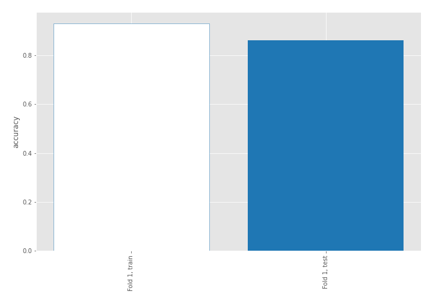

## Decision Tree 

### Tree #1
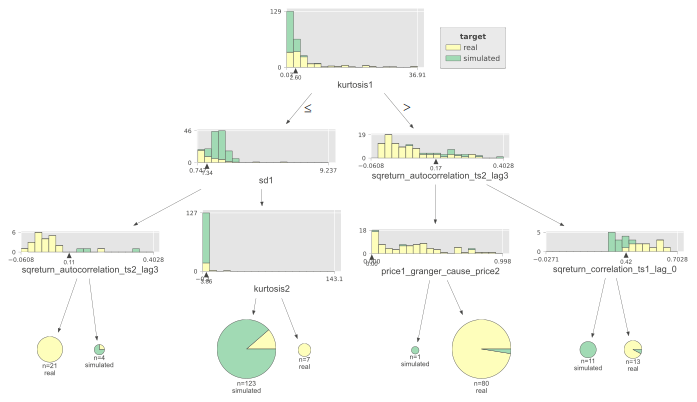

### Rules

if (kurtosis1 <= 2.598) and (sd1 > 1.342) and (kurtosis2 <= 3.856) then class: simulated (proba: 88.62%) | based on 123 samples

if (kurtosis1 > 2.598) and (sqreturn_autocorrelation_ts2_lag3 <= 0.166) and (price1_granger_cause_price2 > 0.0) then class: real (proba: 97.5%) | based on 80 samples

if (kurtosis1 <= 2.598) and (sd1 <= 1.342) and (sqreturn_autocorrelation_ts2_lag3 <= 0.108) then class: real (proba: 100.0%) | based on 21 samples

if (kurtosis1 > 2.598) and (sqreturn_autocorrelation_ts2_lag3 > 0.166) and (sqreturn_correlation_ts1_lag_0 > 0.418) then class: real (proba: 92.31%) | based on 13 samples

if (kurtosis1 > 2.598) and (sqreturn_autocorrelation_ts2_lag3 > 0.166) and (sqreturn_correlation_ts1_lag_0 <= 0.418) then class: simulated (proba: 100.0%) | based on 11 samples

if (kurtosis1 <= 2.598) and (sd1 > 1.342) and (kurtosis2 > 3.856) then class: real (proba: 100.0%) | based on 7 samples

if (kurtosis1 <= 2.598) and (sd1 <= 1.342) and (sqreturn_autocorrelation_ts2_lag3 > 0.108) then class: simulated (proba: 75.0%) | based on 4 samples

if (kurtosis1 > 2.598) and (sqreturn_autocorrelation_ts2_lag3 <= 0.166) and (price1_granger_cause_price2 <= 0.0) then class: simulated (proba: 100.0%) | based on 1 samples

## Permutation-based Importance
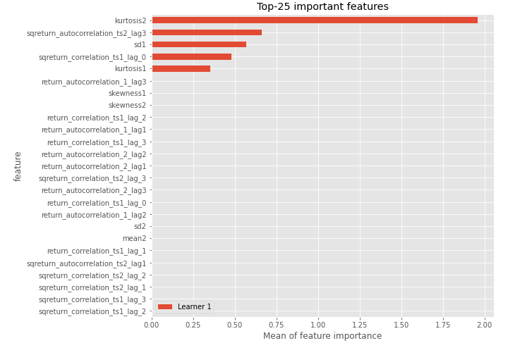
## Confusion Matrix

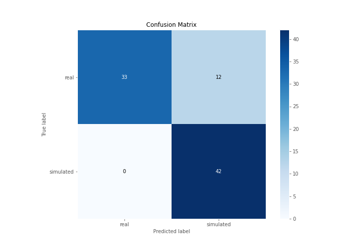

## Normalized Confusion Matrix

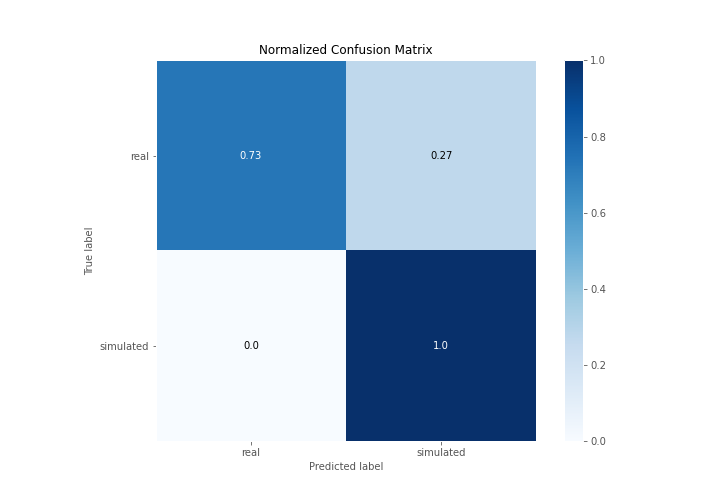

## ROC Curve

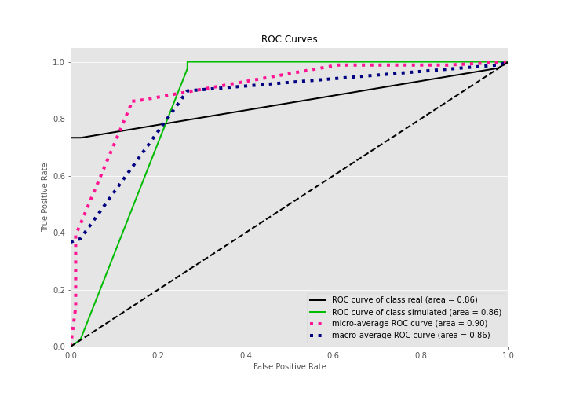

## Kolmogorov-Smirnov Statistic

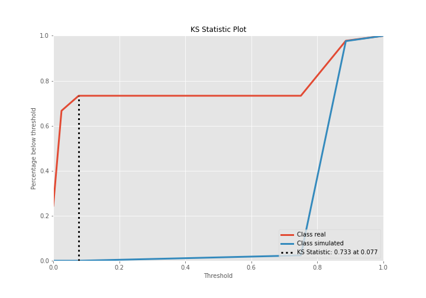

## Precision-Recall Curve

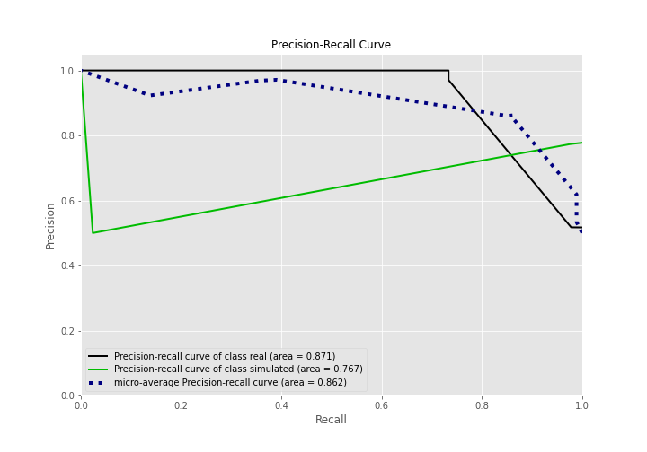

## Calibration Curve

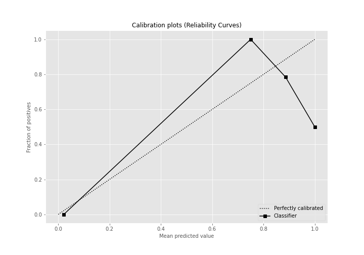

## Cumulative Gains Curve

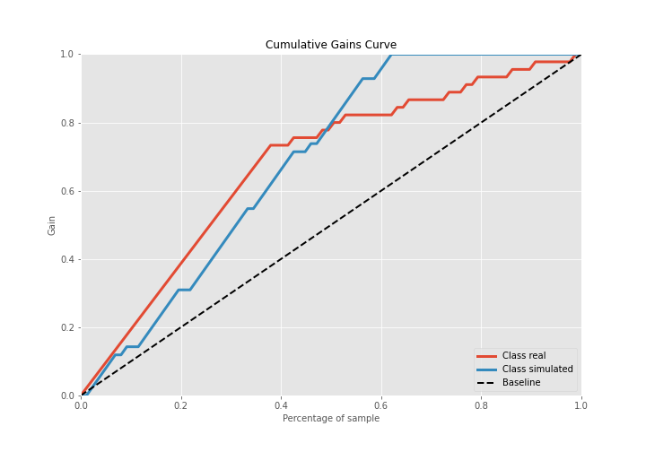

## Lift Curve

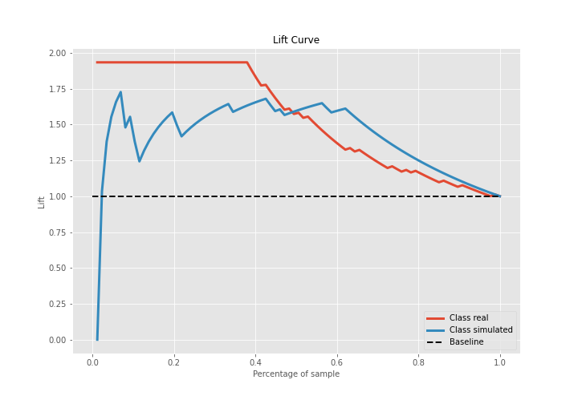

## SHAP Importance
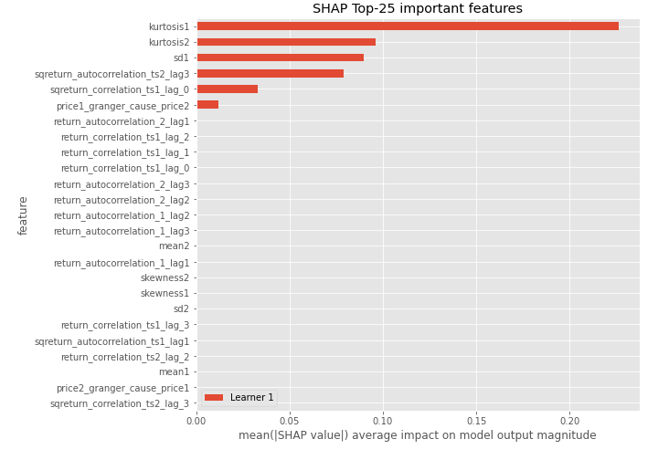

## SHAP Dependence plots

### Dependence (Fold 1)
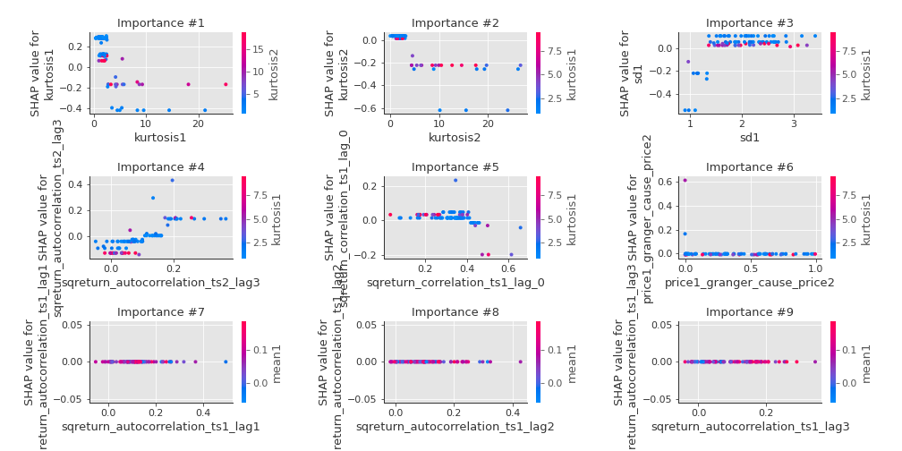

## SHAP Decision plots

### Top-10 Worst decisions for class 0 (Fold 1)
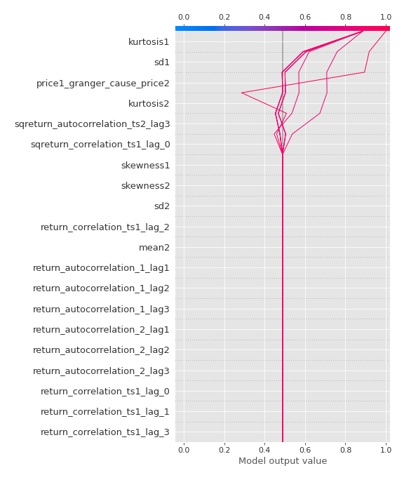
### Top-10 Best decisions for class 0 (Fold 1)
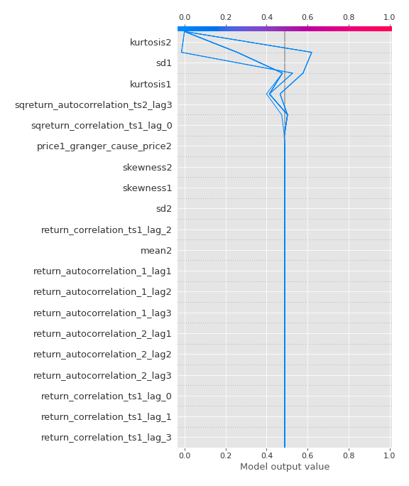
### Top-10 Worst decisions for class 1 (Fold 1)
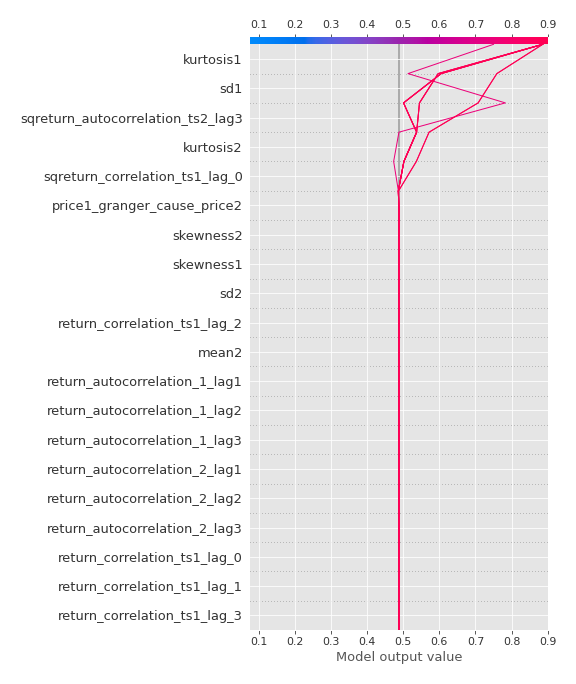
### Top-10 Best decisions for class 1 (Fold 1)
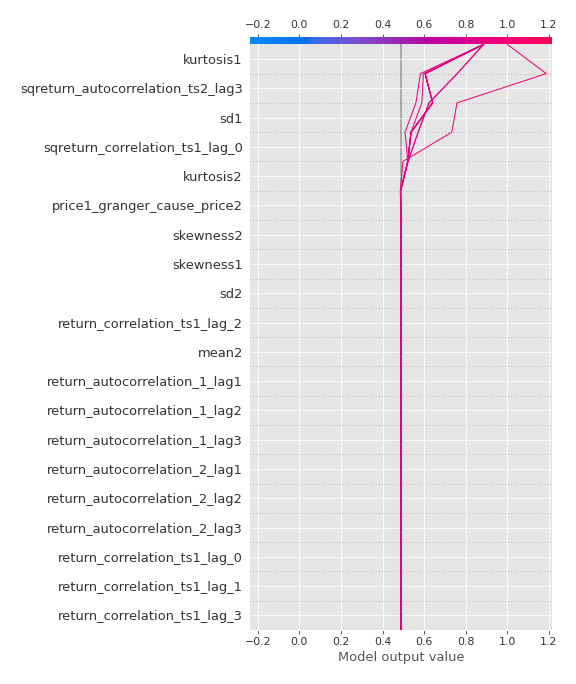

[<< Go back](../README.md)
