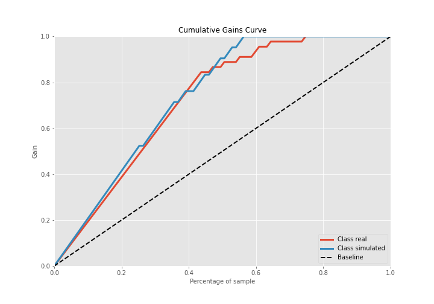
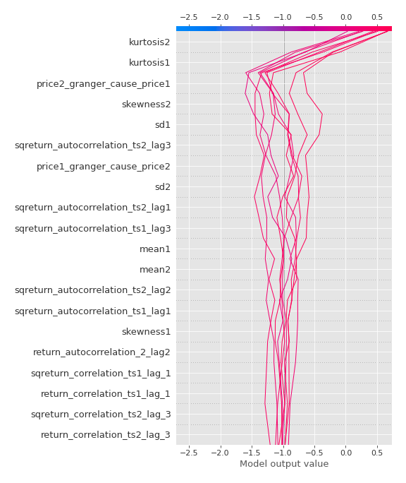

# Summary of 3_Linear

[<< Go back](../README.md)

## Logistic Regression (Linear)
- **n_jobs**: -1
- **explain_level**: 2

## Validation
 - **validation_type**: split
 - **train_ratio**: 0.75
 - **shuffle**: True
 - **stratify**: True

## Optimized metric
accuracy

## Training time

9.6 seconds

## Metric details
|           |    score |     threshold |
|:----------|---------:|--------------:|
| logloss   | 0.327572 | nan           |
| auc       | 0.965608 | nan           |
| f1        | 0.913043 |   0.493243    |
| accuracy  | 0.908046 |   0.543816    |
| precision | 1        |   0.753419    |
| recall    | 1        |   1.78888e-06 |
| mcc       | 0.831064 |   0.493243    |

## Confusion matrix (at threshold=0.543816)
|                      |   Predicted as real |   Predicted as simulated |
|:---------------------|--------------------:|-------------------------:|
| Labeled as real      |                  38 |                        7 |
| Labeled as simulated |                   1 |                       41 |

## Learning curves

## Coefficients
| feature                           |   Learner_1 |
|:----------------------------------|------------:|
| sqreturn_autocorrelation_ts2_lag3 |   2.22593   |
| mean1                             |   1.7192    |
| mean2                             |   1.66063   |
| sqreturn_autocorrelation_ts1_lag3 |   1.47689   |
| sqreturn_autocorrelation_ts2_lag1 |   1.23303   |
| sqreturn_autocorrelation_ts2_lag2 |   1.09683   |
| return_autocorrelation_2_lag1     |   0.699191  |
| return_correlation_ts1_lag_1      |   0.679668  |
| sqreturn_correlation_ts1_lag_1    |   0.679668  |
| sqreturn_correlation_ts2_lag_3    |   0.536471  |
| return_correlation_ts2_lag_3      |   0.536471  |
| return_correlation_ts1_lag_3      |   0.530158  |
| sqreturn_correlation_ts1_lag_3    |   0.530158  |
| return_autocorrelation_2_lag3     |   0.522758  |
| return_autocorrelation_2_lag2     |   0.50883   |
| sqreturn_autocorrelation_ts1_lag1 |   0.480105  |
| return_autocorrelation_1_lag3     |   0.415927  |
| sd1                               |   0.370252  |
| return_autocorrelation_1_lag2     |   0.344157  |
| return_correlation_ts2_lag_1      |   0.340253  |
| sqreturn_correlation_ts2_lag_1    |   0.340253  |
| sqreturn_autocorrelation_ts1_lag2 |   0.337706  |
| return_autocorrelation_1_lag1     |   0.287528  |
| return_correlation_ts2_lag_2      |  -0.0238537 |
| sqreturn_correlation_ts2_lag_2    |  -0.0238537 |
| sqreturn_correlation_ts1_lag_2    |  -0.200067  |
| return_correlation_ts1_lag_2      |  -0.200067  |
| sd2                               |  -0.211965  |
| price1_granger_cause_price2       |  -0.241867  |
| skewness1                         |  -0.25555   |
| sqreturn_correlation_ts1_lag_0    |  -0.343204  |
| return_correlation_ts1_lag_0      |  -0.343204  |
| price2_granger_cause_price1       |  -0.355213  |
| skewness2                         |  -0.474458  |
| intercept                         |  -1.63663   |
| kurtosis2                         |  -2.05421   |
| kurtosis1                         |  -2.67485   |

## Permutation-based Importance

## Confusion Matrix

## Normalized Confusion Matrix

## ROC Curve

## Kolmogorov-Smirnov Statistic

## Precision-Recall Curve

## Calibration Curve

## Cumulative Gains Curve

## Lift Curve

## SHAP Importance

## SHAP Dependence plots

### Dependence (Fold 1)

## SHAP Decision plots

### Top-10 Worst decisions for class 0 (Fold 1)

### Top-10 Best decisions for class 0 (Fold 1)

### Top-10 Worst decisions for class 1 (Fold 1)

### Top-10 Best decisions for class 1 (Fold 1)

[<< Go back](../README.md)
