# Exploratory Data Analysis

[<< Go back](../README.md)
## Feature : target
- **Feature type** : categorical
- **Missing** : 0.0%
- **Unique** : 2
- **Count** :347
- **Unique** :2
- **Top** :real
- **Freq** :178

## Feature : mean1
- **Feature type** : continous
- **Missing** : 0.0%
- **Unique** : 347
- **Count** :347.0
- **Mean** :0.0756178172259323
- **Std** :0.07902724462213805
- **Min** :-0.22632637961920957
- **25%th Percentile** : 0.0257195238626569
- **50%th Percentile** : 0.07494014631404354
- **75%th Percentile** : 0.12078912354270446
- **Max** :0.3612366374600757

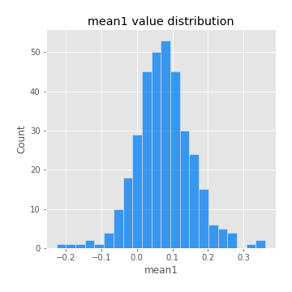
## Feature : mean2
- **Feature type** : continous
- **Missing** : 0.0%
- **Unique** : 347
- **Count** :347.0
- **Mean** :0.08959986441737751
- **Std** :0.09103677636908211
- **Min** :-0.24205418062825398
- **25%th Percentile** : 0.04299220901295219
- **50%th Percentile** : 0.09241331374488118
- **75%th Percentile** : 0.14632177863382173
- **Max** :0.37616608147096464

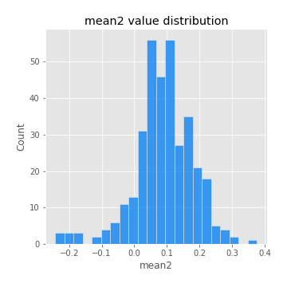
## Feature : sd1
- **Feature type** : continous
- **Missing** : 0.0%
- **Unique** : 347
- **Count** :347.0
- **Mean** :2.0416553621427354
- **Std** :0.8010462807898108
- **Min** :0.7470080772831957
- **25%th Percentile** : 1.5602952311650378
- **50%th Percentile** : 1.9504046186211539
- **75%th Percentile** : 2.3868050724535044
- **Max** :9.236766377527575

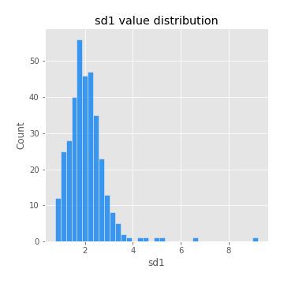
## Feature : sd2
- **Feature type** : continous
- **Missing** : 0.0%
- **Unique** : 347
- **Count** :347.0
- **Mean** :1.99709173945837
- **Std** :0.7720987223549662
- **Min** :0.6214559281798011
- **25%th Percentile** : 1.4840080758798924
- **50%th Percentile** : 1.85809167069906
- **75%th Percentile** : 2.3088446699907945
- **Max** :6.737618636746393

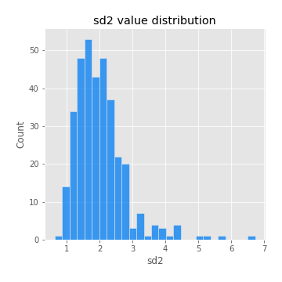
## Feature : skewness1
- **Feature type** : continous
- **Missing** : 0.0%
- **Unique** : 347
- **Count** :347.0
- **Mean** :-0.14088354283997845
- **Std** :0.559309523055104
- **Min** :-2.817259764925239
- **25%th Percentile** : -0.30038995278030206
- **50%th Percentile** : -0.12158071239337705
- **75%th Percentile** : 0.07004832260604263
- **Max** :2.5845963767725557

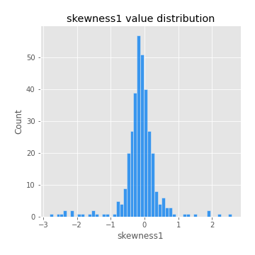
## Feature : skewness2
- **Feature type** : continous
- **Missing** : 0.0%
- **Unique** : 347
- **Count** :347.0
- **Mean** :-0.2211586638509468
- **Std** :0.7942468701363824
- **Min** :-8.801502855292393
- **25%th Percentile** : -0.3704400968000118
- **50%th Percentile** : -0.1486985379795069
- **75%th Percentile** : 0.034803496821654456
- **Max** :2.2606839051517187

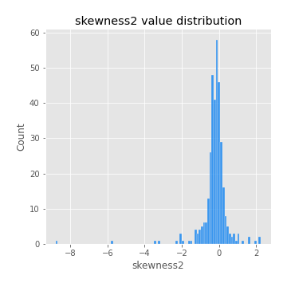
## Feature : kurtosis1
- **Feature type** : continous
- **Missing** : 0.0%
- **Unique** : 347
- **Count** :347.0
- **Mean** :3.8275017130769866
- **Std** :5.339794295790307
- **Min** :0.07149361823522637
- **25%th Percentile** : 1.2770451935313685
- **50%th Percentile** : 1.9677773743006974
- **75%th Percentile** : 3.922968597234183
- **Max** :36.91113889081053

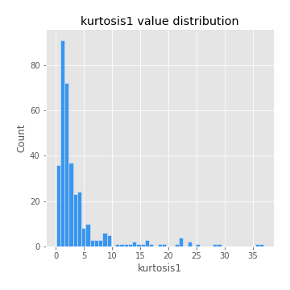
## Feature : kurtosis2
- **Feature type** : continous
- **Missing** : 0.0%
- **Unique** : 347
- **Count** :347.0
- **Mean** :4.621686687439827
- **Std** :9.980099049508693
- **Min** :-0.08695982661775403
- **25%th Percentile** : 1.2861417921526925
- **50%th Percentile** : 2.076929388695056
- **75%th Percentile** : 4.259122866012727
- **Max** :143.10871011533666

## Feature : return_autocorrelation_1_lag1
- **Feature type** : continous
- **Missing** : 0.0%
- **Unique** : 347
- **Count** :347.0
- **Mean** :-0.015345098943218668
- **Std** :0.061830811303073316
- **Min** :-0.2135576224968752
- **25%th Percentile** : -0.057974792005469664
- **50%th Percentile** : -0.012958181168433036
- **75%th Percentile** : 0.028224444775876156
- **Max** :0.12810656890648087

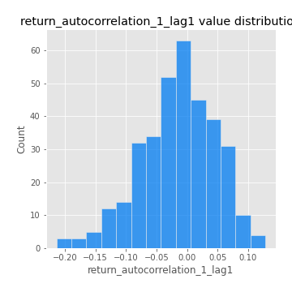
## Feature : return_autocorrelation_1_lag2
- **Feature type** : continous
- **Missing** : 0.0%
- **Unique** : 347
- **Count** :347.0
- **Mean** :-0.0062470075287126324
- **Std** :0.055533713305561234
- **Min** :-0.1521228025183875
- **25%th Percentile** : -0.04167685896596725
- **50%th Percentile** : -0.008652758823622753
- **75%th Percentile** : 0.02886503095718094
- **Max** :0.1561488228015672

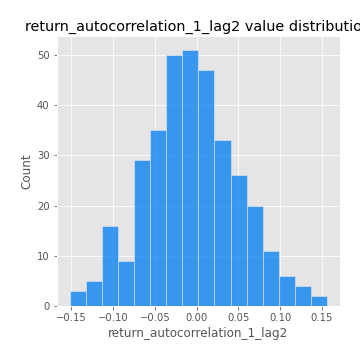
## Feature : return_autocorrelation_1_lag3
- **Feature type** : continous
- **Missing** : 0.0%
- **Unique** : 347
- **Count** :347.0
- **Mean** :-0.0070174522180129735
- **Std** :0.055912852004719106
- **Min** :-0.1940836867390813
- **25%th Percentile** : -0.043634513119213424
- **50%th Percentile** : -0.006678081664469847
- **75%th Percentile** : 0.03162760739786598
- **Max** :0.17805869530681923

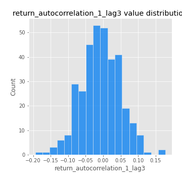
## Feature : return_autocorrelation_2_lag1
- **Feature type** : continous
- **Missing** : 0.0%
- **Unique** : 347
- **Count** :347.0
- **Mean** :-0.014425035757798424
- **Std** :0.06325709644866288
- **Min** :-0.24590087874039124
- **25%th Percentile** : -0.045007610260362554
- **50%th Percentile** : -0.010001426567779354
- **75%th Percentile** : 0.024252580996017757
- **Max** :0.31863413537898483

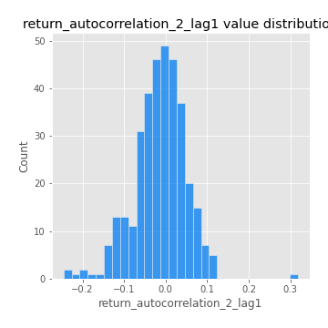
## Feature : return_autocorrelation_2_lag2
- **Feature type** : continous
- **Missing** : 0.0%
- **Unique** : 347
- **Count** :347.0
- **Mean** :-0.0018910140670363792
- **Std** :0.056393014328349936
- **Min** :-0.15323211089747296
- **25%th Percentile** : -0.03841106524908365
- **50%th Percentile** : -0.0034670824892446316
- **75%th Percentile** : 0.03346418366706872
- **Max** :0.20974504043791217

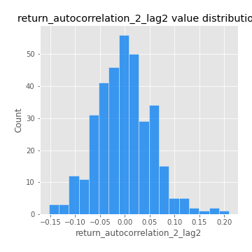
## Feature : return_autocorrelation_2_lag3
- **Feature type** : continous
- **Missing** : 0.0%
- **Unique** : 347
- **Count** :347.0
- **Mean** :-0.008332478113445958
- **Std** :0.05379849316517543
- **Min** :-0.18365745341159798
- **25%th Percentile** : -0.042349841153705575
- **50%th Percentile** : -0.009184947011871199
- **75%th Percentile** : 0.026540997953692372
- **Max** :0.14863166233138522

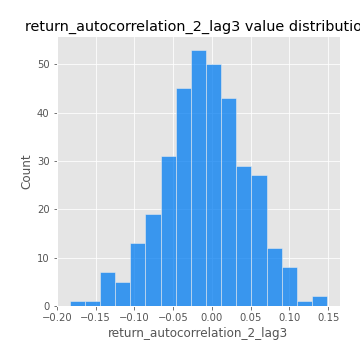
## Feature : return_correlation_ts1_lag_0
- **Feature type** : continous
- **Missing** : 0.0%
- **Unique** : 347
- **Count** :347.0
- **Mean** :0.34262151982793015
- **Std** :0.1112306629049038
- **Min** :-0.027089510445801036
- **25%th Percentile** : 0.28474784222741945
- **50%th Percentile** : 0.3427953031820117
- **75%th Percentile** : 0.40173186629703156
- **Max** :0.7028422087350163

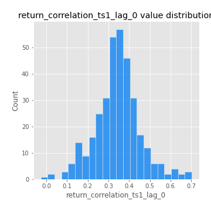
## Feature : return_correlation_ts1_lag_1
- **Feature type** : continous
- **Missing** : 0.0%
- **Unique** : 347
- **Count** :347.0
- **Mean** :-0.01015641028474709
- **Std** :0.05793894659505857
- **Min** :-0.16985510949917193
- **25%th Percentile** : -0.04818310119286463
- **50%th Percentile** : -0.00878251908140008
- **75%th Percentile** : 0.027158696742068986
- **Max** :0.18126392558940171

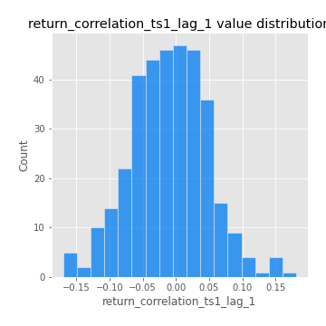
## Feature : return_correlation_ts1_lag_2
- **Feature type** : continous
- **Missing** : 0.0%
- **Unique** : 347
- **Count** :347.0
- **Mean** :-0.003586441607308728
- **Std** :0.053705199634181994
- **Min** :-0.21653581047581763
- **25%th Percentile** : -0.03883136362380947
- **50%th Percentile** : -0.005708873607187067
- **75%th Percentile** : 0.03506892064231482
- **Max** :0.16107438217793135

## Feature : return_correlation_ts1_lag_3
- **Feature type** : continous
- **Missing** : 0.0%
- **Unique** : 347
- **Count** :347.0
- **Mean** :-0.0030510647157674315
- **Std** :0.05686973398620084
- **Min** :-0.17681307970008878
- **25%th Percentile** : -0.0415206636575306
- **50%th Percentile** : -0.005623623140617771
- **75%th Percentile** : 0.0371849787630239
- **Max** :0.1636773216468148

## Feature : return_correlation_ts2_lag_1
- **Feature type** : continous
- **Missing** : 0.0%
- **Unique** : 347
- **Count** :347.0
- **Mean** :-0.010780436371664181
- **Std** :0.05742475675334339
- **Min** :-0.2081139431093261
- **25%th Percentile** : -0.04490105702796724
- **50%th Percentile** : -0.010502912867097602
- **75%th Percentile** : 0.023659098727756737
- **Max** :0.13814405858389642

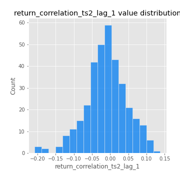
## Feature : return_correlation_ts2_lag_2
- **Feature type** : continous
- **Missing** : 0.0%
- **Unique** : 347
- **Count** :347.0
- **Mean** :-0.0006886887182247373
- **Std** :0.05263066116127642
- **Min** :-0.23751835475804678
- **25%th Percentile** : -0.03520584374301873
- **50%th Percentile** : -0.00045688431833074323
- **75%th Percentile** : 0.028926093934968564
- **Max** :0.20772887392904255

## Feature : return_correlation_ts2_lag_3
- **Feature type** : continous
- **Missing** : 0.0%
- **Unique** : 347
- **Count** :347.0
- **Mean** :-0.004663055541262509
- **Std** :0.0566412177836303
- **Min** :-0.17564076057312866
- **25%th Percentile** : -0.03566833760113878
- **50%th Percentile** : -0.0031696992515712744
- **75%th Percentile** : 0.03393817548390328
- **Max** :0.17717046693542784

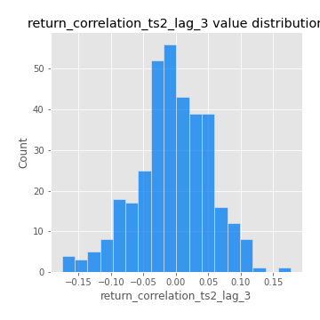
## Feature : sqreturn_autocorrelation_ts1_lag1
- **Feature type** : continous
- **Missing** : 0.0%
- **Unique** : 347
- **Count** :347.0
- **Mean** :0.11993033795826182
- **Std** :0.0900974230989205
- **Min** :-0.052978649713557625
- **25%th Percentile** : 0.05036413297507253
- **50%th Percentile** : 0.10939363576530092
- **75%th Percentile** : 0.17200755655396816
- **Max** :0.49414293176447355

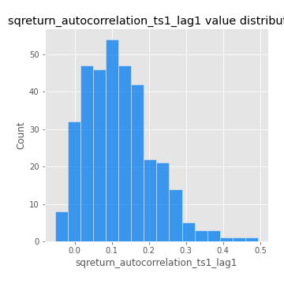
## Feature : sqreturn_autocorrelation_ts1_lag2
- **Feature type** : continous
- **Missing** : 0.0%
- **Unique** : 347
- **Count** :347.0
- **Mean** :0.11211284060339363
- **Std** :0.09692065548056475
- **Min** :-0.05419304650062953
- **25%th Percentile** : 0.03763381141378345
- **50%th Percentile** : 0.09822168370469365
- **75%th Percentile** : 0.17568208848993683
- **Max** :0.540735851444759

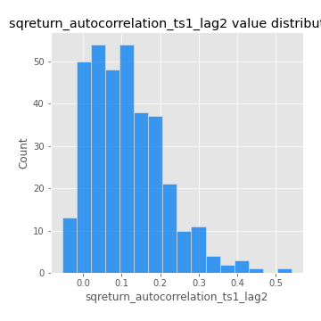
## Feature : sqreturn_autocorrelation_ts1_lag3
- **Feature type** : continous
- **Missing** : 0.0%
- **Unique** : 347
- **Count** :347.0
- **Mean** :0.10380118900611507
- **Std** :0.0887310753029872
- **Min** :-0.05313973583773816
- **25%th Percentile** : 0.03311798963811572
- **50%th Percentile** : 0.0941865068143093
- **75%th Percentile** : 0.1666883716655594
- **Max** :0.41030914918857014

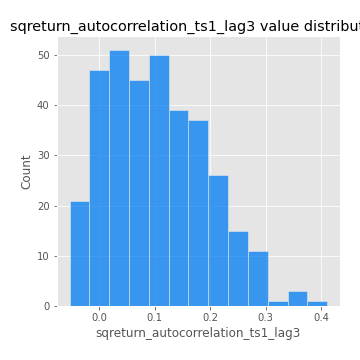
## Feature : sqreturn_autocorrelation_ts2_lag1
- **Feature type** : continous
- **Missing** : 0.0%
- **Unique** : 347
- **Count** :347.0
- **Mean** :0.1202789336385538
- **Std** :0.08598897226485265
- **Min** :-0.08520586663750691
- **25%th Percentile** : 0.05564311238571362
- **50%th Percentile** : 0.11302292654885325
- **75%th Percentile** : 0.17384542139201214
- **Max** :0.510085647437958

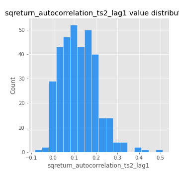
## Feature : sqreturn_autocorrelation_ts2_lag2
- **Feature type** : continous
- **Missing** : 0.0%
- **Unique** : 347
- **Count** :347.0
- **Mean** :0.11592064468520163
- **Std** :0.09630166557716284
- **Min** :-0.051523884196217395
- **25%th Percentile** : 0.036912287828110506
- **50%th Percentile** : 0.10528387188482558
- **75%th Percentile** : 0.1808069397382966
- **Max** :0.5373432415582473

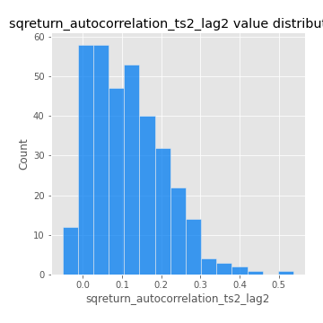
## Feature : sqreturn_autocorrelation_ts2_lag3
- **Feature type** : continous
- **Missing** : 0.0%
- **Unique** : 347
- **Count** :347.0
- **Mean** :0.10113180087179073
- **Std** :0.09034191908847675
- **Min** :-0.06082766359524085
- **25%th Percentile** : 0.02771020795069479
- **50%th Percentile** : 0.08967327177145498
- **75%th Percentile** : 0.16005850676351654
- **Max** :0.40281009435720216

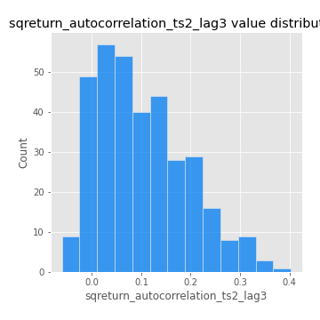
## Feature : sqreturn_correlation_ts1_lag_0
- **Feature type** : continous
- **Missing** : 0.0%
- **Unique** : 347
- **Count** :347.0
- **Mean** :0.34262151982793015
- **Std** :0.1112306629049038
- **Min** :-0.027089510445801036
- **25%th Percentile** : 0.28474784222741945
- **50%th Percentile** : 0.3427953031820117
- **75%th Percentile** : 0.40173186629703156
- **Max** :0.7028422087350163

## Feature : sqreturn_correlation_ts1_lag_1
- **Feature type** : continous
- **Missing** : 0.0%
- **Unique** : 347
- **Count** :347.0
- **Mean** :-0.01015641028474709
- **Std** :0.05793894659505857
- **Min** :-0.16985510949917193
- **25%th Percentile** : -0.04818310119286463
- **50%th Percentile** : -0.00878251908140008
- **75%th Percentile** : 0.027158696742068986
- **Max** :0.18126392558940171

## Feature : sqreturn_correlation_ts1_lag_2
- **Feature type** : continous
- **Missing** : 0.0%
- **Unique** : 347
- **Count** :347.0
- **Mean** :-0.003586441607308728
- **Std** :0.053705199634181994
- **Min** :-0.21653581047581763
- **25%th Percentile** : -0.03883136362380947
- **50%th Percentile** : -0.005708873607187067
- **75%th Percentile** : 0.03506892064231482
- **Max** :0.16107438217793135

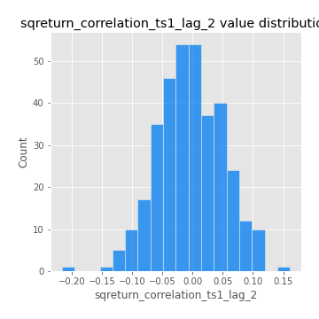
## Feature : sqreturn_correlation_ts1_lag_3
- **Feature type** : continous
- **Missing** : 0.0%
- **Unique** : 347
- **Count** :347.0
- **Mean** :-0.0030510647157674315
- **Std** :0.05686973398620084
- **Min** :-0.17681307970008878
- **25%th Percentile** : -0.0415206636575306
- **50%th Percentile** : -0.005623623140617771
- **75%th Percentile** : 0.0371849787630239
- **Max** :0.1636773216468148

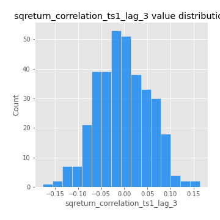
## Feature : sqreturn_correlation_ts2_lag_1
- **Feature type** : continous
- **Missing** : 0.0%
- **Unique** : 347
- **Count** :347.0
- **Mean** :-0.010780436371664181
- **Std** :0.05742475675334339
- **Min** :-0.2081139431093261
- **25%th Percentile** : -0.04490105702796724
- **50%th Percentile** : -0.010502912867097602
- **75%th Percentile** : 0.023659098727756737
- **Max** :0.13814405858389642

## Feature : sqreturn_correlation_ts2_lag_2
- **Feature type** : continous
- **Missing** : 0.0%
- **Unique** : 347
- **Count** :347.0
- **Mean** :-0.0006886887182247373
- **Std** :0.05263066116127642
- **Min** :-0.23751835475804678
- **25%th Percentile** : -0.03520584374301873
- **50%th Percentile** : -0.00045688431833074323
- **75%th Percentile** : 0.028926093934968564
- **Max** :0.20772887392904255

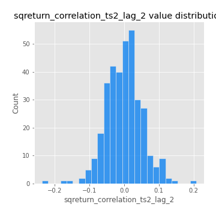
## Feature : sqreturn_correlation_ts2_lag_3
- **Feature type** : continous
- **Missing** : 0.0%
- **Unique** : 347
- **Count** :347.0
- **Mean** :-0.004663055541262509
- **Std** :0.0566412177836303
- **Min** :-0.17564076057312866
- **25%th Percentile** : -0.03566833760113878
- **50%th Percentile** : -0.0031696992515712744
- **75%th Percentile** : 0.03393817548390328
- **Max** :0.17717046693542784

## Feature : price2_granger_cause_price1
- **Feature type** : continous
- **Missing** : 0.0%
- **Unique** : 347
- **Count** :347.0
- **Mean** :0.31278472333247126
- **Std** :0.31118142417992795
- **Min** :2.4833455058401403e-10
- **25%th Percentile** : 0.031050324802476027
- **50%th Percentile** : 0.20368417081248466
- **75%th Percentile** : 0.5594082632430999
- **Max** :0.9951785572164394

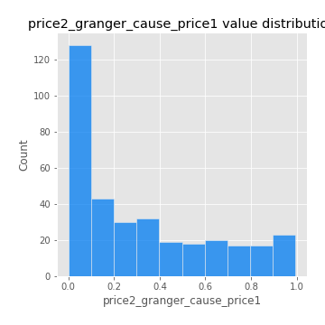
## Feature : price1_granger_cause_price2
- **Feature type** : continous
- **Missing** : 0.0%
- **Unique** : 347
- **Count** :347.0
- **Mean** :0.297569095876101
- **Std** :0.28236283949112034
- **Min** :1.1847955997172605e-07
- **25%th Percentile** : 0.044144786380591564
- **50%th Percentile** : 0.23137171606910142
- **75%th Percentile** : 0.49400937851515925
- **Max** :0.9980684479915588

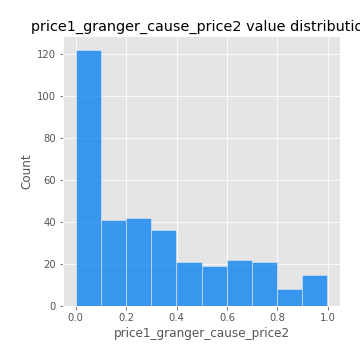

[<< Go back](../README.md)
