# Summary of 2_DecisionTree

[<< Go back](../README.md)

## Decision Tree
- **n_jobs**: -1
- **criterion**: gini
- **max_depth**: 3
- **explain_level**: 2

## Validation
 - **validation_type**: split
 - **train_ratio**: 0.75
 - **shuffle**: True
 - **stratify**: True

## Optimized metric
accuracy

## Training time

12.3 seconds

## Metric details
|           |    score |   threshold |
|:----------|---------:|------------:|
| logloss   | 0.735013 |  nan        |
| auc       | 0.886436 |  nan        |
| f1        | 0.891304 |    0.849282 |
| accuracy  | 0.885057 |    0.849282 |
| precision | 1        |    0.909091 |
| recall    | 0.93617  |    0        |
| mcc       | 0.770294 |    0.849282 |

## Confusion matrix (at threshold=0.849282)
|                      |   Predicted as real |   Predicted as simulated |
|:---------------------|--------------------:|-------------------------:|
| Labeled as real      |                  36 |                        4 |
| Labeled as simulated |                   6 |                       41 |

## Learning curves
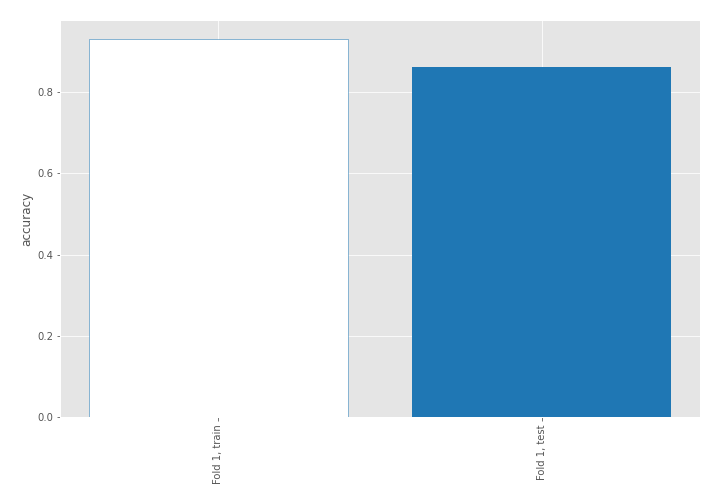

## Decision Tree 

### Tree #1
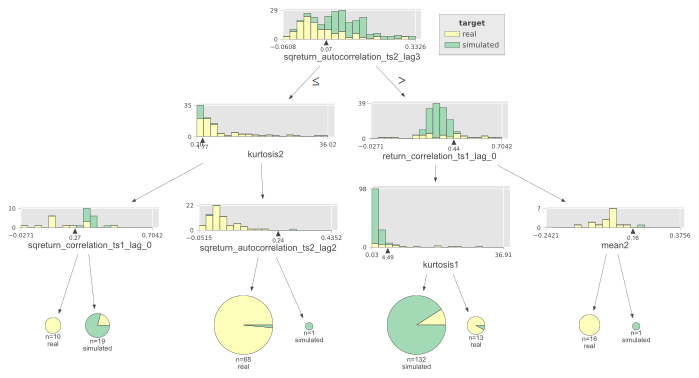

### Rules

if (sqreturn_autocorrelation_ts2_lag3 > 0.068) and (return_correlation_ts1_lag_0 <= 0.436) and (kurtosis1 <= 4.489) then class: simulated (proba: 90.91%) | based on 132 samples

if (sqreturn_autocorrelation_ts2_lag3 <= 0.068) and (kurtosis2 > 1.766) and (sqreturn_autocorrelation_ts2_lag2 <= 0.24) then class: real (proba: 98.53%) | based on 68 samples

if (sqreturn_autocorrelation_ts2_lag3 <= 0.068) and (kurtosis2 <= 1.766) and (sqreturn_correlation_ts1_lag_0 > 0.274) then class: simulated (proba: 78.95%) | based on 19 samples

if (sqreturn_autocorrelation_ts2_lag3 > 0.068) and (return_correlation_ts1_lag_0 > 0.436) and (mean2 <= 0.158) then class: real (proba: 100.0%) | based on 16 samples

if (sqreturn_autocorrelation_ts2_lag3 > 0.068) and (return_correlation_ts1_lag_0 <= 0.436) and (kurtosis1 > 4.489) then class: real (proba: 92.31%) | based on 13 samples

if (sqreturn_autocorrelation_ts2_lag3 <= 0.068) and (kurtosis2 <= 1.766) and (sqreturn_correlation_ts1_lag_0 <= 0.274) then class: real (proba: 100.0%) | based on 10 samples

if (sqreturn_autocorrelation_ts2_lag3 > 0.068) and (return_correlation_ts1_lag_0 > 0.436) and (mean2 > 0.158) then class: simulated (proba: 100.0%) | based on 1 samples

if (sqreturn_autocorrelation_ts2_lag3 <= 0.068) and (kurtosis2 > 1.766) and (sqreturn_autocorrelation_ts2_lag2 > 0.24) then class: simulated (proba: 100.0%) | based on 1 samples

## Permutation-based Importance
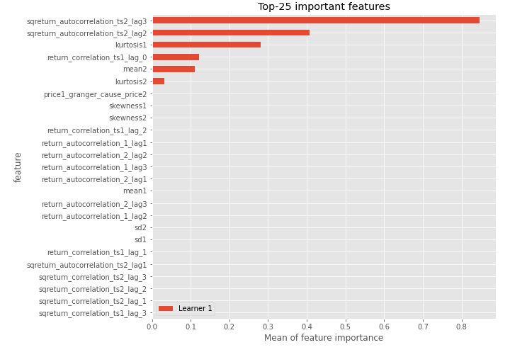
## Confusion Matrix

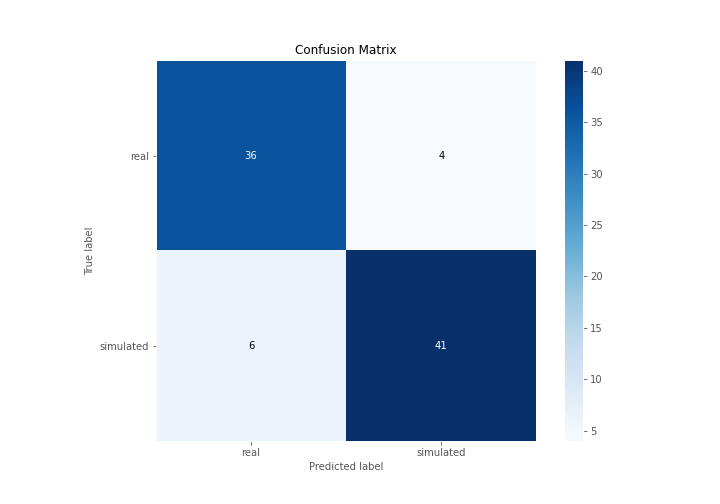

## Normalized Confusion Matrix

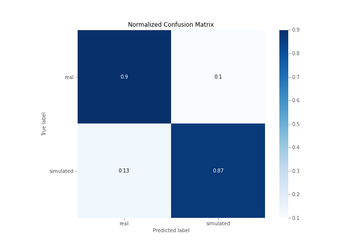

## ROC Curve

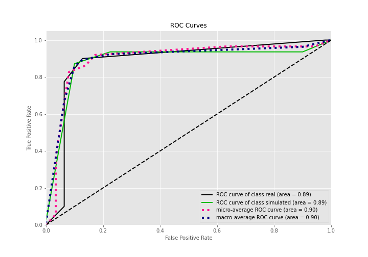

## Kolmogorov-Smirnov Statistic

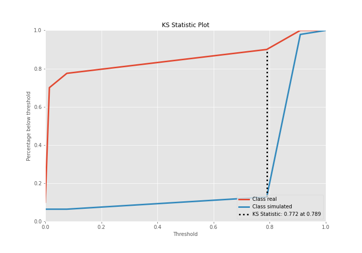

## Precision-Recall Curve

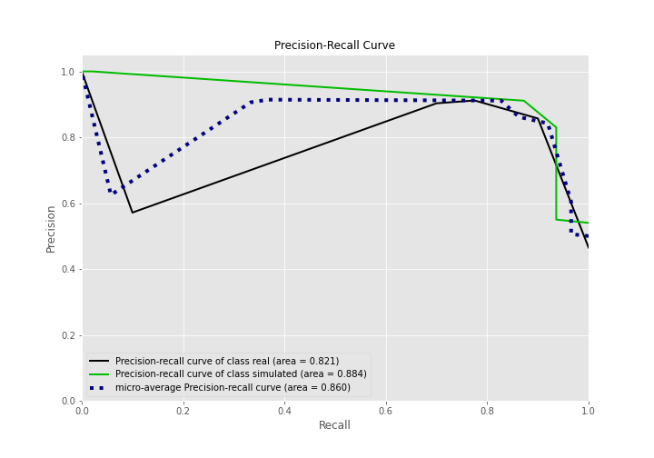

## Calibration Curve

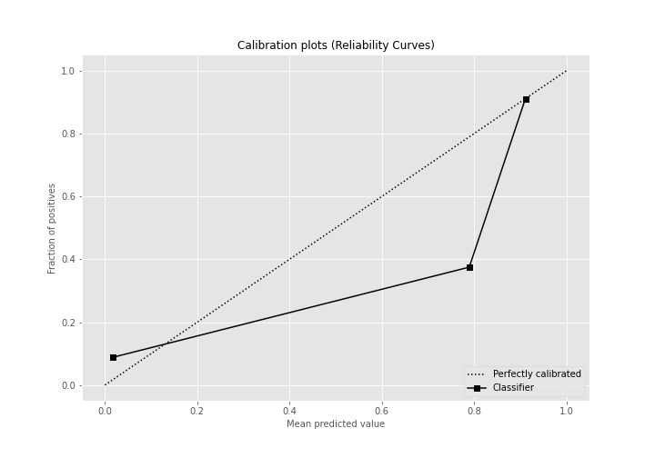

## Cumulative Gains Curve

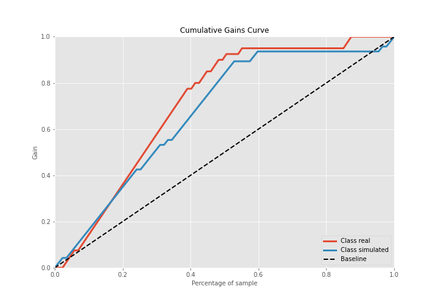

## Lift Curve

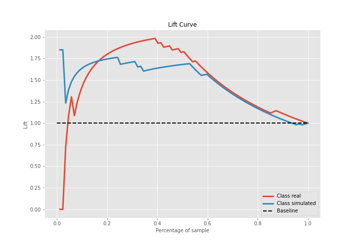

## SHAP Importance
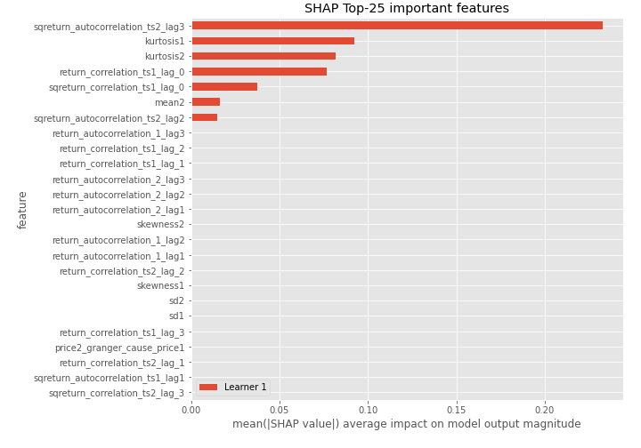

## SHAP Dependence plots

### Dependence (Fold 1)
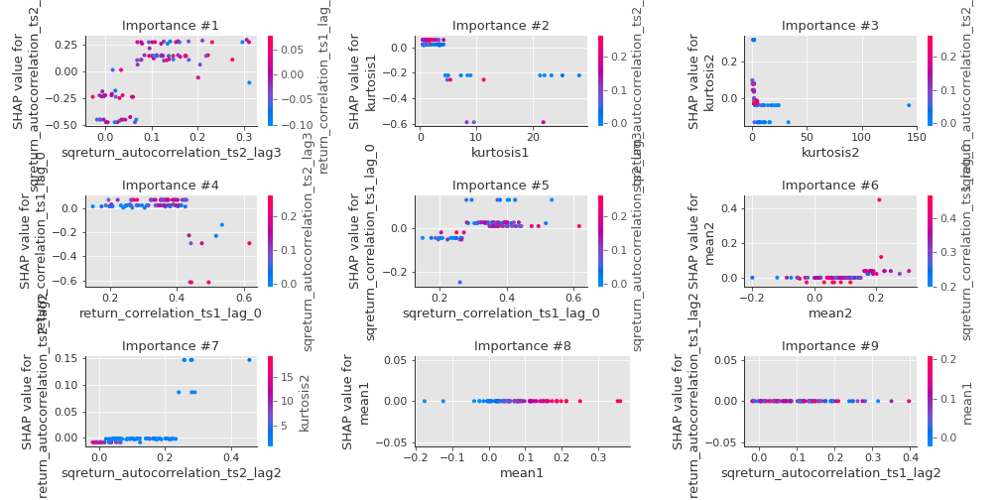

## SHAP Decision plots

### Top-10 Worst decisions for class 0 (Fold 1)
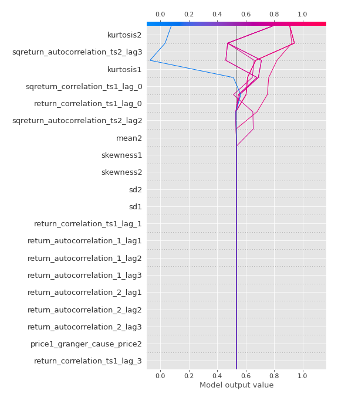
### Top-10 Best decisions for class 0 (Fold 1)
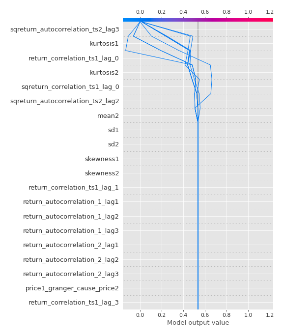
### Top-10 Worst decisions for class 1 (Fold 1)
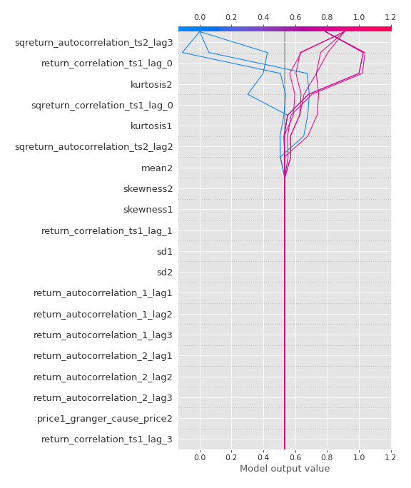
### Top-10 Best decisions for class 1 (Fold 1)
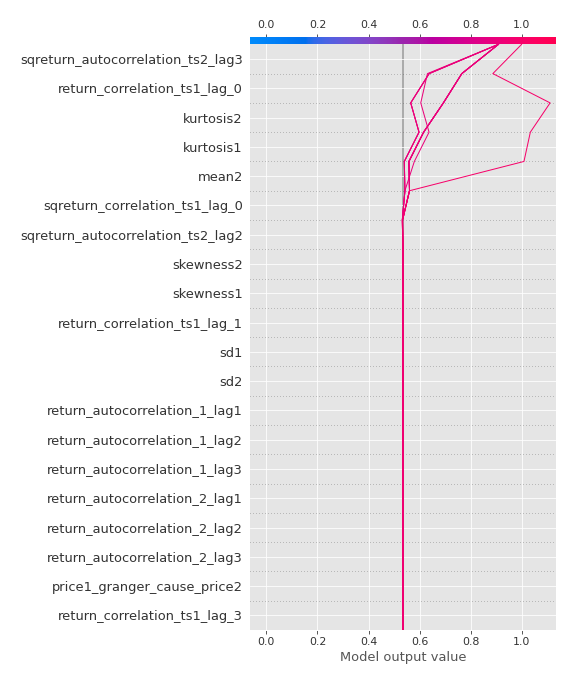

[<< Go back](../README.md)
