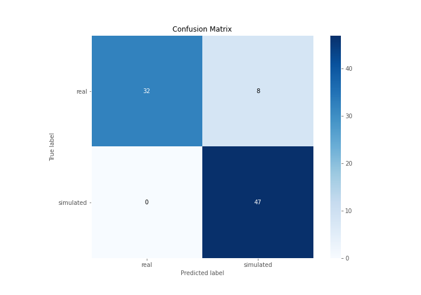
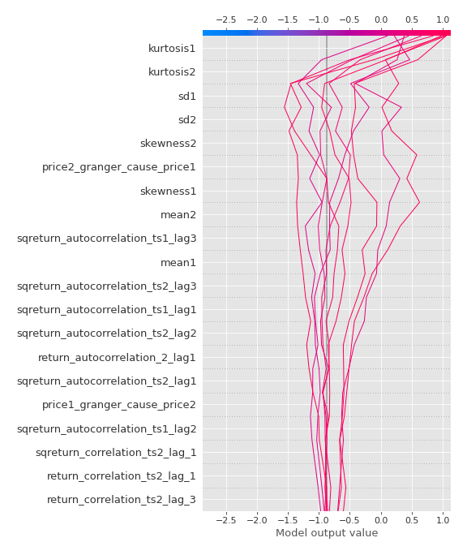

# Summary of 3_Linear

[<< Go back](../README.md)

## Logistic Regression (Linear)
- **n_jobs**: -1
- **explain_level**: 2

## Validation
 - **validation_type**: split
 - **train_ratio**: 0.75
 - **shuffle**: True
 - **stratify**: True

## Optimized metric
accuracy

## Training time

10.8 seconds

## Metric details
|           |    score |     threshold |
|:----------|---------:|--------------:|
| logloss   | 0.284092 | nan           |
| auc       | 0.969681 | nan           |
| f1        | 0.921569 |   0.519087    |
| accuracy  | 0.908046 |   0.519087    |
| precision | 1        |   0.783392    |
| recall    | 1        |   4.18424e-22 |
| mcc       | 0.826823 |   0.519087    |

## Confusion matrix (at threshold=0.519087)
|                      |   Predicted as real |   Predicted as simulated |
|:---------------------|--------------------:|-------------------------:|
| Labeled as real      |                  32 |                        8 |
| Labeled as simulated |                   0 |                       47 |

## Learning curves

## Coefficients
| feature                           |   Learner_1 |
|:----------------------------------|------------:|
| mean2                             |   1.9755    |
| mean1                             |   1.44596   |
| sqreturn_autocorrelation_ts2_lag3 |   1.41158   |
| sqreturn_autocorrelation_ts1_lag3 |   1.24985   |
| sqreturn_autocorrelation_ts1_lag1 |   1.1506    |
| return_autocorrelation_2_lag1     |   0.944861  |
| sqreturn_autocorrelation_ts2_lag1 |   0.938998  |
| sqreturn_autocorrelation_ts2_lag2 |   0.90651   |
| sqreturn_autocorrelation_ts1_lag2 |   0.601867  |
| return_correlation_ts2_lag_3      |   0.571285  |
| sqreturn_correlation_ts2_lag_3    |   0.571285  |
| return_correlation_ts2_lag_1      |   0.568482  |
| sqreturn_correlation_ts2_lag_1    |   0.568482  |
| sqreturn_correlation_ts1_lag_1    |   0.49414   |
| return_correlation_ts1_lag_1      |   0.49414   |
| return_autocorrelation_1_lag3     |   0.437479  |
| sd1                               |   0.435876  |
| return_correlation_ts1_lag_3      |   0.422935  |
| sqreturn_correlation_ts1_lag_3    |   0.422935  |
| return_autocorrelation_1_lag1     |   0.376027  |
| return_autocorrelation_1_lag2     |   0.358294  |
| return_autocorrelation_2_lag3     |   0.350531  |
| return_correlation_ts1_lag_0      |   0.0894473 |
| sqreturn_correlation_ts1_lag_0    |   0.0894473 |
| return_autocorrelation_2_lag2     |   0.0862909 |
| return_correlation_ts2_lag_2      |  -0.0805785 |
| sqreturn_correlation_ts2_lag_2    |  -0.0805785 |
| return_correlation_ts1_lag_2      |  -0.126618  |
| sqreturn_correlation_ts1_lag_2    |  -0.126618  |
| price1_granger_cause_price2       |  -0.136026  |
| sd2                               |  -0.308139  |
| skewness2                         |  -0.460315  |
| price2_granger_cause_price1       |  -0.48121   |
| skewness1                         |  -1.04327   |
| intercept                         |  -1.79149   |
| kurtosis2                         |  -1.97308   |
| kurtosis1                         |  -2.43657   |

## Permutation-based Importance

## Confusion Matrix

## Normalized Confusion Matrix

## ROC Curve

## Kolmogorov-Smirnov Statistic

## Precision-Recall Curve

## Calibration Curve

## Cumulative Gains Curve

## Lift Curve

## SHAP Importance

## SHAP Dependence plots

### Dependence (Fold 1)

## SHAP Decision plots

### Top-10 Worst decisions for class 0 (Fold 1)

### Top-10 Best decisions for class 0 (Fold 1)

### Top-10 Worst decisions for class 1 (Fold 1)

### Top-10 Best decisions for class 1 (Fold 1)

[<< Go back](../README.md)
