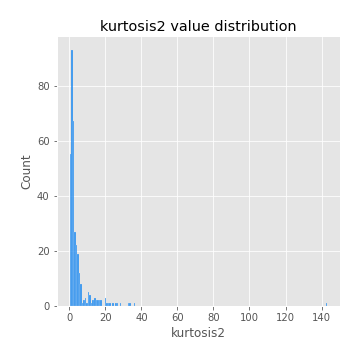

# Exploratory Data Analysis

[<< Go back](../README.md)
## Feature : target
- **Feature type** : categorical
- **Missing** : 0.0%
- **Unique** : 2
- **Count** :347
- **Unique** :2
- **Top** :simulated
- **Freq** :186

## Feature : mean1
- **Feature type** : continous
- **Missing** : 0.0%
- **Unique** : 347
- **Count** :347.0
- **Mean** :0.07977408501587724
- **Std** :0.08006457481331498
- **Min** :-0.17686457077756634
- **25%th Percentile** : 0.03153293084709292
- **50%th Percentile** : 0.07357473414802262
- **75%th Percentile** : 0.11929353907676568
- **Max** :0.37175100008111034

## Feature : mean2
- **Feature type** : continous
- **Missing** : 0.0%
- **Unique** : 347
- **Count** :347.0
- **Mean** :0.09330851194598039
- **Std** :0.08995803179192235
- **Min** :-0.24205418062825398
- **25%th Percentile** : 0.0438994452422868
- **50%th Percentile** : 0.09274508568726152
- **75%th Percentile** : 0.14439112275953087
- **Max** :0.3755896216698336

## Feature : sd1
- **Feature type** : continous
- **Missing** : 0.0%
- **Unique** : 347
- **Count** :347.0
- **Mean** :2.044941701873847
- **Std** :0.6976652291146105
- **Min** :0.7470080772831957
- **25%th Percentile** : 1.584995211996325
- **50%th Percentile** : 1.9999462748527534
- **75%th Percentile** : 2.4321424004697363
- **Max** :6.495661311240861

## Feature : sd2
- **Feature type** : continous
- **Missing** : 0.0%
- **Unique** : 347
- **Count** :347.0
- **Mean** :1.9289353845016235
- **Std** :0.6971543807486229
- **Min** :0.7811088107742427
- **25%th Percentile** : 1.4455898952730293
- **50%th Percentile** : 1.8393900947235202
- **75%th Percentile** : 2.255423274536297
- **Max** :5.762808157208253

## Feature : skewness1
- **Feature type** : continous
- **Missing** : 0.0%
- **Unique** : 347
- **Count** :347.0
- **Mean** :-0.1516905343606473
- **Std** :0.5790503965442492
- **Min** :-2.817259764925239
- **25%th Percentile** : -0.3135246795433515
- **50%th Percentile** : -0.13534310152933868
- **75%th Percentile** : 0.027540000796360677
- **Max** :2.5845963767725557

## Feature : skewness2
- **Feature type** : continous
- **Missing** : 0.0%
- **Unique** : 347
- **Count** :347.0
- **Mean** :-0.22332876696273618
- **Std** :0.7570389822384916
- **Min** :-8.801502855292393
- **25%th Percentile** : -0.3704400968000118
- **50%th Percentile** : -0.14941190117924177
- **75%th Percentile** : 0.050807896087952276
- **Max** :2.123597625075353

## Feature : kurtosis1
- **Feature type** : continous
- **Missing** : 0.0%
- **Unique** : 347
- **Count** :347.0
- **Mean** :3.7619303787862672
- **Std** :5.437132663119914
- **Min** :0.03477879299249054
- **25%th Percentile** : 1.1056117240484875
- **50%th Percentile** : 1.7077044105259307
- **75%th Percentile** : 3.601784904080982
- **Max** :36.91113889081053

## Feature : kurtosis2
- **Feature type** : continous
- **Missing** : 0.0%
- **Unique** : 347
- **Count** :347.0
- **Mean** :4.419736661841974
- **Std** :9.250769059837396
- **Min** :0.10799237963607355
- **25%th Percentile** : 1.2422304404662943
- **50%th Percentile** : 2.0424769360769255
- **75%th Percentile** : 4.2221241429233665
- **Max** :143.10871011533666

## Feature : return_autocorrelation_1_lag1
- **Feature type** : continous
- **Missing** : 0.0%
- **Unique** : 347
- **Count** :347.0
- **Mean** :-0.01304571735379401
- **Std** :0.06164601387962786
- **Min** :-0.2135576224968752
- **25%th Percentile** : -0.05607178020160016
- **50%th Percentile** : -0.012628190528028837
- **75%th Percentile** : 0.027704380883961117
- **Max** :0.13974364785934448

## Feature : return_autocorrelation_1_lag2
- **Feature type** : continous
- **Missing** : 0.0%
- **Unique** : 347
- **Count** :347.0
- **Mean** :-0.01051660482383385
- **Std** :0.05277439399113408
- **Min** :-0.13421161619960562
- **25%th Percentile** : -0.049069097754505867
- **50%th Percentile** : -0.007363567998604444
- **75%th Percentile** : 0.024696347791260776
- **Max** :0.1561488228015672

## Feature : return_autocorrelation_1_lag3
- **Feature type** : continous
- **Missing** : 0.0%
- **Unique** : 347
- **Count** :347.0
- **Mean** :-0.0017790428238752666
- **Std** :0.058767113429515905
- **Min** :-0.1940836867390813
- **25%th Percentile** : -0.04063246519567637
- **50%th Percentile** : -0.00019541105955458199
- **75%th Percentile** : 0.03646794792755828
- **Max** :0.17805869530681923

## Feature : return_autocorrelation_2_lag1
- **Feature type** : continous
- **Missing** : 0.0%
- **Unique** : 347
- **Count** :347.0
- **Mean** :-0.010293314936509609
- **Std** :0.06050694064217136
- **Min** :-0.25075531010123286
- **25%th Percentile** : -0.045178430396559596
- **50%th Percentile** : -0.005203239601871359
- **75%th Percentile** : 0.02650904345933059
- **Max** :0.16349871797309318

## Feature : return_autocorrelation_2_lag2
- **Feature type** : continous
- **Missing** : 0.0%
- **Unique** : 347
- **Count** :347.0
- **Mean** :-0.003911511331114541
- **Std** :0.05470616830297817
- **Min** :-0.16987554300241345
- **25%th Percentile** : -0.0402634166402339
- **50%th Percentile** : -0.005039071644214749
- **75%th Percentile** : 0.032971506537967626
- **Max** :0.1735398560230086

## Feature : return_autocorrelation_2_lag3
- **Feature type** : continous
- **Missing** : 0.0%
- **Unique** : 347
- **Count** :347.0
- **Mean** :-0.005229501016610622
- **Std** :0.056570582572693366
- **Min** :-0.15997856774558453
- **25%th Percentile** : -0.042349841153705575
- **50%th Percentile** : -0.004172648429015415
- **75%th Percentile** : 0.028110082894060768
- **Max** :0.19727368361466294

## Feature : return_correlation_ts1_lag_0
- **Feature type** : continous
- **Missing** : 0.0%
- **Unique** : 347
- **Count** :347.0
- **Mean** :0.32999884255105943
- **Std** :0.1060497607753289
- **Min** :-0.027089510445801036
- **25%th Percentile** : 0.2806513293218747
- **50%th Percentile** : 0.3395924664752867
- **75%th Percentile** : 0.38669674948175603
- **Max** :0.7041861626832071

## Feature : return_correlation_ts1_lag_1
- **Feature type** : continous
- **Missing** : 0.0%
- **Unique** : 347
- **Count** :347.0
- **Mean** :-0.0097040020985718
- **Std** :0.0539421872822145
- **Min** :-0.16985510949917193
- **25%th Percentile** : -0.046061858329275264
- **50%th Percentile** : -0.006700590876969218
- **75%th Percentile** : 0.028719629827331568
- **Max** :0.12614912987855378

## Feature : return_correlation_ts1_lag_2
- **Feature type** : continous
- **Missing** : 0.0%
- **Unique** : 347
- **Count** :347.0
- **Mean** :-0.005565956540547521
- **Std** :0.05311475316001853
- **Min** :-0.21653581047581763
- **25%th Percentile** : -0.04092989578036574
- **50%th Percentile** : -0.005084584010345165
- **75%th Percentile** : 0.035919582324544765
- **Max** :0.11974260598334492

## Feature : return_correlation_ts1_lag_3
- **Feature type** : continous
- **Missing** : 0.0%
- **Unique** : 347
- **Count** :347.0
- **Mean** :0.0007441503727044384
- **Std** :0.05588621111282224
- **Min** :-0.14314594961702662
- **25%th Percentile** : -0.03730162328257794
- **50%th Percentile** : 0.0014003458802558063
- **75%th Percentile** : 0.03701995288950309
- **Max** :0.1636773216468148

## Feature : return_correlation_ts2_lag_1
- **Feature type** : continous
- **Missing** : 0.0%
- **Unique** : 347
- **Count** :347.0
- **Mean** :-0.003062104333733113
- **Std** :0.059012000463409355
- **Min** :-0.20093919236581337
- **25%th Percentile** : -0.04206126470987116
- **50%th Percentile** : -0.0050514227174079055
- **75%th Percentile** : 0.038236603491741045
- **Max** :0.17979568446523148

## Feature : return_correlation_ts2_lag_2
- **Feature type** : continous
- **Missing** : 0.0%
- **Unique** : 347
- **Count** :347.0
- **Mean** :-0.003246031580570751
- **Std** :0.05052988399764387
- **Min** :-0.13778717652856468
- **25%th Percentile** : -0.03834647277398194
- **50%th Percentile** : -0.006685550021129861
- **75%th Percentile** : 0.028303318592543092
- **Max** :0.20772887392904255

## Feature : return_correlation_ts2_lag_3
- **Feature type** : continous
- **Missing** : 0.0%
- **Unique** : 347
- **Count** :347.0
- **Mean** :-0.003061296867547767
- **Std** :0.05554784822569227
- **Min** :-0.17564076057312866
- **25%th Percentile** : -0.035527221278274
- **50%th Percentile** : -0.0014930972633726716
- **75%th Percentile** : 0.03384768648534626
- **Max** :0.16949864703294423

## Feature : sqreturn_autocorrelation_ts1_lag1
- **Feature type** : continous
- **Missing** : 0.0%
- **Unique** : 347
- **Count** :347.0
- **Mean** :0.1274440342498594
- **Std** :0.0910546681948682
- **Min** :-0.06532118872798363
- **25%th Percentile** : 0.06603021527870755
- **50%th Percentile** : 0.11462488936859068
- **75%th Percentile** : 0.17681195612105308
- **Max** :0.49414293176447355

## Feature : sqreturn_autocorrelation_ts1_lag2
- **Feature type** : continous
- **Missing** : 0.0%
- **Unique** : 347
- **Count** :347.0
- **Mean** :0.10835311067394687
- **Std** :0.08918963384881465
- **Min** :-0.05165593255897504
- **25%th Percentile** : 0.037803004532887534
- **50%th Percentile** : 0.0960341122387373
- **75%th Percentile** : 0.16569671924825374
- **Max** :0.4522162366773919

## Feature : sqreturn_autocorrelation_ts1_lag3
- **Feature type** : continous
- **Missing** : 0.0%
- **Unique** : 347
- **Count** :347.0
- **Mean** :0.10612640575940023
- **Std** :0.0870687678259453
- **Min** :-0.06486026764840777
- **25%th Percentile** : 0.04028634287479006
- **50%th Percentile** : 0.09786909157445776
- **75%th Percentile** : 0.1667105279303125
- **Max** :0.41030914918857014

## Feature : sqreturn_autocorrelation_ts2_lag1
- **Feature type** : continous
- **Missing** : 0.0%
- **Unique** : 347
- **Count** :347.0
- **Mean** :0.12206343680656648
- **Std** :0.08493303232585683
- **Min** :-0.08520586663750691
- **25%th Percentile** : 0.05553030602795565
- **50%th Percentile** : 0.11595771523558146
- **75%th Percentile** : 0.174687800965021
- **Max** :0.510085647437958

## Feature : sqreturn_autocorrelation_ts2_lag2
- **Feature type** : continous
- **Missing** : 0.0%
- **Unique** : 347
- **Count** :347.0
- **Mean** :0.10931113440411623
- **Std** :0.09523280619863422
- **Min** :-0.051523884196217395
- **25%th Percentile** : 0.03627400845190649
- **50%th Percentile** : 0.09432240962869395
- **75%th Percentile** : 0.17096345754668985
- **Max** :0.45676817892778204

## Feature : sqreturn_autocorrelation_ts2_lag3
- **Feature type** : continous
- **Missing** : 0.0%
- **Unique** : 347
- **Count** :347.0
- **Mean** :0.09684217413136346
- **Std** :0.08175453649079434
- **Min** :-0.06082766359524085
- **25%th Percentile** : 0.02771020795069479
- **50%th Percentile** : 0.09472485899517698
- **75%th Percentile** : 0.14850653177479695
- **Max** :0.33264727302666314

## Feature : sqreturn_correlation_ts1_lag_0
- **Feature type** : continous
- **Missing** : 0.0%
- **Unique** : 347
- **Count** :347.0
- **Mean** :0.32999884255105943
- **Std** :0.1060497607753289
- **Min** :-0.027089510445801036
- **25%th Percentile** : 0.2806513293218747
- **50%th Percentile** : 0.3395924664752867
- **75%th Percentile** : 0.38669674948175603
- **Max** :0.7041861626832071

## Feature : sqreturn_correlation_ts1_lag_1
- **Feature type** : continous
- **Missing** : 0.0%
- **Unique** : 347
- **Count** :347.0
- **Mean** :-0.0097040020985718
- **Std** :0.0539421872822145
- **Min** :-0.16985510949917193
- **25%th Percentile** : -0.046061858329275264
- **50%th Percentile** : -0.006700590876969218
- **75%th Percentile** : 0.028719629827331568
- **Max** :0.12614912987855378

## Feature : sqreturn_correlation_ts1_lag_2
- **Feature type** : continous
- **Missing** : 0.0%
- **Unique** : 347
- **Count** :347.0
- **Mean** :-0.005565956540547521
- **Std** :0.05311475316001853
- **Min** :-0.21653581047581763
- **25%th Percentile** : -0.04092989578036574
- **50%th Percentile** : -0.005084584010345165
- **75%th Percentile** : 0.035919582324544765
- **Max** :0.11974260598334492

## Feature : sqreturn_correlation_ts1_lag_3
- **Feature type** : continous
- **Missing** : 0.0%
- **Unique** : 347
- **Count** :347.0
- **Mean** :0.0007441503727044384
- **Std** :0.05588621111282224
- **Min** :-0.14314594961702662
- **25%th Percentile** : -0.03730162328257794
- **50%th Percentile** : 0.0014003458802558063
- **75%th Percentile** : 0.03701995288950309
- **Max** :0.1636773216468148

## Feature : sqreturn_correlation_ts2_lag_1
- **Feature type** : continous
- **Missing** : 0.0%
- **Unique** : 347
- **Count** :347.0
- **Mean** :-0.003062104333733113
- **Std** :0.059012000463409355
- **Min** :-0.20093919236581337
- **25%th Percentile** : -0.04206126470987116
- **50%th Percentile** : -0.0050514227174079055
- **75%th Percentile** : 0.038236603491741045
- **Max** :0.17979568446523148

## Feature : sqreturn_correlation_ts2_lag_2
- **Feature type** : continous
- **Missing** : 0.0%
- **Unique** : 347
- **Count** :347.0
- **Mean** :-0.003246031580570751
- **Std** :0.05052988399764387
- **Min** :-0.13778717652856468
- **25%th Percentile** : -0.03834647277398194
- **50%th Percentile** : -0.006685550021129861
- **75%th Percentile** : 0.028303318592543092
- **Max** :0.20772887392904255

## Feature : sqreturn_correlation_ts2_lag_3
- **Feature type** : continous
- **Missing** : 0.0%
- **Unique** : 347
- **Count** :347.0
- **Mean** :-0.003061296867547767
- **Std** :0.05554784822569227
- **Min** :-0.17564076057312866
- **25%th Percentile** : -0.035527221278274
- **50%th Percentile** : -0.0014930972633726716
- **75%th Percentile** : 0.03384768648534626
- **Max** :0.16949864703294423

## Feature : price2_granger_cause_price1
- **Feature type** : continous
- **Missing** : 0.0%
- **Unique** : 347
- **Count** :347.0
- **Mean** :0.3223731744583338
- **Std** :0.3023290202956198
- **Min** :9.532230381207758e-13
- **25%th Percentile** : 0.043253674632360295
- **50%th Percentile** : 0.23983059218672548
- **75%th Percentile** : 0.5309131825466771
- **Max** :0.9885712803689185

## Feature : price1_granger_cause_price2
- **Feature type** : continous
- **Missing** : 0.0%
- **Unique** : 347
- **Count** :347.0
- **Mean** :0.3242531962089283
- **Std** :0.2939164486988109
- **Min** :1.3793922235551152e-10
- **25%th Percentile** : 0.04895897045975624
- **50%th Percentile** : 0.25865993604004966
- **75%th Percentile** : 0.5559113254987422
- **Max** :0.9901018194091578

[<< Go back](../README.md)
