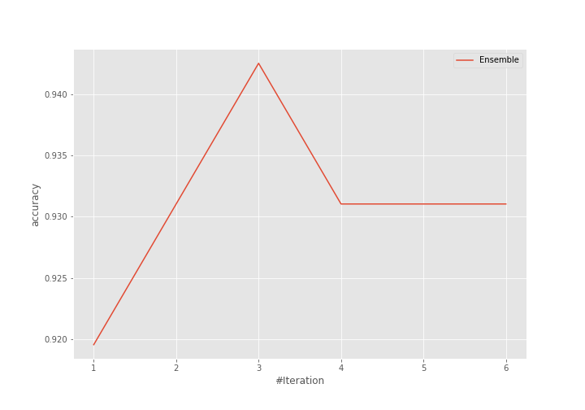
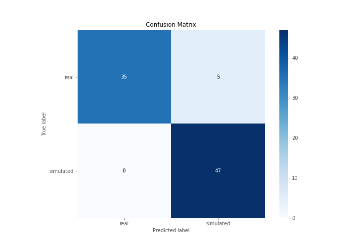
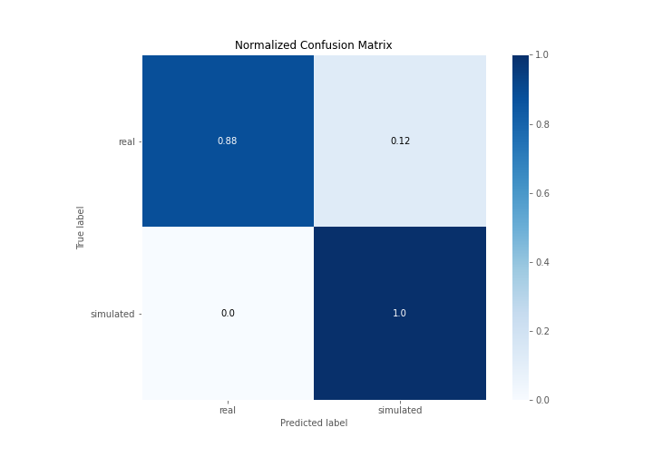
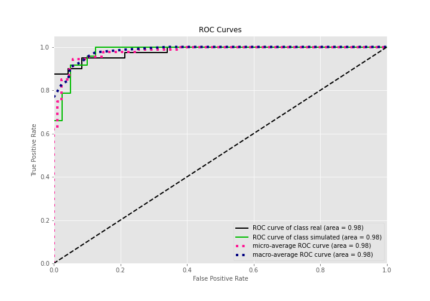
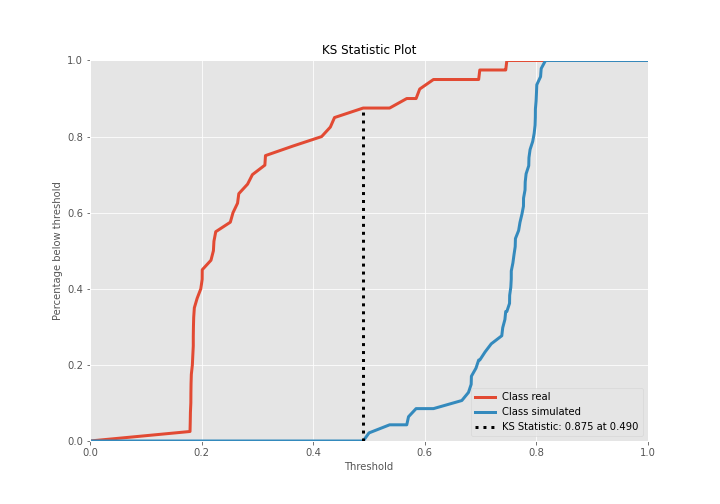
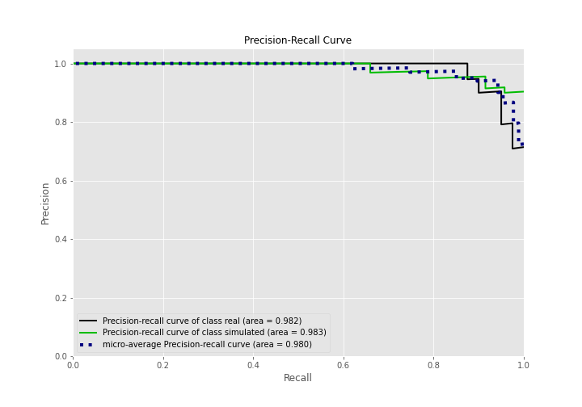
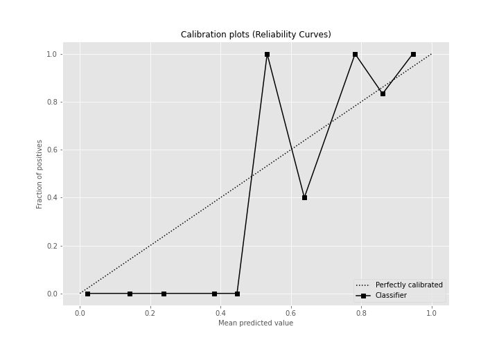
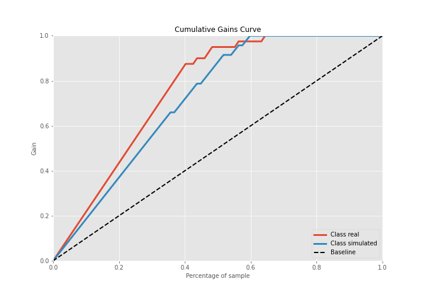
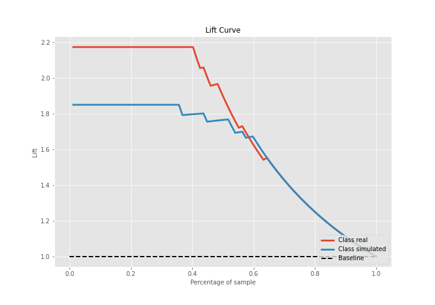

# Summary of Ensemble

[<< Go back](../README.md)

## Ensemble structure
| Model             |   Weight |
|:------------------|---------:|
| 1_Baseline        |        1 |
| 3_Linear          |        1 |
| 4_Default_Xgboost |        1 |

## Metric details
|           |    score |   threshold |
|:----------|---------:|------------:|
| logloss   | 0.340999 |  nan        |
| auc       | 0.980851 |  nan        |
| f1        | 0.949495 |    0.49797  |
| accuracy  | 0.942529 |    0.49797  |
| precision | 1        |    0.778966 |
| recall    | 1        |    0.161321 |
| mcc       | 0.889306 |    0.49797  |

## Confusion matrix (at threshold=0.49797)
|                      |   Predicted as real |   Predicted as simulated |
|:---------------------|--------------------:|-------------------------:|
| Labeled as real      |                  35 |                        5 |
| Labeled as simulated |                   0 |                       47 |

## Learning curves

## Confusion Matrix

## Normalized Confusion Matrix

## ROC Curve

## Kolmogorov-Smirnov Statistic

## Precision-Recall Curve

## Calibration Curve

## Cumulative Gains Curve

## Lift Curve

[<< Go back](../README.md)
