# Summary of 2_DecisionTree

[<< Go back](../README.md)

## Decision Tree
- **n_jobs**: -1
- **criterion**: gini
- **max_depth**: 3
- **explain_level**: 2

## Validation
 - **validation_type**: split
 - **train_ratio**: 0.75
 - **shuffle**: True
 - **stratify**: True

## Optimized metric
accuracy

## Training time

13.0 seconds

## Metric details
|           |    score |   threshold |
|:----------|---------:|------------:|
| logloss   | 0.694312 |  nan        |
| auc       | 0.815275 |  nan        |
| f1        | 0.816327 |    0.625    |
| accuracy  | 0.793103 |    0.625    |
| precision | 0.75     |    0.919355 |
| recall    | 1        |    0        |
| mcc       | 0.601249 |    0.625    |

## Confusion matrix (at threshold=0.625)
|                      |   Predicted as real |   Predicted as simulated |
|:---------------------|--------------------:|-------------------------:|
| Labeled as real      |                  29 |                       14 |
| Labeled as simulated |                   4 |                       40 |

## Learning curves
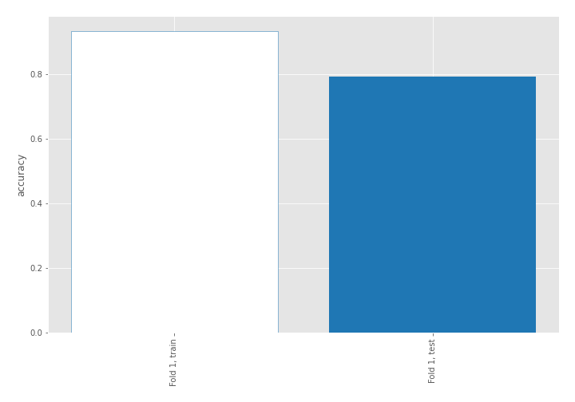

## Decision Tree 

### Tree #1
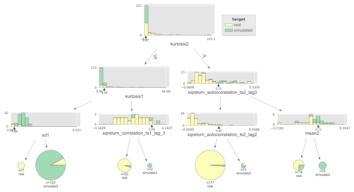

### Rules

if (kurtosis2 <= 2.965) and (kurtosis1 <= 3.445) and (sd1 > 1.083) then class: simulated (proba: 91.94%) | based on 124 samples

if (kurtosis2 > 2.965) and (sqreturn_autocorrelation_ts2_lag3 <= 0.122) and (sqreturn_autocorrelation_ts2_lag2 <= 0.198) then class: real (proba: 98.7%) | based on 77 samples

if (kurtosis2 <= 2.965) and (kurtosis1 > 3.445) and (sqreturn_correlation_ts1_lag_3 <= 0.09) then class: real (proba: 95.45%) | based on 22 samples

if (kurtosis2 > 2.965) and (sqreturn_autocorrelation_ts2_lag3 > 0.122) and (mean2 <= 0.13) then class: real (proba: 75.0%) | based on 16 samples

if (kurtosis2 > 2.965) and (sqreturn_autocorrelation_ts2_lag3 > 0.122) and (mean2 > 0.13) then class: simulated (proba: 100.0%) | based on 9 samples

if (kurtosis2 <= 2.965) and (kurtosis1 <= 3.445) and (sd1 <= 1.083) then class: real (proba: 100.0%) | based on 7 samples

if (kurtosis2 > 2.965) and (sqreturn_autocorrelation_ts2_lag3 <= 0.122) and (sqreturn_autocorrelation_ts2_lag2 > 0.198) then class: simulated (proba: 66.67%) | based on 3 samples

if (kurtosis2 <= 2.965) and (kurtosis1 > 3.445) and (sqreturn_correlation_ts1_lag_3 > 0.09) then class: simulated (proba: 100.0%) | based on 2 samples

## Permutation-based Importance
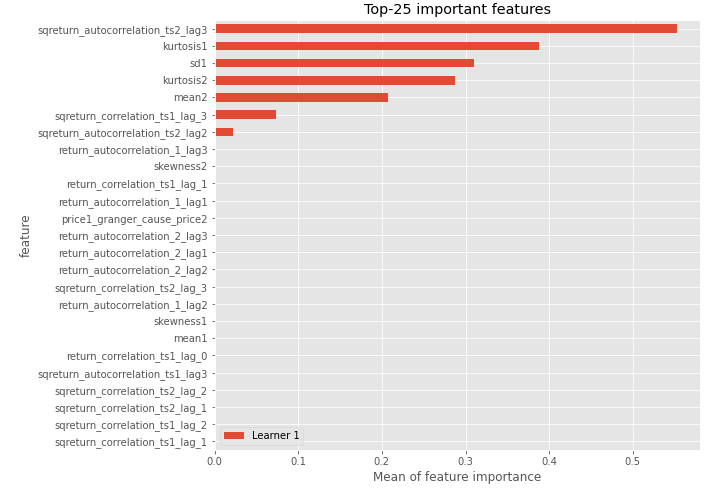
## Confusion Matrix

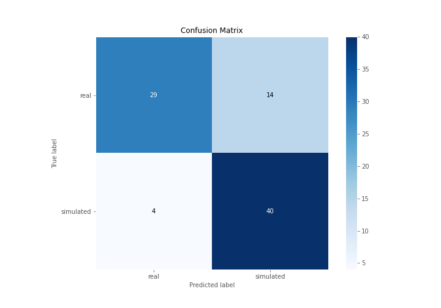

## Normalized Confusion Matrix

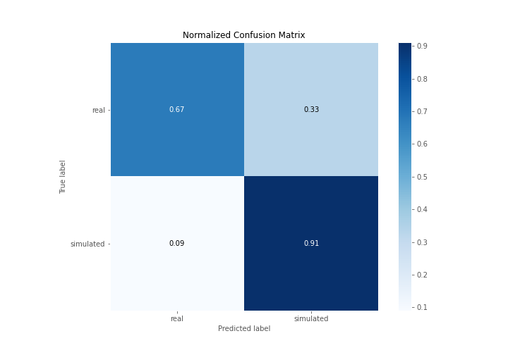

## ROC Curve

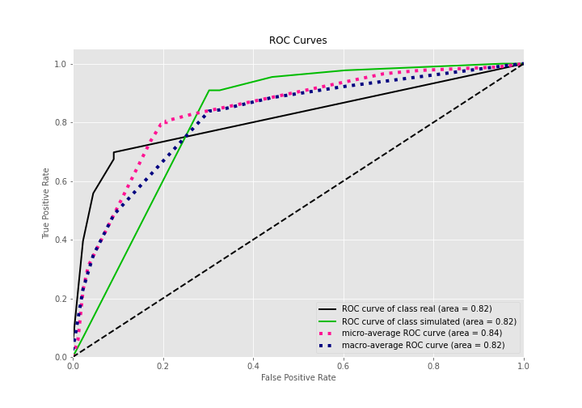

## Kolmogorov-Smirnov Statistic

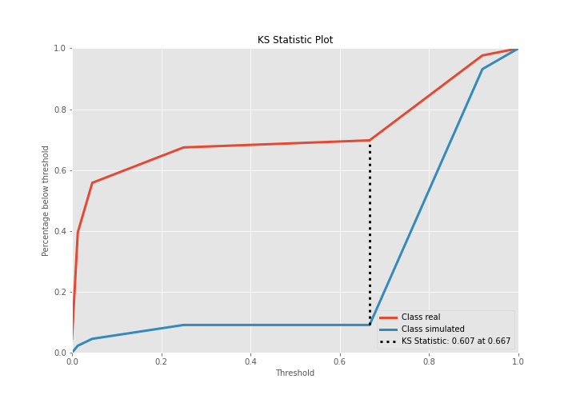

## Precision-Recall Curve

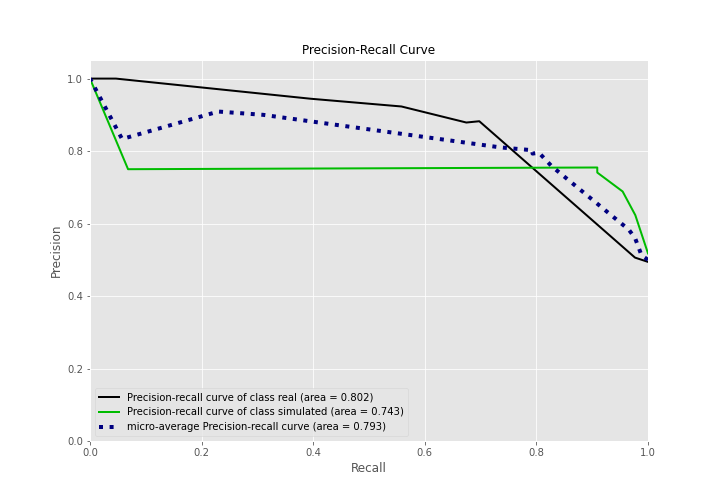

## Calibration Curve

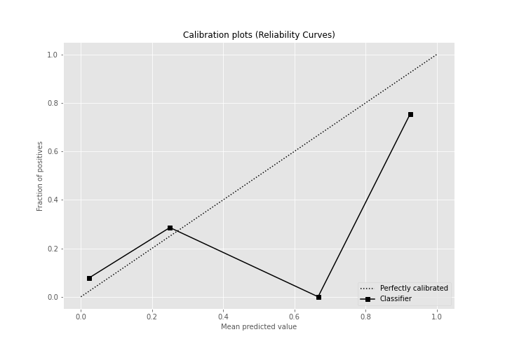

## Cumulative Gains Curve

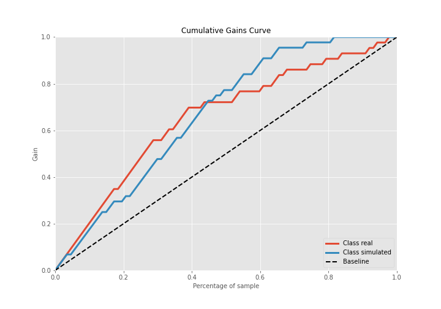

## Lift Curve

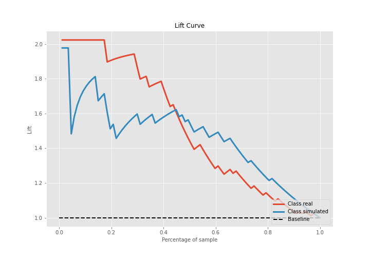

## SHAP Importance
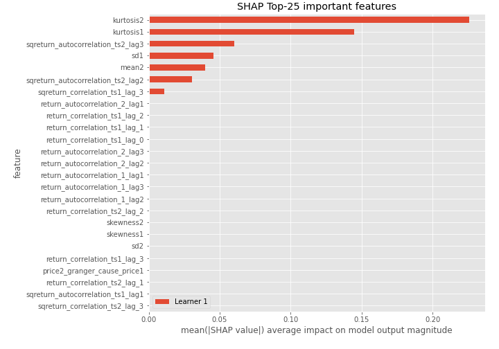

## SHAP Dependence plots

### Dependence (Fold 1)
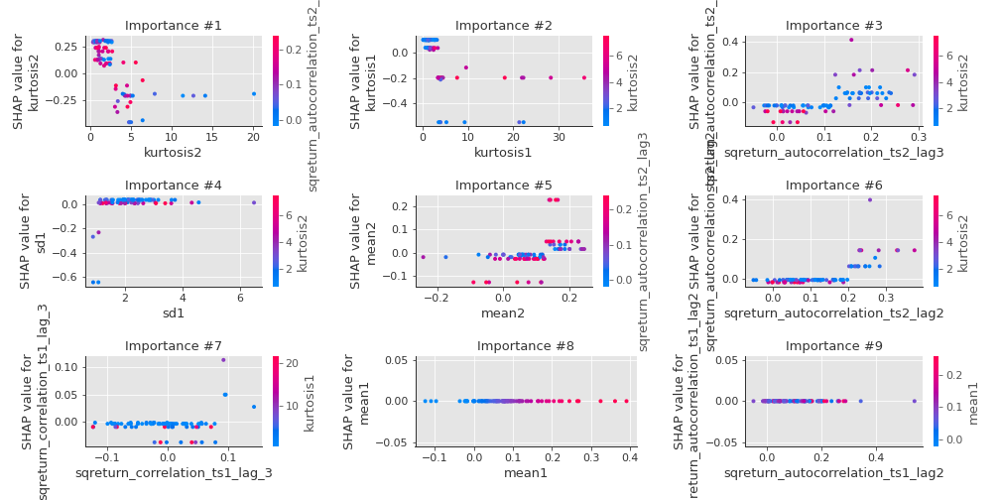

## SHAP Decision plots

### Top-10 Worst decisions for class 0 (Fold 1)
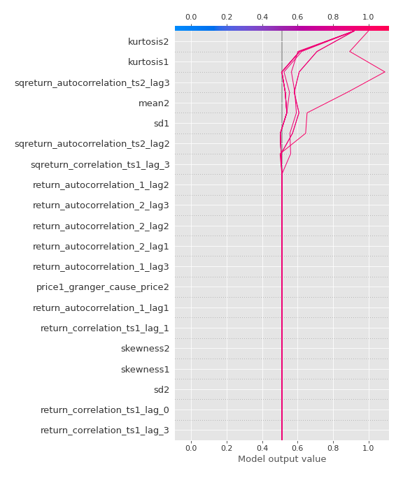
### Top-10 Best decisions for class 0 (Fold 1)
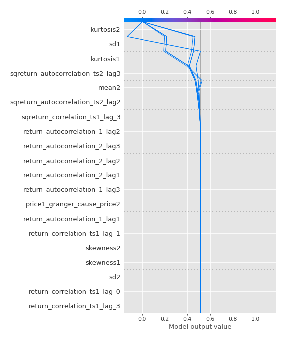
### Top-10 Worst decisions for class 1 (Fold 1)
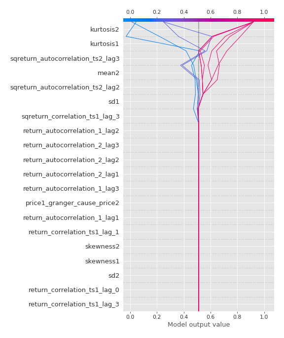
### Top-10 Best decisions for class 1 (Fold 1)
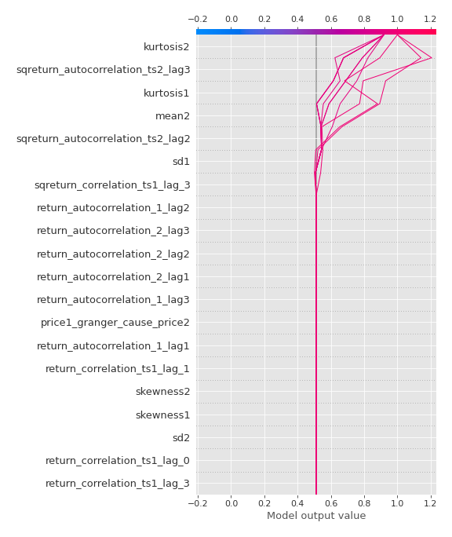

[<< Go back](../README.md)
