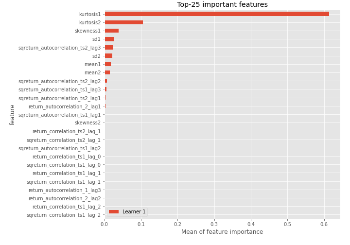
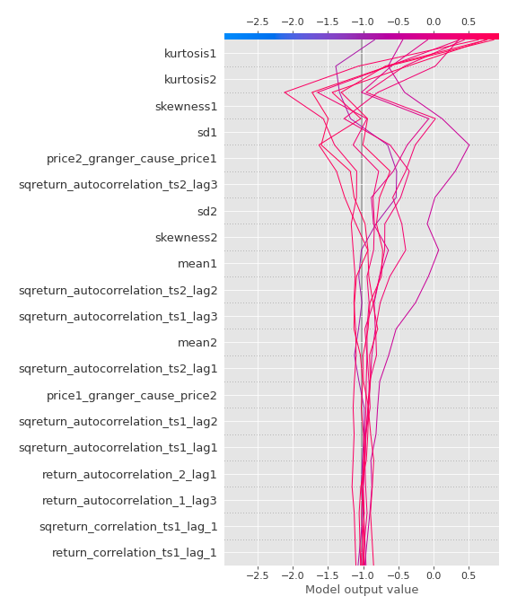

# Summary of 3_Linear

[<< Go back](../README.md)

## Logistic Regression (Linear)
- **n_jobs**: -1
- **explain_level**: 2

## Validation
 - **validation_type**: split
 - **train_ratio**: 0.75
 - **shuffle**: True
 - **stratify**: True

## Optimized metric
accuracy

## Training time

11.9 seconds

## Metric details
|           |    score |     threshold |
|:----------|---------:|--------------:|
| logloss   | 0.439324 | nan           |
| auc       | 0.884249 | nan           |
| f1        | 0.836735 |   0.568698    |
| accuracy  | 0.827586 |   0.645639    |
| precision | 0.9375   |   0.836246    |
| recall    | 1        |   1.38577e-07 |
| mcc       | 0.656419 |   0.645639    |

## Confusion matrix (at threshold=0.645639)
|                      |   Predicted as real |   Predicted as simulated |
|:---------------------|--------------------:|-------------------------:|
| Labeled as real      |                  34 |                        9 |
| Labeled as simulated |                   6 |                       38 |

## Learning curves

## Coefficients
| feature                           |   Learner_1 |
|:----------------------------------|------------:|
| sqreturn_autocorrelation_ts2_lag3 |  1.6217     |
| sqreturn_autocorrelation_ts2_lag2 |  1.40172    |
| mean1                             |  1.25302    |
| mean2                             |  1.24482    |
| sqreturn_autocorrelation_ts1_lag3 |  1.05571    |
| sqreturn_autocorrelation_ts2_lag1 |  0.878696   |
| return_autocorrelation_2_lag1     |  0.621239   |
| sd1                               |  0.613479   |
| return_autocorrelation_1_lag3     |  0.59814    |
| sqreturn_correlation_ts1_lag_1    |  0.529732   |
| return_correlation_ts1_lag_1      |  0.529732   |
| sqreturn_correlation_ts2_lag_1    |  0.514069   |
| return_correlation_ts2_lag_1      |  0.514069   |
| sqreturn_autocorrelation_ts1_lag1 |  0.393769   |
| return_autocorrelation_1_lag1     |  0.368401   |
| return_correlation_ts2_lag_3      |  0.357509   |
| sqreturn_correlation_ts2_lag_3    |  0.357509   |
| return_correlation_ts1_lag_3      |  0.325803   |
| sqreturn_correlation_ts1_lag_3    |  0.325803   |
| sqreturn_autocorrelation_ts1_lag2 |  0.316074   |
| return_autocorrelation_2_lag2     |  0.309729   |
| return_correlation_ts1_lag_2      |  0.154723   |
| sqreturn_correlation_ts1_lag_2    |  0.154723   |
| return_autocorrelation_2_lag3     |  0.153195   |
| return_autocorrelation_1_lag2     | -0.00718791 |
| return_correlation_ts2_lag_2      | -0.0472352  |
| sqreturn_correlation_ts2_lag_2    | -0.0472352  |
| price1_granger_cause_price2       | -0.118331   |
| sd2                               | -0.29596    |
| sqreturn_correlation_ts1_lag_0    | -0.343491   |
| return_correlation_ts1_lag_0      | -0.343491   |
| skewness2                         | -0.564194   |
| price2_granger_cause_price1       | -0.686314   |
| skewness1                         | -1.25237    |
| intercept                         | -1.72047    |
| kurtosis1                         | -2.90149    |
| kurtosis2                         | -3.14355    |

## Permutation-based Importance

## Confusion Matrix

## Normalized Confusion Matrix

## ROC Curve

## Kolmogorov-Smirnov Statistic

## Precision-Recall Curve

## Calibration Curve

## Cumulative Gains Curve

## Lift Curve

## SHAP Importance

## SHAP Dependence plots

### Dependence (Fold 1)

## SHAP Decision plots

### Top-10 Worst decisions for class 0 (Fold 1)

### Top-10 Best decisions for class 0 (Fold 1)

### Top-10 Worst decisions for class 1 (Fold 1)

### Top-10 Best decisions for class 1 (Fold 1)

[<< Go back](../README.md)
