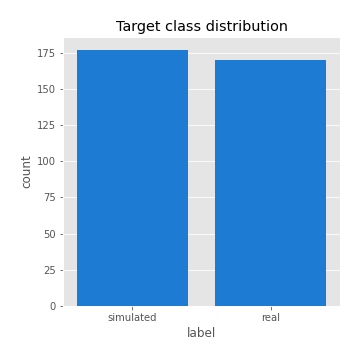
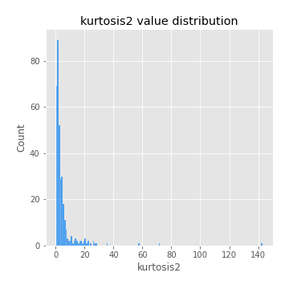
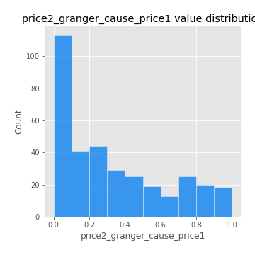

# Exploratory Data Analysis

[<< Go back](../README.md)
## Feature : target
- **Feature type** : categorical
- **Missing** : 0.0%
- **Unique** : 2
- **Count** :347
- **Unique** :2
- **Top** :simulated
- **Freq** :177

## Feature : mean1
- **Feature type** : continous
- **Missing** : 0.0%
- **Unique** : 347
- **Count** :347.0
- **Mean** :0.07889361867233308
- **Std** :0.08032524373544928
- **Min** :-0.22632637961920957
- **25%th Percentile** : 0.03431382433877855
- **50%th Percentile** : 0.07494873984686504
- **75%th Percentile** : 0.12140110794606401
- **Max** :0.3905893209760128

## Feature : mean2
- **Feature type** : continous
- **Missing** : 0.0%
- **Unique** : 347
- **Count** :347.0
- **Mean** :0.08645075323085491
- **Std** :0.08606469785679345
- **Min** :-0.24205418062825398
- **25%th Percentile** : 0.041596510250374405
- **50%th Percentile** : 0.0836847589537287
- **75%th Percentile** : 0.14256358104288494
- **Max** :0.35467233975026907

## Feature : sd1
- **Feature type** : continous
- **Missing** : 0.0%
- **Unique** : 347
- **Count** :347.0
- **Mean** :2.0690833741989567
- **Std** :0.8350924411742093
- **Min** :0.6632181566236454
- **25%th Percentile** : 1.540035850410174
- **50%th Percentile** : 1.9890063020262811
- **75%th Percentile** : 2.4465444449398768
- **Max** :9.236766377527575

## Feature : sd2
- **Feature type** : continous
- **Missing** : 0.0%
- **Unique** : 347
- **Count** :347.0
- **Mean** :1.9553914985078096
- **Std** :0.8212196589332598
- **Min** :0.8162354212162479
- **25%th Percentile** : 1.4353933284768834
- **50%th Percentile** : 1.811221229295349
- **75%th Percentile** : 2.261120101045092
- **Max** :6.737618636746393

## Feature : skewness1
- **Feature type** : continous
- **Missing** : 0.0%
- **Unique** : 347
- **Count** :347.0
- **Mean** :-0.19282856780662797
- **Std** :0.6098028655365444
- **Min** :-3.530116233761814
- **25%th Percentile** : -0.3273833031292977
- **50%th Percentile** : -0.13493971024125775
- **75%th Percentile** : 0.020567147922256633
- **Max** :2.5845963767725557

## Feature : skewness2
- **Feature type** : continous
- **Missing** : 0.0%
- **Unique** : 347
- **Count** :347.0
- **Mean** :-0.26585595398487083
- **Std** :0.8024604614258326
- **Min** :-8.801502855292393
- **25%th Percentile** : -0.3818811863894356
- **50%th Percentile** : -0.17165566484796957
- **75%th Percentile** : -0.0042651134897569755
- **Max** :1.9492855042693131

## Feature : kurtosis1
- **Feature type** : continous
- **Missing** : 0.0%
- **Unique** : 347
- **Count** :347.0
- **Mean** :4.105350152997473
- **Std** :6.252246882944991
- **Min** :0.042617886024750806
- **25%th Percentile** : 1.1057086822075144
- **50%th Percentile** : 2.011077323803685
- **75%th Percentile** : 3.8580232111538235
- **Max** :46.07507808162177

## Feature : kurtosis2
- **Feature type** : continous
- **Missing** : 0.0%
- **Unique** : 347
- **Count** :347.0
- **Mean** :4.810746712401509
- **Std** :10.210472467017608
- **Min** :0.11112032196472788
- **25%th Percentile** : 1.2167148133324126
- **50%th Percentile** : 2.1919162002524417
- **75%th Percentile** : 4.545819265962531
- **Max** :143.10871011533666

## Feature : return_autocorrelation_1_lag1
- **Feature type** : continous
- **Missing** : 0.0%
- **Unique** : 347
- **Count** :347.0
- **Mean** :-0.015278093931384337
- **Std** :0.05913162341604344
- **Min** :-0.2135576224968752
- **25%th Percentile** : -0.055530456111476036
- **50%th Percentile** : -0.0128233274390226
- **75%th Percentile** : 0.02213543302601178
- **Max** :0.1562156675485571

## Feature : return_autocorrelation_1_lag2
- **Feature type** : continous
- **Missing** : 0.0%
- **Unique** : 347
- **Count** :347.0
- **Mean** :-0.00830598672113837
- **Std** :0.052627319014883205
- **Min** :-0.13332423745051786
- **25%th Percentile** : -0.042574216341206006
- **50%th Percentile** : -0.006695536062972761
- **75%th Percentile** : 0.023950625550803673
- **Max** :0.1561488228015672

## Feature : return_autocorrelation_1_lag3
- **Feature type** : continous
- **Missing** : 0.0%
- **Unique** : 347
- **Count** :347.0
- **Mean** :-0.004345954389568774
- **Std** :0.05559698708270899
- **Min** :-0.1940836867390813
- **25%th Percentile** : -0.03858998506706031
- **50%th Percentile** : -0.005230672627303844
- **75%th Percentile** : 0.03270810703148806
- **Max** :0.17805869530681923

## Feature : return_autocorrelation_2_lag1
- **Feature type** : continous
- **Missing** : 0.0%
- **Unique** : 347
- **Count** :347.0
- **Mean** :-0.011260465116688136
- **Std** :0.06255326788064228
- **Min** :-0.24590087874039124
- **25%th Percentile** : -0.04279386867013399
- **50%th Percentile** : -0.00955231111966098
- **75%th Percentile** : 0.020895262019193544
- **Max** :0.31863413537898483

## Feature : return_autocorrelation_2_lag2
- **Feature type** : continous
- **Missing** : 0.0%
- **Unique** : 347
- **Count** :347.0
- **Mean** :-0.004583874759385951
- **Std** :0.05586965181566656
- **Min** :-0.15323211089747296
- **25%th Percentile** : -0.0402886213837278
- **50%th Percentile** : -0.009263523491696773
- **75%th Percentile** : 0.033107417598368494
- **Max** :0.20974504043791217

## Feature : return_autocorrelation_2_lag3
- **Feature type** : continous
- **Missing** : 0.0%
- **Unique** : 347
- **Count** :347.0
- **Mean** :-0.012454483943125224
- **Std** :0.05305869619610521
- **Min** :-0.1879165518815069
- **25%th Percentile** : -0.045234535642464616
- **50%th Percentile** : -0.010321274056735968
- **75%th Percentile** : 0.02377440866593153
- **Max** :0.1581321783923704

## Feature : return_correlation_ts1_lag_0
- **Feature type** : continous
- **Missing** : 0.0%
- **Unique** : 347
- **Count** :347.0
- **Mean** :0.3345409564698547
- **Std** :0.11104512271510873
- **Min** :-0.027089510445801036
- **25%th Percentile** : 0.2809065158440285
- **50%th Percentile** : 0.3393781374352397
- **75%th Percentile** : 0.38922333320649966
- **Max** :0.7041861626832071

## Feature : return_correlation_ts1_lag_1
- **Feature type** : continous
- **Missing** : 0.0%
- **Unique** : 347
- **Count** :347.0
- **Mean** :-0.009178692471700268
- **Std** :0.05440112561590955
- **Min** :-0.16985510949917193
- **25%th Percentile** : -0.0459513072718723
- **50%th Percentile** : -0.00878251908140008
- **75%th Percentile** : 0.027052262451868737
- **Max** :0.16564849700938686

## Feature : return_correlation_ts1_lag_2
- **Feature type** : continous
- **Missing** : 0.0%
- **Unique** : 347
- **Count** :347.0
- **Mean** :-0.0029276151339678075
- **Std** :0.053190894330091595
- **Min** :-0.21653581047581763
- **25%th Percentile** : -0.04012976517212667
- **50%th Percentile** : -0.00496879881406583
- **75%th Percentile** : 0.03653149962364305
- **Max** :0.15552143395553694

## Feature : return_correlation_ts1_lag_3
- **Feature type** : continous
- **Missing** : 0.0%
- **Unique** : 347
- **Count** :347.0
- **Mean** :-0.0038695986584595947
- **Std** :0.055756555765515296
- **Min** :-0.16291683679765628
- **25%th Percentile** : -0.04278603787381284
- **50%th Percentile** : -0.00468077505976925
- **75%th Percentile** : 0.031178133181152645
- **Max** :0.1636773216468148

## Feature : return_correlation_ts2_lag_1
- **Feature type** : continous
- **Missing** : 0.0%
- **Unique** : 347
- **Count** :347.0
- **Mean** :-0.009225468178182691
- **Std** :0.05533120211481029
- **Min** :-0.2081139431093261
- **25%th Percentile** : -0.04221991835651894
- **50%th Percentile** : -0.008552306461263657
- **75%th Percentile** : 0.023463594967956143
- **Max** :0.17208763791364762

## Feature : return_correlation_ts2_lag_2
- **Feature type** : continous
- **Missing** : 0.0%
- **Unique** : 347
- **Count** :347.0
- **Mean** :-0.003292288677070913
- **Std** :0.05022624922910036
- **Min** :-0.15299951737180204
- **25%th Percentile** : -0.036159812640031125
- **50%th Percentile** : -0.0033902387736731493
- **75%th Percentile** : 0.024998193454794107
- **Max** :0.20772887392904255

## Feature : return_correlation_ts2_lag_3
- **Feature type** : continous
- **Missing** : 0.0%
- **Unique** : 347
- **Count** :347.0
- **Mean** :-0.00887400871571944
- **Std** :0.056575254995508126
- **Min** :-0.17564076057312866
- **25%th Percentile** : -0.04371940694204214
- **50%th Percentile** : -0.007725498719377559
- **75%th Percentile** : 0.029770553803646595
- **Max** :0.13399594801496406

## Feature : sqreturn_autocorrelation_ts1_lag1
- **Feature type** : continous
- **Missing** : 0.0%
- **Unique** : 347
- **Count** :347.0
- **Mean** :0.11509747541954059
- **Std** :0.08971439561519762
- **Min** :-0.06532118872798363
- **25%th Percentile** : 0.0418269270028849
- **50%th Percentile** : 0.0974011899789658
- **75%th Percentile** : 0.1591044852311079
- **Max** :0.4439086285737898

## Feature : sqreturn_autocorrelation_ts1_lag2
- **Feature type** : continous
- **Missing** : 0.0%
- **Unique** : 347
- **Count** :347.0
- **Mean** :0.10945421023627118
- **Std** :0.09357101288923267
- **Min** :-0.05419304650062953
- **25%th Percentile** : 0.043238274572984084
- **50%th Percentile** : 0.09401412820589969
- **75%th Percentile** : 0.16690742650713572
- **Max** :0.540735851444759

## Feature : sqreturn_autocorrelation_ts1_lag3
- **Feature type** : continous
- **Missing** : 0.0%
- **Unique** : 347
- **Count** :347.0
- **Mean** :0.09877861393525857
- **Std** :0.08841075320129453
- **Min** :-0.05313973583773816
- **25%th Percentile** : 0.02753232426226342
- **50%th Percentile** : 0.09124774028069892
- **75%th Percentile** : 0.15172698572775567
- **Max** :0.44755937369538146

## Feature : sqreturn_autocorrelation_ts2_lag1
- **Feature type** : continous
- **Missing** : 0.0%
- **Unique** : 347
- **Count** :347.0
- **Mean** :0.11615536582347322
- **Std** :0.08489179681841444
- **Min** :-0.08520586663750691
- **25%th Percentile** : 0.05080685756786815
- **50%th Percentile** : 0.11074075760247731
- **75%th Percentile** : 0.16439300383957547
- **Max** :0.4303411518875286

## Feature : sqreturn_autocorrelation_ts2_lag2
- **Feature type** : continous
- **Missing** : 0.0%
- **Unique** : 347
- **Count** :347.0
- **Mean** :0.10755917441870258
- **Std** :0.09577718540788646
- **Min** :-0.051523884196217395
- **25%th Percentile** : 0.03192735649161743
- **50%th Percentile** : 0.091950355889237
- **75%th Percentile** : 0.16837173602686709
- **Max** :0.45676817892778204

## Feature : sqreturn_autocorrelation_ts2_lag3
- **Feature type** : continous
- **Missing** : 0.0%
- **Unique** : 347
- **Count** :347.0
- **Mean** :0.09998144041719877
- **Std** :0.08380727777957811
- **Min** :-0.06082766359524085
- **25%th Percentile** : 0.026936993438513634
- **50%th Percentile** : 0.09779320778897545
- **75%th Percentile** : 0.16268744778426383
- **Max** :0.33336132760969384

## Feature : sqreturn_correlation_ts1_lag_0
- **Feature type** : continous
- **Missing** : 0.0%
- **Unique** : 347
- **Count** :347.0
- **Mean** :0.3345409564698547
- **Std** :0.11104512271510873
- **Min** :-0.027089510445801036
- **25%th Percentile** : 0.2809065158440285
- **50%th Percentile** : 0.3393781374352397
- **75%th Percentile** : 0.38922333320649966
- **Max** :0.7041861626832071

## Feature : sqreturn_correlation_ts1_lag_1
- **Feature type** : continous
- **Missing** : 0.0%
- **Unique** : 347
- **Count** :347.0
- **Mean** :-0.009178692471700268
- **Std** :0.05440112561590955
- **Min** :-0.16985510949917193
- **25%th Percentile** : -0.0459513072718723
- **50%th Percentile** : -0.00878251908140008
- **75%th Percentile** : 0.027052262451868737
- **Max** :0.16564849700938686

## Feature : sqreturn_correlation_ts1_lag_2
- **Feature type** : continous
- **Missing** : 0.0%
- **Unique** : 347
- **Count** :347.0
- **Mean** :-0.0029276151339678075
- **Std** :0.053190894330091595
- **Min** :-0.21653581047581763
- **25%th Percentile** : -0.04012976517212667
- **50%th Percentile** : -0.00496879881406583
- **75%th Percentile** : 0.03653149962364305
- **Max** :0.15552143395553694

## Feature : sqreturn_correlation_ts1_lag_3
- **Feature type** : continous
- **Missing** : 0.0%
- **Unique** : 347
- **Count** :347.0
- **Mean** :-0.0038695986584595947
- **Std** :0.055756555765515296
- **Min** :-0.16291683679765628
- **25%th Percentile** : -0.04278603787381284
- **50%th Percentile** : -0.00468077505976925
- **75%th Percentile** : 0.031178133181152645
- **Max** :0.1636773216468148

## Feature : sqreturn_correlation_ts2_lag_1
- **Feature type** : continous
- **Missing** : 0.0%
- **Unique** : 347
- **Count** :347.0
- **Mean** :-0.009225468178182691
- **Std** :0.05533120211481029
- **Min** :-0.2081139431093261
- **25%th Percentile** : -0.04221991835651894
- **50%th Percentile** : -0.008552306461263657
- **75%th Percentile** : 0.023463594967956143
- **Max** :0.17208763791364762

## Feature : sqreturn_correlation_ts2_lag_2
- **Feature type** : continous
- **Missing** : 0.0%
- **Unique** : 347
- **Count** :347.0
- **Mean** :-0.003292288677070913
- **Std** :0.05022624922910036
- **Min** :-0.15299951737180204
- **25%th Percentile** : -0.036159812640031125
- **50%th Percentile** : -0.0033902387736731493
- **75%th Percentile** : 0.024998193454794107
- **Max** :0.20772887392904255

## Feature : sqreturn_correlation_ts2_lag_3
- **Feature type** : continous
- **Missing** : 0.0%
- **Unique** : 347
- **Count** :347.0
- **Mean** :-0.00887400871571944
- **Std** :0.056575254995508126
- **Min** :-0.17564076057312866
- **25%th Percentile** : -0.04371940694204214
- **50%th Percentile** : -0.007725498719377559
- **75%th Percentile** : 0.029770553803646595
- **Max** :0.13399594801496406

## Feature : price2_granger_cause_price1
- **Feature type** : continous
- **Missing** : 0.0%
- **Unique** : 347
- **Count** :347.0
- **Mean** :0.32808644564061307
- **Std** :0.30209507184961637
- **Min** :2.919615532302577e-09
- **25%th Percentile** : 0.07008166865035084
- **50%th Percentile** : 0.2428660803879566
- **75%th Percentile** : 0.5361920570124237
- **Max** :0.9999505998234581

## Feature : price1_granger_cause_price2
- **Feature type** : continous
- **Missing** : 0.0%
- **Unique** : 347
- **Count** :347.0
- **Mean** :0.3291685392320426
- **Std** :0.2912571211324261
- **Min** :5.594233727699385e-09
- **25%th Percentile** : 0.05962428184468556
- **50%th Percentile** : 0.25582508355529954
- **75%th Percentile** : 0.5963812306388518
- **Max** :0.996211868789438

[<< Go back](../README.md)
