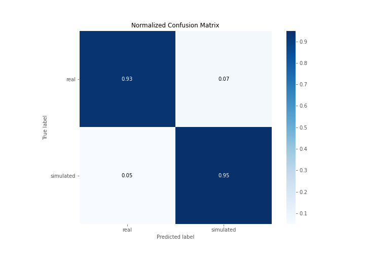

# Summary of Ensemble

[<< Go back](../README.md)

## Ensemble structure
| Model                   |   Weight |
|:------------------------|---------:|
| 3_Linear                |        1 |
| 5_Default_NeuralNetwork |        1 |

## Metric details
|           |    score |     threshold |
|:----------|---------:|--------------:|
| logloss   | 0.260201 | nan           |
| auc       | 0.966702 | nan           |
| f1        | 0.94382  |   0.549824    |
| accuracy  | 0.942529 |   0.549824    |
| precision | 1        |   0.926483    |
| recall    | 1        |   6.92885e-08 |
| mcc       | 0.885307 |   0.680795    |

## Confusion matrix (at threshold=0.549824)
|                      |   Predicted as real |   Predicted as simulated |
|:---------------------|--------------------:|-------------------------:|
| Labeled as real      |                  40 |                        3 |
| Labeled as simulated |                   2 |                       42 |

## Learning curves

## Confusion Matrix

## Normalized Confusion Matrix

## ROC Curve

## Kolmogorov-Smirnov Statistic

## Precision-Recall Curve

## Calibration Curve

## Cumulative Gains Curve

## Lift Curve

[<< Go back](../README.md)
