# Summary of 2_DecisionTree

[<< Go back](../README.md)

## Decision Tree
- **n_jobs**: -1
- **criterion**: gini
- **max_depth**: 3
- **explain_level**: 2

## Validation
 - **validation_type**: split
 - **train_ratio**: 0.75
 - **shuffle**: True
 - **stratify**: True

## Optimized metric
accuracy

## Training time

13.4 seconds

## Metric details
|           |    score |   threshold |
|:----------|---------:|------------:|
| logloss   | 0.753575 |      nan    |
| auc       | 0.810254 |      nan    |
| f1        | 0.814815 |        0    |
| accuracy  | 0.793103 |        0.66 |
| precision | 0.76     |        0.66 |
| recall    | 1        |        0    |
| mcc       | 0.60641  |        0    |

## Confusion matrix (at threshold=0.66)
|                      |   Predicted as real |   Predicted as simulated |
|:---------------------|--------------------:|-------------------------:|
| Labeled as real      |                  31 |                       12 |
| Labeled as simulated |                   6 |                       38 |

## Learning curves
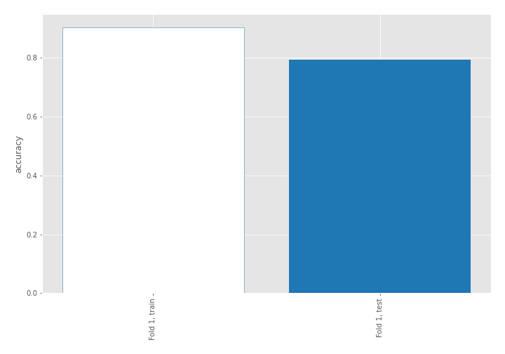

## Decision Tree 

### Tree #1
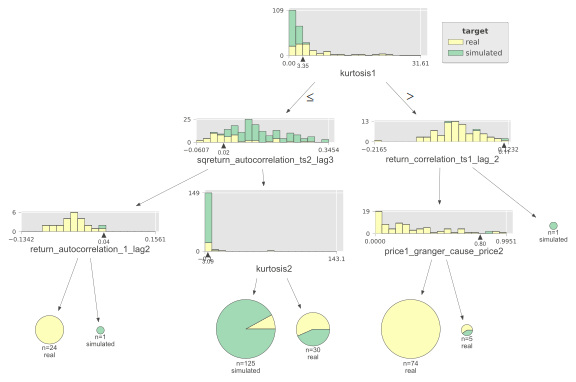

### Rules

if (kurtosis1 <= 3.346) and (sqreturn_autocorrelation_ts2_lag3 > 0.023) and (kurtosis2 <= 3.093) then class: simulated (proba: 92.0%) | based on 125 samples

if (kurtosis1 > 3.346) and (return_correlation_ts1_lag_2 <= 0.113) and (price1_granger_cause_price2 <= 0.798) then class: real (proba: 100.0%) | based on 74 samples

if (kurtosis1 <= 3.346) and (sqreturn_autocorrelation_ts2_lag3 > 0.023) and (kurtosis2 > 3.093) then class: real (proba: 56.67%) | based on 30 samples

if (kurtosis1 <= 3.346) and (sqreturn_autocorrelation_ts2_lag3 <= 0.023) and (return_autocorrelation_1_lag2 <= 0.045) then class: real (proba: 100.0%) | based on 24 samples

if (kurtosis1 > 3.346) and (return_correlation_ts1_lag_2 <= 0.113) and (price1_granger_cause_price2 > 0.798) then class: real (proba: 60.0%) | based on 5 samples

if (kurtosis1 > 3.346) and (return_correlation_ts1_lag_2 > 0.113) then class: simulated (proba: 100.0%) | based on 1 samples

if (kurtosis1 <= 3.346) and (sqreturn_autocorrelation_ts2_lag3 <= 0.023) and (return_autocorrelation_1_lag2 > 0.045) then class: simulated (proba: 100.0%) | based on 1 samples

## Permutation-based Importance
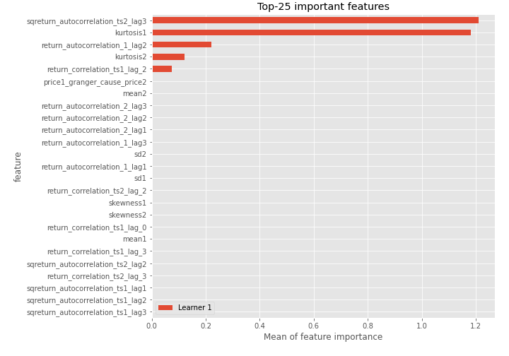
## Confusion Matrix

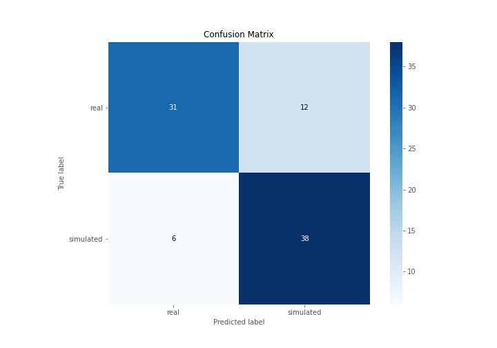

## Normalized Confusion Matrix

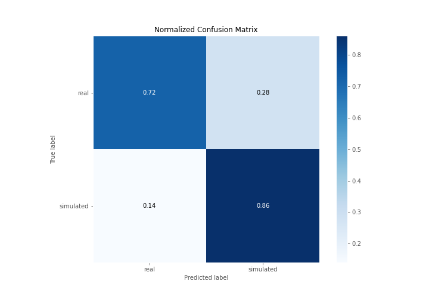

## ROC Curve

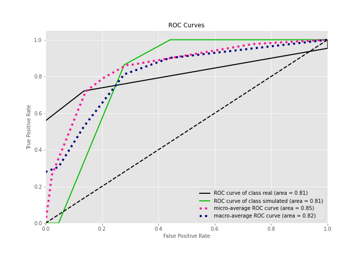

## Kolmogorov-Smirnov Statistic

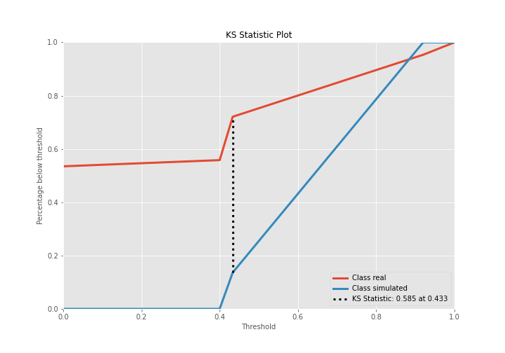

## Precision-Recall Curve

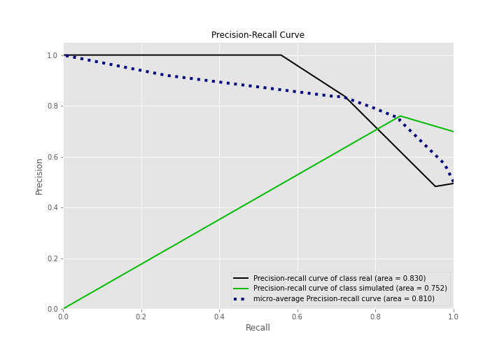

## Calibration Curve

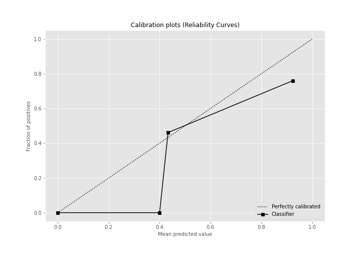

## Cumulative Gains Curve

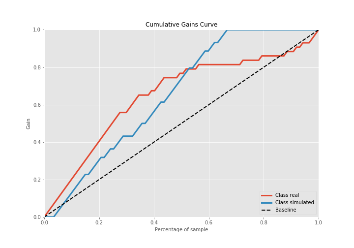

## Lift Curve

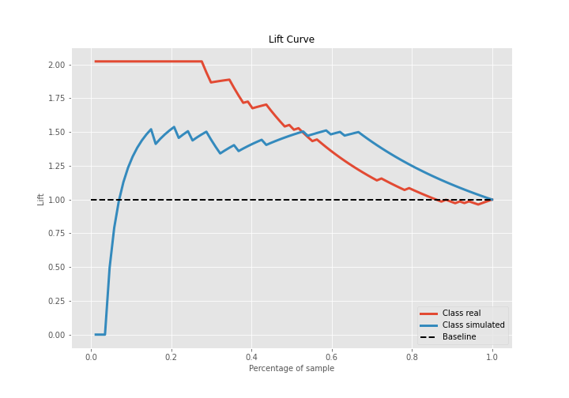

## SHAP Importance
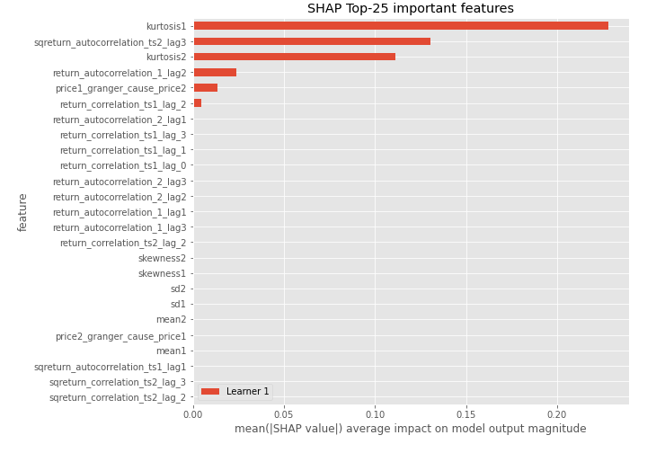

## SHAP Dependence plots

### Dependence (Fold 1)
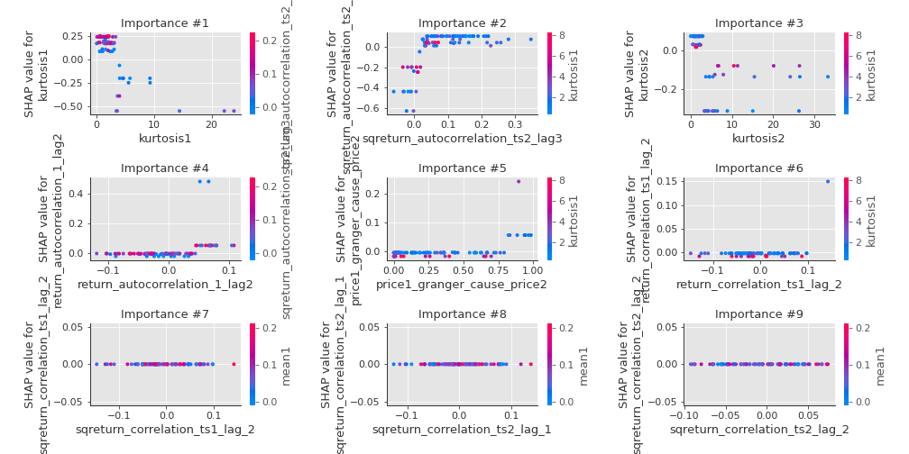

## SHAP Decision plots

### Top-10 Worst decisions for class 0 (Fold 1)

### Top-10 Best decisions for class 0 (Fold 1)
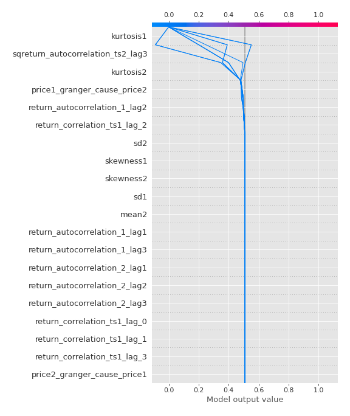
### Top-10 Worst decisions for class 1 (Fold 1)
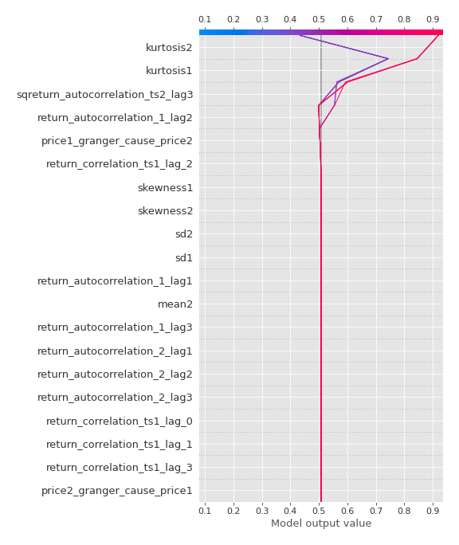
### Top-10 Best decisions for class 1 (Fold 1)
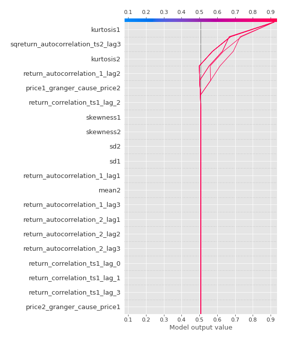

[<< Go back](../README.md)
