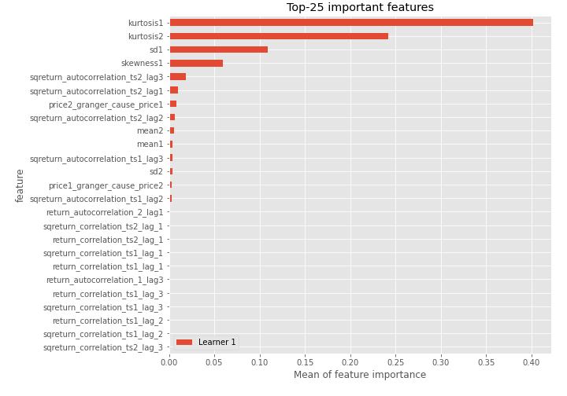

# Summary of 3_Linear

[<< Go back](../README.md)

## Logistic Regression (Linear)
- **n_jobs**: -1
- **explain_level**: 2

## Validation
 - **validation_type**: split
 - **train_ratio**: 0.75
 - **shuffle**: True
 - **stratify**: True

## Optimized metric
accuracy

## Training time

12.1 seconds

## Metric details
|           |    score |     threshold |
|:----------|---------:|--------------:|
| logloss   | 0.324237 | nan           |
| auc       | 0.968816 | nan           |
| f1        | 0.945055 |   0.655059    |
| accuracy  | 0.942529 |   0.655059    |
| precision | 1        |   0.934957    |
| recall    | 1        |   2.78292e-05 |
| mcc       | 0.887067 |   0.655059    |

## Confusion matrix (at threshold=0.655059)
|                      |   Predicted as real |   Predicted as simulated |
|:---------------------|--------------------:|-------------------------:|
| Labeled as real      |                  39 |                        4 |
| Labeled as simulated |                   1 |                       43 |

## Learning curves

## Coefficients
| feature                           |   Learner_1 |
|:----------------------------------|------------:|
| sqreturn_autocorrelation_ts2_lag3 |  1.63027    |
| sqreturn_autocorrelation_ts1_lag3 |  1.59825    |
| mean1                             |  1.42707    |
| mean2                             |  1.24542    |
| sqreturn_autocorrelation_ts2_lag1 |  0.922856   |
| return_autocorrelation_1_lag1     |  0.848848   |
| sqreturn_autocorrelation_ts1_lag1 |  0.785947   |
| sqreturn_autocorrelation_ts2_lag2 |  0.75865    |
| sqreturn_autocorrelation_ts1_lag2 |  0.738594   |
| sd1                               |  0.567414   |
| return_autocorrelation_2_lag1     |  0.49617    |
| return_correlation_ts1_lag_1      |  0.48998    |
| sqreturn_correlation_ts1_lag_1    |  0.48998    |
| sqreturn_correlation_ts2_lag_1    |  0.461114   |
| return_correlation_ts2_lag_1      |  0.461114   |
| return_autocorrelation_2_lag2     |  0.310199   |
| return_correlation_ts1_lag_3      |  0.291497   |
| sqreturn_correlation_ts1_lag_3    |  0.291497   |
| return_autocorrelation_2_lag3     |  0.187627   |
| skewness2                         |  0.149171   |
| return_autocorrelation_1_lag3     |  0.128035   |
| return_correlation_ts2_lag_3      |  0.0237865  |
| sqreturn_correlation_ts2_lag_3    |  0.0237865  |
| return_autocorrelation_1_lag2     |  0.00952151 |
| return_correlation_ts2_lag_2      | -0.0468877  |
| sqreturn_correlation_ts2_lag_2    | -0.0468877  |
| return_correlation_ts1_lag_2      | -0.0774217  |
| sqreturn_correlation_ts1_lag_2    | -0.0774217  |
| sd2                               | -0.197532   |
| price2_granger_cause_price1       | -0.498392   |
| return_correlation_ts1_lag_0      | -0.504789   |
| sqreturn_correlation_ts1_lag_0    | -0.504789   |
| price1_granger_cause_price2       | -0.543065   |
| skewness1                         | -1.3286     |
| intercept                         | -1.54586    |
| kurtosis2                         | -2.61147    |
| kurtosis1                         | -3.39314    |

## Permutation-based Importance

## Confusion Matrix

## Normalized Confusion Matrix

## ROC Curve

## Kolmogorov-Smirnov Statistic

## Precision-Recall Curve

## Calibration Curve

## Cumulative Gains Curve

## Lift Curve

## SHAP Importance

## SHAP Dependence plots

### Dependence (Fold 1)

## SHAP Decision plots

### Top-10 Worst decisions for class 0 (Fold 1)

### Top-10 Best decisions for class 0 (Fold 1)

### Top-10 Worst decisions for class 1 (Fold 1)

### Top-10 Best decisions for class 1 (Fold 1)

[<< Go back](../README.md)
