# Exploratory Data Analysis

[<< Go back](../README.md)
## Feature : target
- **Feature type** : categorical
- **Missing** : 0.0%
- **Unique** : 2
- **Count** :347
- **Unique** :2
- **Top** :simulated
- **Freq** :176

## Feature : mean1
- **Feature type** : continous
- **Missing** : 0.0%
- **Unique** : 347
- **Count** :347.0
- **Mean** :0.07820943686060197
- **Std** :0.07572004715091206
- **Min** :-0.17686457077756634
- **25%th Percentile** : 0.029887140284936553
- **50%th Percentile** : 0.07673259333963232
- **75%th Percentile** : 0.1207653790401036
- **Max** :0.3612366374600757

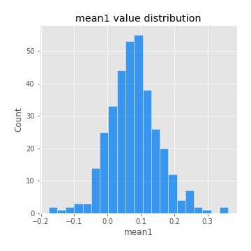
## Feature : mean2
- **Feature type** : continous
- **Missing** : 0.0%
- **Unique** : 347
- **Count** :347.0
- **Mean** :0.09468019160135047
- **Std** :0.08483563340639798
- **Min** :-0.24205418062825398
- **25%th Percentile** : 0.04963049218240359
- **50%th Percentile** : 0.09521606513238334
- **75%th Percentile** : 0.14850543234646477
- **Max** :0.3495479277009939

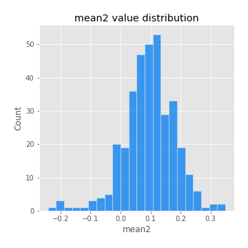
## Feature : sd1
- **Feature type** : continous
- **Missing** : 0.0%
- **Unique** : 347
- **Count** :347.0
- **Mean** :2.040699726951028
- **Std** :0.6730353801758735
- **Min** :0.7620831696941981
- **25%th Percentile** : 1.5530816796582223
- **50%th Percentile** : 1.9919573746190264
- **75%th Percentile** : 2.460674945732508
- **Max** :5.996244884956102

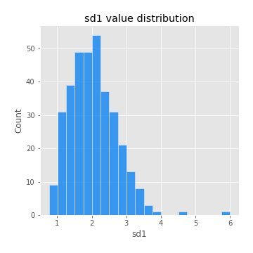
## Feature : sd2
- **Feature type** : continous
- **Missing** : 0.0%
- **Unique** : 347
- **Count** :347.0
- **Mean** :1.9282592155718408
- **Std** :0.6906688817760496
- **Min** :0.8455946193085045
- **25%th Percentile** : 1.4458478614243688
- **50%th Percentile** : 1.803663407154682
- **75%th Percentile** : 2.237803337093757
- **Max** :5.762808157208253

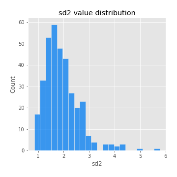
## Feature : skewness1
- **Feature type** : continous
- **Missing** : 0.0%
- **Unique** : 347
- **Count** :347.0
- **Mean** :-0.15355760935249071
- **Std** :0.5662995146735248
- **Min** :-3.530116233761814
- **25%th Percentile** : -0.31827227742860176
- **50%th Percentile** : -0.13587707074939212
- **75%th Percentile** : 0.04336459188868917
- **Max** :2.5845963767725557

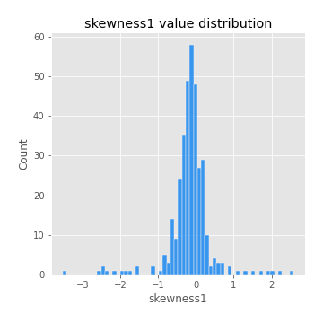
## Feature : skewness2
- **Feature type** : continous
- **Missing** : 0.0%
- **Unique** : 347
- **Count** :347.0
- **Mean** :-0.2466200324271012
- **Std** :0.792224500422687
- **Min** :-8.801502855292393
- **25%th Percentile** : -0.38424576026544927
- **50%th Percentile** : -0.15962679898973287
- **75%th Percentile** : 0.05013062076003981
- **Max** :2.123597625075353

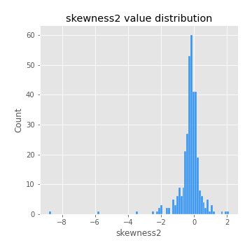
## Feature : kurtosis1
- **Feature type** : continous
- **Missing** : 0.0%
- **Unique** : 347
- **Count** :347.0
- **Mean** :3.6550743119104068
- **Std** :5.026730407771696
- **Min** :0.004283132113435784
- **25%th Percentile** : 1.2015455774399166
- **50%th Percentile** : 1.9511810812306831
- **75%th Percentile** : 3.6302727341974736
- **Max** :31.614652972751188

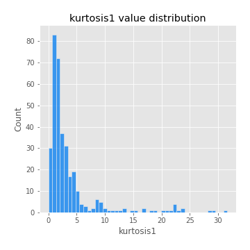
## Feature : kurtosis2
- **Feature type** : continous
- **Missing** : 0.0%
- **Unique** : 347
- **Count** :347.0
- **Mean** :4.74883408636838
- **Std** :9.815781212098457
- **Min** :-0.0500756903409334
- **25%th Percentile** : 1.2967136694544696
- **50%th Percentile** : 2.153851086544067
- **75%th Percentile** : 4.554197422813971
- **Max** :143.10871011533666

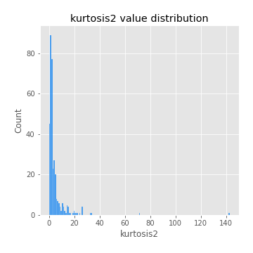
## Feature : return_autocorrelation_1_lag1
- **Feature type** : continous
- **Missing** : 0.0%
- **Unique** : 347
- **Count** :347.0
- **Mean** :-0.015166301188453775
- **Std** :0.06436648076844204
- **Min** :-0.2135576224968752
- **25%th Percentile** : -0.057130643655197
- **50%th Percentile** : -0.014167008248416638
- **75%th Percentile** : 0.02770191285928538
- **Max** :0.15918357355760696

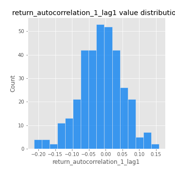
## Feature : return_autocorrelation_1_lag2
- **Feature type** : continous
- **Missing** : 0.0%
- **Unique** : 347
- **Count** :347.0
- **Mean** :-0.005652812897217987
- **Std** :0.051649407834496126
- **Min** :-0.13415831088714275
- **25%th Percentile** : -0.03733367077534049
- **50%th Percentile** : -0.004613866201947514
- **75%th Percentile** : 0.027663642668319485
- **Max** :0.1561488228015672

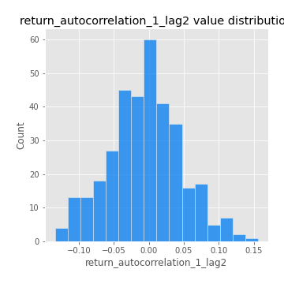
## Feature : return_autocorrelation_1_lag3
- **Feature type** : continous
- **Missing** : 0.0%
- **Unique** : 347
- **Count** :347.0
- **Mean** :-0.0032230394444391175
- **Std** :0.05387385711660548
- **Min** :-0.15806635192103805
- **25%th Percentile** : -0.03618712744686049
- **50%th Percentile** : -0.004768522405721383
- **75%th Percentile** : 0.03475889522000164
- **Max** :0.14202787977725903

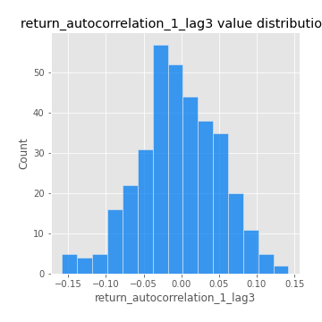
## Feature : return_autocorrelation_2_lag1
- **Feature type** : continous
- **Missing** : 0.0%
- **Unique** : 347
- **Count** :347.0
- **Mean** :-0.016547690582436037
- **Std** :0.06270236816299711
- **Min** :-0.25075531010123286
- **25%th Percentile** : -0.05030879902733458
- **50%th Percentile** : -0.012971039814087247
- **75%th Percentile** : 0.024952260411617244
- **Max** :0.31863413537898483

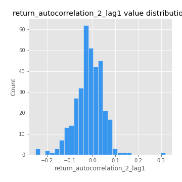
## Feature : return_autocorrelation_2_lag2
- **Feature type** : continous
- **Missing** : 0.0%
- **Unique** : 347
- **Count** :347.0
- **Mean** :-0.005183069969846025
- **Std** :0.05536317750707622
- **Min** :-0.15522407608544048
- **25%th Percentile** : -0.04080263788680657
- **50%th Percentile** : -0.009057888019764485
- **75%th Percentile** : 0.026968851226535792
- **Max** :0.20974504043791217

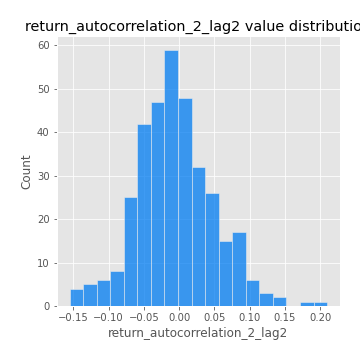
## Feature : return_autocorrelation_2_lag3
- **Feature type** : continous
- **Missing** : 0.0%
- **Unique** : 347
- **Count** :347.0
- **Mean** :-0.005432450660199558
- **Std** :0.05559565651432773
- **Min** :-0.15265722957830954
- **25%th Percentile** : -0.043433709585619575
- **50%th Percentile** : -0.004101317810487607
- **75%th Percentile** : 0.025952347172220815
- **Max** :0.1528223934099494

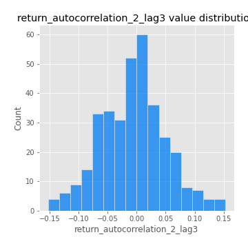
## Feature : return_correlation_ts1_lag_0
- **Feature type** : continous
- **Missing** : 0.0%
- **Unique** : 347
- **Count** :347.0
- **Mean** :0.3315513562998647
- **Std** :0.10764444417143024
- **Min** :-0.027089510445801036
- **25%th Percentile** : 0.2775078326544954
- **50%th Percentile** : 0.3420954049703948
- **75%th Percentile** : 0.38430023835673405
- **Max** :0.7041861626832071

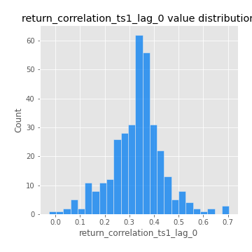
## Feature : return_correlation_ts1_lag_1
- **Feature type** : continous
- **Missing** : 0.0%
- **Unique** : 347
- **Count** :347.0
- **Mean** :-0.013486590051891073
- **Std** :0.05301050750425046
- **Min** :-0.16985510949917193
- **25%th Percentile** : -0.045179292946635655
- **50%th Percentile** : -0.010547851606129402
- **75%th Percentile** : 0.02177448841946538
- **Max** :0.11819480385322509

## Feature : return_correlation_ts1_lag_2
- **Feature type** : continous
- **Missing** : 0.0%
- **Unique** : 347
- **Count** :347.0
- **Mean** :-0.0025079026988810258
- **Std** :0.05480047062861896
- **Min** :-0.21653581047581763
- **25%th Percentile** : -0.03588167387583577
- **50%th Percentile** : -0.00020119542434261512
- **75%th Percentile** : 0.03605747400125655
- **Max** :0.14246145137350832

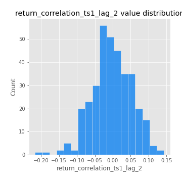
## Feature : return_correlation_ts1_lag_3
- **Feature type** : continous
- **Missing** : 0.0%
- **Unique** : 347
- **Count** :347.0
- **Mean** :0.0007321655718394157
- **Std** :0.057306879809269795
- **Min** :-0.16391511028414787
- **25%th Percentile** : -0.03470122629005529
- **50%th Percentile** : -0.0004028145926102824
- **75%th Percentile** : 0.041132717473819025
- **Max** :0.18357469325660072

## Feature : return_correlation_ts2_lag_1
- **Feature type** : continous
- **Missing** : 0.0%
- **Unique** : 347
- **Count** :347.0
- **Mean** :-0.01010622952394298
- **Std** :0.05733101456973461
- **Min** :-0.2081139431093261
- **25%th Percentile** : -0.045033528427011915
- **50%th Percentile** : -0.01030996025442917
- **75%th Percentile** : 0.026525039174889097
- **Max** :0.137664256292347

## Feature : return_correlation_ts2_lag_2
- **Feature type** : continous
- **Missing** : 0.0%
- **Unique** : 347
- **Count** :347.0
- **Mean** :-0.002852802351874535
- **Std** :0.051108261653258116
- **Min** :-0.23751835475804678
- **25%th Percentile** : -0.03709315880862596
- **50%th Percentile** : -0.003186316216567342
- **75%th Percentile** : 0.027778216782668015
- **Max** :0.20772887392904255

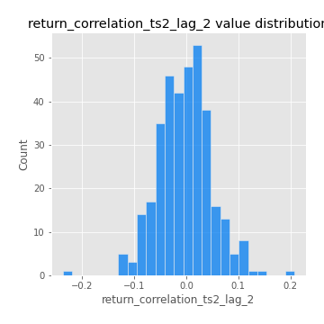
## Feature : return_correlation_ts2_lag_3
- **Feature type** : continous
- **Missing** : 0.0%
- **Unique** : 347
- **Count** :347.0
- **Mean** :-0.004873847441056802
- **Std** :0.05486773818499829
- **Min** :-0.17564076057312866
- **25%th Percentile** : -0.03899517362273837
- **50%th Percentile** : -0.004399611847170813
- **75%th Percentile** : 0.03552127075523308
- **Max** :0.13128380114518473

## Feature : sqreturn_autocorrelation_ts1_lag1
- **Feature type** : continous
- **Missing** : 0.0%
- **Unique** : 347
- **Count** :347.0
- **Mean** :0.11629420398401301
- **Std** :0.08900486247881685
- **Min** :-0.06532118872798363
- **25%th Percentile** : 0.05317105431388448
- **50%th Percentile** : 0.10356430512810995
- **75%th Percentile** : 0.1666406331836503
- **Max** :0.49414293176447355

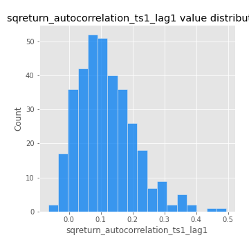
## Feature : sqreturn_autocorrelation_ts1_lag2
- **Feature type** : continous
- **Missing** : 0.0%
- **Unique** : 347
- **Count** :347.0
- **Mean** :0.11061719646217374
- **Std** :0.09484957167051315
- **Min** :-0.05419304650062953
- **25%th Percentile** : 0.04022378482464568
- **50%th Percentile** : 0.09743090672436897
- **75%th Percentile** : 0.15998402784919138
- **Max** :0.540735851444759

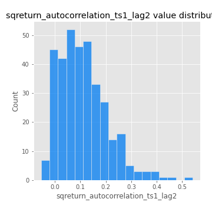
## Feature : sqreturn_autocorrelation_ts1_lag3
- **Feature type** : continous
- **Missing** : 0.0%
- **Unique** : 347
- **Count** :347.0
- **Mean** :0.10058610697167536
- **Std** :0.08721862716976378
- **Min** :-0.06486026764840777
- **25%th Percentile** : 0.03185891516095117
- **50%th Percentile** : 0.08852368549586581
- **75%th Percentile** : 0.16336082849506828
- **Max** :0.3457940197475473

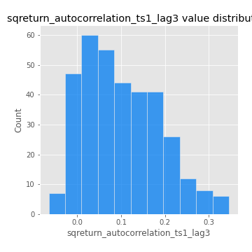
## Feature : sqreturn_autocorrelation_ts2_lag1
- **Feature type** : continous
- **Missing** : 0.0%
- **Unique** : 347
- **Count** :347.0
- **Mean** :0.11841838603373822
- **Std** :0.08701645807380785
- **Min** :-0.026796415279758023
- **25%th Percentile** : 0.05283302737616993
- **50%th Percentile** : 0.11127151738258367
- **75%th Percentile** : 0.16897303415421444
- **Max** :0.510085647437958

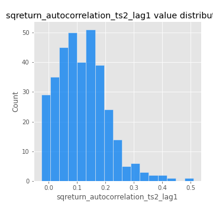
## Feature : sqreturn_autocorrelation_ts2_lag2
- **Feature type** : continous
- **Missing** : 0.0%
- **Unique** : 347
- **Count** :347.0
- **Mean** :0.10563824767967324
- **Std** :0.09002018672030462
- **Min** :-0.04424883229120365
- **25%th Percentile** : 0.03492206419176931
- **50%th Percentile** : 0.09543291737709683
- **75%th Percentile** : 0.155151168407676
- **Max** :0.5373432415582473

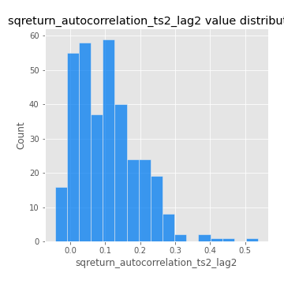
## Feature : sqreturn_autocorrelation_ts2_lag3
- **Feature type** : continous
- **Missing** : 0.0%
- **Unique** : 347
- **Count** :347.0
- **Mean** :0.10174119899548713
- **Std** :0.0871542406407644
- **Min** :-0.06082766359524085
- **25%th Percentile** : 0.03313354511444918
- **50%th Percentile** : 0.09514746978388422
- **75%th Percentile** : 0.15411780231133326
- **Max** :0.34681956493441024

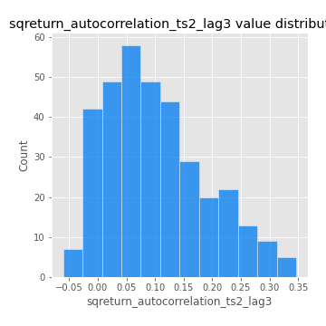
## Feature : sqreturn_correlation_ts1_lag_0
- **Feature type** : continous
- **Missing** : 0.0%
- **Unique** : 347
- **Count** :347.0
- **Mean** :0.3315513562998647
- **Std** :0.10764444417143024
- **Min** :-0.027089510445801036
- **25%th Percentile** : 0.2775078326544954
- **50%th Percentile** : 0.3420954049703948
- **75%th Percentile** : 0.38430023835673405
- **Max** :0.7041861626832071

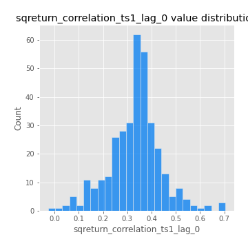
## Feature : sqreturn_correlation_ts1_lag_1
- **Feature type** : continous
- **Missing** : 0.0%
- **Unique** : 347
- **Count** :347.0
- **Mean** :-0.013486590051891073
- **Std** :0.05301050750425046
- **Min** :-0.16985510949917193
- **25%th Percentile** : -0.045179292946635655
- **50%th Percentile** : -0.010547851606129402
- **75%th Percentile** : 0.02177448841946538
- **Max** :0.11819480385322509

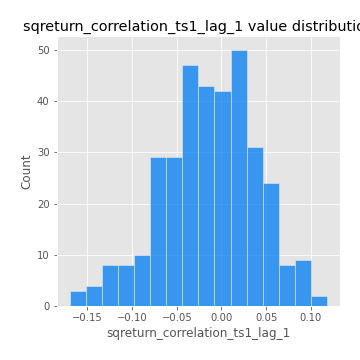
## Feature : sqreturn_correlation_ts1_lag_2
- **Feature type** : continous
- **Missing** : 0.0%
- **Unique** : 347
- **Count** :347.0
- **Mean** :-0.0025079026988810258
- **Std** :0.05480047062861896
- **Min** :-0.21653581047581763
- **25%th Percentile** : -0.03588167387583577
- **50%th Percentile** : -0.00020119542434261512
- **75%th Percentile** : 0.03605747400125655
- **Max** :0.14246145137350832

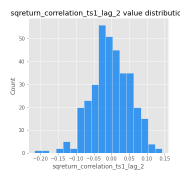
## Feature : sqreturn_correlation_ts1_lag_3
- **Feature type** : continous
- **Missing** : 0.0%
- **Unique** : 347
- **Count** :347.0
- **Mean** :0.0007321655718394157
- **Std** :0.057306879809269795
- **Min** :-0.16391511028414787
- **25%th Percentile** : -0.03470122629005529
- **50%th Percentile** : -0.0004028145926102824
- **75%th Percentile** : 0.041132717473819025
- **Max** :0.18357469325660072

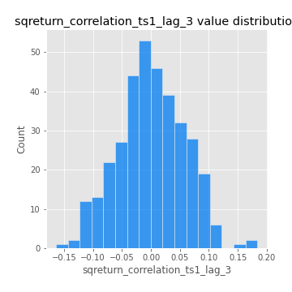
## Feature : sqreturn_correlation_ts2_lag_1
- **Feature type** : continous
- **Missing** : 0.0%
- **Unique** : 347
- **Count** :347.0
- **Mean** :-0.01010622952394298
- **Std** :0.05733101456973461
- **Min** :-0.2081139431093261
- **25%th Percentile** : -0.045033528427011915
- **50%th Percentile** : -0.01030996025442917
- **75%th Percentile** : 0.026525039174889097
- **Max** :0.137664256292347

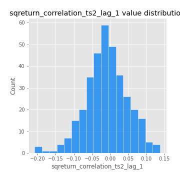
## Feature : sqreturn_correlation_ts2_lag_2
- **Feature type** : continous
- **Missing** : 0.0%
- **Unique** : 347
- **Count** :347.0
- **Mean** :-0.002852802351874535
- **Std** :0.051108261653258116
- **Min** :-0.23751835475804678
- **25%th Percentile** : -0.03709315880862596
- **50%th Percentile** : -0.003186316216567342
- **75%th Percentile** : 0.027778216782668015
- **Max** :0.20772887392904255

## Feature : sqreturn_correlation_ts2_lag_3
- **Feature type** : continous
- **Missing** : 0.0%
- **Unique** : 347
- **Count** :347.0
- **Mean** :-0.004873847441056802
- **Std** :0.05486773818499829
- **Min** :-0.17564076057312866
- **25%th Percentile** : -0.03899517362273837
- **50%th Percentile** : -0.004399611847170813
- **75%th Percentile** : 0.03552127075523308
- **Max** :0.13128380114518473

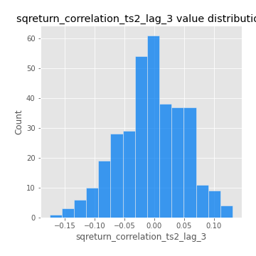
## Feature : price2_granger_cause_price1
- **Feature type** : continous
- **Missing** : 0.0%
- **Unique** : 347
- **Count** :347.0
- **Mean** :0.31211937969992415
- **Std** :0.29299547439232626
- **Min** :1.2724912242069374e-06
- **25%th Percentile** : 0.03957488115807705
- **50%th Percentile** : 0.23337445914814306
- **75%th Percentile** : 0.543371258829241
- **Max** :0.9894278505261417

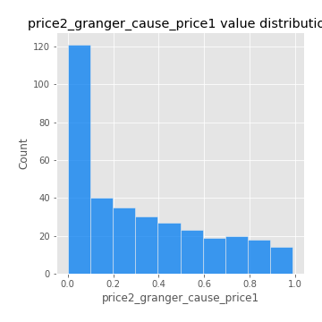
## Feature : price1_granger_cause_price2
- **Feature type** : continous
- **Missing** : 0.0%
- **Unique** : 347
- **Count** :347.0
- **Mean** :0.31617216277650667
- **Std** :0.301910679371707
- **Min** :6.658163157542764e-07
- **25%th Percentile** : 0.039410559275944876
- **50%th Percentile** : 0.2244123542631357
- **75%th Percentile** : 0.5512671453089386
- **Max** :0.9951398266867577

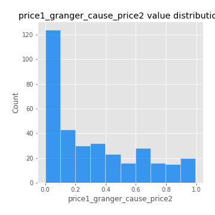

[<< Go back](../README.md)
