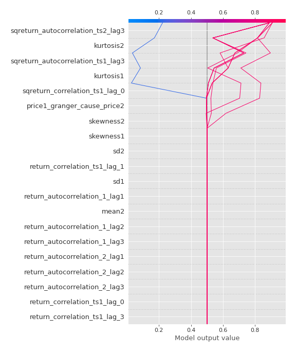

# Summary of 2_DecisionTree

[<< Go back](../README.md)

## Decision Tree
- **n_jobs**: -1
- **criterion**: gini
- **max_depth**: 3
- **explain_level**: 2

## Validation
 - **validation_type**: split
 - **train_ratio**: 0.75
 - **shuffle**: True
 - **stratify**: True

## Optimized metric
accuracy

## Training time

14.5 seconds

## Metric details
|           |    score |   threshold |
|:----------|---------:|------------:|
| logloss   | 0.437998 |  nan        |
| auc       | 0.892178 |  nan        |
| f1        | 0.905263 |    0.564893 |
| accuracy  | 0.896552 |    0.564893 |
| precision | 0.843137 |    0.564893 |
| recall    | 1        |    0        |
| mcc       | 0.803202 |    0.564893 |

## Confusion matrix (at threshold=0.564893)
|                      |   Predicted as real |   Predicted as simulated |
|:---------------------|--------------------:|-------------------------:|
| Labeled as real      |                  35 |                        8 |
| Labeled as simulated |                   1 |                       43 |

## Learning curves

## Decision Tree 

### Tree #1

### Rules

if (kurtosis2 <= 2.559) and (kurtosis1 <= 3.49) and (sqreturn_correlation_ts1_lag_0 > 0.25) then class: simulated (proba: 90.76%) | based on 119 samples

if (kurtosis2 > 2.559) and (sqreturn_autocorrelation_ts2_lag3 <= 0.094) and (price1_granger_cause_price2 > 0.0) then class: real (proba: 98.68%) | based on 76 samples

if (kurtosis2 <= 2.559) and (kurtosis1 > 3.49) and (skewness2 > -0.471) then class: real (proba: 100.0%) | based on 21 samples

if (kurtosis2 > 2.559) and (sqreturn_autocorrelation_ts2_lag3 > 0.094) and (sqreturn_autocorrelation_ts1_lag3 > 0.111) then class: simulated (proba: 88.89%) | based on 18 samples

if (kurtosis2 > 2.559) and (sqreturn_autocorrelation_ts2_lag3 > 0.094) and (sqreturn_autocorrelation_ts1_lag3 <= 0.111) then class: real (proba: 93.33%) | based on 15 samples

if (kurtosis2 <= 2.559) and (kurtosis1 <= 3.49) and (sqreturn_correlation_ts1_lag_0 <= 0.25) then class: real (proba: 77.78%) | based on 9 samples

if (kurtosis2 > 2.559) and (sqreturn_autocorrelation_ts2_lag3 <= 0.094) and (price1_granger_cause_price2 <= 0.0) then class: simulated (proba: 100.0%) | based on 1 samples

if (kurtosis2 <= 2.559) and (kurtosis1 > 3.49) and (skewness2 <= -0.471) then class: simulated (proba: 100.0%) | based on 1 samples

## Permutation-based Importance

## Confusion Matrix

## Normalized Confusion Matrix

## ROC Curve

## Kolmogorov-Smirnov Statistic

## Precision-Recall Curve

## Calibration Curve

## Cumulative Gains Curve

## Lift Curve

## SHAP Importance

## SHAP Dependence plots

### Dependence (Fold 1)

## SHAP Decision plots

### Top-10 Worst decisions for class 0 (Fold 1)

### Top-10 Best decisions for class 0 (Fold 1)

### Top-10 Worst decisions for class 1 (Fold 1)

### Top-10 Best decisions for class 1 (Fold 1)

[<< Go back](../README.md)
