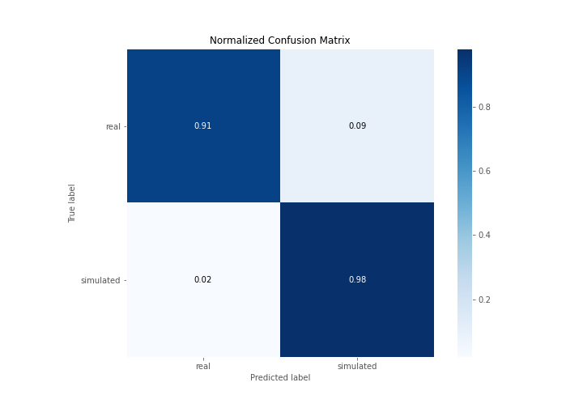

# Summary of 3_Linear

[<< Go back](../README.md)

## Logistic Regression (Linear)
- **n_jobs**: -1
- **explain_level**: 2

## Validation
 - **validation_type**: split
 - **train_ratio**: 0.75
 - **shuffle**: True
 - **stratify**: True

## Optimized metric
accuracy

## Training time

15.2 seconds

## Metric details
|           |    score |     threshold |
|:----------|---------:|--------------:|
| logloss   | 0.331672 | nan           |
| auc       | 0.975687 | nan           |
| f1        | 0.945055 |   0.64306     |
| accuracy  | 0.942529 |   0.64306     |
| precision | 1        |   0.840117    |
| recall    | 1        |   2.60993e-07 |
| mcc       | 0.887067 |   0.64306     |

## Confusion matrix (at threshold=0.64306)
|                      |   Predicted as real |   Predicted as simulated |
|:---------------------|--------------------:|-------------------------:|
| Labeled as real      |                  39 |                        4 |
| Labeled as simulated |                   1 |                       43 |

## Learning curves

## Coefficients
| feature                           |   Learner_1 |
|:----------------------------------|------------:|
| sqreturn_autocorrelation_ts2_lag3 |   1.69175   |
| mean2                             |   1.63601   |
| mean1                             |   1.52601   |
| sqreturn_autocorrelation_ts1_lag2 |   1.34342   |
| sqreturn_autocorrelation_ts1_lag3 |   1.31372   |
| return_autocorrelation_2_lag1     |   0.969224  |
| sqreturn_autocorrelation_ts2_lag2 |   0.938842  |
| sqreturn_autocorrelation_ts1_lag1 |   0.836748  |
| return_correlation_ts1_lag_1      |   0.612658  |
| sqreturn_correlation_ts1_lag_1    |   0.612658  |
| sqreturn_autocorrelation_ts2_lag1 |   0.587539  |
| return_autocorrelation_2_lag2     |   0.398725  |
| return_autocorrelation_1_lag3     |   0.391024  |
| sd1                               |   0.360834  |
| return_autocorrelation_1_lag2     |   0.357271  |
| return_autocorrelation_2_lag3     |   0.299688  |
| sqreturn_correlation_ts2_lag_1    |   0.278874  |
| return_correlation_ts2_lag_1      |   0.278874  |
| sqreturn_correlation_ts1_lag_2    |   0.25052   |
| return_correlation_ts1_lag_2      |   0.25052   |
| return_correlation_ts2_lag_3      |   0.217101  |
| sqreturn_correlation_ts2_lag_3    |   0.217101  |
| return_correlation_ts2_lag_2      |   0.189856  |
| sqreturn_correlation_ts2_lag_2    |   0.189856  |
| sqreturn_correlation_ts1_lag_3    |   0.156597  |
| return_correlation_ts1_lag_3      |   0.156597  |
| price1_granger_cause_price2       |   0.04627   |
| return_autocorrelation_1_lag1     |  -0.0455063 |
| sd2                               |  -0.266311  |
| skewness2                         |  -0.516023  |
| skewness1                         |  -0.525573  |
| return_correlation_ts1_lag_0      |  -0.54402   |
| sqreturn_correlation_ts1_lag_0    |  -0.54402   |
| price2_granger_cause_price1       |  -0.706325  |
| intercept                         |  -1.67645   |
| kurtosis2                         |  -2.87067   |
| kurtosis1                         |  -2.9696    |

## Permutation-based Importance

## Confusion Matrix

## Normalized Confusion Matrix

## ROC Curve

## Kolmogorov-Smirnov Statistic

## Precision-Recall Curve

## Calibration Curve

## Cumulative Gains Curve

## Lift Curve

## SHAP Importance

## SHAP Dependence plots

### Dependence (Fold 1)

## SHAP Decision plots

### Top-10 Worst decisions for class 0 (Fold 1)

### Top-10 Best decisions for class 0 (Fold 1)

### Top-10 Worst decisions for class 1 (Fold 1)

### Top-10 Best decisions for class 1 (Fold 1)

[<< Go back](../README.md)
