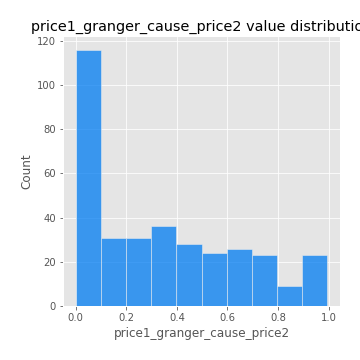

# Exploratory Data Analysis

[<< Go back](../README.md)
## Feature : target
- **Feature type** : categorical
- **Missing** : 0.0%
- **Unique** : 2
- **Count** :347
- **Unique** :2
- **Top** :simulated
- **Freq** :174

## Feature : mean1
- **Feature type** : continous
- **Missing** : 0.0%
- **Unique** : 347
- **Count** :347.0
- **Mean** :0.07599077568292635
- **Std** :0.08167355544074931
- **Min** :-0.22632637961920957
- **25%th Percentile** : 0.03060366185512233
- **50%th Percentile** : 0.07272113893847179
- **75%th Percentile** : 0.11715187759595852
- **Max** :0.4169413480298478

## Feature : mean2
- **Feature type** : continous
- **Missing** : 0.0%
- **Unique** : 347
- **Count** :347.0
- **Mean** :0.09046615325539613
- **Std** :0.08950740377660567
- **Min** :-0.24205418062825398
- **25%th Percentile** : 0.04363357395377222
- **50%th Percentile** : 0.09267740802272406
- **75%th Percentile** : 0.14796337794902378
- **Max** :0.37616608147096464

## Feature : sd1
- **Feature type** : continous
- **Missing** : 0.0%
- **Unique** : 347
- **Count** :347.0
- **Mean** :2.0530289966862045
- **Std** :0.818822918528685
- **Min** :0.7470080772831957
- **25%th Percentile** : 1.5602952311650378
- **50%th Percentile** : 1.9137578498896533
- **75%th Percentile** : 2.433009518424381
- **Max** :9.236766377527575

## Feature : sd2
- **Feature type** : continous
- **Missing** : 0.0%
- **Unique** : 347
- **Count** :347.0
- **Mean** :1.9273468905983726
- **Std** :0.7189708567969338
- **Min** :0.8455946193085045
- **25%th Percentile** : 1.4387522453547952
- **50%th Percentile** : 1.7827560893119572
- **75%th Percentile** : 2.2492114356035895
- **Max** :5.872800253666788

## Feature : skewness1
- **Feature type** : continous
- **Missing** : 0.0%
- **Unique** : 347
- **Count** :347.0
- **Mean** :-0.12865347946138272
- **Std** :0.585271387406268
- **Min** :-3.453087436558107
- **25%th Percentile** : -0.2832593134872714
- **50%th Percentile** : -0.1272449418422332
- **75%th Percentile** : 0.06305933627647438
- **Max** :2.5845963767725557

## Feature : skewness2
- **Feature type** : continous
- **Missing** : 0.0%
- **Unique** : 347
- **Count** :347.0
- **Mean** :-0.2479459491990835
- **Std** :0.808175971671938
- **Min** :-8.801502855292393
- **25%th Percentile** : -0.37155961676958305
- **50%th Percentile** : -0.17695943354658916
- **75%th Percentile** : -0.002489084714642862
- **Max** :2.2606839051517187

## Feature : kurtosis1
- **Feature type** : continous
- **Missing** : 0.0%
- **Unique** : 347
- **Count** :347.0
- **Mean** :3.8967600952580277
- **Std** :5.78905511120165
- **Min** :-0.046700280536027705
- **25%th Percentile** : 1.1376209450613346
- **50%th Percentile** : 1.9621195410040753
- **75%th Percentile** : 3.8405863563633806
- **Max** :46.07507808162177

## Feature : kurtosis2
- **Feature type** : continous
- **Missing** : 0.0%
- **Unique** : 347
- **Count** :347.0
- **Mean** :4.652990355237811
- **Std** :10.120373533665418
- **Min** :0.21289459366185293
- **25%th Percentile** : 1.1992766464249227
- **50%th Percentile** : 2.076929388695056
- **75%th Percentile** : 4.36726062980749
- **Max** :143.10871011533666

## Feature : return_autocorrelation_1_lag1
- **Feature type** : continous
- **Missing** : 0.0%
- **Unique** : 347
- **Count** :347.0
- **Mean** :-0.012415771728334088
- **Std** :0.062382181336821094
- **Min** :-0.2135576224968752
- **25%th Percentile** : -0.0506786615256575
- **50%th Percentile** : -0.004550747085321637
- **75%th Percentile** : 0.024924258549968166
- **Max** :0.1413572372248962

## Feature : return_autocorrelation_1_lag2
- **Feature type** : continous
- **Missing** : 0.0%
- **Unique** : 347
- **Count** :347.0
- **Mean** :-0.00646301691818667
- **Std** :0.05431483313918979
- **Min** :-0.17458077907359995
- **25%th Percentile** : -0.040163311534665194
- **50%th Percentile** : -0.005075948507283003
- **75%th Percentile** : 0.025054124645903897
- **Max** :0.15756235665140256

## Feature : return_autocorrelation_1_lag3
- **Feature type** : continous
- **Missing** : 0.0%
- **Unique** : 347
- **Count** :347.0
- **Mean** :-0.004984924382087181
- **Std** :0.05596258461350336
- **Min** :-0.15806635192103805
- **25%th Percentile** : -0.044022032846672984
- **50%th Percentile** : -0.008243129997781906
- **75%th Percentile** : 0.036672233499510355
- **Max** :0.15952238220772655

## Feature : return_autocorrelation_2_lag1
- **Feature type** : continous
- **Missing** : 0.0%
- **Unique** : 347
- **Count** :347.0
- **Mean** :-0.012934941173928164
- **Std** :0.06451568046802915
- **Min** :-0.25075531010123286
- **25%th Percentile** : -0.048182604087156466
- **50%th Percentile** : -0.014832669354179276
- **75%th Percentile** : 0.020563332610907356
- **Max** :0.31863413537898483

## Feature : return_autocorrelation_2_lag2
- **Feature type** : continous
- **Missing** : 0.0%
- **Unique** : 347
- **Count** :347.0
- **Mean** :-0.004205903484901127
- **Std** :0.057540378838427796
- **Min** :-0.19216755663389537
- **25%th Percentile** : -0.04298699328171945
- **50%th Percentile** : -0.006588528796977387
- **75%th Percentile** : 0.03369030370962067
- **Max** :0.20974504043791217

## Feature : return_autocorrelation_2_lag3
- **Feature type** : continous
- **Missing** : 0.0%
- **Unique** : 347
- **Count** :347.0
- **Mean** :-0.0031127465168927196
- **Std** :0.05344654256361012
- **Min** :-0.14200107169559698
- **25%th Percentile** : -0.03985154696989436
- **50%th Percentile** : -0.001992969453947655
- **75%th Percentile** : 0.033762961486864765
- **Max** :0.1572896750014395

## Feature : return_correlation_ts1_lag_0
- **Feature type** : continous
- **Missing** : 0.0%
- **Unique** : 347
- **Count** :347.0
- **Mean** :0.3319747122400854
- **Std** :0.11246613318149318
- **Min** :-0.027089510445801036
- **25%th Percentile** : 0.27728831830324097
- **50%th Percentile** : 0.3406536080413508
- **75%th Percentile** : 0.38605045736558063
- **Max** :0.7041861626832071

## Feature : return_correlation_ts1_lag_1
- **Feature type** : continous
- **Missing** : 0.0%
- **Unique** : 347
- **Count** :347.0
- **Mean** :-0.0041842026046007615
- **Std** :0.05876208109451081
- **Min** :-0.16985510949917193
- **25%th Percentile** : -0.04490301429385647
- **50%th Percentile** : -0.005171590184683453
- **75%th Percentile** : 0.03690557631869017
- **Max** :0.17467175887321834

## Feature : return_correlation_ts1_lag_2
- **Feature type** : continous
- **Missing** : 0.0%
- **Unique** : 347
- **Count** :347.0
- **Mean** :0.0022343534345749595
- **Std** :0.05461124795383772
- **Min** :-0.21653581047581763
- **25%th Percentile** : -0.03339479317768104
- **50%th Percentile** : 0.0018117487052801212
- **75%th Percentile** : 0.0395781564355339
- **Max** :0.1545419107365163

## Feature : return_correlation_ts1_lag_3
- **Feature type** : continous
- **Missing** : 0.0%
- **Unique** : 347
- **Count** :347.0
- **Mean** :-0.00029629357412572503
- **Std** :0.056660255887255206
- **Min** :-0.13963491238356532
- **25%th Percentile** : -0.03485681523113536
- **50%th Percentile** : -0.0018944668938554326
- **75%th Percentile** : 0.03673453986618489
- **Max** :0.16423829554280345

## Feature : return_correlation_ts2_lag_1
- **Feature type** : continous
- **Missing** : 0.0%
- **Unique** : 347
- **Count** :347.0
- **Mean** :-0.010626754974765253
- **Std** :0.05566327174643699
- **Min** :-0.2081139431093261
- **25%th Percentile** : -0.046240835834738245
- **50%th Percentile** : -0.010969367007407466
- **75%th Percentile** : 0.024612495595486256
- **Max** :0.17208763791364762

## Feature : return_correlation_ts2_lag_2
- **Feature type** : continous
- **Missing** : 0.0%
- **Unique** : 347
- **Count** :347.0
- **Mean** :-0.0025845763617864666
- **Std** :0.05521899440393031
- **Min** :-0.23751835475804678
- **25%th Percentile** : -0.04146468328781018
- **50%th Percentile** : -0.003594781765655671
- **75%th Percentile** : 0.030804584338275008
- **Max** :0.20772887392904255

## Feature : return_correlation_ts2_lag_3
- **Feature type** : continous
- **Missing** : 0.0%
- **Unique** : 347
- **Count** :347.0
- **Mean** :-0.006032023160022299
- **Std** :0.05498046163713385
- **Min** :-0.17564076057312866
- **25%th Percentile** : -0.039960806360569125
- **50%th Percentile** : -0.006528307581784235
- **75%th Percentile** : 0.03306120345309838
- **Max** :0.13128380114518473

## Feature : sqreturn_autocorrelation_ts1_lag1
- **Feature type** : continous
- **Missing** : 0.0%
- **Unique** : 347
- **Count** :347.0
- **Mean** :0.11431612316333944
- **Std** :0.09108299368814864
- **Min** :-0.06532118872798363
- **25%th Percentile** : 0.043347975856764434
- **50%th Percentile** : 0.09877722218252116
- **75%th Percentile** : 0.16441428631235522
- **Max** :0.5184762277419127

## Feature : sqreturn_autocorrelation_ts1_lag2
- **Feature type** : continous
- **Missing** : 0.0%
- **Unique** : 347
- **Count** :347.0
- **Mean** :0.11180968496004723
- **Std** :0.09543130923799924
- **Min** :-0.05419304650062953
- **25%th Percentile** : 0.04198104766777181
- **50%th Percentile** : 0.09918272529580173
- **75%th Percentile** : 0.167590789934979
- **Max** :0.540735851444759

## Feature : sqreturn_autocorrelation_ts1_lag3
- **Feature type** : continous
- **Missing** : 0.0%
- **Unique** : 347
- **Count** :347.0
- **Mean** :0.10218972451142601
- **Std** :0.08837161616820877
- **Min** :-0.06486026764840777
- **25%th Percentile** : 0.033404083449926035
- **50%th Percentile** : 0.08835701051960874
- **75%th Percentile** : 0.15882239103534895
- **Max** :0.39671334992123264

## Feature : sqreturn_autocorrelation_ts2_lag1
- **Feature type** : continous
- **Missing** : 0.0%
- **Unique** : 347
- **Count** :347.0
- **Mean** :0.12052391690333836
- **Std** :0.08363415946587675
- **Min** :-0.04997282481431907
- **25%th Percentile** : 0.05384190850295016
- **50%th Percentile** : 0.1147730253780656
- **75%th Percentile** : 0.16990536098332307
- **Max** :0.510085647437958

## Feature : sqreturn_autocorrelation_ts2_lag2
- **Feature type** : continous
- **Missing** : 0.0%
- **Unique** : 347
- **Count** :347.0
- **Mean** :0.10705813118632666
- **Std** :0.09415368417385998
- **Min** :-0.06273439845424096
- **25%th Percentile** : 0.03481298867753621
- **50%th Percentile** : 0.09268674841714832
- **75%th Percentile** : 0.16611923955993302
- **Max** :0.5373432415582473

## Feature : sqreturn_autocorrelation_ts2_lag3
- **Feature type** : continous
- **Missing** : 0.0%
- **Unique** : 347
- **Count** :347.0
- **Mean** :0.09411786773414482
- **Std** :0.08370885935634136
- **Min** :-0.06082766359524085
- **25%th Percentile** : 0.02540516688011514
- **50%th Percentile** : 0.083863788631135
- **75%th Percentile** : 0.14912954626332375
- **Max** :0.3449710593582518

## Feature : sqreturn_correlation_ts1_lag_0
- **Feature type** : continous
- **Missing** : 0.0%
- **Unique** : 347
- **Count** :347.0
- **Mean** :0.3319747122400854
- **Std** :0.11246613318149318
- **Min** :-0.027089510445801036
- **25%th Percentile** : 0.27728831830324097
- **50%th Percentile** : 0.3406536080413508
- **75%th Percentile** : 0.38605045736558063
- **Max** :0.7041861626832071

## Feature : sqreturn_correlation_ts1_lag_1
- **Feature type** : continous
- **Missing** : 0.0%
- **Unique** : 347
- **Count** :347.0
- **Mean** :-0.0041842026046007615
- **Std** :0.05876208109451081
- **Min** :-0.16985510949917193
- **25%th Percentile** : -0.04490301429385647
- **50%th Percentile** : -0.005171590184683453
- **75%th Percentile** : 0.03690557631869017
- **Max** :0.17467175887321834

## Feature : sqreturn_correlation_ts1_lag_2
- **Feature type** : continous
- **Missing** : 0.0%
- **Unique** : 347
- **Count** :347.0
- **Mean** :0.0022343534345749595
- **Std** :0.05461124795383772
- **Min** :-0.21653581047581763
- **25%th Percentile** : -0.03339479317768104
- **50%th Percentile** : 0.0018117487052801212
- **75%th Percentile** : 0.0395781564355339
- **Max** :0.1545419107365163

## Feature : sqreturn_correlation_ts1_lag_3
- **Feature type** : continous
- **Missing** : 0.0%
- **Unique** : 347
- **Count** :347.0
- **Mean** :-0.00029629357412572503
- **Std** :0.056660255887255206
- **Min** :-0.13963491238356532
- **25%th Percentile** : -0.03485681523113536
- **50%th Percentile** : -0.0018944668938554326
- **75%th Percentile** : 0.03673453986618489
- **Max** :0.16423829554280345

## Feature : sqreturn_correlation_ts2_lag_1
- **Feature type** : continous
- **Missing** : 0.0%
- **Unique** : 347
- **Count** :347.0
- **Mean** :-0.010626754974765253
- **Std** :0.05566327174643699
- **Min** :-0.2081139431093261
- **25%th Percentile** : -0.046240835834738245
- **50%th Percentile** : -0.010969367007407466
- **75%th Percentile** : 0.024612495595486256
- **Max** :0.17208763791364762

## Feature : sqreturn_correlation_ts2_lag_2
- **Feature type** : continous
- **Missing** : 0.0%
- **Unique** : 347
- **Count** :347.0
- **Mean** :-0.0025845763617864666
- **Std** :0.05521899440393031
- **Min** :-0.23751835475804678
- **25%th Percentile** : -0.04146468328781018
- **50%th Percentile** : -0.003594781765655671
- **75%th Percentile** : 0.030804584338275008
- **Max** :0.20772887392904255

## Feature : sqreturn_correlation_ts2_lag_3
- **Feature type** : continous
- **Missing** : 0.0%
- **Unique** : 347
- **Count** :347.0
- **Mean** :-0.006032023160022299
- **Std** :0.05498046163713385
- **Min** :-0.17564076057312866
- **25%th Percentile** : -0.039960806360569125
- **50%th Percentile** : -0.006528307581784235
- **75%th Percentile** : 0.03306120345309838
- **Max** :0.13128380114518473

## Feature : price2_granger_cause_price1
- **Feature type** : continous
- **Missing** : 0.0%
- **Unique** : 347
- **Count** :347.0
- **Mean** :0.31336544330929517
- **Std** :0.29086612809908613
- **Min** :1.6140213406496488e-11
- **25%th Percentile** : 0.045133670084625085
- **50%th Percentile** : 0.23120706144075112
- **75%th Percentile** : 0.5446022092720781
- **Max** :0.9885712803689185

## Feature : price1_granger_cause_price2
- **Feature type** : continous
- **Missing** : 0.0%
- **Unique** : 347
- **Count** :347.0
- **Mean** :0.33797594864681213
- **Std** :0.3021269980472622
- **Min** :2.0423277693140178e-10
- **25%th Percentile** : 0.04747597533969739
- **50%th Percentile** : 0.27751079881382684
- **75%th Percentile** : 0.5720060473959907
- **Max** :0.9951398266867577

[<< Go back](../README.md)
