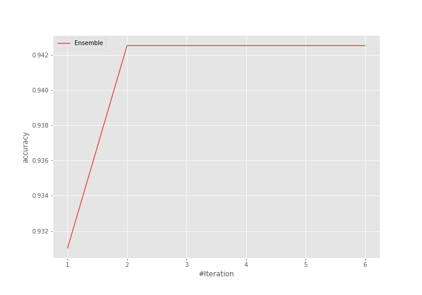
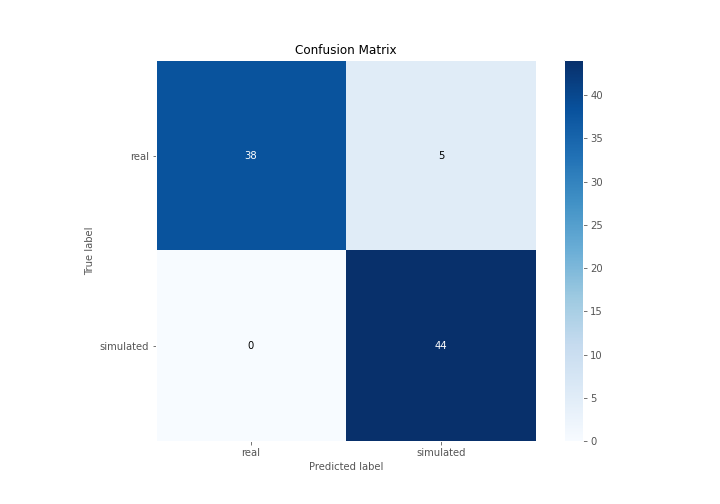
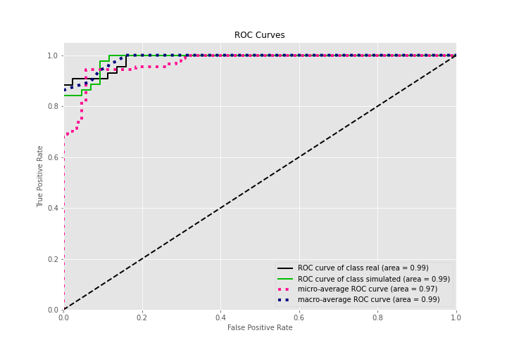
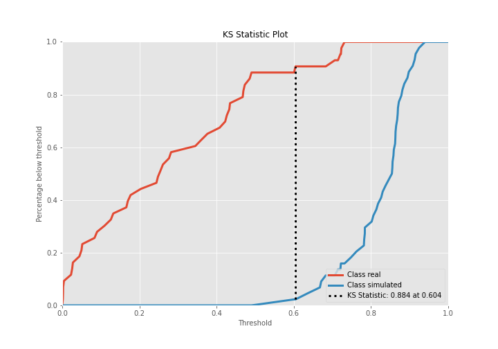
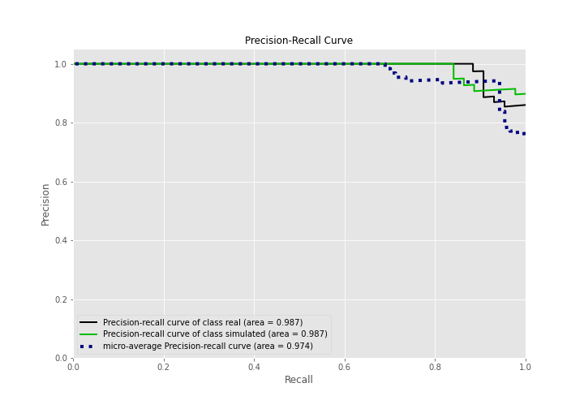
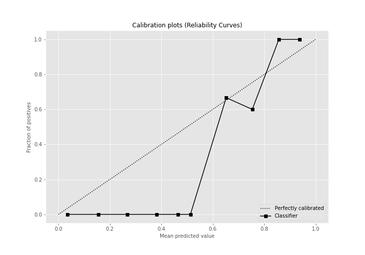
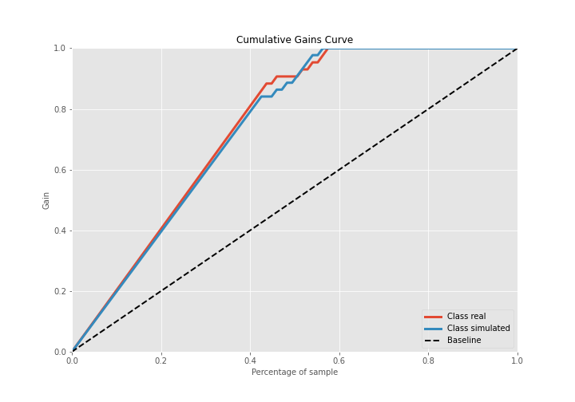
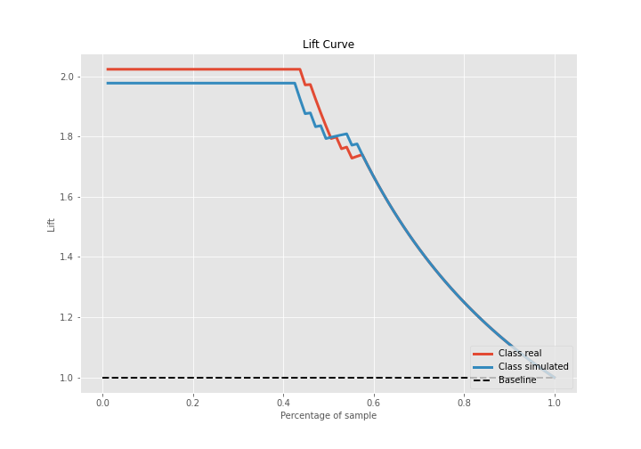

# Summary of Ensemble

[<< Go back](../README.md)

## Ensemble structure
| Model                  |   Weight |
|:-----------------------|---------:|
| 3_Linear               |        1 |
| 6_Default_RandomForest |        1 |

## Metric details
|           |    score |   threshold |
|:----------|---------:|------------:|
| logloss   | 0.294709 | nan         |
| auc       | 0.986258 | nan         |
| f1        | 0.946237 |   0.578898  |
| accuracy  | 0.942529 |   0.578898  |
| precision | 1        |   0.764482  |
| recall    | 1        |   0.0014559 |
| mcc       | 0.890812 |   0.578898  |

## Confusion matrix (at threshold=0.578898)
|                      |   Predicted as real |   Predicted as simulated |
|:---------------------|--------------------:|-------------------------:|
| Labeled as real      |                  38 |                        5 |
| Labeled as simulated |                   0 |                       44 |

## Learning curves

## Confusion Matrix

## Normalized Confusion Matrix

## ROC Curve

## Kolmogorov-Smirnov Statistic

## Precision-Recall Curve

## Calibration Curve

## Cumulative Gains Curve

## Lift Curve

[<< Go back](../README.md)
