# Summary of 2_DecisionTree

[<< Go back](../README.md)

## Decision Tree
- **n_jobs**: -1
- **criterion**: gini
- **max_depth**: 3
- **explain_level**: 2

## Validation
 - **validation_type**: split
 - **train_ratio**: 0.75
 - **shuffle**: True
 - **stratify**: True

## Optimized metric
accuracy

## Training time

14.9 seconds

## Metric details
|           |    score |   threshold |
|:----------|---------:|------------:|
| logloss   | 1.16281  |  nan        |
| auc       | 0.825581 |  nan        |
| f1        | 0.808081 |    0.125    |
| accuracy  | 0.781609 |    0.285714 |
| precision | 0.852941 |    0.775298 |
| recall    | 0.931818 |    0        |
| mcc       | 0.580883 |    0.125    |

## Confusion matrix (at threshold=0.285714)
|                      |   Predicted as real |   Predicted as simulated |
|:---------------------|--------------------:|-------------------------:|
| Labeled as real      |                  31 |                       12 |
| Labeled as simulated |                   7 |                       37 |

## Learning curves
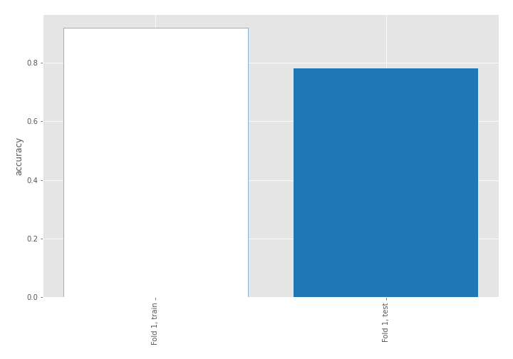

## Decision Tree 

### Tree #1

### Rules

if (sqreturn_autocorrelation_ts2_lag2 > 0.062) and (kurtosis1 <= 2.186) and (sd1 > 1.563) then class: simulated (proba: 97.92%) | based on 96 samples

if (sqreturn_autocorrelation_ts2_lag2 <= 0.062) and (sqreturn_autocorrelation_ts2_lag3 <= 0.106) and (sqreturn_autocorrelation_ts2_lag1 <= 0.128) then class: real (proba: 100.0%) | based on 71 samples

if (sqreturn_autocorrelation_ts2_lag2 > 0.062) and (kurtosis1 > 2.186) and (mean2 <= 0.096) then class: real (proba: 87.5%) | based on 40 samples

if (sqreturn_autocorrelation_ts2_lag2 > 0.062) and (kurtosis1 > 2.186) and (mean2 > 0.096) then class: simulated (proba: 69.23%) | based on 26 samples

if (sqreturn_autocorrelation_ts2_lag2 <= 0.062) and (sqreturn_autocorrelation_ts2_lag3 <= 0.106) and (sqreturn_autocorrelation_ts2_lag1 > 0.128) then class: real (proba: 81.82%) | based on 11 samples

if (sqreturn_autocorrelation_ts2_lag2 > 0.062) and (kurtosis1 <= 2.186) and (sd1 <= 1.563) then class: simulated (proba: 57.14%) | based on 7 samples

if (sqreturn_autocorrelation_ts2_lag2 <= 0.062) and (sqreturn_autocorrelation_ts2_lag3 > 0.106) and (sqreturn_correlation_ts2_lag_3 <= 0.025) then class: simulated (proba: 100.0%) | based on 6 samples

if (sqreturn_autocorrelation_ts2_lag2 <= 0.062) and (sqreturn_autocorrelation_ts2_lag3 > 0.106) and (sqreturn_correlation_ts2_lag_3 > 0.025) then class: real (proba: 66.67%) | based on 3 samples

## Permutation-based Importance
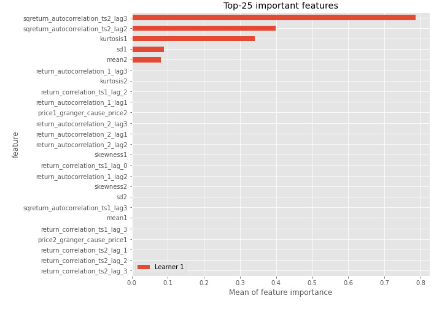
## Confusion Matrix

## Normalized Confusion Matrix

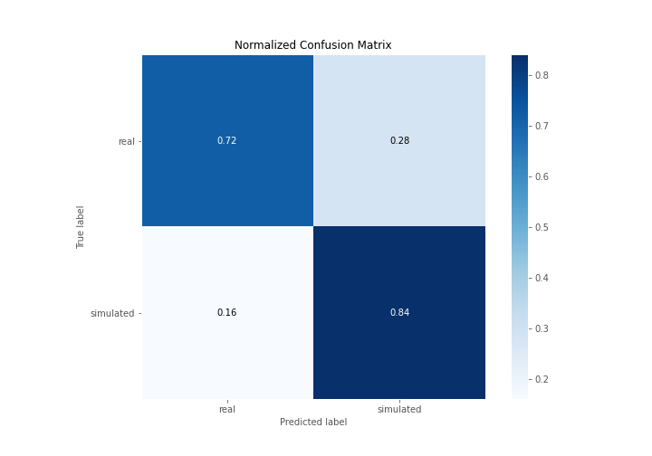

## ROC Curve

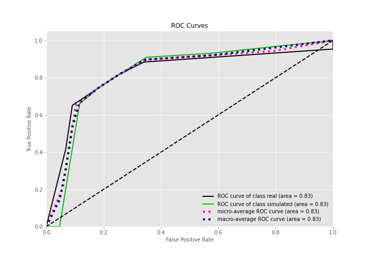

## Kolmogorov-Smirnov Statistic

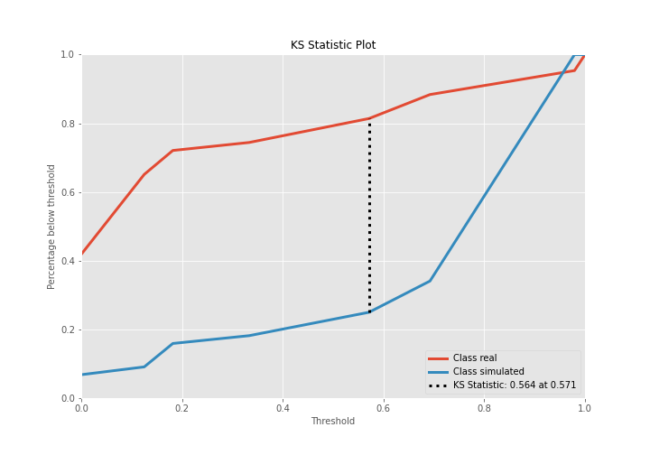

## Precision-Recall Curve

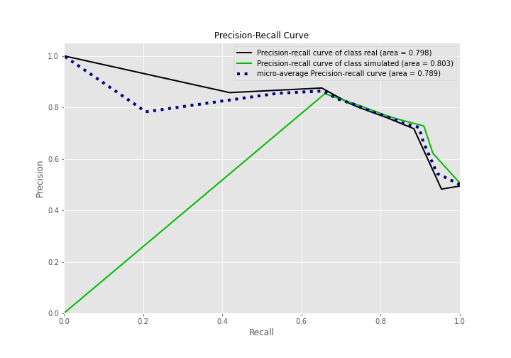

## Calibration Curve

## Cumulative Gains Curve

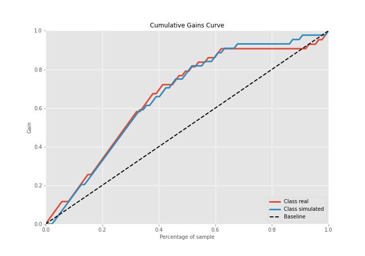

## Lift Curve

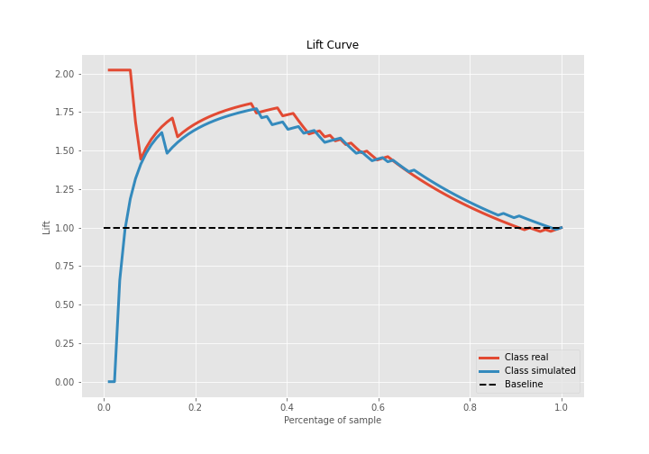

## SHAP Importance

## SHAP Dependence plots

### Dependence (Fold 1)

## SHAP Decision plots

### Top-10 Worst decisions for class 0 (Fold 1)
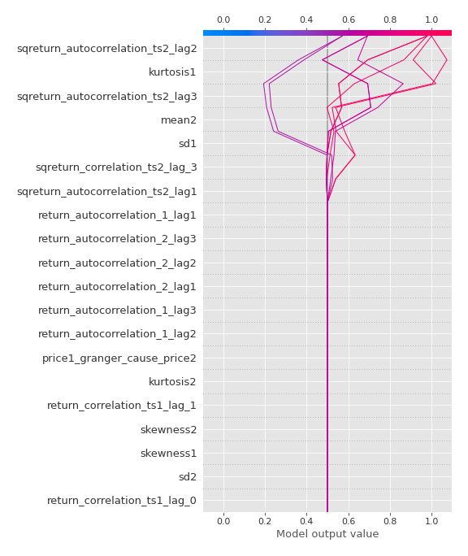
### Top-10 Best decisions for class 0 (Fold 1)
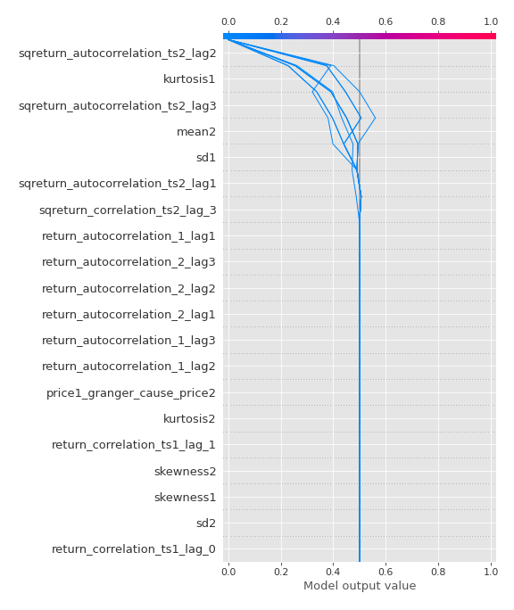
### Top-10 Worst decisions for class 1 (Fold 1)
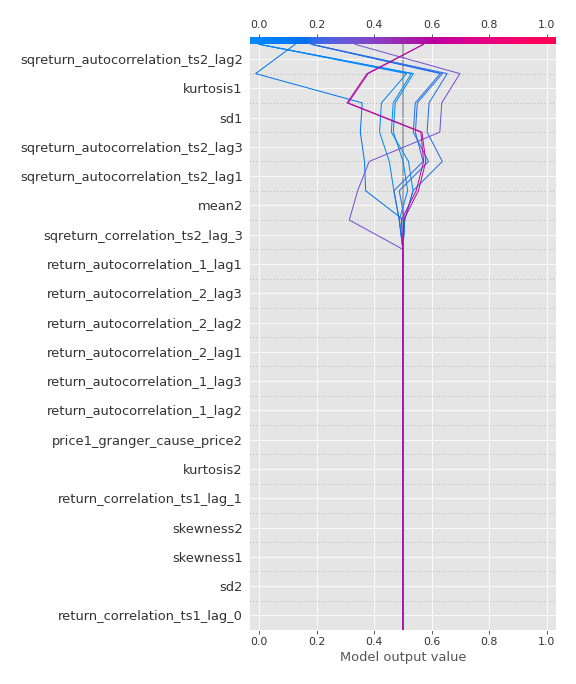
### Top-10 Best decisions for class 1 (Fold 1)
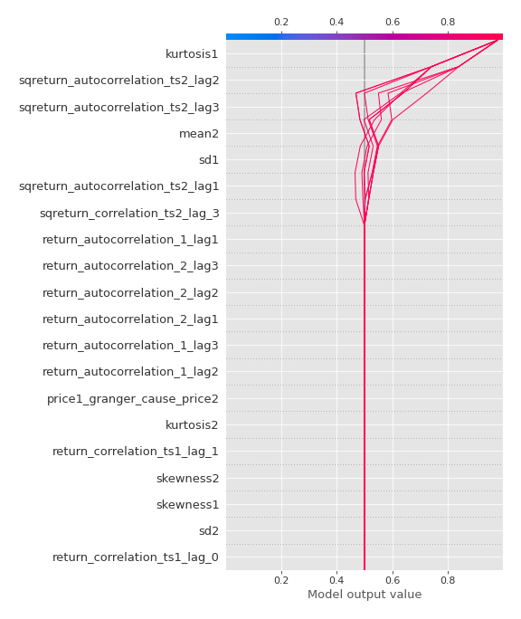

[<< Go back](../README.md)
