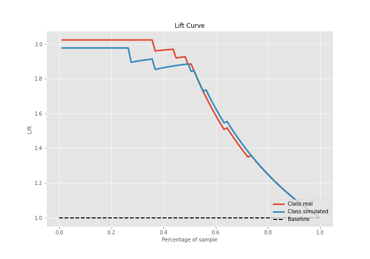
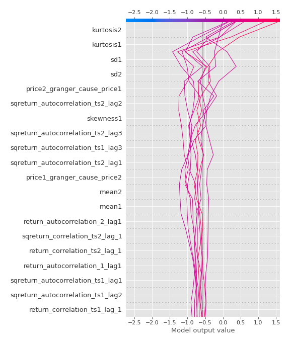

# Summary of 3_Linear

[<< Go back](../README.md)

## Logistic Regression (Linear)
- **n_jobs**: -1
- **explain_level**: 2

## Validation
 - **validation_type**: split
 - **train_ratio**: 0.75
 - **shuffle**: True
 - **stratify**: True

## Optimized metric
accuracy

## Training time

14.6 seconds

## Metric details
|           |    score |     threshold |
|:----------|---------:|--------------:|
| logloss   | 0.296968 | nan           |
| auc       | 0.973573 | nan           |
| f1        | 0.94382  |   0.586796    |
| accuracy  | 0.942529 |   0.586796    |
| precision | 1        |   0.874542    |
| recall    | 1        |   9.21569e-09 |
| mcc       | 0.885307 |   0.658537    |

## Confusion matrix (at threshold=0.586796)
|                      |   Predicted as real |   Predicted as simulated |
|:---------------------|--------------------:|-------------------------:|
| Labeled as real      |                  40 |                        3 |
| Labeled as simulated |                   2 |                       42 |

## Learning curves

## Coefficients
| feature                           |   Learner_1 |
|:----------------------------------|------------:|
| sqreturn_autocorrelation_ts2_lag3 |   1.66116   |
| mean1                             |   1.50504   |
| mean2                             |   1.50365   |
| sqreturn_autocorrelation_ts2_lag1 |   1.33836   |
| sqreturn_autocorrelation_ts1_lag3 |   1.30096   |
| sqreturn_autocorrelation_ts2_lag2 |   1.16301   |
| return_autocorrelation_2_lag1     |   0.792815  |
| return_correlation_ts2_lag_1      |   0.766992  |
| sqreturn_correlation_ts2_lag_1    |   0.766992  |
| return_autocorrelation_1_lag1     |   0.605864  |
| sqreturn_autocorrelation_ts1_lag1 |   0.531588  |
| sqreturn_correlation_ts1_lag_1    |   0.386443  |
| return_correlation_ts1_lag_1      |   0.386443  |
| sd1                               |   0.376617  |
| sqreturn_correlation_ts2_lag_3    |   0.330915  |
| return_correlation_ts2_lag_3      |   0.330915  |
| sqreturn_autocorrelation_ts1_lag2 |   0.278258  |
| return_correlation_ts1_lag_3      |   0.252772  |
| sqreturn_correlation_ts1_lag_3    |   0.252772  |
| return_autocorrelation_1_lag3     |   0.192248  |
| return_autocorrelation_1_lag2     |   0.107916  |
| return_autocorrelation_2_lag3     |   0.0845588 |
| return_correlation_ts1_lag_2      |  -0.0225641 |
| sqreturn_correlation_ts1_lag_2    |  -0.0225641 |
| skewness2                         |  -0.0626103 |
| return_autocorrelation_2_lag2     |  -0.109342  |
| sqreturn_correlation_ts1_lag_0    |  -0.153968  |
| return_correlation_ts1_lag_0      |  -0.153968  |
| return_correlation_ts2_lag_2      |  -0.189097  |
| sqreturn_correlation_ts2_lag_2    |  -0.189097  |
| price1_granger_cause_price2       |  -0.335642  |
| sd2                               |  -0.34678   |
| skewness1                         |  -0.769214  |
| price2_granger_cause_price1       |  -0.873172  |
| intercept                         |  -1.60452   |
| kurtosis1                         |  -2.64766   |
| kurtosis2                         |  -2.908     |

## Permutation-based Importance

## Confusion Matrix

## Normalized Confusion Matrix

## ROC Curve

## Kolmogorov-Smirnov Statistic

## Precision-Recall Curve

## Calibration Curve

## Cumulative Gains Curve

## Lift Curve

## SHAP Importance

## SHAP Dependence plots

### Dependence (Fold 1)

## SHAP Decision plots

### Top-10 Worst decisions for class 0 (Fold 1)

### Top-10 Best decisions for class 0 (Fold 1)

### Top-10 Worst decisions for class 1 (Fold 1)

### Top-10 Best decisions for class 1 (Fold 1)

[<< Go back](../README.md)
